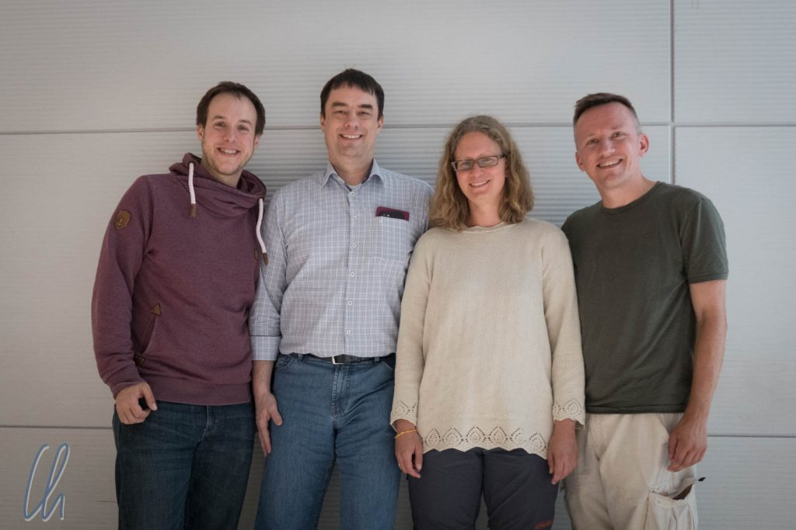
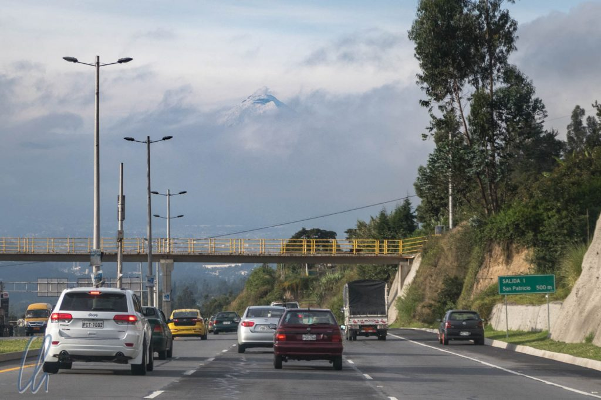
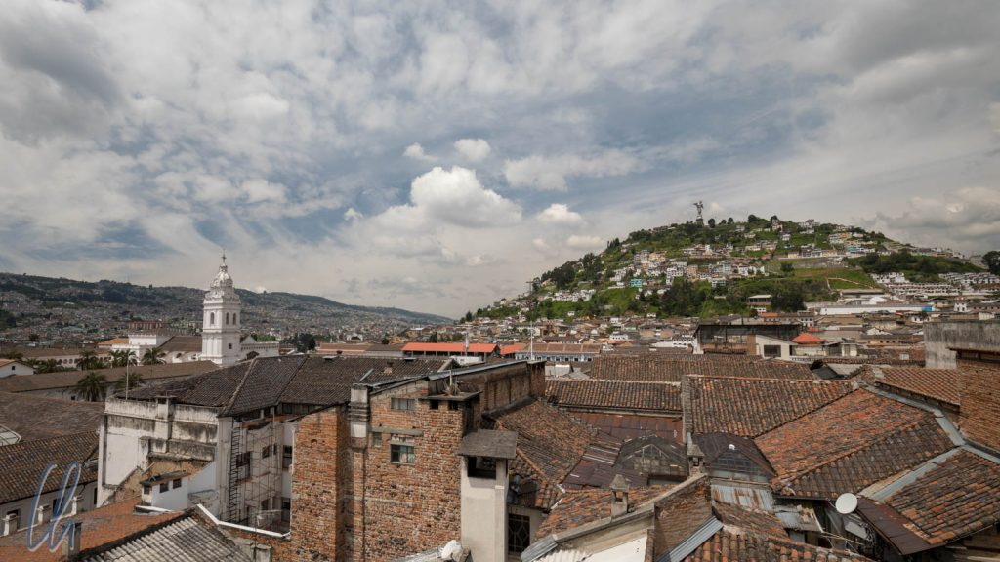
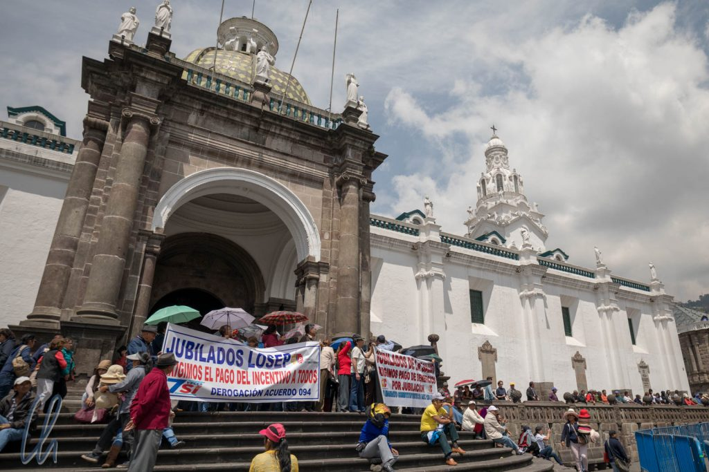

# Erste Eindrücke aus Ecuador

Die Organisation der Anreise von Belize nach Ecuador gestaltete sich etwas schwierig. Natürlich gab es keinen Direktflug von Belize City nach Ecuador (weder nach Guayaquil noch nach Quito). Einen Flug mit weniger als einer Stunde Umsteigezeit über San Salvador haben wir uns nicht zu buchen getraut (wegen des ungewissen Gepäcktranfers). Damit führte der "[direkte](https://www.google.de/maps/dir/Cdad.+de+Belice,+Belice/Houston,+Texas,+EE.+UU./Quito,+Ecuador)" Weg über die USA. Houston wurde der Umsteige-Flughafen unserer Wahl. Welch ein Zufall! Clemens und Thomas hatten unabhängig auch einen Flug nach Houston gebucht! So trafen wir uns am Gepäckband für ungefähr eine halbe Stunde :)

<!--more-->

## In Ecuador angekommen

Nachdem wir einen vollen Tag im Flieger verbracht hatten, kamen wir kurz vor Mitternacht am neu gebauten, hochmodernen, aber nicht allzu großen Flughafen in Quito an. Früher gab es einen zentralen Flughafen mitten in der Stadt. Früher bedeutet vor 13 Jahren, als ich (Christian) 2005 schon einmal in Ecuador war. Es könnte also auch an anderer Stelle in den Ecuador-Artikeln vorkommen, dass sich ein Vergleich mit der Situation von vor 13 Jahren einschleicht, da sich in Ecuador viel verändert hat.

Nicht nur der Flughafen war funkelnagelneu, auch die Straßen vom Flughafen in die Innenstadt waren 2- oder 3-spurig und in perfektem Zustand. Im modernen Taxi gab es Sicherheitsgurte auf der Rücksitzbank und fixe Preise für die Fahrt in die Altstadt. Dort, im historischen Zentrum, hatte sich Quito glücklicherweise weniger verändert. Ein Projekt findet aber aktuell im Untergrund statt: eine U-Bahn ist im Bau. Die Altstadt ist weiterhin ein koloniales Juwel Lateinamerikas mit wunderschönen, gut erhaltenen alten Häusern und einheitlichem Stadtbild. Die Innenstadt besichtigten wir zunächst nur für einen Tag (dieser war als Puffertag geplant), bevor es auf die Galapagos-Inseln ging (dazu natürlich im nächsten Beitrag mehr).

Quito und die gute Höhenluft der Anden begrüßten uns aber auch noch auf andere Art und Weise. So kalt wie in Quito war es schon lange auf unserer Reise nicht mehr gewesen. Da war die dicke Bettdecke im landestypisch ungeheizten Hotelzimmer sehr willkommen. Am nächsten morgen "explodierte" unsere Sonnencreme aufgrund des niedrigeren Luftdrucks - Quito liegt auf ca. 2800m - und spendete auf einen Schlag viel zu viel Creme. T-Shirt und kurze Hosen sind in Quito eher unzweckmäßig ;)

## Demonstrationen und Wachwechsel auf der Plaza Grande

Unser erstes Ziel des Stadtrundgangs war die [Plaza Grande](https://en.wikipedia.org/wiki/Plaza_de_la_Independencia) (offiziell Plaza de la Independencia), wo jeden Montag um 11 Uhr vor dem Präsidentenpalast der zeremonielle Wachwechsel stattfindet. Wir erwarteten nur ein paar marschierende Soldaten. Stattdessen fanden wir einen prall gefüllten Platz vor, auf dem die Vorbereitungen liefen und eine Demonstration stattfand. Was wir sahen, war angeblich nur eine Auftaktveranstaltung für eine Großdemonstration am folgenden Tag. Die pensionierten Lehrer forderten höhere Renten, wie uns eine der demonstrierenden Lehrerinnen erklärte. Ecuador hätte viel in Infrastruktur (wie Flughafen und Straßen) oder Bildung investiert, was prinzipiell auch gut sei. Insgesamt habe Ecuador aber trotz aller Einnahmen aus den Erdölexporten noch viele Schulden angehäuft und die Lehrer (vor allem die Rentner) vollkommen vergessen. Die Rentnerin berichtete, sie habe zu Pferd in die Schule reiten müssen. Mona erschien dies zwar gleich sehr erstrebenswert, die Lehrerin empfand ihr Transportmittel allerdings als rückständig.

Kurz vor 11 Uhr sorgte die Polizei dafür, dass die Menschen die Straße vor dem Präsidentenpalast verließen und sich hinter die Absperrungen begaben, was alles sehr friedlich ablief. Und dann begann die Zeremonie: Die Wachen marschierten mit vollständiger Blasmusikkapelle und in prachtvollen Galauniformen ein. Außerdem waren ein paar berittene Soldaten dabei, die nicht nur vor den Palast, sondern auch (durch abgesperrte Korridore hindurch) mitten auf den Platz ritten.

## Parade und noch eine Demonstration

Nach dem Einritt gab es kurze Ansprachen, Flaggen wurden gehisst und die Wachen marschierten zackig, alles zu schneidiger Blasmusik. Insgesamt dauerte das ganze Schauspiel eine gute Stunde und war deutlich unterhaltsamer als wir erwartet hatten.

Nach der Parade wurde eine weitere Demonstration abgehalten. Die Demonstranten (andere, nicht die Lehrer) forderten den Rücktritt der Sportministerin, aber wir konnten keinen echten Grund dafür auf den Transparenten lesen. Die Quiteños, die wir fragten, konnten uns auch keine hilfreiche Antwort geben. In den Nachrichten lasen wir von einem Plan, Sportförderung in Millionenhöhe (Landeswährung ist der US-Dollar) zu betreiben, um bei der Olympiade in Tokio 2020 mehr Medaillen erringen zu können. Vielleicht ging es darum, dass einige Menschen der Meinung waren, dass das Geld an anderen Stellen dringend benötigt werde.

## Nos faltan tres - Wir vermissen 3

Auf der Plaza Grande fielen uns außerdem Plakate mit der Aufschrift "Nos faltan tres" ("Wir vermissen 3") und den Fotos von 3 Männern auf. Wie wir später erfuhren, handelte es sich bei den dreien um ecuadorianische Journalisten (genauer einen Journalisten, seinen Fotografen und einen Fahrer), die im Grenzgebiet von Ecuador und Kolumbien [gekidnappt worden waren](https://amerika21.de/2018/03/198149/ecuador-entfuehrte-journalisten). Sie waren damit zu Geiseln im Konflikt zwischen der ecuadorianischen Regierung und einem kolumbianischen Drogenboss ("Guacho") geworden. Kolumbien ist weiterhin im Drogengeschäft aktiv und die neue Regierung von Ecuador toleriert den Drogenhandel im Gegensatz zu früher nicht mehr.

Leider hörten wir später (als wir nach 2 Wochen wieder in Quito waren), dass die 3 von Guachos Männern [ermordet worden waren](http://www.dw.com/en/ecuadors-president-confirms-2-abducted-journalists-killed-in-border-region/a-43384191). Ecuador hat auch die Hilfe der USA angefordert und mit den USA ein [Abkommen unterzeichnet](https://www.telesurtv.net/english/news/Ecuador-Signs-Security-Deal-with-US-Military-Presence-Expected-20180426-0006.html), um im Kampf gegen den Drogenhandel härter durchgreifen zu können. (Interessanterweise hatte Ecuador die US-Armee erst 2014 zum Abzug aus Ecuador bewegt). Wie erfolgreich die Maßnahmen sein werden, bleibt abzuwarten.

## Die koloniale Altstadt

Nachdem wir deutlich mehr Zeit auf der Plaza Grande verbracht hatten als gedacht, besuchten wir anschließend einige sehenswerte Kirchen der Stadt, jede mit ihren Besonderheiten. In der Kathedrale von Quito befand sich zum Beispiel der Sarg von [Mariscal Sucre](https://de.wikipedia.org/wiki/Antonio_Jos%C3%A9_de_Sucre). Neben [Simón Bolívar](https://de.wikipedia.org/wiki/Sim%C3%B3n_Bol%C3%ADvar) war er vielleicht der wichtigsten Kämpfer für die Unabhängigkeit Südamerikas von der spanischen Kolonialmacht. (Was wir zu dem Zeitpunkt noch nicht realisierten war, wie häufig wir seinen Namen in den nächsten Wochen auch in Peru und Bolivien noch hören sollten.) Außerdem beherbergte die Kathedrale ein Gemälde, das eine interessante andine Version des [letzten Abendmahls](https://goo.gl/images/GeYuFk) darstellt. Vor Jesus Christus steht ein Teller mit gegrilltem Meerschweinchen (eine Delikatesse der Anden) auf dem Tisch. (Fotografieren war in der Kirche nicht erlaubt, aber [auf dieser Seite](https://goo.gl/images/GeYuFk) findet ihr ein Bild.)

Die angeblich schönste Kirche ganz Ecuadors soll die [Iglesia de la Compañía de Jesús](https://en.wikipedia.org/wiki/Compa%C3%B1%C3%ADa_de_Jes%C3%BAs,_Quito), die Kirche des Jesuitenordens sein. Die Fassade wirkte eher nüchtern, dieser Eindruck änderte sich jedoch drastisch, sobald wir das Gotteshaus betraten. Das Innere ist über und über auf das barockste verziert und durch die verschwenderische Verwendung von Blattgold fühlte man sich wie in einem Schmuckkästchen.

Auf den Straßen von Quito sahen wir auch an den Gesichtszügen und der Kleidung der Leute, dass wir in den Anden angekommen waren. Erstaunlich viele Menschen trugen traditionelle Kleidung. Waren, Einkäufe oder Kinder wurden in Tragetüchern transportiert und als Kopfbedeckung sahen wir die typischen Hüte.

Quito hatte uns einen spektakulären Empfang bereitet. In gut zwei Wochen würden wir zurückkommen, vorher besuchten wir jedoch die Galapagos-Inseln, den Nebelwald bei Mindo und Otavalo.
