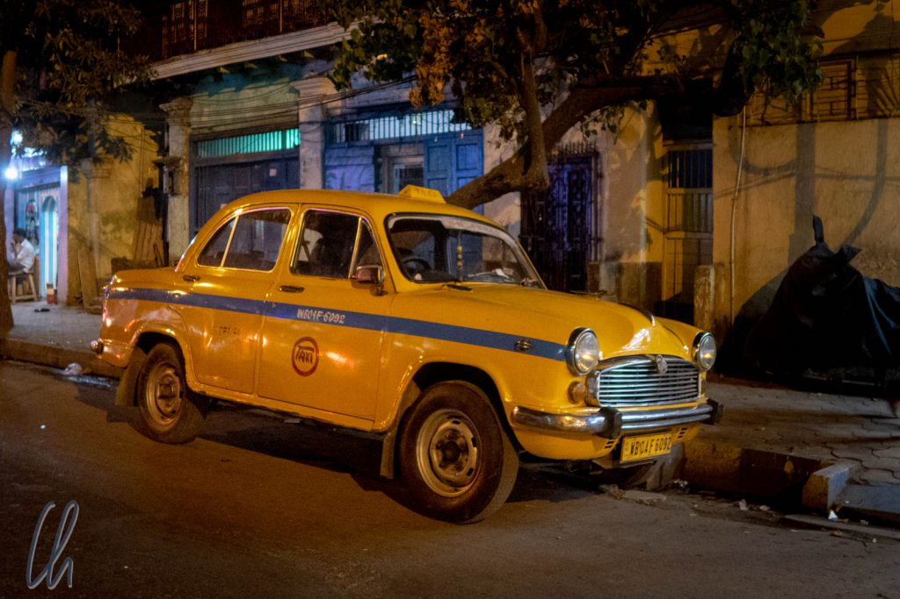
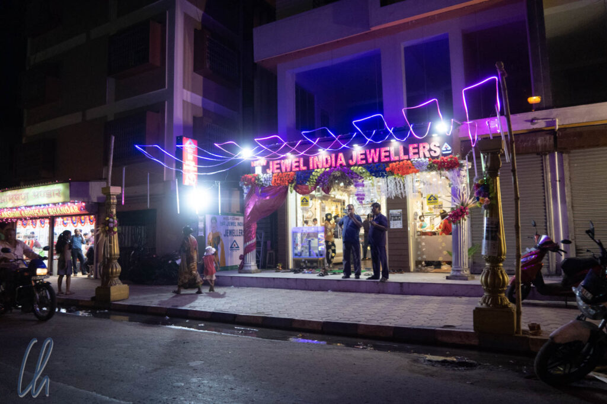
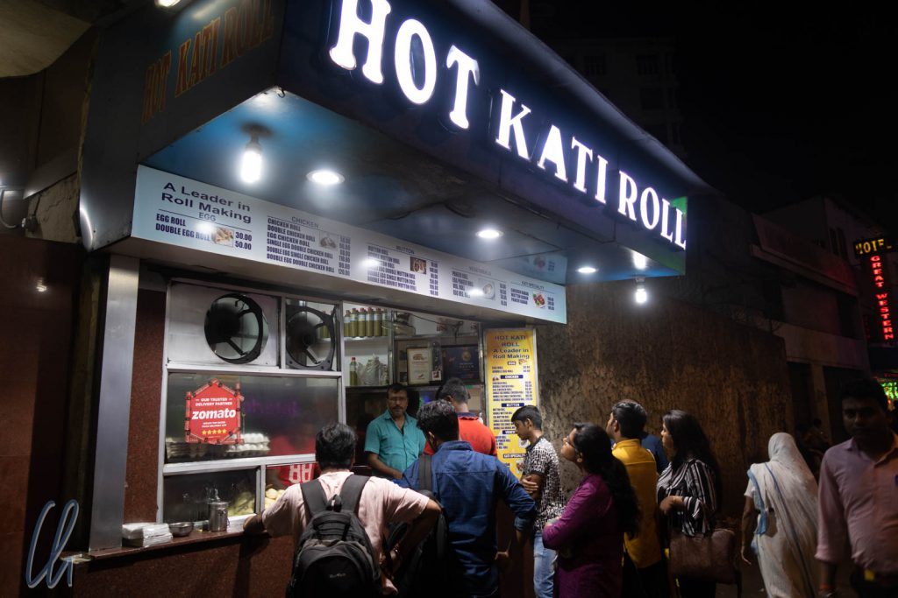
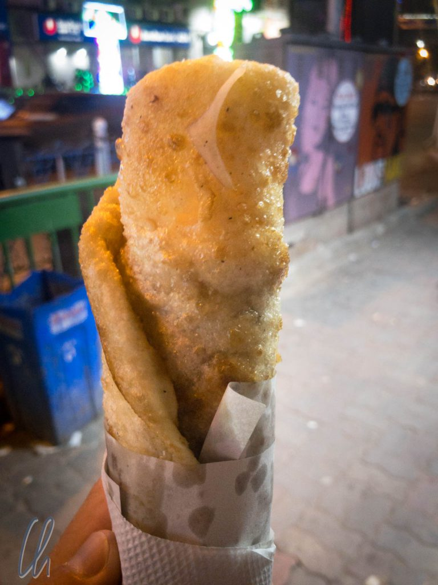
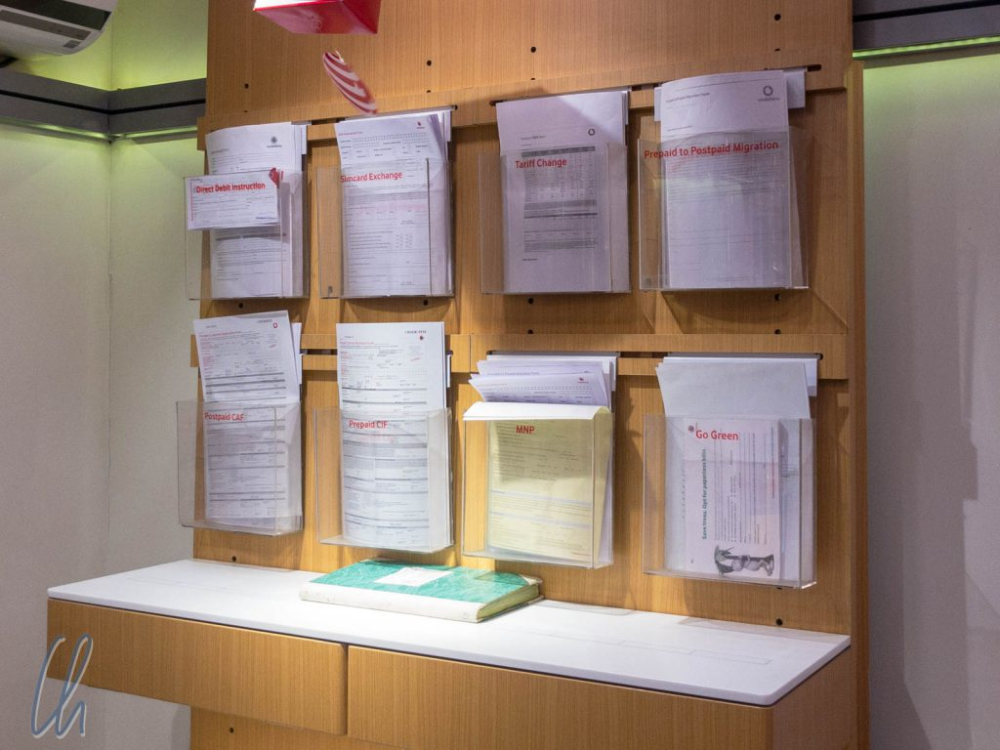
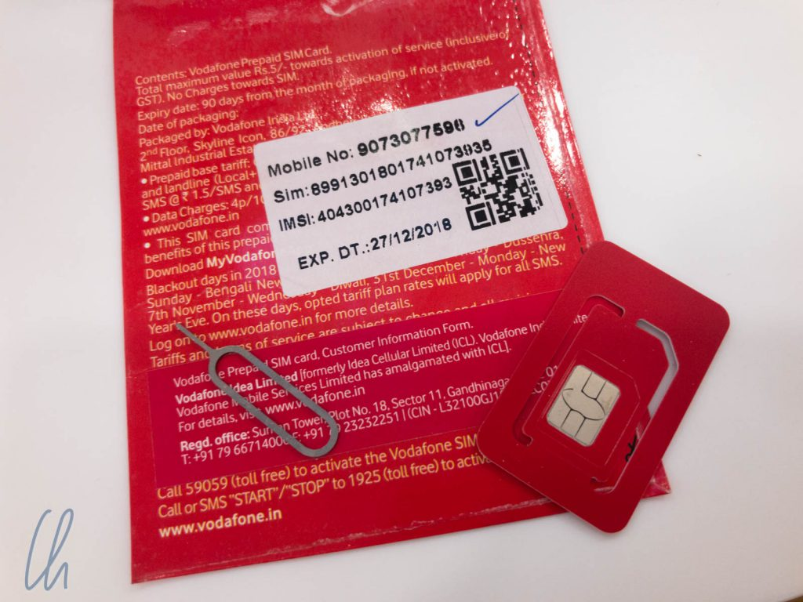
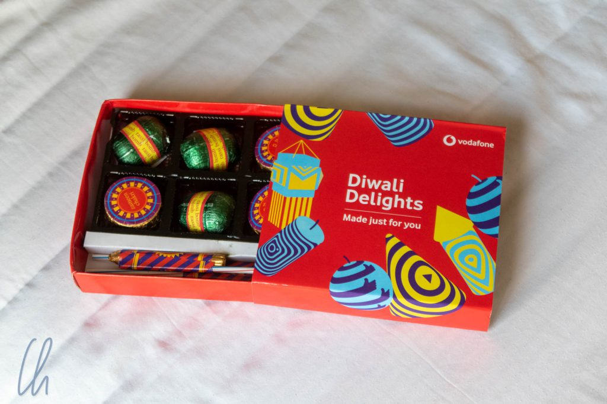

# Erste Eindrücke aus Indien

Indien ist anders als alle anderen Länder. Um das zu bemerken, muss man gar nicht hinfahren, sondern nur eine Reise dorthin planen. Das erste, was dem aspirierenden Besucher auffällt: Die Nation hat ihre Bürokratie in einem enervierenden Ausmaß zu einem hinderlichen Labyrinth komplizierter, undurchsichtiger Prozesse und Vorschriften ausgestaltet. Mit Leichtigkeit übertraf das Visumsformular die Länge aller anderen, die wir auf unserer Weltreise vorher hatten ausfüllen mussten - zusammen ;). Zusätzlich mussten Passbilder in einem bestimmten, speziellen Format hochgeladen werden. Außerdem machten wir beim Buchen von Flügen und Hotels mit phantasievollen aber unausweichlichen Gebühren Bekanntschaft. So bezahlten wir eine User Development Fee, CUTE Fee (wie niedlich!) und, unser Favorit, die Convenience Fee, die wir allerdings eher unbequem fanden ;).

<!--more-->

## Wir buchten und fluchten

Bevor es allerdings zur Bezahlung dieser niedlichen Gebührchen kam, mussten wir uns mit den Internetseiten der Anbieter herumschlagen. Leider müssen wir festhalten: Die Webseiten der Computer-Inder waren eine Katastrophe. Sowohl bei Air India als auch bei Indian Railways scheiterten wir entweder bei der Registrierung (Indian Railways) oder beim Bezahlen (Air India) an unüberwindlichen Softwareproblemen.

Wir waren vorgewarnt: Im Reiseführer und auf der sehr detaillierten Ratgeberseite für internationale Zugreisen [seat61](https://www.seat61.com/India.htm#Buy-tickets-online) wurde besonders vor dem kryptischen Anmeldeprozess der [indischen Eisenbahn](https://www.irctc.co.in/nget/train-search) gewarnt. Und es war mindestens so schlimm wie beschrieben. Man beginnt, das Formular auszufüllen, denkt erst etwas naiv: "Ist doch alles ganz einfach.", scrollt runter und bemerkt Felder ohne Beschriftung als Pflichtfelder. Außerdem mahnt die Webseite optionale Felder an, wenn sie nicht ausgefüllt sind… Hat man es schließlich doch irgendwie geschafft, bekommt man ein Einmalpasswort (OTP) per E-Mail zugeschickt, mit dem man sich anmelden soll.

Leider gab es auf der ganzen Webseite nirgendwo die Möglichkeit, sich anzumelden… Der einzige Ausweg, den ich fand, bestand darin, einen Buchungsprozess zu starten und schließlich muss man sich irgendwann anmelden. Sogar die Option der Eingabe des OTP bestand, aber die führte ins Nichts (damit meine ich allerdings nicht die Erlösung). Nach mehreren Anläufen (Wiedergeburten?) und 2 bis 3 Stunden waren wir keinen Schritt weiter und dem Nervenzusammenbruch nahe. (Es ist schwer, den Kreislauf zu durchbrechen.) Es musste ein Plan B her. Sowohl für die Bahn als auch bei Air India gelang uns die Buchung letztendlich nur indirekt über einen Zwischenhändler.

## Gelandet auf indischem Boden

Nach der Landung in Neu-Delhi waren wir zuallererst beeindruckt, wie einfach und schnell der Einreiseprozess vonstatten ging. Die Stunde Ausfüllzeit pro Visumsformular und die 82 US-Dollar Gebühr pro Person hatten sich bezahlt gemacht. Es gab keine Schlange, wir präsentierten jeweils die ausgedruckte Bestätigungs-E-Mail und unseren Reisepass. Nach der heutzutage obligatorischen Abnahme der Fingerabdrücke bekamen wir sofort den Stempel in den Pass gedrückt :).

Weniger erfreulich verliefen wenige Minuten später unsere Versuche, Bargeld abzuheben. Die zwei Geldautomaten, die wir vor der Sicherheitskontrolle versuchten, akzeptierten unsere VISA-Karte nicht und brachen die Transaktion ab. Nach der Sicherheitskontrolle gab es im ganzen Abflugbereich mit 23 Gates, Food Court, vielen Geschäften und mehreren riesigen Duty Free-Läden keinen einzigen Geldautomaten. So flogen wir unverrichteter Dinge weiter nach Kolkata (englische Bezeichnung: Calcutta). Dort im Ankunftsbereich waren wir ebenso wenig erfolgreich, der im Reiseführer beschriebene Geldautomat existierte nicht mehr. Schließlich blieb uns nichts anderes übrig, als einen geringen Betrag an US-Dollars (also Bargeld) aus unseren Notvorräten zu einem unglaublich schlechten Kurs in die in der Zwischenzeit schon heiß ersehnten Rupien zu tauschen, um ein Taxi zum Hotel bezahlen zu können...

Vor unsere erste Taxifahrt im Land hatten die indischen Götter aber als weitere Prüfung eine Warteschlange gestellt. Die Menschen harrten duldsam vor dem Pre-Paid-Taxi-Schalter aus. Das Pre-Paid-Taxi ist das Mittel der Wahl für alle, die kein mobiles Internet haben (also kein Uber bestellen können) und willkürlichen Preisen vorzubeugen möchten. Die Schlange war zwar nicht lang, aber sie bewegte sich überhaupt nicht vorwärts. In Deutschland wären die Leute in solch einer Situation sicher bald rebellisch geworden, aber die Inder ertrugen das Warten ergeben. Wir rätselten, woran diese enorme Langsamkeit liegen könnte. Zu wenige Fahrzeuge? Nein. Kein Wechselgeld? Nein. Es sah so aus, als ob das Computer-System (Déja Vu), welches die Taxis zuwies und die Zahlungen abwickelte, einfach viiiel zu laaaangsam war. Als wir nach einer Stunde endlich an der Reihe waren, konnte die Transaktion an sich schnell abgeschlossen werden. Bis der Ausdruck kam, vergingen allerdings einige Minuten…

## Im indischen Taxi Typ "Hindustan Ambassador"

Kaum waren wir ins altmodisch wirkende Taxi eingestiegen, sprang der Modus von "zermürbend langweilig" (in der Warteschlage) auf "extrem spannend" um. Der Chauffeur startete den Motor, aus dem Radio erklang typisch indische Musik und die Fahrt verlief rasant. Auf einmal umgaben uns überall viele Autos, Fußgänger, farbige Lichter, Tuktuks, ein scheinbar chaotisches indisches Gewusel. Wir verrenkten uns die Hälse und wussten gar nicht, wohin wir zuerst schauen sollten, alles war exotisch, spannend, bunt und turbulent. Ähnliche Eindrücke erlebt man vermutlich im Drogenrausch unter dem Einfluss einer Mischung aus Speed und LSD. Fahrbahnmarkierungen hatten rein dekorativen Charakter, Hauptsache die Hupe funktionierte. Dem Gesetz des Stärkeren folgend (wir befanden uns mit unserem Gefährt in der Rangfolge der indischen Vorfahrtsregeln vor Motorrädern und Tuktuks auf der einen, aber hinter Bussen auf der anderen Seite) fuhren wir in Richtung der Innenstadt von Kolkata.

https://www.youtube.com/watch?v=v7pTi2iUhJg

Viele der zahlreichen Taxis wirkten wie Oldtimer. Bei den meisten Fahrzeugen handelte es sich jedoch um das Modell [Hindustan Ambassador](https://de.wikipedia.org/wiki/Hindustan_Ambassador) und somit sind die Wagen nicht unbedingt so betagt, wie ihr Stil vermuten ließe. Die Version "Mark 4" wurde bis 2014 hergestellt, dann wurde die Produktion eingestellt. Zweifelsohne werteten die Pseudo-Oldtimer das Straßenbild ungemein auf.

## Diwali-Rush Hour

Hupen gehört zum Verkehr in Indien dazu wie für den Fahrer das Atmen oder das Benzin als Brennstoff für den Motor. Wer nicht hupt, nimmt nicht am Straßenverkehr teil. Eine türkische Hochzeit würde in Kolkata überhaupt nicht auffallen. Und es gibt auch immer genug gute Gründe für akustische Lautäußerungen: Zu langsam vorausfahrende Autos, einscherender Verkehr von allen Seiten, Rikschas, Fußgänger oder schlicht, um darauf aufmerksam zu machen, dass man auch da ist. Manchmal hatten wir den Eindruck, der Fahrer hupte, wenn es mal wieder Zeit dafür war. Die meisten wurden dann schnell rastlos: Schon 30 Sekunden nicht gehupt, määäp, määäp! Interessanterweise gewöhnten wir uns rasch daran und vermissten das akustische Signal sogar, wenn es ausblieb. Vielleicht aus Sorge um das Wohlergehen unseres Chauffeurs?

[Diwali](https://de.wikipedia.org/wiki/Diwali), das hinduistische Lichterfest, stand vor der Tür. Eine Reihe von festlichen Tagen mit jeweils eigener Bedeutung feiert den Sieg des Guten über das Böse, des Lichts über das Dunkel. So war die Stadt an vielen Stellen mit bunten elektrischen Lichterketten geschmückt, vor vielen Häusern und Geschäften hatten die Menschen traditionelle Muster aus gefärbtem Reismehl - echte kleine Kunstwerke - auf den Bürgersteig gestreut und kleine Öllämpchen aus Ton aufgestellt. Am Straßenrand standen riesige Statuen der schwarzen Göttin [Kali](https://en.wikipedia.org/wiki/Kali), die in Bengalen sehr verehrt wird, zum Verkauf, viele festlich gekleidete Menschen bewegten sich auf den Straßen und die Juweliergeschäfte waren gut besucht. (Es hat in Indien Tradition, zu Diwali Schmuck zu verschenken).

## Indien kulinarisch: Unbürokratische Kati Rolls

Nachdem wir im Hotel angekommen waren und eingecheckt hatten, war es eigentlich nach lokaler Zeit noch nicht spät, aber unsere innere Uhr war schon zweieinhalb Stunden weiter und wir waren ziemlich müde und hungrig. Um uns mögliche Wartezeiten in einem Restaurant zu ersparen, gingen wir zu einem (vom Lonely Planet empfohlenen) Stand, der Kati Rolls verkaufte. Dort umlagerte schon eine Menge hoffnungsvoller Inder den Imbiss… Das war nun immerhin ein Hinweis auf die gute Qualität der hier angebotenen Snacks. Trotz unserer traumatischen Erfahrung in der Taxi-Schlange am Flughafen stellten wir uns, innerlich seufzend, dazu. Aber, oh Wunder, es dauerte nicht lange, bis wir die heißen, knusprigen, aromatisch duftenden Rollen in Händen hielten.

Bei [Kati Rolls](https://en.wikipedia.org/wiki/Kati_roll) handelt es sich um original bengalisches Street Food aus Kolkata und das Konzept ähnelt einem Dürüm Döner oder einem mexikanischen Burrito. Fleisch (Hühnchen oder Lamm) oder Käse ([Paneer](https://de.wikipedia.org/wiki/Panir)) werden zusammen mit Zwiebeln, Chilis, Gemüse, Chutney und Gewürzen in ein gebratenes [Paratha](https://de.wikipedia.org/wiki/Paratha), indisches Fladenbrot eingerollt. Das Ergebnis ist köstliches indisches Fastfood mit angenehmer Würze.

## Wir kaufen eine indische SIM-Karte

Was den Kauf der SIM-Karte anging, hatten wir uns schon auf einen zähen, überbordenden bürokratischen Akt eingestellt. Laut Reiseführer und Internet müsse man mindestens Kopien von Pass und Visum mitbringen, 2 bis 5 Passbilder, einen Nachweis über die Adresse in Deutschland und die Adresse in Indien. Dann soll es mindestens einen Tag nach dem Kauf bis zur Aktivierung dauern und auch das soll auch nicht immer funktionieren. Nach unseren Erfahrungen vor allem mit der indischen Eisenbahn klang das alles sehr glaubwürdig.

Aber zum Glück durften wir feststellen, dass zumindest für uns diese Geschichten aus dem Lonely Planet und von den einschlägigen Webseiten NICHT zutrafen. Nachdem uns ein Angestellter im Airtel-Geschäft abgewiesen hatte (wegen Diwali verkauften sie aktuell keine SIM-Karten), wandten wir uns zu einem Vodafone-Laden. Ein freundlicher junger Mann hatte den Prozess offensichtlich im Griff. Er bat um meinem Pass und begann, das lange Formular auszufüllen.

## Einfacher als gedacht

Für die Hoteladresse in Indien reichte der Nachweis per App auf dem Smartphone, unsere deutsche Anschrift notierten wir auf einen Block, damit er sie abschreiben konnte. Kopien meines Reisepasses fertigte er direkt an, ich musste nur alle Blätter unterschreiben mit einem Teil der Unterschrift auf der kopierten Passseite und einem Teil daneben. Dann klebte er eines meiner Fotos auf. Ich durfte bezahlen (501 Rupien = 6 EUR). Das frisch ausgefüllte Formular gab er an einen anderen Mitarbeiter weiter. Dieser tippte die Informationen vom Blatt in ein Computersystem ab, während ein weiterer Angestellter assistierte. Anschließend aktivierte er die SIM-Karte mit einem anderen Telefon und voilà: Alles zusammen dauerte nur eine gute Stunde und wir waren online :).

Für die 501 Rupien bekamen wir 1,5 GB Daten pro Tag (!), unlimitierte Gespräche in Indien sowie 100 SMS täglich. Damit nicht genug: Als spezielles Diwali-Geschenk überreichte uns der freundliche Mitarbeiter noch zwei Schachteln mit leckeren Süßigkeiten. Danke Vodafone!

