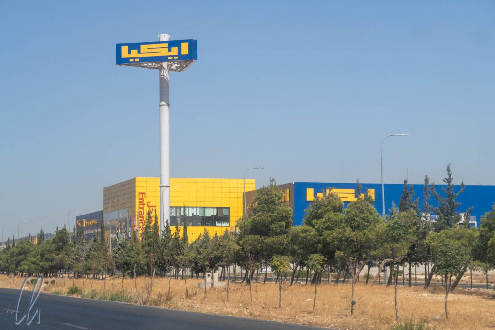

Jordanien hatten wir in unsere Reiseroute aufgenommen, da wir auf unserer Weltreise mindestens ein arabisches Land besuchen wollten. Über die arabische und muslimische Welt gibt es vor allem in der heutigen Zeit viele Vorurteile und da liegt nichts näher, als einfach hinzufahren und selbst Eindrücke zu gewinnen. Nachdem wir uns gegen den [Iran](http://wittmann-tours.de/warum-wir-doch-nicht-den-iran-besuchten) entschieden hatten, war Jordanien eine logische, unkomplizierte und interessante Alternative. Es gibt kaum politische Spannungen und das Land gilt als sehr weltoffen. Außerdem hat es eine sehr spannende und wechselhafte Geschichte. Einige biblische Stätten befinden sich auf dem Staatsgebiet, Griechen, Nabatäer und Römer haben ihren Einfluss in der Region ausgeweitet, die Kreuzritter hinterließen gewaltige Burgen, gefolgt von der arabischen Blütezeit. Nicht zuletzt wird unter anderem in Jordanien eine der berühmtesten Pferderassen der Welt gezüchtet, die Araber, so dass wir die Gelegenheit ergreifen wollten, vor Ort diese herrlichen Kreaturen kennenzulernen. Zuerst besuchten wir die Hauptstadt Amman.

<!--more-->

## Die arabische Schrift

Direkt nach der Ankunft fielen uns natürlich überall arabische Hinweistafeln ins Auge. Jordanien war eines der Länder unserer Reise, in denen wir die einheimische Schrift nicht entziffern konnten. Zum Glück gab es aber viele zweisprachige Schilder, auf denen uns eine zusätzliche englische Beschriftung weiterhalf. Nicht nur sind die Zeichen ganz anders, sondern man liest auch von rechts nach links, so dass man den Eindruck hat, gar nichts verstehen zu können. Denkste! Dank perfektem Branding waren einige internationale Marken auch auf Arabisch unzweifelhaft zu identifizieren, wobei die Schriftzeichen dazu allerdings keinen Beitrag leisteten ;)

Bei den Zahlen hingegen fragten wir uns, warum es in dem arabischen Land andere Nummernsymbole gab als die, die wir als arabische Ziffern (also 0, 1, 2, 3, 4, 5, 6, 7, 8, 9) kennen. Wie wir auf [Wikipedia](https://de.wikipedia.org/wiki/Arabische_Zahlschrift#Der_Sprung_ins_Abendland) lernten, kamen die "arabischen" Zahlen in Wirklichkeit aus Indien, fanden dann aber ihren Weg nach Europa über die arabische Welt und das damals muslimische Spanien. Daher hat sich ihre eigentlich missverständliche Bezeichnung gehalten. Interessant ist, dass die Ziffern im Arabischen entgegen der dort normalen Richtung auch von links nach rechts geschrieben werden, so wie bei uns. Damit gab es am Geldautomaten keine Missverständnisse. Aus 200 JOD werden ٢٠٠ JOD und das Jahr 2018 wird auf arabisch ٢٠١٨ geschrieben (nicht umgekehrt).

## Die Hauptstadt Amman

So fuhren wir vom hochmodernen Flughafen von Amman, 30 Kilometer südlich des Zentrums gelegen, mit einem Taxi in die Innenstadt zu unserem Hotel. Die Straßen waren sehr gut ausgebaut und am Straßenrand fielen uns wir die ersten Kamele auf. Auf den ersten Blick wirkte alles sehr modern und trotzdem waren wir eindeutig in einem arabischen, traditionsbewussten Land angekommen. Die Architektur der Häuser und die Kleidung der Leute spiegelten diese Durchmischung von muslimischen Bräuchen und Gegenwart recht deutlich wider. Viele Frauen trugen zum Beispiel Kopftuch, aber vollverschleierte Personen in Burkas sahen wir nicht.

Die lange Geschichte Ammans spiegelt sich auch im Namen des Ortes wieder, der in biblischer Zeit als Rabba bekannt war. Der heutige Name geht auf die schon im Alten Testament erwähnten [Ammoniter](https://de.wikipedia.org/wiki/Amman#Ursprung_des_Namens) zurück. Dieses Volk lebte in etwa im 13 Jh. vor Christus dort. Nach den erfolgreichen Feldzügen Alexanders des Großen (332 v. Chr.) in der Region hieß die Stadt für viele Jahrhunderte Philadelphia. Erst um 630, nach der Eroberung durch die Muslime, nannte man die Siedlung Amman. Aufgrund ihrer geographischen Lage haben im Laufe der Jahrhunderte viele Völker dort ihre Spuren hinterlassen und die lange, wechselhafte und vielfältige Geschichte des heutigen Landes Jordanien sollte uns in den kommenden Wochen begleiten.

Bei unserem Hotel im Hier und Jetzt angekommen, wäre allerdings unser Taxifahrer beinah mit unserem Gepäck davongefahren. Wir stiegen aus und er fuhr sofort los. Huch! Ich konnte noch auf den Kofferraum des rollenden Wagens klopfen, was ihn zum Glück zum Anhalten bewegte. Beim Zurücksetzen überfuhr er uns fast und entschuldigte sich nach dem Aussteigen mit einem blumigen Wortschwall. Es täte ihm schrecklich leid, es wäre alles seine Schuld, keine Absicht, nichts passiert, kein Problem, keine Absicht, er wäre ein ehrlicher Mann. Zum Abschied küsste er mich auf die Stirn. Wir glaubten ihm, dass es ein Versehen war. Dennoch schwankten unsere Gefühle zwischen Verärgerung und Amüsement.

## Jordanien kulinarisch - Mezze

Bevor wir mit der von Mona vorbereiteten Entdeckungstour von Amman starteten, stand das Mittagessen auf dem Programm. Die Empfehlung der Rezeption war mehr ein Imbiss als ein Restaurant auf der gegenüberliegenden Straßenseite. Wir hatten Probleme, als einzige Ausländer einen Sitzplatz zu finden, ein gutes Zeichen!

Glücklicherweise fanden wir noch einen Platz in dem Hof, der von einer Plastikplane als Sonnenschutz überspannt wurde. Wir bestellten ein paar Kleinigkeiten, Mezze, quasi jordanische Tapas: Falafel, Humus, eine Auberginenpaste (die mehr als nur Spuren von Knoblauch enthielt) und einen Salat. Fladenbrot gab es natürlich auch dazu. Das Essen war phantastisch und sehr gut gewürzt. Dies war seit langem das beste einheimische Essen, das wir genossen haben. Klar haben wir in Afrika auch gut gegessen, aber dort war die einheimische Küche weniger spannend und oft (z.B. auf den Safaris) gab es eher westliche Gerichte. In Jordanien freuten wir uns nun auf jede Mahlzeit!

Nicht zu vernachlässigen waren natürlich die orientalischen Süßigkeiten. Diverse Geschäfte lockten mit üppigen Auslagen, die wahrhaftig glänzten und funkelten - Dank all dem Sirup, mit dem sie übergossen waren ;). Natürlich mussten wir probieren. In der Tat, sie waren so süß und köstlich, wie sie aussahen und klebten regelrecht am Teller fest! Der schuldbewusste Versuch, die in diesem Naschwerk aus 1001 Nacht enthaltenen Kalorien zu ermitteln, würde jedem westlichen Ernährungswissenschaftler die Tränen in die Augen treiben.

## Die Zitadelle - die Akropolis von Amman

Einer der Höhepunkte der Stadt (auch in geografischer Hinsicht) ist die Zitadelle von Amman. Zahlreiche Kulturen errichteten auf diesem Hügel religiöse Stätten und Paläste. Die Ruinen dieser Gebäude sind auch heute noch, Jahrhunderte später, zu sehen: der römische Herkulestempel, eine byzantinische Kirche und zahlreiche Bauwerke der [Umayyaden](https://de.wikipedia.org/wiki/Umayyaden), z.B. ein Palast, ein Hamam und eine Zisterne. Die meisten stehen wiederum auf den Grundmauern vorheriger Gebäude anderer Bauherren. Vom Hügel aus hatten wir im warmen Abendlicht einen herrlichen Blick über die Stadt und das sehr gut erhaltene römische Theater.

Das sehenswerte Museum präsentierte Fundstücke der Zitadelle und ordnete die Perioden für uns zeitlich ein. Auch wenn es bei Geschichte eigentlich nicht um Jahreszahlen geht, gab es schon ein paar wichtige Eckpunkte. So herrschten die Griechen von 332-63 v.Chr., die Römer bis 324 n.Chr., anschließend die Byzantiner und die Zeit von 661 bis 1916 wurde als Islamische Ära bezeichnet. Nach dem Zusammenbruch des Osmanischen Reichs 1918 folgte das moderne Jordanien.

Fußnote: Zurück in Deutschland sahen wir interessanterweise in einem Krimi die Stadt und die Zitadelle von Amman, die einen Ort in Syrien darstellen sollten. Man rechnete wohl nicht damit, dass Mitteleuropäer die jordanische Hauptstadt erkennen würden ;).

## Das Nationalmuseum in Amman

Das Nationalmuseum in Amman ist ein Vorzeigeprojekt bzw. befindet sich im Begriff, eines zu werden. Leider waren große Teile des modernen Gebäudes wegen Renovierungsarbeiten nicht zugänglich. Immerhin konnten wir uns die [Schriftrollen von Qumran](https://de.wikipedia.org/wiki/Schriftrollen_vom_Toten_Meer) ansehen, von denen sich ein Teil in Jordanien befindet.

Im Nationalmuseum versuchte sich Jordanien als modernes Land mit einer langen Geschichte zu präsentieren. Interessant war ein Terminal, auf dem man seinen Namen in den verschiedenen Alphabeten der früher im Land ansässigen Völker schreiben lassen konnte.

Jordanien präsentierte sich als Standort von Technologie und Innovation, es ging um Umweltschutz, Energie und gesunde Ernährung, alles Problemfelder im Land. Die Präsentation signalisierte einen offenen Umgang mit diesen Themen. Jordanien verbraucht sehr wenig [Wasser pro Kopf](http://www.fao.org/nr/water/aquastat/data/query/index.html) (besonders verglichen mit den direkten Nachbarländern und den meisten Industrienationen) und nimmt für sich Fortschritte bei den Frauenrechten in Anspruch.

Nach diesem Auftakt irritierte und verwunderte uns eine Ausstellung im ersten Stock über die Erfindungen islamischer Gelehrter ein wenig. Aufwändige Multimedia-Installationen, eher für Kinder als für Erwachsene konzipiert, folgten alle dem immer gleichen Grundtenor: Heutzutage vollkommen vergessene islamische Forscher haben die Grundlagen für die Errungenschaften der modernen Wissenschaften gelegt. Eigentlich haben sie Flugzeuge erfunden, Medizin und Mathematik geprägt etc. Sicher eine interessante, wohl aber etwas einseitig polarisierte Betrachtungsweise der Geschichte… Immerhin, wenn die Ausstellung das Ziel erreichte, Kinder für die Wissenschaft zu begeistern, dann hätte sie ein positives Resultat zu verbuchen.

## Moderner als erwartet

Jordanien gibt sich fortschrittlich und Tradition und Moderne erschienen uns ohne wirkliches Spannungsfeld im Alltag vereint. Jordanien präsentierte sich uns als gut organisiert und deutlich weniger chaotisch als erwartet. Wenn man Marrakesch als Maßstab im Kopf hat, dann ist Amman dagegen eine friedliche Oase. Als Ausländer waren wir natürlich leicht zu erkennen, aber niemand versuchte, daraus Kapital zu schlagen. Die Sicherheitslage war vollkommen entspannt, auch abends und bei Dunkelheit - so viel zum Thema der bedrohlichen islamischen Welt: Wir bemerkten keine Spur davon.

Amman wirkte nicht so modern und glitzernd wie Dubai. Jordanien kann nicht mit Öl-Dollars protzen, sondern muss sein Geld in anderen [Wirtschaftszweigen](https://de.wikipedia.org/wiki/Jordanien#Wirtschaftssektoren) verdienen, zum Beispiel mit Phosphatabbau und der Produktion von Düngemitteln. Das Land ist damit nicht übermäßig reich, aber die Wirtschaft wächst stetig, was auch auf den Straßen sichtbar war. Ein moderner Fuhrpark rollte durch Amman, vor allem die Uber-Autos (auch in Jordanien konnten wir den Fahrdienst bequem und problemlos nutzen) waren fast ausnahmslos brandneue Hybrid-Modelle. Damit machte die Nation einen sehr positiven ersten Eindruck auf uns. Wir freuten uns darauf, mehr vom Königreich, sowohl Historisches als auch die Kultur der Gegenwart, kennenzulernen.
