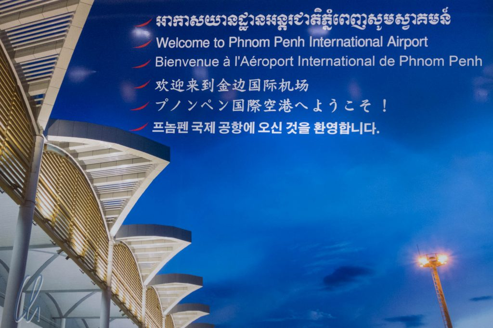
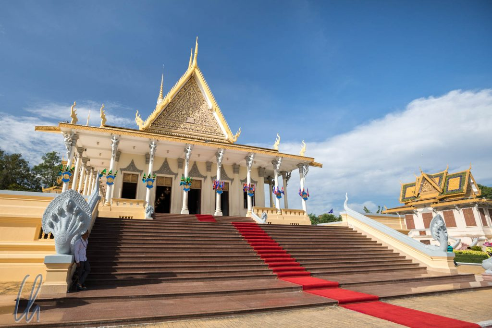
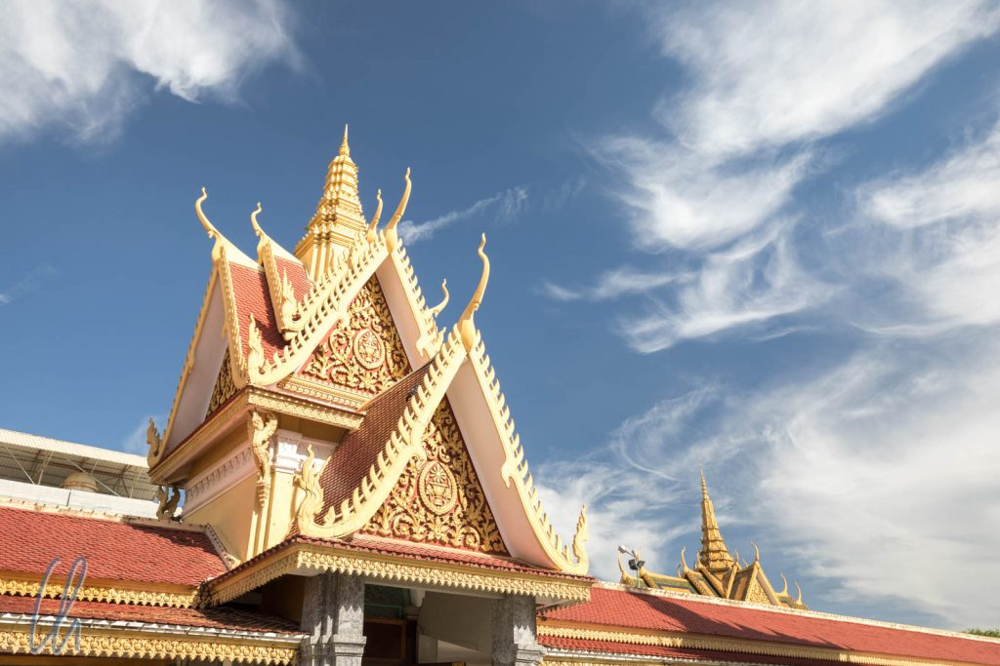
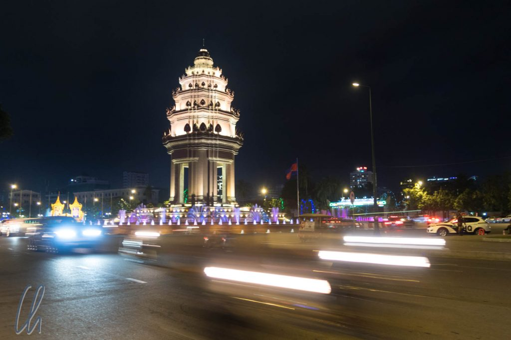
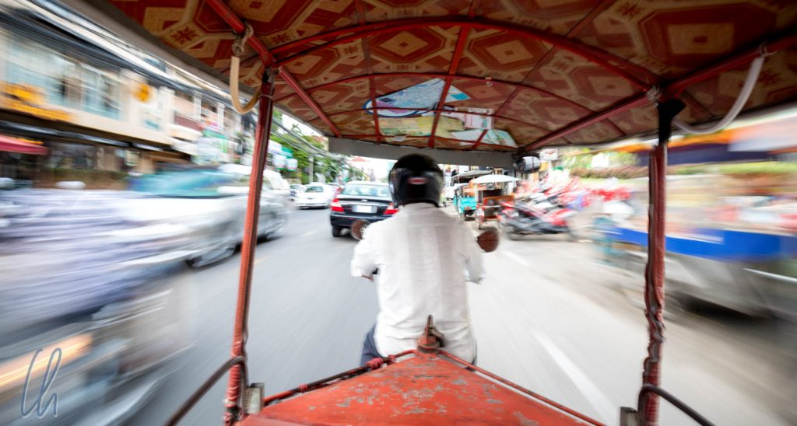
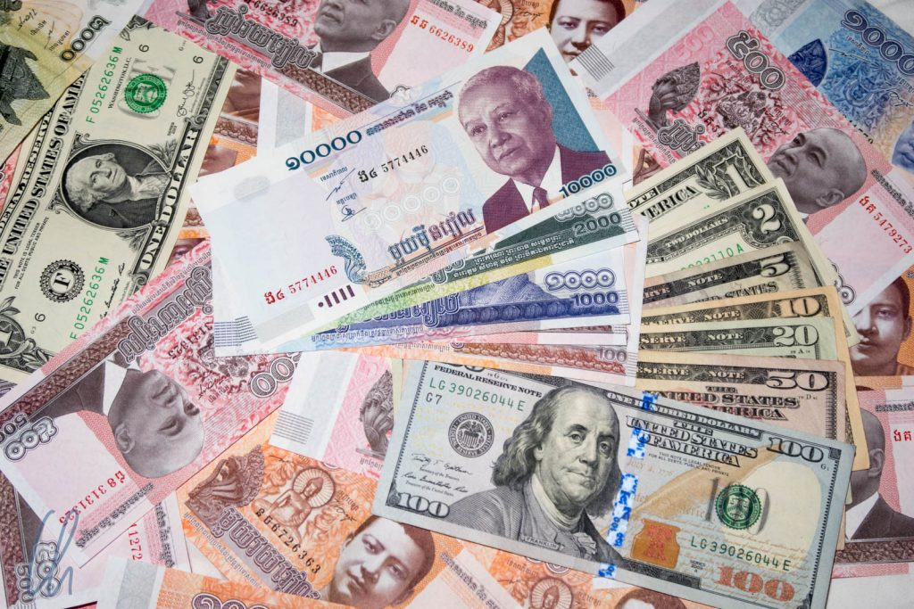

Nach der Ankunft in Kambodscha wirkte [Phnom Penh](https://de.wikipedia.org/wiki/Phnom_Penh) sehr modern auf uns. Die Straße vom Flughafen ins Stadtzentrum war gut, verglichen mit Myanmar gab es viel bunte Beleuchtung der Plätze und Leuchtreklame. Das Taxi erschien uns vergleichsweise neu und - oh Wunder - alle Sitze hatten funktionstüchtige Sicherheitsgurte. Unser Taxifahrer sprach zudem gutes Englisch. Der Transfer in die Stadt hatte dann auch den gehobenen Einheitspreis von 12 US-Dollar, mindestens doppelt so teuer wie in Myanmar.

<!--more-->

## Kambodscha in Sorge

Auf der Fahrt offenbarte sich jedoch auch bald ein negativer Aspekt der Situation des Landes. Nachdem die üblichen Einstiegsthemen (Woher? Wie lange in Kambodscha? etc.) das Eis gebrochen hatten, kam unser Taxifahrer schnell auf die Politik in Kambodscha zu sprechen. Das Land habe große Probleme: Bei den nächsten Wahlen hätte er keine echte Wahl, es gäbe nur eine Partei. Außerdem blühe die Korruption. Wie sich herausstellte, war dies keine Pauschalkritik am System, sondern er äußerte ernst gemeinte Sorgen.

Im Reiseführer wurde Kambodscha noch als vielversprechendes Land auf dem Weg zur Demokratie beschrieben, aber Mitte November 2017 wurde [die größte Oppositionspartei durch den Obersten Gerichtshof verboten](http://www.zeit.de/politik/ausland/2017-11/kambodscha-oberstes-gericht-oppositionspartei). Nachdem die [CNRP](https://de.wikipedia.org/wiki/Nationale_Rettungspartei_Kambodschas) bei den vergangenen Wahlen immer mehr Stimmen für sich verbuchen konnte, hätten die Wahlen 2018 Kambodscha eine neue Regierung bescheren können. Aber für den Machterhalt ist der aktuellen Regierung anscheinend jedes Mittel recht. Wir waren schockiert, und so richtig glaubten wir es erst, nachdem wir im Internet mehr Details gelesen hatten.

## Zu Besuch beim König

Auch wenn die Macht beim ewigen Premierminister [Hun Sen](https://de.wikipedia.org/wiki/Hun_Sen) liegt, ist [König Norodom Sihamoni](https://de.wikipedia.org/wiki/Norodom_Sihamoni) das echte Staatsoberhaupt. Der Königspalast liegt im Herzen von Phnom Penh und war unser erstes Besichtigungsziel. Die 10 Dollar Eintritt pro Person fanden wir eher happig, die weiteren pauschalen 10 Dollar für einen Guide ebenso. Wir bekamen schnell den Eindruck, dass Touristen gemolken werden.

Trotz des Preises war die Führung sehr interessant. Wir lernten viel über die Palastgebäude, den König, die Religion und Kambodscha. Auch hier erhielten wir so etwas wie einen Kommentar zur Politik in Kambodscha: Der Kommunismus sei wie ein Virus, der das Land bedrohen würde. Neben historischen Ereignissen meinte unser Guide damit vor allem China, das in großem Stil in Kambodscha [investiert und starken Einfluss ausübt](http://www.spiegel.de/politik/ausland/kambodscha-china-kommt-die-demokratie-geht-a-1167432.html).

Am Ende der Führung wurde für uns Geschichte lebendig. Unser Führer berichtete kurz über die Zeit der [Roten Khmer](https://de.wikipedia.org/wiki/Rote_Khmer), die er als Kind erlebt hatte: Mit seiner Familie wurde er gezwungen, die Stadt zu verlassen, wie sie auf dem Land lebten und sehr hart arbeiten mussten und wie sie nach dem Krieg wieder zurückkehrten nach Pnomh Penh. Dabei wurde uns erst so richtig bewusst, dass die Zeit der Gräuel unter den Roten Khmer noch nicht lange her ist. Um uns herum waren viele Kambodschaner, die diese schwere Zeit miterlebt hatten - im Gegensatz zu Deutschland, wo die Zeitzeugen des zweiten Weltkrieges allmählich aussterben.

## Phnom Penh

Auch auf den zweiten Blick machte das Zentrum von Phnom Penh auf uns den Eindruck einer modernen Stadt. Da wir Yangon noch vor Augen hatten, erschienen im direkten Vergleich die Unterschiede enorm. Die Straßen waren sauberer, die Gehwege konnten wirklich als solche benutzt werden, das Warenangebot in den Geschäften wirkte deutlich umfangreicher. Obwohl in Phnom Penh nur zwei Drittel der Einwohnerzahl von Yangon leben, wirkte es deutlich großstädtischer.

Tourismus war im Zentrum von Phnom Penh ein unübersehbarer Wirtschaftszweig. An jeder Ecke wartete ein Überangebot von Tuk Tuk-Fahrern, die gerne eine Fahrt an Land ziehen wollten (_"Tuk Tuk? Killing Fields? Where you from?"_). Es gab viele Touranbieter, Wechselstuben, Hotels und Restaurants, die ganz eindeutig die zahlreichen Ausländer als Zielgruppe anvisierten. Auf der einen Seite war es positiv, ein gutes Angebot zu haben, aber gleichzeitig wirkte alles geschäftsorientierter und oberflächlicher. In Myanmar waren wir als Ausländer aufgefallen, hier wurden wir als Touristen und damit als mögliche Geldquelle wahrgenommen.

## Von kleinen und großen Fischen

Viele (v.a. höhere) Preise waren in Dollar ausgezeichnet, die eigene Währung (Riel, der kleine Fisch, wie wir auf [Wikipedia](https://de.wikipedia.org/wiki/Kambodschanischer_Riel) lernten) spielte eher die zweite Geige. Trotzdem ließen sich beide Währungen überall zum Kurs von 1:4000 problemlos ineinander tauschen - solange die großen Fische, die Dollarscheine, keine Risse, Falten oder sonstigen Gebrauchsspuren hatten.

Die Riel übernahmen so meist die Rolle von Kleingeld, da es auch hier (wie in Myanmar) keine Münzen gab. So bekamen wir beim Bezahlen oft Teile des Wechselgeldes in Riel. Das gleiche funktionierte auch in die andere Richtung: 6 Dollar kann man mit einem 5 Dollar Schein und weiteren 4000 Riel bezahlen - ein ungewöhnliches Konzept, an das wir uns erst gewöhnen mussten.

