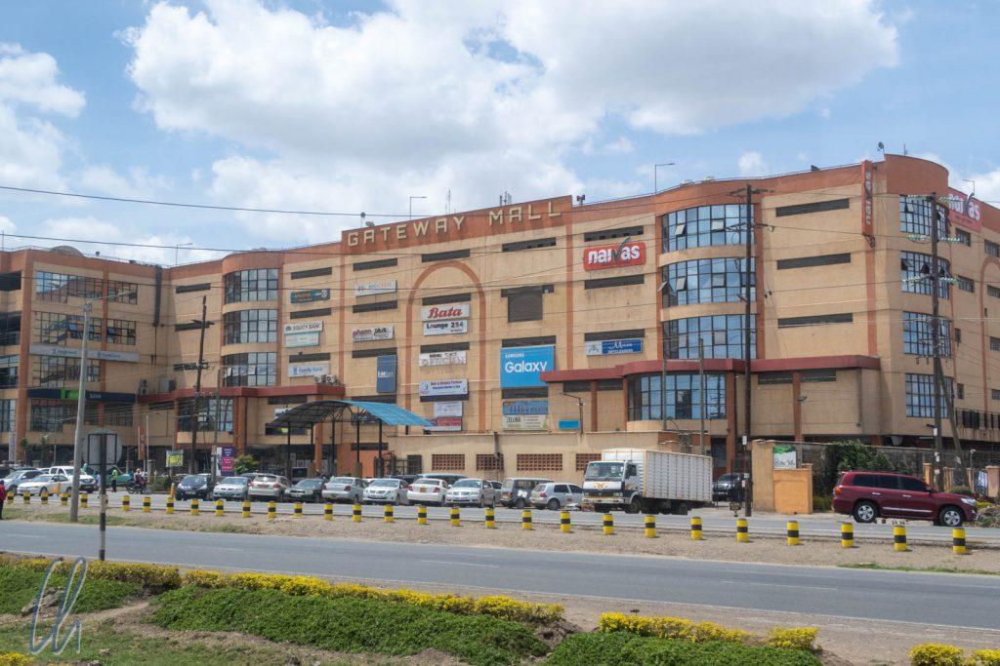

# Erste Eindrücke aus Kenia

Eigentlich hatten wir nicht gedacht, dass es sich lohnen würde, über die "Ersten Eindrücke" in Kenia (sonst immer der initiale Blogpost aus jedem besuchten Land) zu berichten. Wir waren nur nach Kenia gereist, um an einer Reitsafari teilzunehmen (mehr dazu im [nächsten Artikel](http://wittmann-tours.de/auf-reitsafari-in-der-masai-mara/)). Aber dann hatten wir in den ersten zwei Tagen in Nairobi doch einiges erlebt, über das wir berichten wollen.

<!--more-->

## Beeindruckende Infrastruktur

Aus Madagaskar kommend erschien uns Tansania schon deutlich entwickelter. Dagegen wirkte Kenia noch einmal viel moderner. Die Straßen waren, wie schon in Tansania, sehr gut, aber es gab deutlich mehr Verkehr, umso mehr, je näher wir dem Zentrum von [Nairobi](https://de.wikipedia.org/wiki/Nairobi) kamen. In der Hauptstadt selbst gipfelte dies dann leider in einem Mega-Stau, durch den sich unser Kleinbus nur sehr langsam vorarbeiten konnte. Von der Grenze bis in die Innenstadt von Nairobi (ca. 150km) brauchten wir satte 4 Stunden.

Entlang des Weges wandelte sich das Bild neben der Straße. Direkt hinter der Grenze sahen wir noch eine Savannenlandschaft und Viehhirten mit Ziegen, Kühen und gelegentlich Schafen. Um Nairobi herum hingegen gab es Fabriken (so etwas hatten wir schon länger nicht mehr zu Gesicht bekommen) und riesige Einkaufszentren. Pkws und Lkws aller bedeutenden Marken fuhren auf den Straßen und trugen ihren Teil zum Stau bei.

## Nairobi, the city of crime?

Nachdem wir in der Innenstadt ausgestiegen waren, kauften wir, wie in jedem Land nach der Ankunft, eine lokale SIM-Karte, passenderweise von [Safaricom](https://www.safaricom.co.ke/) ;). Erstaunlich waren die Sicherheitsvorkehrungen am Eingang des Safaricom-Ladens (und auch bei den anderen Geschäften). Es gab einen Metalldetektor wie am Flughafen und einen Wachmann am Eingang, der die Kunden im Befehlston ansprach und streng kontrollierte.

Die Steigerung davon erlebten wir in unserer Unterkunft (zugegeben der gehobenen Klasse): Eine hohe Mauer umgab das Hotel. An der Schranke inspizierte der Sicherheitsdienst den Fußraum von Fahrer und Beifahrer, dann das Handschuhfach und schließlich überprüften sie den Unterboden unseres Taxis mit Spiegeln. Erst nachdem sie sich überzeugt hatten, dass alles unauffällig war, durften wir die Schranke passieren. Am Hoteleingang wurde unser gesamtes Gepäck durchleuchtet. Wir leerten unsere Taschen und passierten den Metalldetektor. Um den Lift zu dem Stockwerk, in dem sich unser Zimmer befand, zu bedienen, brauchten wir die Schlüsselkarte. Anschließend entsperrte die Karte die Tür zum Flur und natürlich zu guter Letzt auch noch die Zimmertür. Im Pentagon gibt es vermutlich weniger Sicherheitsvorkehrungen … oder lauerten die Kriminellen wirklich überall?

## M-Pesa Scam

All die Schlösser und Kontrollen konnten aber die modernen Bösewichte nicht stoppen. Am Morgen des zweiten Tages in Nairobi, den wir als Puffertag eingeplant hatten, erhielten wir eine SMS, dass wir per M-Pesa eine Überweisung erhalten hätten. [M-Pesa](https://de.wikipedia.org/wiki/M-Pesa) ist eine Transaktionsmöglichkeit für Geld bei der Telefongesellschaft (und ersetzt ein Konto bei einer "echten" Bank), mit der man bargeldlos per Handy bezahlen kann.

Gleich darauf bekam ich einen Anruf vom Absender: Es wäre alles ein großes Versehen. Er hätte das Geld an ein Krankenhaus überweisen wollen, um die Behandlung seiner Tochter zu bezahlen, aber unglücklicherweise habe er eine Ziffer falsch eingegeben und damit versehentlich mir die Summe überwiesen. Ich möge sie ihm bitte zurückerstatten. Er hätte sich schon mit Safaricom in Verbindung gesetzt, das Guthaben wäre deshalb gesperrt (damit ich es nicht ausgeben könne), und der Kundenservice würde sich bald bei mir melden, um sich den Fall von meiner Seite bestätigen zu lassen.

## Systematischer Betrug von (internationalen) Neukunden?

Genauso geschah es dann auch, der nächste Anruf folgte ein paar Minuten später, der Fall wurde nochmals erläutert. Ich entgegnete, ich hätte noch nie eine M-Pesa Transaktion getätigt, bräuchte also eine Anleitung. Als erstes sollte ich 4000 Ks (ca. 40 Euro) einzahlen, um meinen Account zu aktivieren. Moment mal?! Das hörte sich sehr suspekt an. Je länger die Erläuterungen am Telefon dauerten, desto misstrauischer wurde ich. Ich lehnte rundheraus ab, das würde ich nicht tun. Es musste einen anderen Weg geben, die Transaktion rückgängig zu machen. Der Support-Mitarbeiter wollte sich später nochmal melden… (Was er jedoch dann nicht mehr tat.)

Nachdem ich kurz gegoogelt hatte, bestätigte sich mein Verdacht: Das war eine Betrugsmasche. Es gab zahlreiche Seiten im Netz (z.B. [hier](https://www.tripadvisor.com/ShowTopic-g294207-i9695-k11367182-M_PESA_scam_in_Nairobi-Nairobi.html)), die solch einen Fall beschrieben. Jetzt sei aber mal die Frage erlaubt @Safaricom: Versucht Ihr (oder Eure Mitarbeiter) wirklich systematisch, Eure internationalen Neukunden übers Ohr zu hauen? Niemand außer Euch kannte bis dahin unsere Nummer, keine 24 Stunden waren nach der Aktivierung der SIM-Karte vergangen. Es mag sein, dass Ihr das beste Netz im Land habt, aber das ist kein Spaß…

## Das Restaurant "Carnivore"

Den Tag über hatten wir uns kein Besichtigungsprogramm vorgenommen, sondern wir wollten die Flüge nach und in Indien buchen und im Reiseführer lesen. Einzig am Abend planten wir einen Ausflug zum legendären Restaurant "[Carnivore](https://tamarind.co.ke/restaurant.php?carnivore)", das sozusagen [Rodizio](http://wittmann-tours.de/brasilien-kulinarisch-rodizio-und-mehr/) auf kenianisch bietet. Selbstredend sollten wir die paar hundert Meter zum Restaurant mit dem Taxi fahren (zu gefährlich). Leider servieren sie schon seit einigen Jahren kein Game mehr, also keinen Springbock, Kudu oder Warzenschwein. (Der Verkauf von Wildfleisch ist heutzutage in Kenia verboten.) Stattdessen gab es reichlich saftiges Rind, Schwein und Hühnchen, das die Kellner auf mächtigen Spießen brutzelnd-heiß an unseren Tisch brachten und wovon sie uns großzügige Scheiben abschnitten. So nahm der Tag doch noch einen versöhnlichen Ausgang.

Es ist durchaus möglich, dass wir Kenia allgemein und Nairobi im Besonderen mit unseren "Ersten Eindrücken" Unrecht tun, aber das waren nun einmal unsere Erfahrungen. Dafür freuten wir uns umso mehr auf die Reitsafari!
