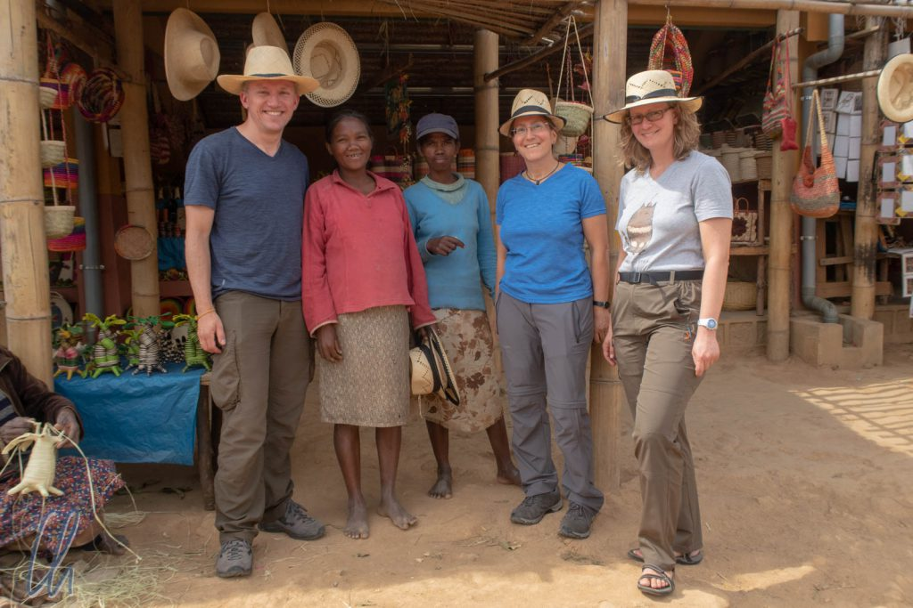
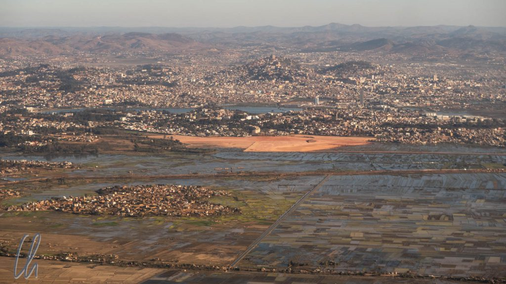
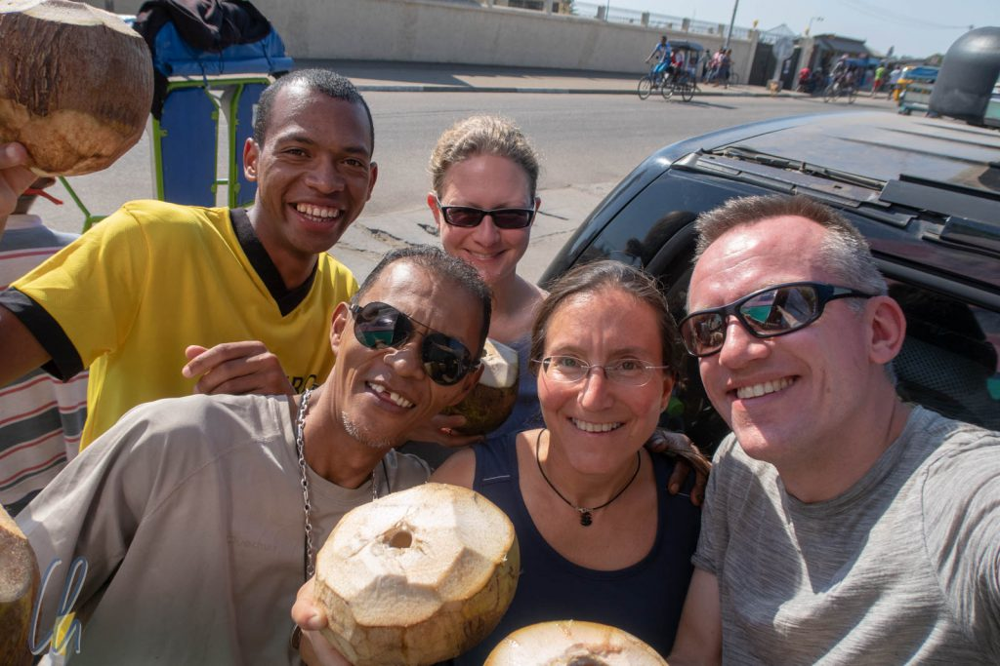

# Erste Eindrücke aus Madagaskar

Madagaskar war das einzige Land auf unserer Reiseroute, das wir beide zusammen schon früher besucht hatten. 2011 waren wir auf den Spuren der Lemuren unterwegs gewesen und die große Insel und ihre Bewohner hatten uns begeistert. Schon damals stand fest, dass wir wiederkommen wollten. Und nun waren wir sogar zu dritt angereist: Katja hatte eine Fernreise bei Wittmann-Tours gebucht ;). Zusammen mit Katja waren wir für 3 Wochen auf Madagaskar unterwegs.

<!--more-->

## Zurück in Antananarivo

Schon im Anflug auf [Antananarivo](https://de.wikipedia.org/wiki/Antananarivo) (kurz: Tana), der Hauptstadt Madagaskars, erkannten wir den Ort, den wir zuvor ins Herz geschlossen hatten. Die hügelige Landschaft des Hochlandes, die rötliche Erde, die Reisfelder, in deren Wasser die Sonne glitzerte und die sich nicht nur vor den Toren der Stadt befanden, sondern auch nahe des Zentrums.

Auch am kleinen Hauptstadtflughafen hatte sich wenig verändert. Wir reihten uns brav in eine lange Schlange ein, dann in die nächste Schlange und in eine weitere. In dieser Abfolge gaben wir das Gesundheitsformular ab, bezahlten das Visum und bekamen selbiges am Ende auch ausgestellt. Damals, in den "guten alten Zeiten", war uns allerdings ein deutlich hübscheres Visum in den Pass geklebt worden…

Nachdem wir schließlich alle Formalitäten erledigt hatten, trafen wir Tahina, unseren Reiseleiter, und Christian, unseren Fahrer. Beide sollten uns die kommenden Wochen begleiten. Eine Reise auf eigene Faust mit öffentlichen Verkehrsmitteln hatten wir von vorneherein ausgeschlossen, da die Fortbewegung mit sogenannten Busch-Taxis (Taxi Brousse) zu langwierig und zu schwierig gewesen wäre. Außerdem hätten wir viele Orte gar nicht erreichen können, da es schlicht keine (verlässlichen) Verbindungen gibt.

## Vom Reisenden zum Ariary-Millionär

Madagaskar ist zwar eines der [materiell ärmsten Länder der Welt](https://de.wikipedia.org/wiki/Liste_der_L%C3%A4nder_nach_Bruttoinlandsprodukt_pro_Kopf), aber die Geldbeträge sind bei einem Kurs von 1:4000 zuweilen astronomisch. Trotzdem ist der größte Schein ein erst kürzlich eingeführter 20.000er (ca. 5 Euro), 2011 war es noch eine 10.000 [Ariary](https://de.wikipedia.org/wiki/Ariary)-Banknote. Mittlerweile hatte allerdings die Inflation alle Werte quasi verdoppelt. Der kleinste Schein, 100 Ariary, war mit einem Gegenwert von gerade einmal 2,5 Cent auch wertmäßig klein. Münzen gibt es zwar theoretisch, allerdings haben wir sie nie im Einsatz erlebt.

Am Flughafen hoben wir zunächst das Transaktionsmaximum von 400.000 Ariary am Geldautomaten ab. Später tauschten wir einige von Katja mitgebrachte Euro-Scheine in dicke Ariary-Geldbündel um, um davon die ersten 10 Tage bestreiten zu können. Damit wurden wir in kürzester Zeit zu Ariary-Millionären ;)

## Die liebenswerten Madegassen

Auf dem Weg zum Hotel standen wir im Stau, es war "Rush-Hour". Daher hielten wir zur Auflockerung einmal an, um uns anzusehen, wie die Menschen Lehmziegel herstellen. Der Prozess war denkbar einfach: Auf einer improvisierten Arbeitsplatte wurden ein paar Sägespäne verteilt, damit der Werkstoff nicht festklebte. Dann setzte der Arbeiter eine Kastenform aus Holz auf, drückte mit Schwung einen Klumpen Lehm hinein und entfernte überschüssigen Schlamm mit den Händen. Anschließend legte er den in Entstehung begriffenen Backstein in der Schablone einige Meter weiter auf dem Boden zum Trocknen ab und entfernte die Form. Später werden die Ziegel dann gebrannt, um ihnen Stabilität zu verleihen. Die Prozedur fand am Rande von Reisfeldern direkt neben der Straße vom Flughafen zum Zentrum von Antananarivo statt. Eine Kinderschar bestaunte weniger die Lehmziegelherstellung sondern mehr uns.

Sie hatten einen riesigen Spaß daran, dass wir Ausländer (die Vazahas) gekommen waren, komische Leute ;). Ein Mädchen machte sich über meine Brille lustig, indem sie mit ihren Fingern ein Brillengestell formte und es kichernd vor ihr Gesicht hielt. Kurzerhand bot ich ihr die Sehhilfe zum Anprobieren an, was ihr dann aber doch zu unheimlich war. Ein kleiner Junge traute sich hingegen und setzte sie auf. Nach dem anschließenden Foto-Shooting war es ein riesiger Spaß für die Kinder, sich selbst auf dem Display der Kamera zu betrachten.

## Madegassen und Vazahas

Derart unverkrampfte Begegnungen mit den Madegassen hatten wir schon vor 7 Jahren erlebt. Tahina, wie damals Hasina, hatte ein Händchen dafür, spontan eine Verbindung zwischen uns als Besuchern und den Einheimischen herzustellen, ohne dass die Situation künstlich wirkte oder ein kommerzieller Hintergedanke offensichtlich wurde. Wir spürten die Herzlichkeit der menschlichen Begegnung, nicht nur mit den Kindern, sondern auch mit Erwachsenen.

Wir waren in Madagaskar die Vazahas. Der Begriff "Vazaha", klingt für unser Ohren in etwa wie "Wasa", wird aber etwas schneller ausgesprochen, auf der ersten Silbe betont und hat natürlich nichts mit Knäckebrot zu tun ;). Die Vazahas sind die Ausländer, die Weißen auf Malagasy (interessanterweise keine Bezeichnung für Asiaten). Das Wort ist eher neutral, für uns war es jedoch ungewohnt, so pauschalisiert angesprochen zu werden. "Salama Vazaha!" ("Hallo Ausländer!"), war eine gängige Grußformel auf der Straße. Auch mal eine interessante Erfahrung ;)

## Die fahrenden Museen

Unser Besuch in Madagaskar war für uns in mehrerlei Hinsicht eine Art Zeitreise in die Vergangenheit. Ein Aspekt dieses Eindruckes manifestierte sich auf den Straßen. Die Franzosen haben als Kolonialisatoren vielfältige Spuren auf Madagaskar hinterlassen, so zum Beispiel auch ihre Autos. Auf den Straßen von Antananarivo sahen wir zahllose französische Fahrzeugmodelle, an die wir uns noch aus unserer Kindheit erinnerten, die aber inzwischen im deutschen Straßenbild vollkommen verschwunden sind.

Wir sahen unzählige Enten (Citroën [2CV](https://de.wikipedia.org/wiki/Citro%C3%ABn_2CV)), Renault [R4](https://de.wikipedia.org/wiki/Renault_4) und [R5](https://de.wikipedia.org/wiki/Renault_5). Fast alle dieser Pkw waren allerdings ganz normale Gebrauchsfahrzeuge und keine gehegten, gepflegten Oldtimer, obwohl es auch einen 2CV-Club in Tana gibt. Der Zahn der Zeit nagte jedoch sichtlich an den "fahrenden Museen", wie Tahina sie liebevoll nannte. Des öfteren sahen wir, wie Fahrzeuge neben der Straße repariert wurden oder wie liegengebliebene Autos aus dem Weg geschoben wurden, um den Verkehr nicht (noch mehr) zu behindern.

In unserer Gedankenwelt assoziieren wir die Begriffe "Hauptstadt" und "Straße" mit breiten, mehrspurigen Alleen. In Antananarivo sind dies jedoch enge Asphaltstreifen, die teilweise auch von florierenden bunten Märkten okkupiert werden. Autos sind bei weitem nicht die einzigen Fortbewegungsmittel. Viele Gefährte kommen auch ganz ohne Motor aus. Handwagen und Zebu-Karren (ein Zebu ist ein madagassisches Rind) sind ebenfalls Normalität und für den Verkehrsfluss nicht gerade förderlich ;).

## Angekommen in Madagaskar

Unsere Madagaskar-Reise 2011 hatte uns ausgesprochen gut gefallen. Wir waren damals gekommen, um Flora und Fauna kennenzulernen, vor allem die Lemuren. Noch mehr hatten uns aber die freundlichen und aufgeschlossenen Menschen begeistert. Würden wir wieder solche unmittelbaren Begegnungen erleben dürfen oder hatte der Tourismus auch in Madagaskar Einzug gehalten und die gegenseitige, fast kindliche Neugier in eine rein kommerzielle Beziehung verwandelt? Nach unserem ersten Tag auf der Insel hatten wir das Gefühl, als hätte sich nur wenig verändert. Madagaskar (allein der Name des Landes klingt aufregend exotisch) hatte noch die Magie des Unberührten. Hier wurde der Reisende noch als Mensch betrachtet und ein gegenseitiges Beschnuppern mit interessierten Einheimischen war möglich.

Wir spürten auch, dass wir mit Tahina einen sehr guten Führer hatten, der uns sein Land zeigen und uns mit den Menschen in Verbindung bringen würde. Wir freuten uns auf 3 spannende Wochen und konnten es kaum erwarten, am nächsten Morgen aufzubrechen und mehr von Madagaskar kennenzulernen.
