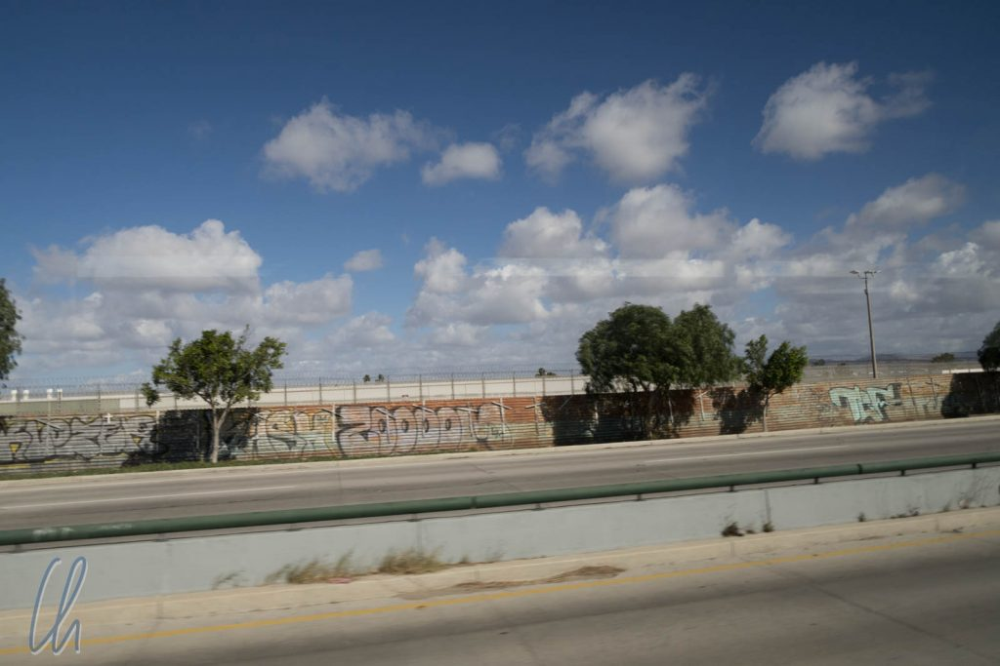
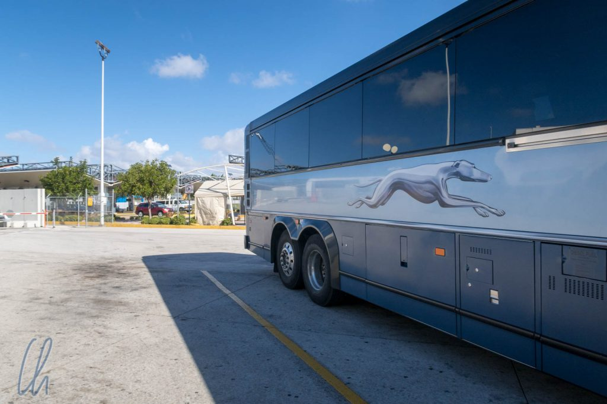
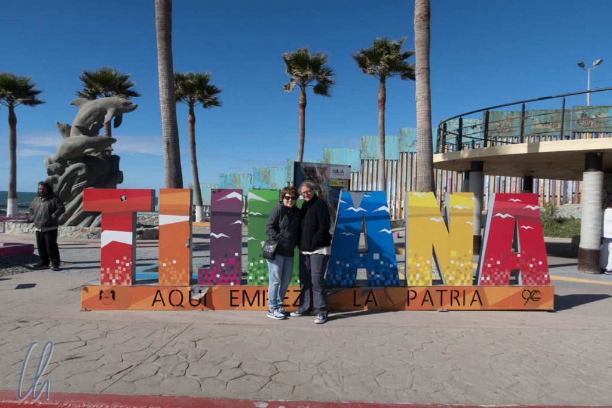
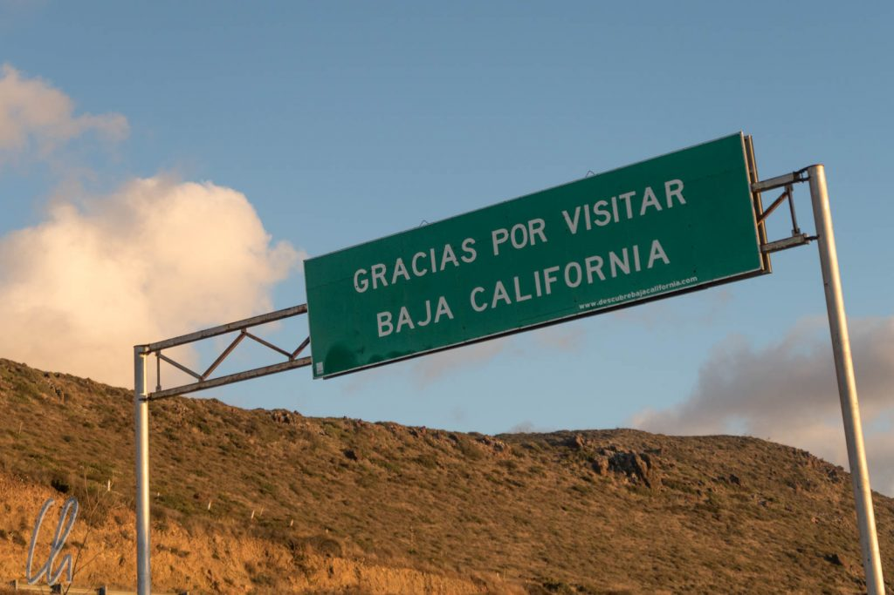
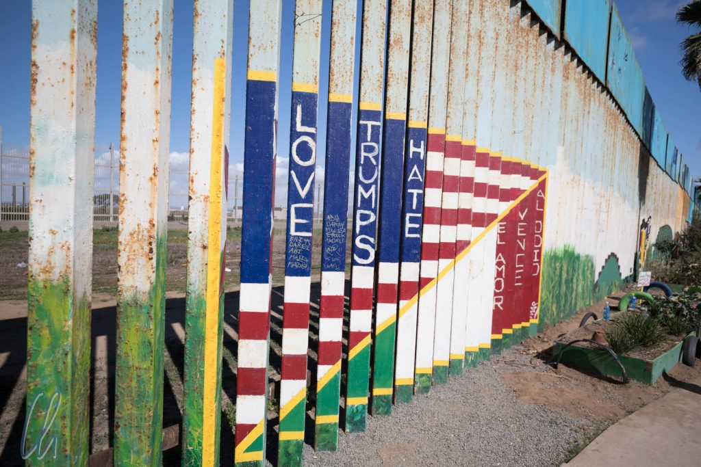
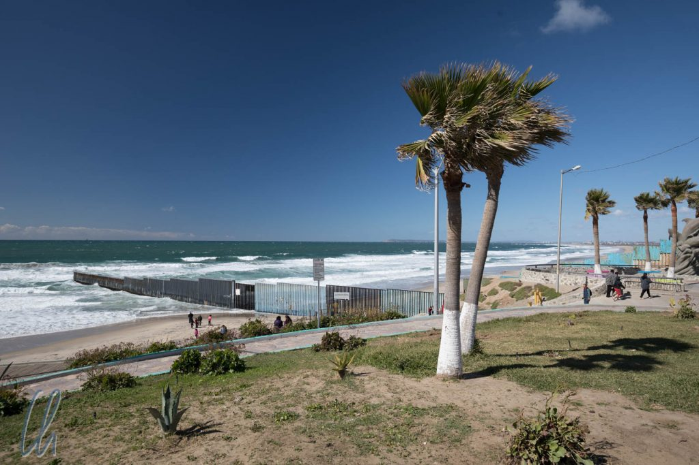
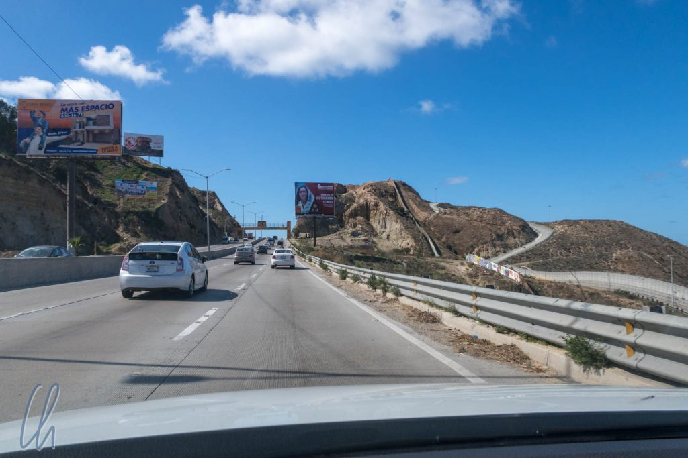
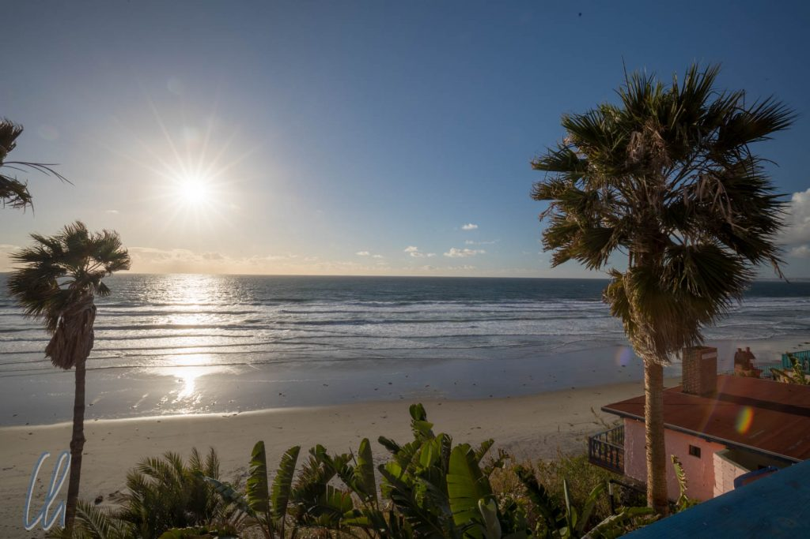
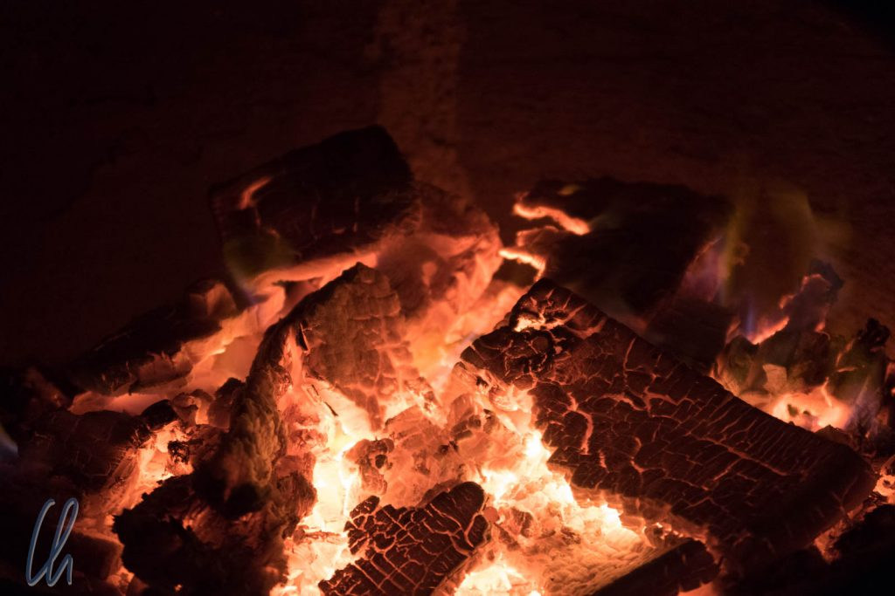

# Erste Eindrücke aus Mexiko

Bevor wir in einem Land ankommen, buchen wir mindestens das erste oder ein paar weitere Hotels und Aktivitäten, die eventuell begehrt sein könnten - nur um sicherzugehen bzw. um vor Ort keine Zeit zu verlieren. Genauso auch in Mexiko. Die Organisation erwies sich jedoch als relativ zäh. Englische Mails wurden gerne ignoriert, spanische - wenn überhaupt - erst nach einigen Tagen beantwortet, Hotels waren nicht auf Buchungsportalen gelistet, stattdessen gab es nur Telefonnummern oder E-Mail Adressen. Wir waren etwas erstaunt, dass Buchungen und Reservierungen in Myanmar oder Kambodscha in dieser Hinsicht wesentlich einfacher waren…

<!--more-->

Von San Diego kommend planten wir zusammen mit Mary-Alice einen Roadtrip auf der Baja California (kurz: die "Baja"). Also buchten wir einen Mietwagen, den wir am Flughafen in Tijuana im Empfang nehmen wollten. So weit, so einfach - dachten wir. Es stellte sich jedoch heraus, dass es in der Realität nicht so einfach war, über die Grenze zu kommen. Ein Schelm, wer eine gewisse Reziprozität vermutet ;).

Wie erhält man eine Touristenkarte, sind die Kosten im Transferpreis (Flug oder Bus) schon enthalten? Laut unseren Recherchen herrschten für jedes Verkehrsmittel eigene Bestimmungen, sehr kompliziert. Wie sich bei der Ausreise herausstellen sollte, waren nicht nur wir durch die Regeln sehr verwirrt, sondern auch die Grenzbeamten. Verschiedene Grenzübergänge scheinen andere Abläufe zu verfolgen und die Verantwortlichen versuchen, die Vorschriften zu ihrem Vorteil auszulegen, was im Klartext heißt, es wird gerne bei der Ausreise noch einmal kassiert (dazu später mehr).

Eigentlich hatten wir geplant, am Flughafen Tijuana zu Fuß über die Grenze zu laufen. An diesem [Grenzübergang](https://www.crossborderxpress.com/) ist der Übertritt aber leider nur für Inhaber eines Boarding Passes für einen Flug erlaubt :(. Also nahmen wir stattdessen einen Greyhound-Bus, der uns von [San Ysidro](https://de.wikipedia.org/wiki/San_Ysidro) die wenigen Kilometer über die Grenze fuhr. Damit hatten wir die sonst anfallende Zu-Fuß-Gebühr am Flughafen gespart und an deren Stelle ein Busticket gekauft. Da wir planten, länger als 6 Tage in Mexiko zu bleiben, mussten wir außerdem noch eine Touristenkarte kaufen.

Am Grenzübergang mussten wir aus dem Bus steigen, mitsamt unserem Gepäck eine Sicherheitskontrolle durchlaufen und besagte Touristenkarte bezahlen. In der Zwischenzeit wurde der gesamte Greyhound-Bus durch ein riesiges Röntgengerät gefahren, bevor wir auf der anderen Seite der Grenze wieder einsteigen durften.

Solch einen Aufwand hatten wir vorher noch auf keiner anderen Reise bei keinem anderen Grenzübertritt betreiben müssen.

## Ist Mexiko sicher?

Neben Tacos, Mariachi und Tequila sind leider einige der ersten Assoziationen mit Mexiko Drogenkrieg und Gewalt. Immer wieder wird in Reiseführern gewarnt, dass überall die Gangster lauern. Wenn man mit einem Mietwagen unterwegs ist, soll man auf keinen Fall bei Unfällen oder Pannen helfen, Banditen verkleiden sich angeblich gerne als Polizisten. Drogen sind ein großes Problem, und selbst die Baja California ist mittlerweile gemessen an der Mordrate einer der [gefährlichste Staaten Mexikos](http://www.bajainsider.com/article/drug-war-baja-california-sur) - allerdings ist das relativ bei einer sehr geringen Bevölkerungsdichte.

Statt sich völlig verängstigen zu lassen, muss man folgendes überlegen: Auf der Baja leben Millionen von Menschen, (Zehn-)tausende (oder mehr) Ausländer (in der Regel US-Amerikaner) passieren täglich die Grenze - nur sehr selten passiert ihnen etwas. Die Drogenbanden tragen ihre gewalttätigen Auseinandersetzungen in der Regel untereinander aus.

## In Mexiko angekommen

Die Grenze zwischen den USA und Mexiko ist bekanntlich keine gewöhnliche Grenze, sondern auch ein Politikum. Genau deshalb sind die bisherigen (lange bestehenden) Grenzanlagen in Tijuana aus Protest teilweise in [Kunstwerke](https://inhabitat.com/artists-are-turning-the-u-s-mexico-border-fence-into-the-worlds-longest-peace-themed-mural/) umgestaltet worden. Dieses Projekt hat nichts mit der von Mr. T. geplanten Mauer zu tun, trotzdem wollten wir uns das natürlich ansehen und so verbrachten wir die ersten Stunden in Mexiko direkt an der Grenze.

Die mexikanische Seite der Mauer in Tijuana trägt das "[Mural de la Hermandad](https://www.facebook.com/muraldelahermandad/)" und war vielfältigst bemalt, auch mit einigen politischen Statements. Direkt an der Küste reichen die Grenzbefestigungen gut 25 Meter ins Wasser hinein - mehr nicht. Irgendwie hatten wir uns dieses Bollwerk des Nordens gewaltiger vorgestellt. Die Grenze bestand aus 2 Zäunen, aber trotzdem hatten wir den Eindruck, es wäre nicht allzu schwierig, auf die andere Seite zu gelangen, zumal wir keine Patrouillen gesehen haben. Stattdessen gingen auf der amerikanischen Seite, ungefähr 100 Meter von uns entfernt, Leute spazieren.

## Auf dem Weg nach Süden

Während die Einwanderer in die USA immer den Weg nach Norden ("al Norte") verfolgen, so war unsere Richtung genau entgegengesetzt. Wir fuhren auf der Baja California immer gen Süden. Unser Ziel war [Cabo San Lucas](https://de.wikipedia.org/wiki/Cabo_San_Lucas) an der Südspitze der Baja. Auf den ersten Kilometern fuhren wir durch Tijuana. Interessanterweise sah man im Stadtbild keinen großen Unterschied zu den USA, auf den Straßen waren die Verkehrsschilder sehr ähnlich, es gab die bekannten US-amerikanischen Ketten von Großmärkten und sogar viele Autos hatten US-amerikanische Nummernschilder.

Bei näherem Hinsehen tickt die Uhr aber trotzdem südlich der Grenze anders. Die Straßen sind enger, der Verkehr wesentlich kreativer. Die Dichte an Verkehrsschildern ist deutlich angenehmer, soll heißen geringer. Das ging soweit, dass wir zuweilen keine Ahnung hatten, was das Tempolimit war, also fuhren wir einfach mit. Die Hupe ist ein normales Kommunikationsmittel und auf den ersten Kilometern fühlten wir uns immer "schuldig" und dachten, wir hätten etwas falsch gemacht… Wie eigentlich immer in uns unbekannten Ländern mussten wir uns nur etwas eingewöhnen ;).

## La Fonda - unser erster Unterkunft auf den Weg nach Süden

Gut 60 Kilometer südlich der Grenze verbrachten wir die erste Nacht im laut Reiseführer legendären La Fonda-Hotel. In einem geschätzten 200-Seelen-Ort zwischen Highway 1 und Meer lag das kleine Hotel etwas oberhalb des Wassers und bot leichtem Zugang zum Strand, einen herrlichen Blick auf den Sonnenuntergang, ein Restaurant mit großen Portionen köstlichen mexikanischen Essens, gehaltvollen Margaritas und Livemusik - beinahe zu mexikanisch um wahr zu sein ;)

Was die Romantik etwas trübte war die Tatsache, dass sich der (baja) kalifornische Winter alles andere als angenehm warm erwies, ganz im Gegenteil. Tagsüber zeigte das Thermometer selten mehr als 20 Grad, oft war es windig. Bei Sonnenschein fühlte es sich etwas wärmer an, aber nachts kühlte es sich auf um die 10 Grad Celsius ab. Verglichen mit dem deutschen Winter bestand zwar theoretisch kein Grund zur Beschwerde, aber gute Heizungen sind auf der Baja eher selten, und so wurde es nachts doch ziemlich kühl. Umso erfreuter waren wir, dass der Holzofen in unserem Zimmer nicht nur Dekoration war, sondern dass auf Nachfrage auch ein gemütliches Feuer entzündet wurde :).

Im Bad fielen wir allerdings zunächst auf ein Verwirrspiel herein. Es gab englische Armaturen, die mit H ("Hot") und C ("Cold") beschriftet waren. Das vermeintlich heiße Wasser blieb allerdings bitter kalt, auch der Hausmeister war ratlos. Der mexikanische Klempner hatte wohl das warme Wasser an C für "Caliente" angeschlossen und sich anschließend vielleicht über das H gewundert ;) - Nachdem wir es sehr lange laufen ließen, konnten wir dem C-Regler am Ende doch warmes Wasser entlocken :)
