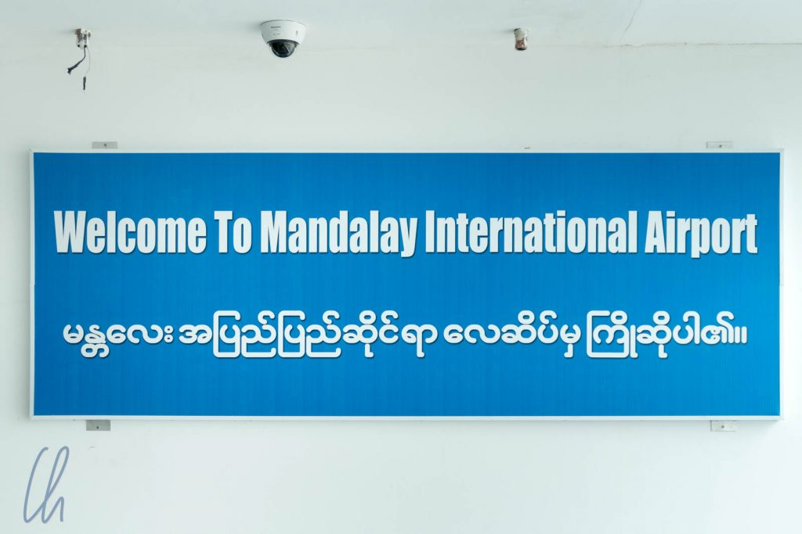
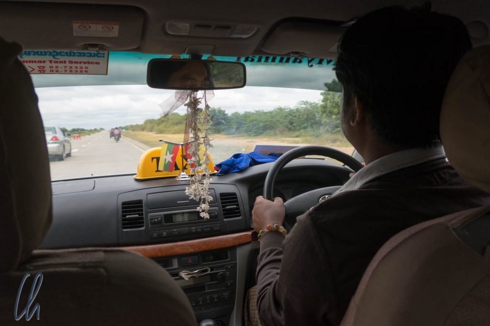
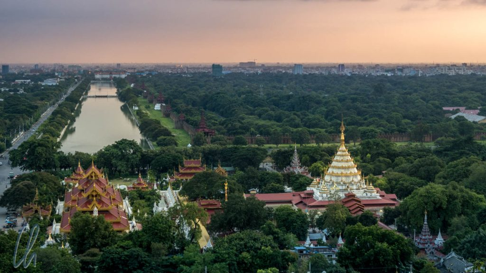
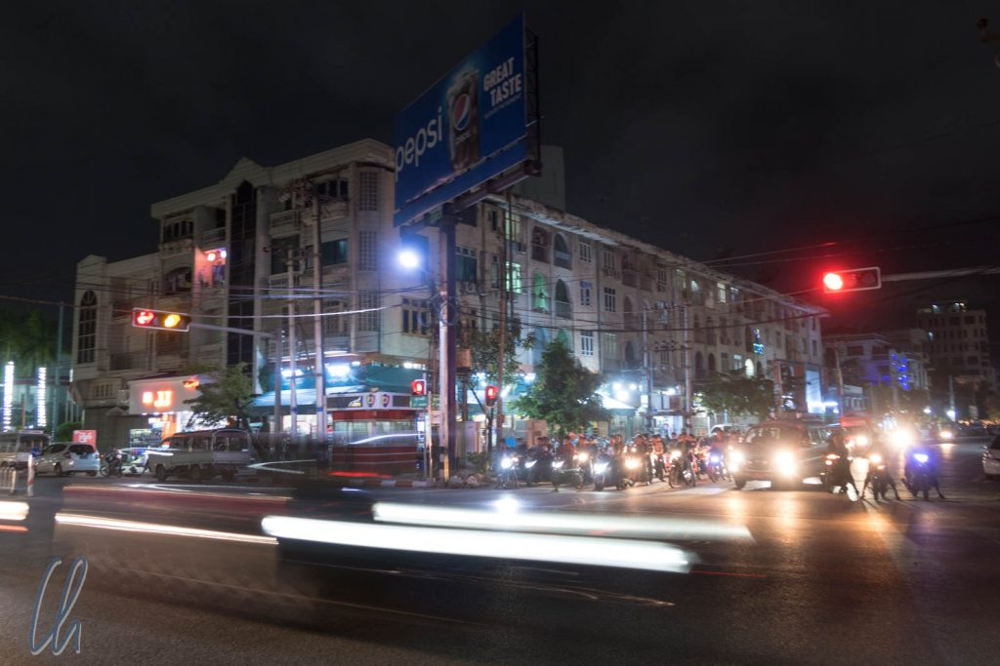
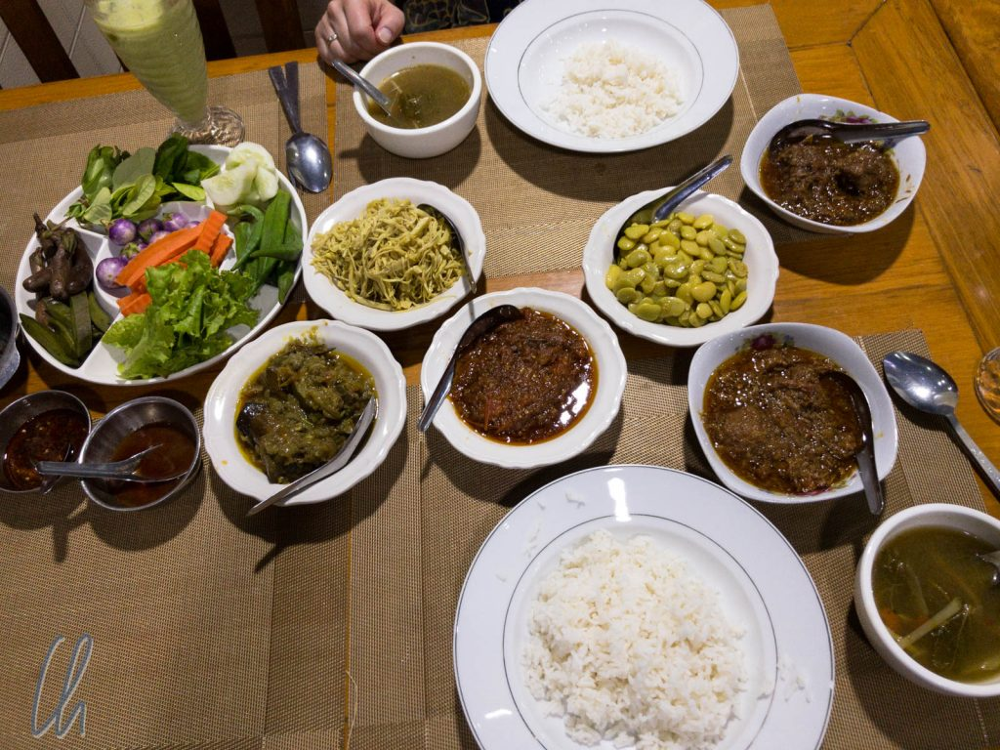

Mingalaba Myanmar! Hallo Myanmar! Inzwischen sind wir in Myanmar angekommen. Bevor sich ein Gewöhnungseffekt einstellt, hier unsere Eindrücke vom ersten Tag in Myanmar. Genauer gesagt kamen wir in Mandalay an, eher im Norden von Myanmar. Schon im Anflug sahen wir zahlreiche golden glänzenden Pagoden in der Landschaft verstreut. Nach der Landung versorgten wir uns zunächst mit Geld und einer lokalen SIM-Karte und fuhren mit dem Taxi ins Hotel.

<!--more-->

## Falsche Seite?

Während wir in extrem materialschonender Fahrweise über die für den geringen Verkehr am Flughafen viel zu breite Straße fuhren, entdeckten wir sofort ein Kuriosum, über das wir vorher schon gelesen hatten. In Myanmar herrscht Rechtsverkehr, aber das Steuer befindet sich in allen Autos auch auf der rechten Seite, fast ohne Ausnahme! Wir mussten nachlesen, um uns die Fakten ins Gedächtnis zu rufen: 1970 wurde per Dekret von einem Tag auf den anderen beschlossen, dass von Links- auf Rechtsverkehr umgestellt wird. Der Anlass was, dass der damalige Staatschef General Ne Win einen Traum hatte, der ihn zur Umstellung bewog.

Allgemein herrscht auf den Straßen von Mandalay eher ein kreativer Fahrstil, obwohl immerhin rote Ampeln in der Regel beachtet werden. Autos, meist mindestens gefühlte 10 Jahre alt, und viele Motorroller fahren nicht schnell oder aggressiv, aber stetig, mal auf der falschen Seite oder auf dem "Gehweg", manchmal auch irgendwie quer durcheinander. Dabei erinnerte die [Geräuschkulisse](https://www.youtube.com/watch?v=wxaKd_0HVxM) auf den Hauptstraßen sehr an Vietnam. Das Schnurren der Motorroller ist der Grundton, dazu ein stetiges Hupkonzert, abgemischt mit vielen anderen Geräuschen. Insgesamt ist auf den Straßen aber (noch) deutlich weniger los.

## Rundgang mit einheimischer Begleitung

Nach dem Einchecken machten wir uns auf unseren ersten Stadtrundgang. Auf dem Programm standen das [Shwenandaw Kloster](https://en.wikipedia.org/wiki/Shwenandaw_Monastery), [Kuthodaw Pagode](https://de.wikipedia.org/wiki/Kuthodaw-Pagode) und [Mandalay Hill](https://en.wikipedia.org/wiki/Mandalay_Hill). Der Aufstieg geht über mehrere Treppen, die durch viele Pagoden führen. Daher gingen wir barfuß, so schreibt es die Etikette vor. Auf dem Weg nach oben wurden wir von einem Lehrer (nennen wir ihn Utung, auch wenn es bestimmt falsch geschrieben ist) angesprochen, der sich in englischer Konversation üben wollte.

Was uns erst misstrauisch an Nepper und Schlepper denken ließ entwickelte sich zu einem angenehmen und interessanten Spaziergang bis zur Spitze und zurück. Wir redeten über Myanmar, die Sehenswürdigkeiten, Deutschland und mehr. Nach einiger Zeit wurde die Konversation auch etwas politisch. Utung beschrieb 50 Jahre Isolation und stellte [Aung San Suu Kyi](https://de.wikipedia.org/wiki/Aung_San_Suu_Kyi) als Heldin dar, die jetzt für Demokratie sorge. Wir sind gespannt, ob wir während unserer Reise in Myanmar noch Eindrücke von der politischen Situation werden gewinnen können.

Unten angekommen zogen wir unsere Sandalen wieder an und waren bestimmt länger barfuß draußen unterwegs gewesen als im bisherigen Verlauf des Jahres 2017. Den freundlichen Vorschlag Utungs, er könne uns auf seinem Motorroller zum Hotel bringen, d.h. 3 Leute auf einem Roller, konnten wir glücklicherweise höflich ablehnen.

## Das erste Abendessen in Myanmar

Zum Abendessen wollten wir zur Einstimmung burmesisches Curry probieren. Eine Restaurant-Empfehlung im Lonely Plant befand sich ca. 1 km von unserem Hotel entfernt, so gingen wir durch die abenteuerlichen nächtlichen Straßen. Es gibt zwar (meistens) Gehwege, diese sind jedoch eher Multifunktionsbereiche neben der eigentlichen Fahrbahn. Gerne werden dort auch Motorroller geparkt oder diverse Stände aufgebaut. Zuweilen verläuft anscheinend die Kanalisation unter dem Gehweg, diese ist mit Betonplatten locker abgedeckt. Manchmal fehlen einige dieser Platten, so dass große Löcher im Weg entstehen, auf deren Grund das Abwasser steht. Watch your step!

Im Restaurant angekommen bestellten wir zwei Currys und bekamen serviert, was auf dem Foto unten zu sehen ist. Die Currys (Hammel und Rind) sind die beiden Schälchen auf der rechten Seite mit dem dunkleren Inhalt. Der Rest ist Beilage: Suppe, eine Rohkostplatte mit Salat, einem unbekannten Kraut, Gurken, Auberginen, Okra, Möhren, zwei weitere gekochte Gemüse, würzige Soßen (nicht wirklich scharf), weitere Schüsseln mit Salaten und Dips und natürlich Reis. Nicht nur die Menge und Auswahl überzeugte, sondern auch Geschmack und Preis. Zusammen mit 2 Getränken bezahlten wir 12.000 Kyat, also ca. 8 Euro. Am Ende fragten wir uns nur, was mit den Resten geschieht. Wir konnten uns nicht vorstellen, daß Nahrungsmittel weggeworfen würden.

Unser Ankunftstag in Mandalay war sehr interessant und verheißungsvoll. Zurück im Hotel amüsierten wir uns über unsere Minibar, in der sich Energy Drinks mit Namen wie "Shark" und "Burn" befanden. Trotz unüberhörbarem Straßenverkehr und durchgehender Musikuntermalung schliefen wir sofort ein.
