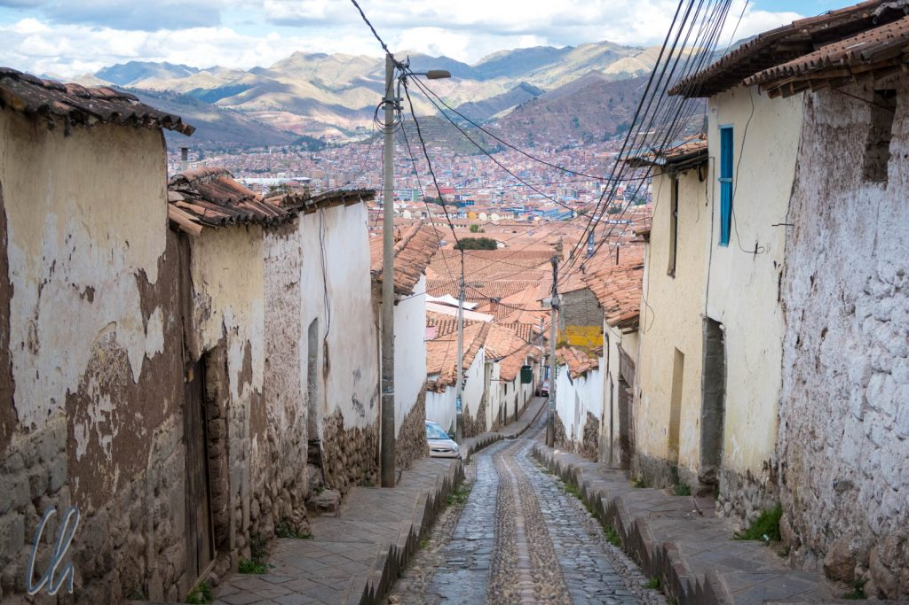

# Erste Eindrücke aus Peru

In Peru erlebten wir am Flughafen in Lima die simpelste Einreiseprozedur seit langem. Wir mussten kein Formular ausfüllen, weder online noch am Flughafen, keine Zollerklärungen abgeben und keine Einreisegebühr bezahlen. Stattdessen gingen wir mit unserem Pass zum Grenzbeamten, er fragte uns nur, mit welchem Flug wir gekommen waren und wie lange wir bleiben wollten, dann bekamen wir unseren Stempel in knalligem Pink. So einfach kann es gehen!

<!--more-->

## An anderer Stelle aber sehr kompliziert

So einfach die Einreise sich gestaltete, so kompliziert war es, eine SIM-Karte für das Telefon zu kaufen. Am Flughafen in Lima erklärten uns die Claro-Angestellten, dass nur peruanische Staatsangehörige SIM-Karten kaufen könnten (sehr sinnvoll!). Die gleiche Geschichte hörten wir auch in anderen Claro-Geschäften sowie bei Moviestar (dies sind die beiden größten Anbieter mit den besten Netzen). Entweder wurden wir abgewiesen oder in eine andere Filiale geschickt - und davon schien es an jeder Ecke eine zu geben. Wir hatten uns vorher informiert und es ist richtig, dass in Peru der SIM-Kartenkauf staatlich kontrolliert wird. Jeder Ausländer kann jedoch unter Vorlage seines Reisepasses eine SIM kaufen - das macht aber womöglich etwas Arbeit…

Schließlich fanden wir doch ein Geschäft, das uns für umgerechnet ca. 10 Euro einen Monat Internet mit 3GB Daten verkaufte. Die Aktivierung der SIM-Karte gestaltete sich dann jedoch problematisch, was nach unserem Eindruck aber nicht daran lag, dass wir Ausländer waren ;). Nach mehr als einer Stunde im Laden hatten fast alle anwesenden Angestellten versucht, unseren Fall zu lösen, von der Auszubildenden bis zur Supervisorin. Am Ende war die Lösung, dass wir eine andere SIM-Karte bekamen, die statt mit 3GB mit 13 GB aufgeladen war - Danke Claro!

## Willkommen in Cuzco

Lima, das auf Meereshöhe liegt, war für uns nur eine Durchreisestation. Gleich am nächsten Morgen flogen wir weiter nach Cuzco, um die mittlerweile seit gut zwei Wochen antrainierte Höhenanpassung nicht zu verlieren. (Wir planten, später nach Lima zurückzukehren). Cuzco liegt offiziell [auf 3416 Metern](https://de.wikipedia.org/wiki/Cusco), also noch einmal mehr als 500 Meter höher als Quito und das merkten wir, da die Stadt alles andere als flach ist.

In Cuzco angekommen, war nicht nur die Höhe anstrengend. Dort hatten wir auf einmal ganz viele Freunde ("Hola Amigo!"), die uns Verschiedenes verkaufen wollten: ausgestopfte Mini-Lamas, Ketten, Ringe, Ponchos, Kleidung aus Alpaka-Wolle oder sonstige Souvenirs. In Cuzco gab es anscheinend mehr Touranbieter als Besucher und erstere priesen ihre mehr oder weniger vertrauenswürdigen Dienste an. Außerdem standen vor vielen Restaurants Angestellte, die zielgerichtet Touristen ansprachen und ins Lokal zu locken versuchten. Etwas seltener boten junge oder junggebliebene Damen Massagen oder schamanistische Heilzeremonien aus der Inkazeit an. Die Taxifahrer riefen uns an jeder Ecke "Taxi!" zu. Frauen in traditioneller Tracht posierten mit aufgeputzten Baby-Alpakas für Fotos (natürlich gegen Entgelt) oder die Schuhputzer wollten unsere Wanderschuhe mit schwarzer Schuhcreme auf Hochglanz polieren. Klar, jeder möchte seinen Teil vom Tourismus-Kuchen abhaben, aber es konnte schon etwas auf die Nerven gehen…

Die Innenstadt von Cuzco wirkte sehr hübsch restauriert, beinah schon zu hübsch. Der Plaza de Armas war auf Hochglanz poliert und wurde von Beamten der Touristenpolizei überwacht. Die Stadt präsentierte sich in einem einheitlichen Stil mit rekonstruierten dicken Inka-Mauern, so einheitlich, dass es einen Masterplan zur Renovierung gegeben haben muss. Alles sah äußerst historisch aus. Werbetafeln oder Hinweisschilder waren so klein, dass wir zum Beispiel nach einer Bank etwas gesucht haben. Auch McDonalds und Starbucks wirkten hinter scheinbar alten Steinmauern weniger aufdringlich als sonst. Kaum verließ man jedoch die direkte Stadtmitte, bröckelte der Putz von den Häusern und nachts machten sich in den Vororten die Straßenhunde über den Inhalt der Müllsäcke her.

## Die Markthalle von Cuzco

Abseits der von Touristen besuchten Pfade nahm das peruanische Leben seinen gewohnten Gang. Auf der Suche nach einem Schneider (eine Hose war reparaturbedürftig, eine andere musste gekürzt werden), lernten wir eine wohltuend authentische Seite Cuzcos in der Markthalle nördlich der Plaza San Blas kennen. Nicht nur fanden wir eine nette Schneiderin ("Virginia"), die mit ihrer antiken Nähmaschine schnell und professionell innerhalb eines Tages unseren Auftrag bearbeitete. Sondern wir aßen dort auch sehr gut und günstig (3 Soles pro Person, weniger als 1 Dollar) unter den Einheimischen zu Mittag.

Eigentlich war die Quinoasuppe nur die Vorspeise des fix angebotenen Menüs, für uns aber voll und ganz ausreichend. Zu unserer Linken und Rechten aßen einige Handwerker anschließend noch einen gigantischen Teller voll Reis, Hühnchen und Gemüse. Es war ihnen allerdings auch anzusehen, dass sie körperlich schwere Arbeit leisteten. Die Stimmung in der Markthalle war sehr gelassen und man konnte die Menschen in ihrem Alltag erleben.

Da es draußen auf einmal wie aus Kübeln zu schütten begann, beschlossen wir, dass wir es nicht so eilig hätten, das schützende Dach zu verlassen. Um die gewonnene Zeit angenehm zu verbringen, genehmigten wir uns zum Nachtisch eine Batida de Mango (eine Mango und zwei Erdbeeren zusammen mit Milch in den Mixer geben, 2 Minuten zerkleinern, fertig!). Wir unterhielten uns sehr nett mit der Standbesitzerin ("Cristina"), die uns u.a. erzählte, dass sie vor langer Zeit als Schulkind Machu Picchu und die Thermen von Aguas Calientes besucht hatte.

## Peru kulinarisch: Mehr als Hausmannskost

In der Markthalle hatten wir eine sehr bodenständige Spielart der peruanischen Küche probiert. Schon in den ersten Tagen im Land bemerkten wir jedoch, dass es auch noch eine andere Seite gab. Die Gerichte in Peru waren oft deutlich interessanter als die vermeintlich ähnlichen ecuadorianischen. Die Speisen waren komplexer gewürzt, hübsch angerichtet, manchmal gab es noch eine kleine Garnitur (zum Beispiel ein paar Oliven) oder ausländische Einflüsse. Die Peruaner sind zu Recht sehr stolz auf ihre novoandine Küche. Ein peruanischer Klassiker ist z.B. [Ceviche](https://de.wikipedia.org/wiki/Ceviche): rohe Fischwürfel, die einige Zeit in einer Limetten-Zwiebel-Chili-Gewürz-Marinade eingelegt werden, sehr wohlschmeckend, leicht und aromatisch. Inzwischen entwickelte sich die Abwandlung [Tiradito](https://en.wikipedia.org/wiki/Tiradito), die Einflüsse der japanischen Küche aufweist. Dazu wird der Fisch in Scheibchen geschnitten und erst direkt vor dem Servieren mit der Würzsauce übergossen. Dadurch unterbleibt die Denaturierung des Fischeiweiß durch die Säure und das Gericht erinnert ein wenig an Sashimi.

So wirkte die peruanische Küche auch im Rückblick deutlich raffinierter auf uns als die der andinen Nachbarländer Ecuador und Bolivien. Der Eindruck bestätigte sich schon beim Frühstück. Wir bekamen leckere knusprige Brötchen serviert! Das lässt das Herz des Deutschen natürlich höher schlagen ;).

Ebenfalls in sehr guter Erinnerung ist uns das Alpaka-Fleisch geblieben, welches überaus zart und schmackhaft war. Bei der Zubereitung auf einem heißen Stein konnte man die gewünschte Garstufe selbst bestimmen, musste aber aufpassen, dass es nicht zu lange briet. Wegen des geringen Fettgehaltes war es englisch (also blutig) am schmackhaftesten, zu lange erhitzt wurde es schnell zäh.

Solch einen Touristenrummel wie in Cuzco hatten wir schon länger nicht mehr erlebt. Es hat natürlich seinen Grund, warum die Stadt so gut besucht war. Sowohl die historische Altstadt als auch die nahegelegenen Inka-Stätten waren sehr sehenswert. Nicht zuletzt ist Cuzco das Tor zum heiligen Tal und nach Machu Picchu, mehr dazu in den folgenden Beiträgen.
