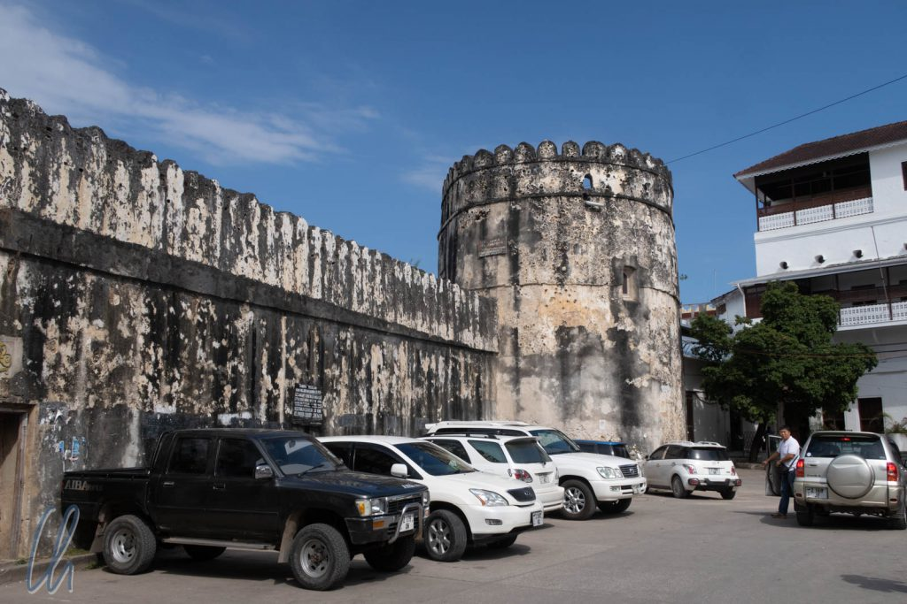
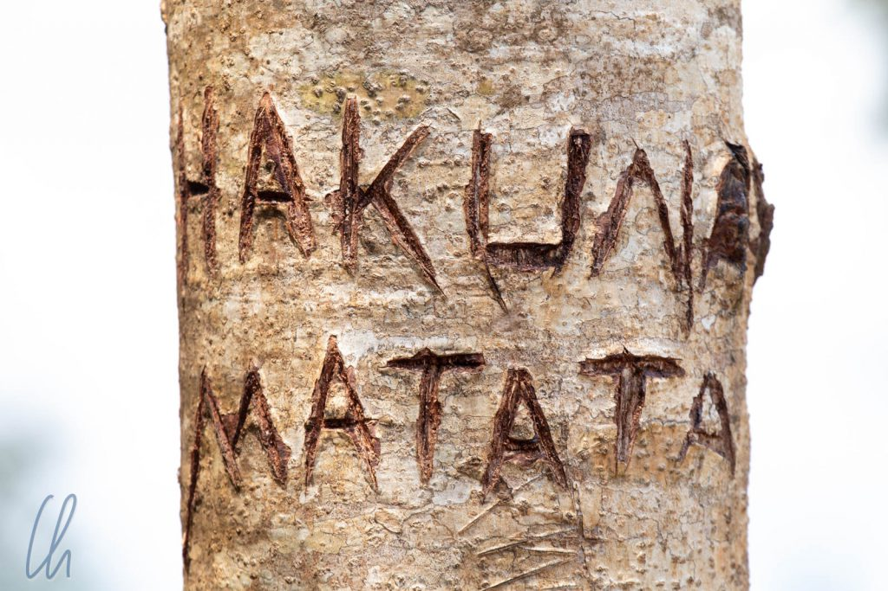
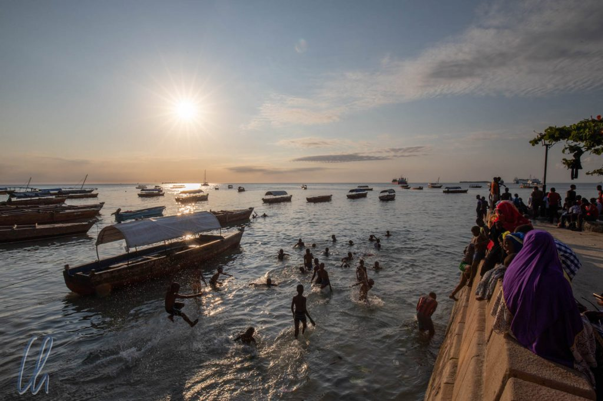

Tansania war das erste Land, das wir auf dem afrikanischen Kontinent besuchten. Wir planten, eine Safari zu unternehmen und ein Land kennenzulernen, über das wir schon viel gehört und gelesen hatten. Unsere erste Station war, noch nicht ganz auf dem afrikanischen Festland, eine Woche auf Sansibar. Schon der Name der [Insel](https://de.wikipedia.org/wiki/Sansibar) beschwört Vorstellungen von Strand, Gewürzen und Exotik herauf.

<!--more-->

## Angekommen in Stone Town

Mitten in der Nacht kamen wir am kleinen internationalen Flughafen von Sansibar an. Zwei Formulare, 50 USD pro Kopf (zahlbar ausschließlich mit Kreditkarte, nicht in Cash wie vom Reiseführer angekündigt) und eine wenig herzliche Abfertigung später hatten wir unser Visum im Pass und fuhren mit dem Taxi zum Hotel.

In der Altstadt von [Stone Town](https://de.wikipedia.org/wiki/Stone_Town) durchquerten wir ein regelrechtes Labyrinth aus menschenleeren Gassen. Immer wieder bog das Taxi ab, rechts, links, recht, links und wir fragten uns etwas besorgt, ob wir im Kreis fahren würden. Aber nein, ein Blick auf Maps.me zeigte es deutlich, der Taxifahrer steuerte zielstrebig zum Hotel. Schließlich hielt er in einer dunklen Sackgasse, wo es für das Auto zu eng wurde, direkt neben einigen überquellenden Müllcontainern. Angekommen. Wo waren wir hier gelandet? Hatten wir die Katze im Sack gebucht? Nur wenige Schritte weiter jedoch ging es um eine Ecke und wir hatten das Hotel erreicht, das sich von außen luxuriös und von innen hell und freundlich präsentierte.

Am nächsten Morgen bestand die erste Bürgerpflicht darin, wie immer in einem neuen Land, Geld abzuheben. Das war überraschenderweise im für den internationalen Tourismus gut erschlossenen Stone Town schwieriger als erwartet. Erst der vierte Geldautomat funktionierte und wir waren wieder mal reich. 800.000 Shilling (circa 300 Euro) konnten wir dem Automaten in 2 Transaktionen entlocken. Der größte tansanische Schein ist eine 10.000 Shilling Banknote (weniger als 4 Euro), auf dem ein imposanter Elefantenkopf abgebildet ist. Auch in Tansania kann man Safari im Portemonnaie machen, auf fast allen Scheinen sind afrikanische Tiere aufgedruckt :)

## Jambo! - Kiswahili für Einsteiger

"[Jambo!](https://en.wikipedia.org/wiki/Jambo!)" So schallte es uns zur Begrüßung oft entgegen. Was man heute mit "Hallo!" übersetzen könnte, war im Grunde genommen eine heutzutage etwas veraltete Form des Grußes zwischen Händlern in Ostafrika. Die Tansanier begrüßen sich untereinander eher z.B. mit "Habari?" ("Was gibt's Neues?"), aber wir als Ausländer, die [Wazungu](https://de.wikipedia.org/wiki/Mzungu), wurden in der Regel mit "Jambo!" begrüßt.

Die aber vielleicht wichtigste Floskel ist "[Hakuna Matata](https://de.wikipedia.org/wiki/Hakuna_Matata)!". Sie bedeutet "Kein Problem" und ist genauso zu benutzen wie das australische "No worries, mate" oder einfach nur "Alles bestens". Sollte Euch der Ausdruck "Hakuna Matata" bekannt vorkommen und Ihr wisst nicht warum, dann habt Ihr vielleicht das Musical "[König der Löwen](https://www.youtube.com/watch?v=xB5ceAruYrI)" gesehen.

Grundsätzlich war auf Sansibar die Kommunikation auf Englisch meistens problemlos möglich. Wir hatten den Eindruck, dass deutlich mehr Menschen Englisch sprachen als zum Beispiel in Brasilien. Vielleicht auch ein Erbe der Kolonialzeit? Für uns vervollständigte "Asante" ("Danke") das Trio der wichtigsten [Kiswahili](<https://de.wikipedia.org/wiki/Swahili_(Sprache)>)-Begriffe. Für Bonuspunkte im Crash-Kurs: "Asante Sana" bedeutet "Vielen Dank".

## Wie habt ihr das eigentlich alles geplant?

Häufig wurde uns die Frage gestellt, wie wir konkret so eine lange Reise organisiert haben. Die Antwort ist so einfach wie naheliegend. Nach viel Vorbereitung in Deutschland (Krankenversicherung, Bändigung des Papiertigers, Impfungen, grobe Reiseroute d.h. Festlegung der Reiseländer) haben wir unterwegs mehr oder weniger 3 Monate rollierend und abwechselnd im Voraus geplant. So fungierte ich z.B. als Reiseleiter in Japan, Mona war für die Planung des Programms in Myanmar zuständig usw. Dafür haben wir uns auch unterwegs viel Zeit genommen, so dass auf keinen Fall jeder Tag unserer Reise komplett mit Unternehmungen ausgefüllt war (auch wenn es sich vielleicht im Blog anders liest).

Außerdem legten wir zwischendurch immer wieder Reisepausen ein. Sansibar war so eine Art Ruhepunkt für uns. In den 7 Tagen auf der Insel haben wir natürlich auch einiges unternommen (dazu gleich mehr), aber die Woche war nicht zuletzt zum Weiterplanen gedacht. Mona begann, unsere Reiseroute in Jordanien auszutüfteln und ich informierte mich über Äthiopien. Außerdem schrieben wir unseren Reiseblog weiter. Wir hatten einiges aufzuholen, da wir auf Madagaskar kaum daran gearbeitet hatten.

Manchmal fühlte es sich tatsächlich fast wie Arbeit an, wenn wir bis spät abends im Reiseführer lasen, Details im Internet recherchierten oder uns um Flüge, Hotels oder Visa kümmerten. Aber natürlich wussten wir genau, weshalb wir diese Überstunden einlegten ;). Damit war Sansibar für uns Reiseziel und Planungsstandort mit guter Infrastruktur zugleich.

## Sansibar - arabisch und afrikanisch

Aber neben Planung und Organisation wollten wir natürlich auch Sansibar kennenlernen. Auf den ersten Blick fiel sofort auf, dass Sansibar nicht afrikanisch wirkte, sondern eher arabisch: die engen Gassen, die Souks, die Architektur der Häuser, die Kleidung der Menschen (Männer in langen Gewändern, Frauen mit Burka oder Kopftuch), arabische Schrift. Nicht zuletzt rief der [Muezzin](https://de.wikipedia.org/wiki/Muezzin) die Menschen mehrmals am Tag zum Gebet.

Dies ist kein Zufall, denn Sansibar hatte geschichtlich gesehen durch seine günstige Lange an den Handelsrouten entlang der Küste Ostafrikas eine enge Verbindung zur arabischen Welt. Stone Town war zeitweise sogar die Hauptstadt des Oman. Der arabische Einfluss spiegelt sich auch im Namen der Insel wieder. Der persische Ausdruck زنگبار ("Zangi-bar") wird mit "Küste der Schwarzen" übersetzt.

Nachdem Vasco da Gama 1498 den Weg nach Indien um das Kap der guten Hoffnung gefunden hatte, waren Portugiesen die ersten Europäer, die versuchten, in der Region Einfluss zu gewinnen. Sie konnten sich allerdings nicht langfristig dort etablieren. Nach der Niederlage der Portugiesen in der Schlacht von Hormus 1622 zementierte der Sultan des Oman seine Macht und baute sie weiter aus. Sansibar wurde ein wichtiger Handelsstützpunkt für Gewürze, Elfenbein und Sklaven.

## Sklaverei - ein schrecklich(es) profitables Geschäft

Der berühmt-berüchtigte Sklavenmarkt von Stone Town war der größte Ostafrikas und zu seinen "Spitzenzeiten" wurden [bis zu 50.000 Sklaven pro Jahr](https://en.wikipedia.org/wiki/Arab_slave_trade#19th_century) verkauft. Der Vertrieb muss extrem lukrativ gewesen sein. Trotz der sich ab Anfang des 19. Jahrhunderts durchsetzenden Einsicht, dass Sklaverei unethisch ist (Großbritannien verbot den Handel 1807), ging der Handel auf Sansibar weiter. Das blutige Geschäft wurde erst 1873 eingestellt. Dies geschah unter dem Einfluss und mit erheblichem politischen Druck der Engländer auf den Sultan durch Androhung einer Seeblockade.

Die Orte, an denen früher die Sklavenmärkte abgehalten worden waren, sind heutzutage nur noch durch Hinweistafeln als solche zu erkennen oder können besichtigt werden. Das heißt aber nicht, dass Sklaverei heutzutage nicht mehr existiert. [Moderne Sklaverei](https://en.wikipedia.org/wiki/Slavery_in_the_21st_century) ist ein vielfach unbekanntes, aber reales Phänomen. [Über 40 Millionen Menschen](https://www.globalslaveryindex.org/) weltweit leben als moderne Sklaven. Auf [Madagaskar](http://wittmann-tours.de/madegassischer-alltag-von-antsirabe-bis-morondava/) haben wir sie direkt am Straßenrand gesehen, aber in vielen Fällen bleiben sie für uns [unsichtbar](https://www.youtube.com/watch?v=-X9HkP0JDRU). Auf Sansibar legte man Weihnachten 1873 dort den Grundstein für die [anglikanische Kathedrale](https://en.wikipedia.org/wiki/Christ_Church,_Zanzibar), wo der größte Umschlagplatz geschlossen worden war.

## Die Sklavenkammern / Slave Chambers

Auf dem Gelände der anglikanischen Kathedrale kann man heute noch die Kammern - oder besser Verliese - besichtigen, in die die Sklaven vor ihrem Verkauf gesperrt wurden. In die beiden Kellerlöcher, die zu sehen sind, pferchte man 50 bzw. 75 Stück menschliche Ware auf engstem Raum: Es war eng, dunkel, unhygienisch. Eine Grube im Boden in der Mitte des Raumes diente als Toilette. Ein anderer gern zitierter grausamer Fakt war, dass die Sklaven auf dem Markt vor der Kundschaft ausgepeitscht wurden, um ihre Widerstandskraft zu zeigen. Wer weniger schrie, erzielte einen höheren Preis.

Die "Rohstoffe" (Sklaven und Elfenbein) kamen vom afrikanischen Festland und auf Sansibar verdienten die europäischen und arabischen Händler das große Geld. Damals lebten viele verschiedene Stämme an der Küste und im Inland Ostafrikas, von denen manche sich ebenfalls am grausamen Handel beteiligten. Die heutige Nation Tansania existiert in dieser Form erst seit 1964. Die beiden Landesteile, das Festland ([Tanganjika](https://de.wikipedia.org/wiki/Tanganjika)) und die Inseln von Sansibar erkennt man auch heute noch im Namen "Tansania" wieder. Die Bezeichnung setzt sich aus Tanganjika, Sansibar und [Azania](https://de.wikipedia.org/wiki/Azania) zusammen. Auch heute noch gibt es große Unterschiede zwischen Sansibar und Tanganjika und die Inselgruppe hat einen halbautonomen Status. Der wohl auffälligste Kontrast bleibt auf den ersten Blick die arabische bzw. afrikanische Prägung.

## Unterwegs in den Gassen von Stone Town

Gerne liefen wir durch die verwinkelten Souks, die trotz allem Tourismus noch sehr authentisch auf uns wirkten. Abends grillten viele Bewohner Stone Towns mit der ganzen Familie auf der Straße. Kleine Stände oder Geschäfte für Lebensmittel wurden von und für Einheimische betrieben. Die Lieferung von Waren erfolgte mit dem Handwagen und trotz der engen Gassen flitzten die Motorroller sehr schwungvoll um die Ecken. Wo es in Lateinamerika viele streunende Hunde gegeben hätte, waren es auf Sansibar die Katzen, die die Straßen bevölkerten.

Andererseits gab es auch einige Gassen, in denen sich viele touristische Souvenirläden aneinander reihten. Massai-Shops (kleine geographische Verirrung…), Holzschnitzereien, Tücher, T-Shirts, Malerei und mehr. "Welcome! Here, look my shop!" - So wurden wir immer wieder eher unaufdringlich angesprochen. Manche fliegenden Händler dagegen waren schon hartnäckiger. Sie boten CDs, T-Shirts und Sonnenbrillen an und begleiteten uns auch gerne mal 50 Meter. Vor allem an solchen Orten hatte scheinbar jeder etwas an die Wazungu zu verkaufen: Taxifahrten, Tour Guides, Ausflüge nach Prison Island.

## Ausflug nach Prison Island

Die Ausflüge, die wir planten, buchten wir (natürlich) nicht auf der Straße, sondern in dem kleinen Laden eines vom Reiseführer empfohlenen lokalen Anbieters in der Nähe unseres Hotels. Eine Bootsfahrt nach Prison Island ([Changuu Island](https://de.wikipedia.org/wiki/Changuu)), ca. 5km von Stone Town entfernt, war ein kurzweiliger Halbtagesausflug. Die Insel hatte früher als "Zwischenlager" für Sklaven gedient, die vom Festland nach Sansibar gebracht worden waren. Auf Sansibar gab es nicht genug Kapazitäten für die "Ware". Nach der Schließung des Sklavenmarktes wurde Changuu schnell zum Ausflugsziel für die damalige Elite.

Heute sind die dort lebenden [Aldabra-Riesenschildkröten](https://de.wikipedia.org/wiki/Aldabra-Riesenschildkr%C3%B6te) die große Sehenswürdigkeit auf der Insel. Vier ihrer Vorfahren waren 1919 als Geschenk des Gouverneurs der Seychellen hierher gebracht worden. Sie vermehrten sich prächtig - immer wieder wurden allerdings einige gestohlen - und heute stehen die Reptile dort unter Schutz. Wenige Exemplare sind sehr alt, die meisten allerdings eher jung. Über mangelnde Aufmerksamkeit können sich die Schildkröten auf keinen Fall beklagen. Gerne lassen sie sich mit ein paar Kohlblättern füttern.

Nicht nur an Land, sondern auch unter Wasser gab es Tiere zu sehen. Der Schnorchelgang vor Changuu Island war zwar nicht außergewöhnlich, aber dennoch interessant.

## Auf Gewürz-Tour

Ein weiterer "Pflichtausflug" auf Sansibar ist die sog. Spice Tour. Klingt touristisch, ist es auch, wir fanden es aber dennoch sehr interessant. Eines Vormittags fuhren wir also zu einer Gewürzplantage, die eher einem großen Garten glich.

Dort sahen wir auf einer unterhaltsamen Führung unter anderem Vanille, Kaffee, Karambole ([Sternfrucht](https://de.wikipedia.org/wiki/Sternfrucht)), Ingwer, Pfeffer und natürlich auch [Gewürznelken](https://de.wikipedia.org/wiki/Gew%C3%BCrznelkenbaum), für die Sansibar berühmt ist. Sie waren neben Sklaven und Elfenbein das dritte traditionelle Handelsgut der Insel (und in diesem Fall auch der Nachbarinsel Pemba). Auch wenn Nelken ursprünglich aus dem asiatischen Raum stammen, produziert man auf Sansibar auch heute noch die beste Qualität der Erde. Im 19. Jahrhundert war die Insel sogar der [weltgrößte Produzent von Gewürznelken](https://de.wikipedia.org/wiki/Sansibar-Archipel#Wirtschaft). Damals haben - wen wundert es - Sklaven die aufwändige Arbeit erledigt.

Zwischenzeitlich sammelten wir fleißig (bzw. wurden wir angehalten zu sammeln) Bestandteile aller Pflanzen, die wir gesehen hatten, in einem fix gebastelten Bio-Behälter aus besten Blättern. Und dann folgte der touristische Höhepunkt: Wir wurden zu Gewürzkönigin und -könig gekürt. Natürlich bekamen wir auch prunkvolle Gewänder gestellt ;).

## Schnorcheln vor der Insel Chumbe

Unser letzter und am schwierigsten zu organisierender Ausflug führte uns auf die Insel [Chumbe](https://de.wikipedia.org/wiki/Chumbe), über die wir gelesen hatten, dass man dort exzellent schnorcheln könne. Die Bootsüberfahrt war erstaunlich unruhig, obwohl das Wasser gar nicht so einen aufgewühlten Eindruck machte. Die Wellen schwappten gelegentlich sogar ins Boot, so dass die begehrtesten Plätze ganz hinten waren. Auf Chumbe angekommen durften wir erst das qualitativ hochwertige Büffet plündern und nutzten im Anschluss die Gelegenheit für einen kleinen Spaziergang über die Insel, bis die Flut hoch genug war, dass wir gefahrlos losschnorcheln konnten. Auf dem tropischen Privat-Eiland befindet sich ein aus natürlichen Materialien erbautes Öko-Resort in traumhafter Lage am Meer. Wir waren zusammen mit einer Gruppe von Besuchern als Tagesgäste dort.

Die Unterwasserwelt war deutlich belebter als bei Prison Island. Schwärme knallbunter, gepunkteter oder gestreifter Fische in allen nur erdenklichen Formen und Farben umgaben uns. Die Papageienfische knabberten hörbar an den Korallen (und halten damit das Riff in Ordnung, indem sie kranke Teile fressen). Dieses Riff soll angeblich eines der intaktesten in Ostafrika sein, aber auch hier war [Coral-Bleaching](https://de.wikipedia.org/wiki/Korallenbleiche) zu sehen, das durch zu warmes Wasser ausgelöst wird. Anzeichen des Klimawandels fielen uns also auch hier ins Auge und die einmalige Unterwasserwelt könnte schon bald der Vergangenheit angehören.

So endete unsere Arbeits- und Planungswoche auf eine sehr entspannte Weise. Wir hatten zwar im Sinne der Organisation, wie so häufig, mal wieder nicht so viel erledigt, wie wir uns vorgenommen hatten, dafür aber auch ein wenig das sehr sehenswerte Sansibar kennengelernt. Unsere Erwartungen waren sogar deutlich übertroffen worden, da die Insel trotz des Tourismus noch viel Authentisches zu bieten hat.

