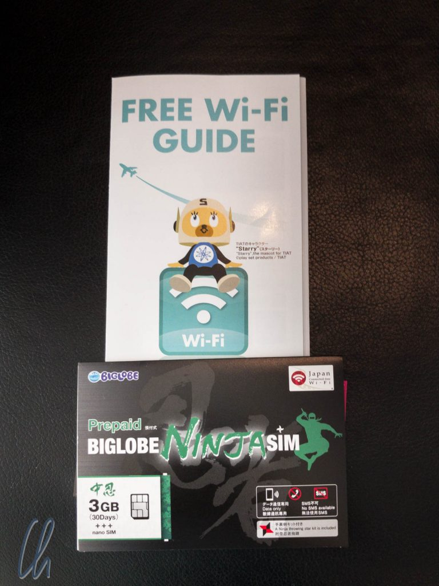
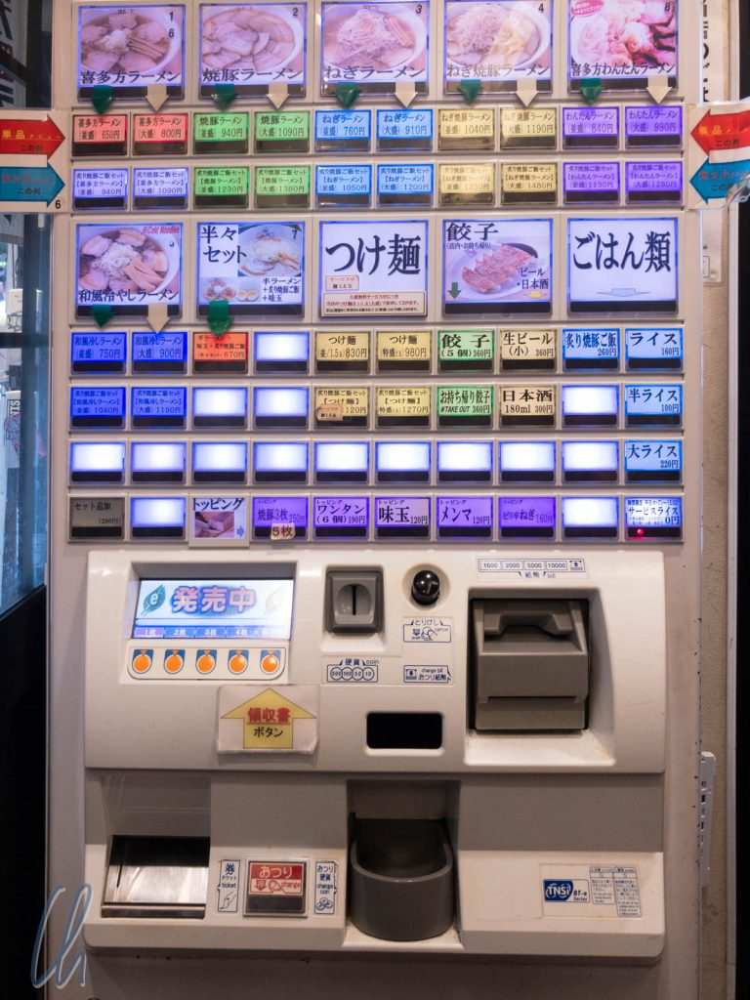

Tokyo ist überwältigend, wie üblich extrem gut organisiert, und so haben wir ca. 40 Minuten nach der Landung schon unser Gepäck, waren beim Geldautomaten und haben eine lokale SIM-Karte gekauft. Nach kurzem Vergleich fällt unsere Wahl auf die Ninja-SIM (kein Witz!), die nicht nur 3GB Datenvolumen für 30 Tage bietet, zusätzlich erhalten wir Ninja-Taschentücher und Origami-Papier - Geschenke sind in Japan sehr wichtig!

## <!--more-->Bahnfahren

In Tokyo sind wir meist U-Bahn gefahren. Das ist auch gleich ein großes Erlebnis. Nicht nur ist die Bahn hoch-effizient, sondern auch die Fahrgäste: Die Leute stehen links auf den Rolltreppen, rechts wird gegangen, es wird nicht gedrängelt und geschoben, in der U-Bahn wird geschlafen und (die meisten) wachen pünktlich zur richtigen Station wieder auf. Zudem pfeifen die Vöglein (wie nett!) an den U-Bahnhöfen, allerdings nur aus dem Lautsprecher (trotzdem nett!). Und so bringen uns die tokyoter Monorail und U-Bahn auf die Minute pünktlich zu unserem Hotel in Shinjuku.

Da Checkin erst um 15 Uhr ist, deponieren wir unser Gepäck, empfangen eine Blumenpfandmarke und beginnen, Tokyo bei schwülen 26-28°C zu entdecken. Dabei erfüllt Tokyo natürlich sofort einige weitere Klischees, und wir müssen auch erkennen, dass Japan an einigen Stellen einfach anders tickt.

## Wir essen Ramen

Wir waren gut eine Stunde unterwegs, da meldete sich unser etwas zeitverschobener Magen mit dem Verlangen nach Ramen-Nudeln. Ein Restaurant war schnell gefunden, der Bestellvorgang jedoch ungewöhnlich. Wer Ramen essen möchte, muss zum Bestellen diesen japanischen Automaten bedienen:

Nach kurzer Erläuterung eines Angestellten, stecken wir zwei 1000 Yen-Scheine in den Automaten, wählen die Menge 2 unten links, drücken wir auf den roten Knopf oben links. Daraufhin gibt uns der Automat Wechselgeld und 2 kleine Papierchen, die wir an der Theke abgeben. Gut 10 Minuten später stehen 2 dampfende Nudelsuppen vor uns.

## Tokyo ist riesig und eng

Zurück im Hotel können wir einchecken. Unser Hotelzimmer ist im 13. Stock, was in Japan anscheinend kein Unglück bringt. Unser Zimmer ist super sauber und hat einen schönen Ausblick: Im Meer der Häuser können wir sogar den [Sky Tree](https://de.wikipedia.org/wiki/Tokyo_Skytree) in der Ferne sehen, und in unserer direkten Umgebung liegen wir höhenmäßig voll im Durchschnitt. Viele Häuser sind ungefähr so hoch wie unser Hotel, manche kleiner, aber etliche auch deutlich höher. Das Zimmer ist jedoch kaum größer als das Doppelbett, das darin steht, und das Bad ist mit gefühlten 2qm auch sehr kompakt. Auf engstem Raum haben wir trotzdem eine Dusche, WC und Waschbecken. Die Toilette ist natürlich eine japanische mit ganz vielen Knöpfen. Dusche und Waschbecken werden aus der gleichen Mischbatterie gespeist - vorher auch noch nie gesehen...

Wir lassen den Tag in Shibuya ausklingen, besuchen natürlich die [Shibuya Crossing](http://christian-wittmann.com/photographing-shibuya-crossing/), den treuen Hund [Hachikō](https://de.wikipedia.org/wiki/Hachik%C5%8D) und das große Gemälde The Myth of Tomorrow, welches eine [interessante Geschichte](https://www.timeout.com/tokyo/art/the-myth-of-tomorrow) hat und einen Bezug zur atomaren Bedrohung, heute wieder sehr aktuell. Mehr als die große Politik interessierte uns aber dann doch ehrlich gesagt das leibliche Wohl. Zum Abendessen gibt es Sushi - was sonst? Japan hat kulinarisch sicher deutlich mehr zu bieten, aber das ist ein anderer Blogpost.

Tokyo ist auch ohne die vermeintlichen großen Sehenswürdigkeiten sehr sehenswert. Es ist sehr dynamisch, und an manchen Stellen haben wir uns gefragt, ob wir wirklich mit dem Flugzeug gekommen sind, oder doch mit einer Zeitmaschine weit in die Zukunft gereist sind. Hier noch einige weitere Impressionen (Ein Klick auf das Bild öffnet die Gallerie, 20 Bilder): `[envira-gallery id="581"]`
