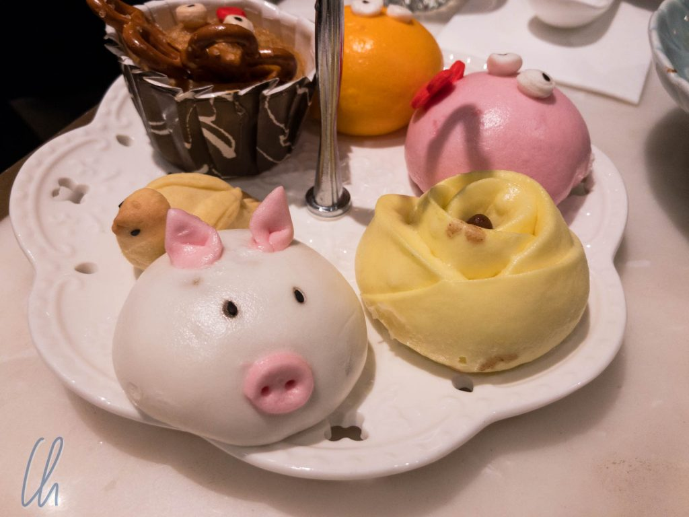

Hongkong ist ein Schmelztiegel britischer und chinesischer Kultur. Dies spiegelt sich auch in der kulinarischen Szene wider: Hongkong hat weit mehr als ausgezeichnete kantonesische Küche zu bieten. Die Spannweite reicht von Streetfood (mit Michelin-Stern) bis zu exquisiten Häppchen in 5-Sterne-Ambiente. Von dieser Bandbreite möchten wir Euch beispielhaft in vier kurzen Episoden berichten, vom Frühstück bis zum Nachtisch.

<!--more-->

## Pantyhose Tea zum Frühstück

Unser Hotel war sehr zentral gelegen, aber viel mehr als ein Bett, ein sauberes Bad und akzeptables Internet gab es nicht. Das war auch genau das, was wir gebucht hatten, schließlich wollten wir Hongkong und nicht unser Hotel erkunden ;). Frühstück wurde nicht angeboten und so war unsere Morgenmahlzeit gleich am ersten Tag ein Erlebnis.

Auf der Suche nach dem typischen Hongkonger Milchtee, den der Lonely-Planet-Reiseführer versprach, gingen wir durch die Straßen im Großhandelsviertel östlich vom Central District. Hier wirkt Hongkong sehr authentisch. Fleisch- und Gemüsehändler preisen in Buden oder in zur Straße hin offenen Geschäften ihre bunten Waren an. Fischgeschäfte offerieren, teils lebendig, alle nur vorstellbaren Lebewesen des Meeres. Außerdem gibt es viele Apotheken für traditionelle chinesische Medizin, die getrocknete Kräuter und Pilze, Ginseng, Schwimmblasen von Fischen, Seepferdchen, Hirschgeweihe und manch andere rätselhafte Waren verkaufen. Die Straßen sind eng und es gibt nicht den Glamour der Luxusmarken.

Nach gut 10 Minuten standen wir vor einer unscheinbaren Bude, in der offensichtlich große Mengen Tee gebraucht wurden - nicht notwendigerweise mit einer [Strumpfhose](https://dict.leo.org/englisch-deutsch/pantyhose), sondern mit einer Art elefantösem Teesocken. Es hätte nicht viel gefehlt und wir hätten übersehen, dass es tatsächlich einen Eingang gab, um auch drinnen zu essen.

Die Wände und der Fußboden waren gefliest, der Raum sehr niedrig, und auf einer Fläche von vielleicht 25 Quadratmetern standen mindestens 10 größere und kleinere Tische, die eigentlich voll besetzt waren. An einem Tisch waren doch noch 2 Hocker frei und wir studierten die kurze und zum Glück mehrsprachige Karte. Für den Anfang fiel unsere Wahl auf, natürlich, 2mal Milchtee und zusätzlich zwei Hongkong Crispy Buns.

Der Tee war für einen Schwarztee trotz eines guten Milchanteils erstaunlich bitter und nach unserem Geschmack nur mit viel Zucker genießbar. Das Crispy Bun entpuppte sich als eine Art Toastbrötchen (in der Tat knusprig) mit gesüßter Kondensmilch als Aufstrich. Das klingt vielleicht ungewöhnlich, ist aber für Liebhaber eines süßen Frühstücks recht wohlschmeckend. Als herzhafte Variante lernten wir an einem anderen Tag die Sandwiches mit zarter Rinderzunge oder gebratenem Schweinefleisch zu schätzen.

## 5 O'Clock Tea im Peninsula Hotel

In mancher Hinsicht ist Hongkong noch sehr britisch und die Tea Time, very British indeed, ist ein kulinarisches Paradebeispiel. Angeblich gibt es in Hongkong keinen besseren Ort als das ehrwürdige Peninsula Hotel, um den Nachmittagstee stilvoll zu genießen. Nachdem die Warteschlange überwunden war, nahmen wir in der luxuriösen, im Dezember pompös weihnachtlich geschmückten Lobby Platz. Auf einer Empore spielten drei Musiker klassische Werke und auf der Speisekarte gibt es eigentlich nur eine mögliche Wahl: den klassischen Afternoon Tea.

Neben Tee landete auf unserem Tisch eine Etagere, in der sich köstliche Leckereien befanden. In der Mitte lagen herzhafte Häppchen mit Lachs und Schinken. In der unteren Etage warteten Rosinen-[Scones](<https://de.wikipedia.org/wiki/Scone_(Geb%C3%A4ck)>) darauf, mit [Clotted Cream](https://de.wikipedia.org/wiki/Clotted_Cream) und Erdbeerkonfitüre verzehrt zu werden. Im Oberschloss fanden wir süße Leckereien wie Pistazien-Macarons, Kastanienmousse, Schokoladen- und Himbeerküchlein.

Die Atmosphäre wirkte durchaus vornehm, aber die alten englischen Herrschaften würden sich vermutlich im Grabe umdrehen, wenn sie wüssten, wie es heute beim Afternoon Tea im Peninsula zugeht. Der prächtige Weihnachtsbaum neben dem Eingang war ein Hotspot für Selfies aller Art. In Trekkinghose, Pullover und mit Tagesrucksack zählten wir verglichen mit einigen Asiaten und Asiatinnen in Trainingsanzug und Baseballkappe noch zu den besser gekleideten Gästen. So können sich die Zeiten ändern.

## Knuspriger Gänsebraten

Typisch kantonesisch und für uns geradezu gewohnt weihnachtlich aßen wir bei [Kam's Roast Goose](http://www.krg.com.hk/!en/) einen leckeren Gänsebraten. Das Restaurant liegt an einer der Hauptverkehrsstraßen, ist eher klein und unscheinbar. Eines der besten Erkennungsmerkmale ist die Menschentraube, die abends auf dem Bürgersteig hungrig darauf wartet, endlich einen Tisch zugeteilt zu bekommen.

Beim Warten nutzten wir bereits die Gelegenheit, die knusprigen Gänse im Schaufenster zu bewundern. Durch das rege Treiben auf dem Bürgersteig und auf den Straßen wurde uns nicht wirklich langweilig. Mit gerade mal 15 Grad war es jedoch für unser Gefühl unerwartet kühl. Nach gut 45 Minuten wurde endlich unsere Nummer aufgerufen und wir nahmen an einer langen Tafel auf 2 Stühlen nahe dem Tafelende Platz. Beim Studium der Speisekarte half uns ein freundlicher älterer Hongkonger, damit wir die echten Spezialitäten des Hauses bestellen konnten: Eine Viertel-Ente (unteres Stück mit Keule), Nudeln und die Tagessuppe mit kräftiger Fleischeinlage.

Wenn es nicht wirklich gut gewesen wäre, würden wir wohl nicht darüber schreiben ;). Die Ente war vollmundig, saftig und sehr knusprig, so dass der ästhetische Verzehr mit Stäbchen gar nicht so einfach war. Die Empfehlung des Reiseführers, die Menschentraube und der Michelin-Stern haben sich nicht geirrt, hmmm. Trotzdem verwunderte uns der Stern etwas, da wir mit einem Michelin-Stern eher ultimative Gourmet-Küche in einem edlem Ambiente verbinden.

Auch waren wir erstaunt, dass es in Hongkong unerwartet viele Michelin-Sterne gibt, z.B. in der Kategorie Streetfood - davon hatten wir noch nie gehört. So aßen wir auch einmal eine Michelin-gesterndelte Ei-Waffel (gefüllt mit z.B. Sesam oder Schokolade) auf der Straße bei Mammy's. Diese Waffeln sind eine der Hongkonger Spezialitäten schlechthin und sollten unserer Meinung nach bei einem Hongkong-Besuch unbedingt probiert werden!

## Das Desserant

Auch einen Stern hätte das [ATUM Desserant](https://www.facebook.com/ATUMDesserant/) verdient. Die Bezeichnung an sich ist schon ein Kunstwerk und anscheinend [weltweit einzigartig](https://www.google.com/search?q=desserant). Außerdem gilt: Der Name ist Programm! Der Nachtisch ist Weltklasse, nicht nur geschmacklich, sondern auch in der Präsentation. Dank Google Maps fanden wir den unauffälligen Eingang, über dem L.Square geschrieben stand, an einer der geschäftigsten Straßen Hongskongs. Dahinter verbarg sich ein Aufzug, der uns in den 16. Stock, direkt in das wohnzimmergroße Restaurant beförderte. Alle Gäste saßen rund um eine Bar, die in der Mitte des Raums stand.

Die Empfehlung des Hauses ist die "Improvisation", die wir natürlich bestellten. Daraufhin wurde eine Art Gummimatte, vielleicht 1 Meter mal 60 Zentimeter, vor uns ausgerollt, auf der kurze Zeit später die Improvisation begann. Der Dessertmeister begann damit, verschiedene Cremes und Saucen in unterschiedlichen Geschmacksrichtungen vor uns zu verteilen, die ein kunstvolles Muster ergaben. Nach kurzer Zeit gravitierten frische Himbeeren, ein fruchtiges Gelee, Matcha-Mochis und Schokoladenmousse in mehrere Dessert-Zentren. Zum Abschluss dieses Aktes trug unser Zuckerartist unsere persönliche Nachricht auf, aber seht selbst:

https://www.youtube.com/watch?v=k8gZ7QJDuE0

Im zweiten Akt spielte sich der Zauber hauptsächlich in einer Isolierschlüssel ab. Unser Nachtischkomponist füllte flüssigen Stickstoff (-196°C) in eine große silberfarbene Schale und gab anschließend flüssiges Fruchtpüree (erst Himbeere, dann Schokolade) hinzu. Der Stickstoffnebel brodelte, waberte über den Rand und dampfte! Unter ständigem Rühren wurde das so entstehende Sorbet schockgefrostet und gerann in feine Schollen, die uns ob ihrer Konsistenz an Lavagestein erinnerten. Die Show dauerte gut 8-10 Minuten und das Ergebnis war eigentlich zu schade zum Essen. Trotzdem konnten wir nicht widerstehen! ;)

