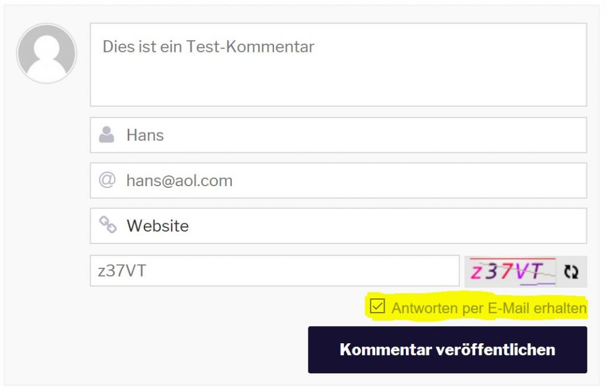
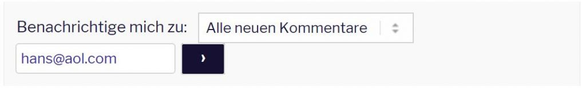

Vielen Dank für Euer Interesse und Euer positives Feedback zu unserem Blog. Das ist ein Ansporn für uns, fleißig weiterzuschreiben. Leider haben wir erst jetzt (eher zufällig) bemerkt, dass Ihr nicht per E-Mail benachrichtigt wurdet, wenn wir auf Eure Kommentare geantwortet haben :( - Das tut uns sehr leid. **Wir freuen uns über alle Eure Kommentare!**

Zum Glück gibt es jetzt Abhilfe, das Feature wurde nachgerüstet. In diesem Beitrag beschreiben wir kurz, was sich geändert hat und wie ihr per E-Mail über neue Kommentare benachrichtigt werden könnt. So eine Weltreise ist also auch ein kleines IT-Projekt ;)

<!--more-->

## Neues Kommentarsystem

Die Kommentare sehen jetzt optisch ein bisschen anders aus. Antworten sind optisch schöner eingerückt. Außerdem hat die Erfassung jetzt ein Captcha, das sich leider nicht deaktivieren ließ. Das Flag/der Haken "Antworten per E-Mail erhalten" ist automatisch gesetzt:

**Wichtig:** Nachdem Ihr einen Kommentar geschrieben habt, bekommt Ihr eine E-Mail mit einem Link, um das Abo der Antworten zu bestätigen. Dieses Opt-in-Feature ist hoffentlich nicht zu lästig (lässt sich aber leider nicht abschalten). Wenn ihr keine E-Mail erhaltet, schaut bitte in Euren Spam-Ordner.

## Kommentare ohne eigenen Kommentar abonnieren

Ihr könnt auch Kommentare abonnieren ohne eigene zu schreiben - auch wenn das nur der halbe Spaß ist ;).

## Was bisher geschah

Damit Ihr die Antworten zu Euren bisherigen Kommentaren noch lesen könnt, hier die Links zu den Kommentar-Abschnitten der vorherigen Beiträge:

Von Nudeln und Suppen: <http://wittmann-tours.de/japan-kulinarisch-von-nudeln-und-suppen/#comment-25>

Japan kulinarisch: Tonkatsu, japanisches Schnitzel: <http://wittmann-tours.de/japan-kulinarisch-tonkatsu-japanisches-schnitzel/#comment-17>

Tokyo, ein Lichermeer: <http://wittmann-tours.de/tokyo-ein-lichtermeer/#comment-10>

Japan kulinarisch: Sushi, Sashimi und Tsukiji: <http://wittmann-tours.de/japan-kulinarisch-sushi-sashimi-und-tsukiji/#comment-12>

Erste Eindrücke aus Tokyo: <http://wittmann-tours.de/erste-eindruecke-aus-tokyo/#comment-6>
