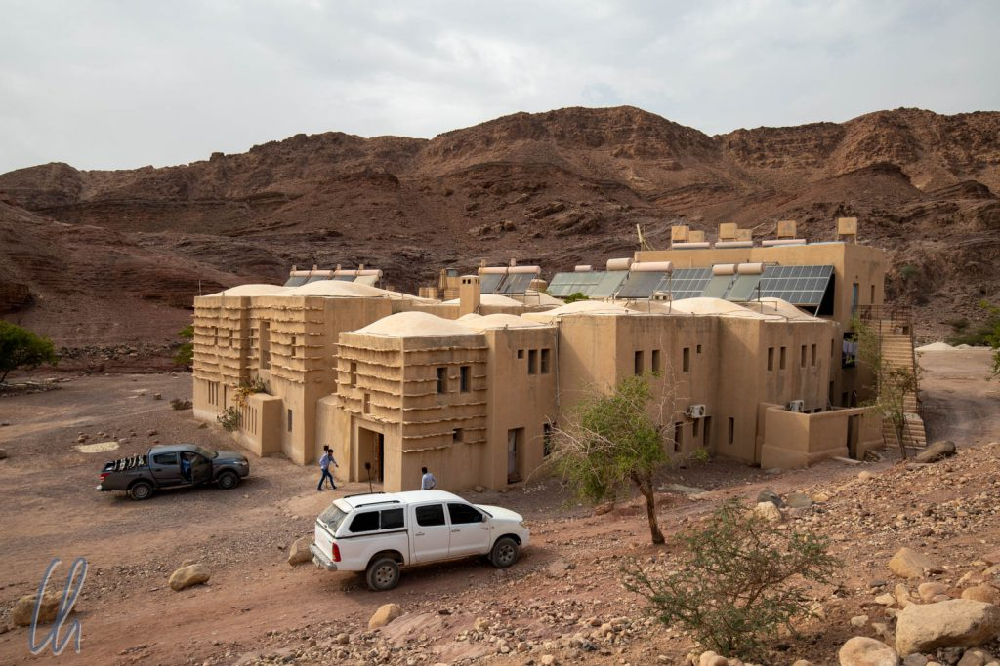

# Feynan - Nachhaltigkeit in der Wüste?

Nach so viel Kultur in Amman, rund um Madaba, an den biblischen Orten und in Jerash fuhren wir in die Wüste, um die Natur und das traditionelle Leben der Beduinen in Jordanien kennenzulernen. Wenn man dem Reiseführer und vielen Quellen im Internet glaubt, dann gibt es dafür keinen besseren Ort als die vielfach international ausgezeichnete [Feynan Ökolodge](https://en.wikipedia.org/wiki/Royal_Society_for_the_Conservation_of_Nature#Feynan_Ecolodge). Würde die Unterkunft die hohen Erwartungen erfüllen können? Wäre sie wirklich ein Paradebeispiel für Nachhaltigkeit?

<!--more-->

## Die Feynan Ökolodge

Das Konzept der Feynan Ökolodge beruht auf mehreren Elementen, die Nachhaltigkeit garantieren sollen. Mitten in der Wüste gelegen, ist das Hotel nicht an das öffentliche Stromnetz angeschlossen. Stattdessen wird der gesamte Strom über Solarzellen generiert. Die Verpflegung ist ausschließlich vegetarisch und besteht im Wesentlichen aus lokalen Produkten. Außerdem rekrutiert die Lodge viele ihrer Angestellten aus den Beduinenfamilien der Region, vom Fahrer bis zum Guide. Auch bietet die Lodge Aktivitäten zusammen mit den lokalen Familien an, so dass die Besucher einen Einblick in deren Lebensweise gewinnen können. Das hört sich fast schon zu gut an, um wahr zu sein.

Wir reisten via Pkw-Transfer an, mussten aber ab der Rezeption, 15 Kilometer von der eigentlichen Lodge entfernt, in den klapprigen 4x4 Pickup eines Beduinen umsteigen. Unser Gepäck fand auf der Ladefläche Platz, wir auf dem Rücksitz. Der Rest des Weges war in der Tat eine Piste, die Jordanier unterschätzen jedoch ihre Straßen. Für alle Verkehrswege, die nicht asphaltiert waren, wurde uns ein Allradfahrzeug angeraten, im Geländewagen fuhr man dann maximal 10km/h. Andere Länder würden die Pisten dort zu Nationalstraßen erklären ;). Feynan müssen wir zugutehalten, dass die Beduinen sich mit den Transfers ein Zubrot verdienen können.

Das Gebäude der Lodge spiegelte die Farben der Landschaft wider und erinnerte mit seinen abweisenden Außenmauern ein wenig an eine Festung. Statt Wachtürmen befanden sich allerdings Solarzellen auf dem Dach. Die dicken Wände und kleinen Fenster sollen tagsüber die Hitze abhalten, was allerdings in unserem Zimmer nur mäßig effektiv zu sein schien. Um die heiße Luft nach Sonnenuntergang wieder gegen kühlere auszutauschen, gab es statt einer stromfressenden Klimaanlage nur einen Standventilator, der allerdings der enormen Wüstenhitze wenig entgegenzusetzen hatte. Dabei handelte es sich um den einzigen Stromverbraucher im Zimmer. Um die Benutzung mitgebrachter Elektrogeräte zu verhindern, gab es für den Ventilator keine frei zugängliche Steckdose, sondern das Ende des Kabels verschwand in einem fest installierten Anschluss. Eigene Geräte mussten an einer der Steckdosen an der Rezeption geladen werden. Uns erschien Feynan subjektiv als der heißeste Ort unserer Weltreise und so hätten wir ein wenig Abkühlung durch eine Klimaanlage sehr begrüßt.

## Blick zu den Sternen

Nach Sonnenuntergang wurde es nicht nur draußen finster, auch in der Lodge gab es dann wenig Helligkeit. Elektrisches Licht leuchtete nur im Rezeptionsbereich und in den Badezimmern. Die Schlafräume und Gänge wurden durch den Schein von lokal hergestellten Kerzen mehr oder weniger erleuchtet. Das war natürlich sehr stimmungsvoll, aber auch an der Grenze zum Unpraktischen, so dass wir nach Einbruch der Dunkelheit immer eine Stirnlampe zur Hand hatten, z.B. wenn wir in den Tiefen des Rucksacks etwas suchten.

Die Dunkelheit der Nacht in Feynan ist normalerweise optimal, um die Sterne zu beobachten. Weit entfernt von großen Städten präsentiert sich der Himmel in der Regel ungewohnt prächtig. So wurde jeden Abend eine Einführung in die Sternbilder und Planeten angeboten und ein Mitarbeiter der Lodge erläuterte auch die lokale Bedeutung der saisonalen Phänomene für die Beduinen. Durch das potente Teleskop auf dem Dach der Lodge konnten wir die zahlreichen Krater des Mondes und die Ringe des Saturns bewundern. Zahlreiche Matten luden dazu ein, sich hinzulegen und das Firmament auf sich wirken zu lassen. Leider konnten wir die volle Pracht des Sternenhimmels nur an einem Abend erleben, da wir ungünstigerweise um Vollmond herum dort waren und, untypisch für die Jahreszeit, einige Wolken aufzogen, aus denen es einmal sogar für wenige Minuten etwas tröpfelte.

## Katzen und Ziegen zur Frühstückszeit

Beim Frühstück durften wir erneut feststellen, dass vieles (egal, worum es sich handelt) spannender und interessanter wird, wenn Tiere auftauchen. Zahlreiche Katzen schlichen um uns herum und maunzten uns an ([Simon's Cat](https://youtu.be/w0ffwDYo00Q) lässt grüßen), in der Hoffnung, etwas von unserer Mahlzeit abzubekommen. War ein Tisch unbewacht, so zögerten sie nicht lange: Sie sprangen auf die Tischplatte, um die geleerten Teller gewissenhaft vorzuspülen.

Jeden Tag um ca. 7:30 Uhr kamen außerdem einige neugierige schlappohrige Ziegen vorbei. Sie wurden zum Grasen in die Berge getrieben. Der Frühstücksbereich war aber für sie auf ihrem Weg immer einen Zwischenstopp wert. Sie fraßen die Blätter, die von einem großen schattenspendenden Baum gefallen waren. Aber manche gelüstete es nach anderen Leckerbissen. Eines Morgens steuerte eine der Ziegen schnurstracks auf einen eingedeckten Tisch zu und zog die Papierserviette unter dem Besteck hervor, um sie dann genüsslich zu verspeisen! Alles andere auf den Tellern, z.B. Obst und Gemüse, verschmähte sie jedoch.

## Wanderung im Wadi Ghwayr

Unsere erste Wanderung führte in das Wadi Ghwayr. [Wadi](https://de.wikipedia.org/wiki/Wadi) bedeutet ungefähr "Flussbett", wobei der dazugehörige Wasserlauf in manchen Fällen erst nach Niederschlägen entsteht. Das Wadi Ghwayr führt normalerweise etwas Wasser, der Strom kann nach Regen aber massiv anschwellen und damit das Wadi unpassierbar machen. Hätten wir uns nicht in Jordanien befunden, dann hieße der Flusslauf vermutlich Ghwayr Canyon und die Wanderung wäre als Canyoning bezeichnet worden.

Auch im Wadi Ghwayr ließ das Wasser die Wüste ergrünen. So standen neben dem Wasserlauf Bäume, Oleanderbüsche und hohe Gräser. Schon nach kurzer Zeit wechselte der Weg vom linken ans rechte Flussufer, dann wieder zurück ans linke und so weiter. Statt gewagte Sprünge vom einen zum anderen Ufer zu vollführen, liefen wir einfach durch das Wasser. Noch später, das Tal wurde immer enger, war das Flussbett selbst der einzige Weg. Unsere in den USA erworbenen Wasserschuhe erwiesen sich erneut als sehr nützlich und das feuchte Nass machte die Hitze von mindestens 35 Grad recht erträglich.

Ab und zu mussten wir ein wenig klettern oder durch knietiefe Becken waten. Der Weg wand sich zwischen immer höheren Felswänden hindurch. Die Landschaft hielt hinter fast jeder Kurve eine kleine Überraschung bereit. Entweder wuchs dort eine Gruppe stattlicher Palmen, die Schlucht verengte sich zu einem schmalen Spalt, ein kleiner Wasserfall sprudelte zwischen Felsen hervor oder der Fluss hatte die Wände der Schlucht zu organisch anmutenden, geschwungenen Formen geglättet.

Am Umkehrpunkt unserer Wanderung packte unser Führer Suleiman aus seinem Rucksack das Beduinen-Survival-Kit aus: Ein Teekesselchen, die Zutaten für den Tee und ein paar Gläser. Zwischen vier Steinen entzündete er ein kleines Feuer, um das mit viel Zucker versetzte Wasser zu erwärmen. In die kochende Flüssigkeit gab er etwas schwarzen Tee und Salbei. Der heiße Getränk zog nun neben dem Feuer und war nach wenigen Minuten genussfertig. In der Touristenvariante verwendete Suleiman nicht ganz so viel Zucker wie sonst üblich. Das Verhältnis lässt sich gut aus der Reihenfolge ableiten: Wasser, Zucker und Tee ;). Voller Energie waren wir nach der Pause bereit für den Rückweg.

## Wanderung von Dana nach Feynan

Am folgenden Tag wanderten wir durch das Wadi Dana. Es beginnt oben in den Bergen auf etwa 1000 Metern über dem Meeresspiegel im Gebirgsdorf Dana und erstreckt sich auf einer Länge von etwa 20km Richtung Südwesten bis zur Feynan Lodge. Um in der brütenden Hitze der Wüste nicht diesen Anstieg machen zu müssen, wählten wir eine bequemere Variante und buchten einen Taxitransfer nach Dana, um dann zu unserem Hotel zurückzulaufen. In Ermangelung einer direkteren Straße dauerte die Fahrt gut 2 Stunden und war ca. 100km lang. GoogleMaps hatte uns dies zwar angekündigt, aber so recht konnten wir es erst glauben, nachdem wir es wirklich erlebt hatten.

Im Wadi Dana gab es zu der Zeit kein Wasser, aber die Bäume im Tal wiesen eindeutig darauf hin, wo das Flussbett verlief. Abseits davon standen nur einige vertrocknete Büsche zwischen den Felsen. Mit jedem Schritt bauten wir Höhe ab und es wurde immer heißer. Der Hauptweg verlief im Wadi Dana meist nicht direkt im Flussbett. Schatten gab es auf dieser Wanderung fast nicht.

## Zum Teetrinken bei einer Beduinenfamilie

Nach etwa dreiviertel des Weges, wir hatten noch etwa 5 Kilometer zu laufen, erreichten wir bewohntes Gebiet. Einige Beduinen hatten ihre Zelte in kleinen Gruppen aufgeschlagen. Freundlicherweise lud uns eine Familie zum Tee ein. Erleichtert nahmen wir im an zwei Seiten offenen Vorzelt auf einer Matte Platz, ein angenehmes leichtes Lüftchen wehte. Wohltuender Schatten schützte uns nun vor den unbarmherzigen Strahlen der Sonne.

Anscheinend lernen die Kinder in der Schule kein Englisch, sondern schnappen nur Brocken der Sprache von den Besuchern auf. Mit Händen und Füßen konnten wir gegenseitig unsere Namen austauschen, beschreiben, von wo wir kamen, wohin wir gingen, wie alt wir waren und uns für den wohlschmeckenden, belebenden Tee bedanken. Eine solche spontane Gastfreundschaft haben wir nur in wenigen Ländern erfahren dürfen. Die Einheimischen waren schlicht neugierig auf uns und nicht auf Profit aus. Ganz im Gegenteil, es wäre eine tödliche Beleidigung, zu versuchen, für den Tee zu bezahlen. So brachen wir denn durch das Erlebnis beschwingt, etwas ausgeruht und mit neuer Energie vom Beduinenzelt auf.

Den nicht gerade ökologischen 100km-Taxitransfer haben wir nicht bereut. Wir hatten zwar ausreichend Wasser dabei, aber nach 5 Stunden Wanderung waren alle unsere Vorräte aufgebraucht und wir fühlten uns trotzdem etwas dehydriert. Vor allem die letzte Stunde war brüllend heiß und wir liefen in der prallen Sonne gänzlich ohne Schatten bei mindestens 35 Grad - und das trotz der Schleierwolken, die in der Nacht die Sterne verdecken würden ;).

## Wüstenbrot

Am folgenden Tag besuchten wir einen Beduinen, der auch für die Lodge Brot backte und uns in seine Geheimnisse einweihte. Das Rezept war sehr simpel: Mehl, Wasser und Salz. Aus den Zutaten knetete er einen Teig, den er zu einem Fladen formte. Der "Backofen" bestand aus Sand, Asche und Kohle. Er schob das brennende Holz seines Feuers beiseite und legte den Teig in das Aschebett. Nun bedeckte er den Fladen mit glühender Kohle und anschließend auch mit Sand. Nun backte das Brot für rund 20 Minuten.

Ein Tee versüßte uns die Backzeit und wir erinnern uns gerne an das interessante Gespräch mit Tamara und ihrem Ehemann Jenna zurück, die aus Jordanien stammten, aber in England lebten. Sie übersetzten freundlicherweise, was gesprochen wurde und hatten viele spannende Tatsachen über Jordanien zu berichten. Ein junger Beduine, der sich auch dort aufhielt, so gab Tamara an uns weiter, hatte nach der fünften Klasse die Schule abgebrochen, um seinen Vater beim Hüten der Ziegen zu unterstützen. Die Tiere stellen das Vermögen der Familie dar und sind daher wichtiger als die Bildung der Kinder. Englisch konnte der junge Mann gar nicht, was uns doch etwas verwunderte, da auch der Tourismus eine mögliche Einkommensquelle sein könnte.

Als das Brot fertig war, schob unser Gastgeber Sand und Kohle beiseite und nahm den Fladen aus der Hitze. Er breitete eine Plane aus, schlug das Brot mehrmals kräftig darauf aus und strich mit der Hand darüber, um es zu reinigen. Dann brach er den Fladen in handliche, appetitanregend duftende Stücke. In der Tat, das Brot hatte eine knusprige Kruste und war trotzdem innen noch saftig, exzellent!

Während wir im Schatten des halb offenen Zeltes saßen, trieben sich in der Umgebung ein paar Ziegen herum. Sie knabberten an den Büschen oder mussten als Spielgefährten für unseren Führer und die Kinder herhalten. Damit war es ein sehr kurzweiliger Nachmittag.

## Der Beduine heute

Einige Beduinenfamilien leben ähnlich wie ihre Vorväter mit und von ihren Tieren. Im Sommer sind sie in den kühleren Bergen, im Winter unten im Tal. Sie wohnen in Zelten, in der Natur und mit der Natur. Das klingt vermutlich romantischer als es wirklich ist, da zahlreiche Einflussfaktoren an dieser traditionellen Lebensweise zerren. Die sogenannten Errungenschaften der modernen Zivilisation wie auch Globalisierung und Klimawandel tragen genauso einen Teil dazu bei wie die Reaktion der Beduinen selbst auf diese äußeren Einflüsse.

Nicht zuletzt durch die Existenz der Feynan Lodge sind die Beduinen sesshafter geworden. Entweder haben die Familien sich ganz an einem Ort niedergelassen oder die Frauen und Kinder wohnen in der Nähe des Hotels, während ein Teil der Männer mit den Tieren den Sommer über in die Berge zieht. Die Lodge bietet Arbeitsplätze und damit ein Einkommen. Außerdem gibt es in der Nähe eine Schule, die den Kindern Zugang zu einer Grundbildung ermöglicht.

## Leben mit und in der Wüste

Zudem bietet die Sesshaftigkeit den Menschen die Möglichkeit, etwas Landwirtschaft zu betreiben. Die Familien bauen etwas Gemüse an, unter anderem auch Tomaten. Diese gedeihen prächtig im warmen Klima (Treibhäuser sind überflüssig), sie schmecken und tragen zu einer ausgewogenen Ernährung bei. Allerdings sind Tomaten auch dafür bekannt, dass sie sehr viel Wasser benötigen und diese wertvolle Ressource ist in der Wüste bekanntlich knapp.

Die Globalisierung schadet der Weidewirtschaft. Die Fleischpreise sind angeblich in den vergangenen Jahren stark eingebrochen (von 150 JD pro Ziege auf 80 JD, gerade einmal 100 Euro), so dass es immer schwieriger wird, mit der Zucht einen Gewinn zu erwirtschaften. Die Konkurrenz kommt jetzt aus Australien und Neuseeland. Auf der anderen Seite gibt es allerdings auch keine Obergrenze, wie viele Ziegen oder Schafe (auch im [Biosphärenreservat](https://de.wikipedia.org/wiki/Biosphärenreservat_Dana)) gehalten werden dürfen.

## Klimawandel in der Wüste

Auch in Feynan macht sich der Klimawandel bemerkbar. Unsere Führer erzählten uns, dass die Flüsse früher wesentlich mehr Wasser geführt hätten. Heutzutage gäbe es nur gelegentliches [Flash Flooding](https://de.wikipedia.org/wiki/Sturzflut). Die Versorgung mit Wasser ist also schlechter und unregelmäßiger bei steigendem Bedarf.

Betrachtet man nun die Fakten, so ergibt sich eine gefährliche Mischung aus Klimawandel und stärkerer Nutzung der natürlichen Ressourcen. Mehr Schafe und Ziegen sollen die gesunkenen Fleischpreise ausgleichen, machen aber vielen der sowieso schon spärlichen Pflanzen den Garaus. Der Gemüseanbau quetscht jeden Tropfen Wasser aus dem Ökosystem. Der einst vorhandene kleine Wald ist schon lange abgeholzt, teils für den Kupferabbau, der dort bereits in grauer Vorzeit betrieben wurde, der Rest als Brennmaterial. Es drängt sich der Gedanke auf, dass die natürlichen Ressourcen zu stark beansprucht werden, und dass die Ökolodge, als wesentlicher Baustein dieses Systems, ihren Teil zu der negativen Entwicklung beiträgt.

## Fazit

Die Feynan Ökolodge greift trotz bester Vorsätze massiv in die Umwelt und die Gesellschaft ein. Die lokalen Ressourcen werden genutzt, vor allem das Wasser, nicht nur direkt für die Lodge, sondern auch indirekt für den Gemüseanbau. Die lokalen Tomaten schmecken zwar sehr gut, sind aber natürlich nicht heimisch. Über die Ökobilanz könnte man bestimmt trefflich streiten, rein vegetarische Kost hin oder her. Allein durch ihre Existenz bewirkt die Lodge auch eine Veränderung des althergebrachten Lebensstils der Menschen. Vor allem die junge Generation profitiert davon allerdings sehr stark durch Ausbildung, Arbeitsplätze und besseres Einkommen. Man könnte aber auch in diesem Punkt dagegenhalten, dass die Lodge eventuell genau das negativ beeinflusst, was sie eigentlich bewahren möchte, nämlich die traditionelle Lebensweise der Beduinen. Es ist letztlich so, dass all unsere Handlungen Konsequenzen haben. Es gibt keine Aktionen, die nur für sich alleine wirken, sondern es entfaltet sich als Folge zwangsläufig ein komplexes Geflecht aus Wechselwirkungen.

Insgesamt hat uns der Aufenthalt in der Ökolodge gut gefallen, allerdings empfanden wir das Hotel nicht als ganz so Weltklasse, wie wir es anhand der euphorischen Bewertung im Reiseführer erwartet hätten. Einige Details ließen zu wünschen übrig, vor allem, wenn man den stolzen Preis des Aufenthaltes bedenkt. Es ist nicht auszuschließen, dass der Standard initial höher war. Ein vielleicht im doppelten Wortsinn pauschales Indiz dafür ist vielleicht die Tatsache, dass ganze Reisegruppen dort übernachteten. Als Folge davon ist es häufig vorbei mit echter Individualität. Trotzdem hätten wir die Erfahrung nicht missen wollen, da uns die Tage in Feynan die Möglichkeit gegeben haben, interessante Begegnungen zu erleben, spannende Details über das Leben der Beduinen zu lernen und die beeindruckende Natur zu genießen. Das Beispiel der Lodge zeigt, wie schwierig echte Nachhaltigkeit ist, besonders in einem so fragilen Ökosystem wie der Wüste. Trotz aller Kritikpunkte ist jedoch bereits der Versuch einer Umsetzung lobenswert.
