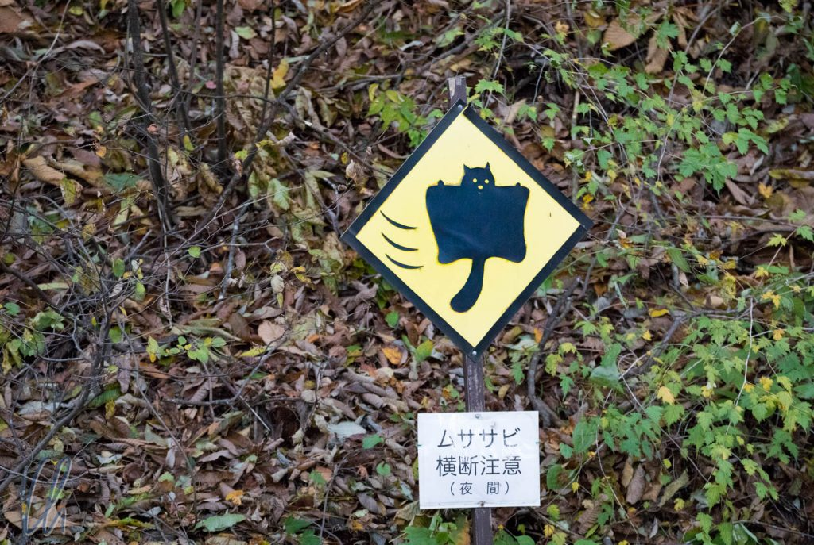
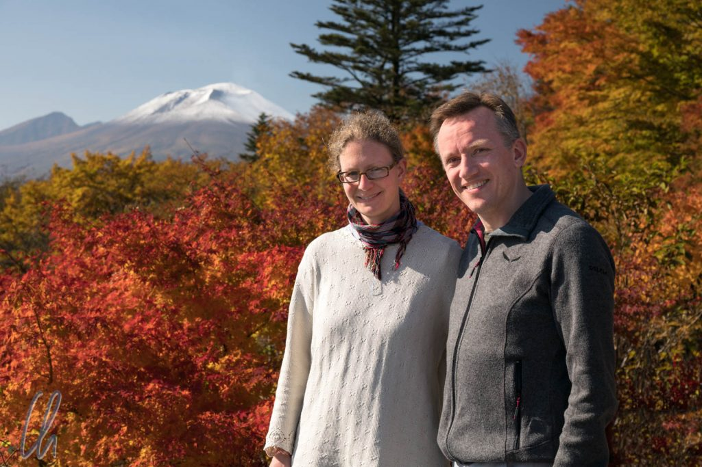
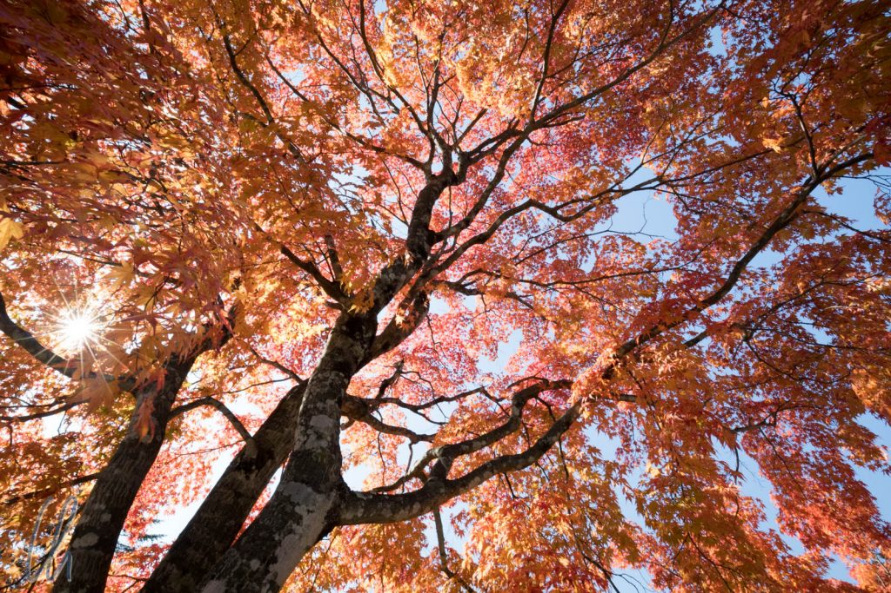
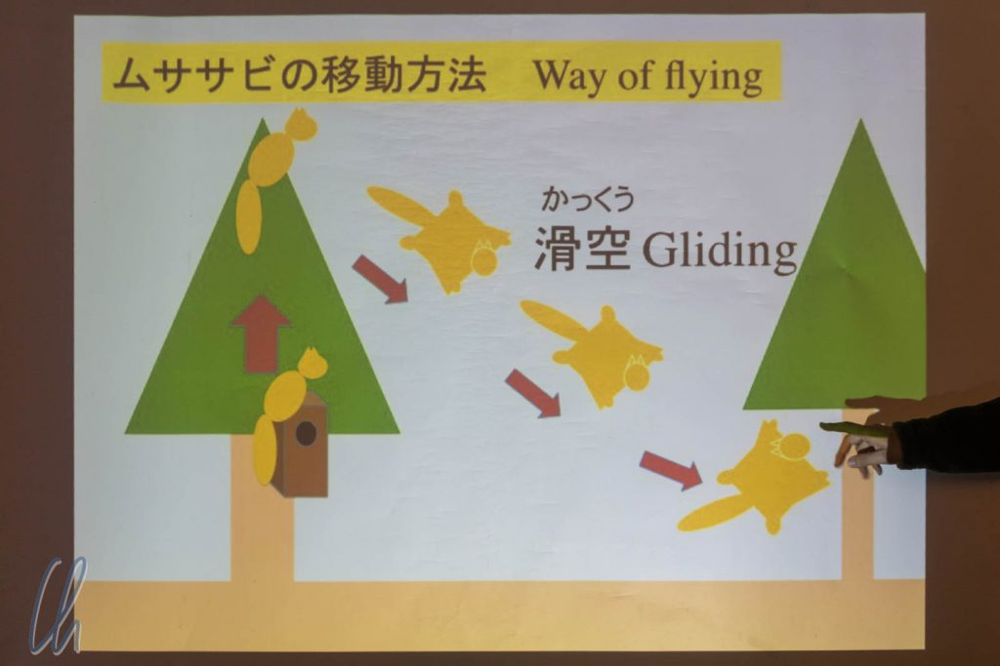

# Fliegende Eichhörnchen in Karuizawa

Nein, wir haben nicht zu viel Sake getrunken, wir waren wirklich bei den fliegenden Eichhörnchen. Ok, eigentlich sind es Gleithörnchen, genauer gesagt [japanische Riesengleithörnchen](Japanisches%20Riesengleithörnchen), aber das hört sich nicht so cool an ;) - und Wikipedia bezeichnet die niedlichen Tiere im englischen Artikel als [Japanese giant flying squirrel](https://en.wikipedia.org/wiki/Japanese_giant_flying_squirrel). Na also!

<!--more-->

## Karuizawa

Wir waren schon fast wieder auf dem Rückweg nach Tokyo und durchquerten die Japanischen Alpen. Unterwegs war ein Zwischenstopp in Karuizawa eingeplant, weil wir von den fliegenden Eichhörnchen gelesen hatten. Da wir [in Koblenz](http://christian-wittmann.com/squirrel-appreciation-day/) zuweilen auch unsere Eichhörnchen beobachten dürfen und es in Japan mehr Kultur als Natur in unseren Programm gab, war dieser Programmpunkt schnell ganz oben auf der Wunschliste der Aktivitäten.

Die japanischen fliegenden Eichhörnchen sind nachtaktiv und starten erst gut 30 Minuten nach Sonnenuntergang. Daher unternahmen wir tagsüber einen ebenfalls sehenswerten Ausflug zum Kumanokōtai Schrein und zum [Aussichtspunkt am Usui Pass](https://www.japan-guide.com/e/e6035.html). Endlich war er da, ein goldener Oktobertag, und so hatten wir einen fantastischen Blick auf die umliegenden Hügel, die sich verfärbenden Bäume und den [Mt. Asama](https://de.wikipedia.org/wiki/Asama).

Auf den ersten Blick würde man Mt. Fuji im Hintergrund vermuten ;) Mt. Asama ist auch ein Vulkan und laut Wikipedia der aktivste auf der Hauptinsel Honshu. Taifun Lan hat vermutlich den Schneefall auf dem Gipfel verursacht. [Vor gut 2 Wochen in Hakone](http://wittmann-tours.de/hakone-wandern-ryokan-und-fuji/) hatte auf dem Fuji noch kein Schnee gelegen. Fuji-san ist der höchste Berg Japans.

## Auf zu den Eichhörnchen

Nach einer hübschen Wanderung durch den herbstlichen Wald und einer kurzen Busfahrt kamen wir um ca. 16 Uhr bei [Picchio](https://www.wildlife-picchio.com/), einer Öko-Tourismus- und Umweltschutzorganisation an. Zunächst lernten wir einiges über die Hörnchen (Musasabi). Sie sind Vegetarier, ca. 80 Zentimenter lang (Körper und Schwanz zusammen) und können bis zu 100 Meter weit fliegen bzw. gleiten. Der Vortrag war auf Japanisch mit einigen Brocken Englisch gewürzt. Zusätzlich hatte unser Guide ein lebensechtes niedliches Stoff-Musasabi dabei, um das Gesagte zu verdeutlichen, was sehr gut funktionierte.

Mittlerweile war die Sonne hinter dem Horizont verschwunden und so gingen wir auf Pirsch. Die Eichhörnchen scheinen sich recht genau am Sonnenstand zu orientieren. Sie wachen bei Sonnenuntergang auf, putzen sich ausgiebig und kommen ca. 30 Minuten später aus ihren Nestern. Deshalb verschiebt sich der Beginn der Tour auch alle 10 Tage um einige Minuten. Im Vorfeld hatten wir noch über den minutengenauen Flugplan auf der Picchio-Webseite gewitzelt, aber die japanischen Hörnchen überzeugten (was ja eigentlich im Land des Shinkansen nicht überraschend ist) durch Pünktlichkeit.

## Die Eichhörnchen-Beobachtung

Die Wartezeit bis zum Erscheinen der Eichhörnchen wurde auf interessante Weise überbrückt, indem wir über eine in der Nistbox installierte Kamera einem Musasabi bei der Abendtoilette zusehen konnten.

Während wir auf einer Wiese standen, wo mehrere Eichhörnchen in einer Art Vogelhäuschen ihre Nester haben, wurde es immer dunkler und die Fledermäuse wurden allmählich aktiv. Die Temperatur sank schnell deutlich ab, nachdem die wärmende Sonne verschwunden war. Wie versprochen kam das Eichhörnchen gut 30 Minuten nach Sonnenuntergang zum Vorschein, steckte zunächst neugierig seinen Kopf aus dem Nest, um die Lage zu sondieren:

Nach gut 2 Minuten war anscheinend klar, dass die Luft rein war. Das Musasabi kletterte auf den Nestkasten und ab da ging alles recht schnell. Wenige Momente später machte sich das Eichhörnchen auf den Weg nach oben auf den Baum. Oben angekommen machte es einen Satz und flog bis zum nächsten Baum - ungefähr so wie auf einem Video von Picchio zu sehen ist:

https://www.youtube.com/watch?v=NpiveTKvVYk

Unser Eichhörnchen konnten wir zweimal fliegen sehen bis es der Guide mit der Taschenlampe nicht mehr finden konnte.

Picchio bringt den Besuchern die zum Glück nicht gefährdeten aber schwer zu erblickenden Eichhörnchen in einer interessanten Tour nahe. Uns haben die Eichhörnchen sehr gut gefallen. Sie waren putzig anzuschauen und die Flugeinlagen waren spektakulär - ein einzigartiges Erlebnis.

