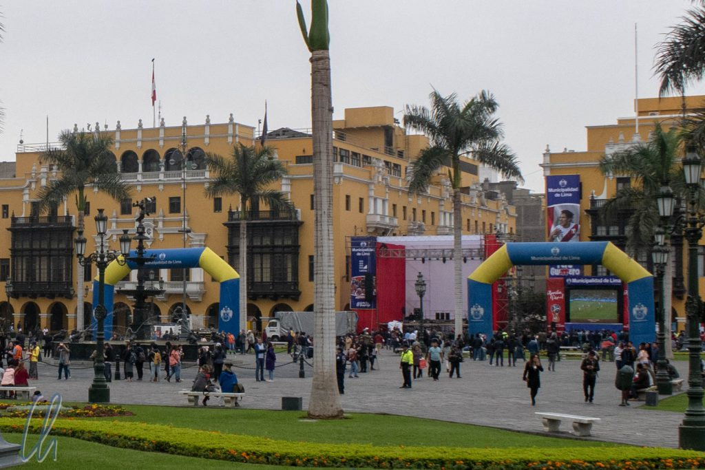

# Flug über die Nazca-Linien

Eine der interessantesten Sehenswürdigkeiten in Peru sind die Nazca-Linien, sog. [Geoglyphen](https://de.wikipedia.org/wiki/Geoglyphe), die [zwischen 450 und 600 n. Chr.](https://de.wikipedia.org/wiki/Nazca-Linien) entstanden sein sollen. Hierbei handelt es sich um Zeichnungen, die das [Prä-Inka-Volk](https://de.wikipedia.org/wiki/Nazca-Kultur) der Nazca vor über tausend Jahren in den Boden schabte und die noch heute zu sehen sind, allerdings am besten aus der Luft. Also buchten wir einen Flug über die Nazca-Linien von Pisco aus mit Transfer von Lima und zurück.

<!--more-->

## Fußballfieber am Flughafen von Pisco

Morgens um 7:30 Uhr wurden wir abgeholt und fuhren gut 3 Stunden bis nach Pisco. Die Fahrt war dahingehend kurzweilig, dass an diesem Tag das Fußball-WM-Spiel Peru gegen Dänemark stattfand. Alle Peruaner fieberten dem Spiel entgegen und waren sehr siegessicher, schließlich war ihr Kapitän Guerrero [doch Teil des WM-Kaders](https://www.faz.net/aktuell/sport/fussball-wm/sportpolitik/peru-kapitaen-paolo-guerrero-darf-trotz-doping-sperre-zur-wm-15617067.html). Zuvor hatten [Dopingvorwürfe gegen Guerrero](https://www.sueddeutsche.de/news/sport/fussball-raetseln-um-ursache-fuer-positive-dopingprobe-von-guerrero-dpa.urn-newsml-dpa-com-20090101-171105-99-741807) das Land erschüttert, die von den Fans stark heruntergespielt worden waren. Phantasievolle Gerüchte kursierten. Guerrero hätte doch nur aus einer Tasse getrunken, in der vorher Coca-Tee gewesen sei, und auch diese sei ihm von einem Argentinier untergeschoben worden. Und selbst wenn, was wäre schlimm an [Coca-Tee](http://wittmann-tours.de/hochland-kulinarisch-coca)?

Der Flughafen von Pisco wirkte etwas überdimensioniert: Check-in, Security, Wartebereich, 12 Gates, aber nur 24 Passagiere. Die einzigen beiden Flüge des heutigen Tages waren zwei Rundfüge über die Nazca-Linien mit je 12 Fluggästen. Auf dem Rollfeld von Pisco International befanden sich keine Flugzeuge, die größer waren als unseres. Laut [Wikipedia](https://de.m.wikipedia.org/wiki/Flughafen_Pisco) wird das Areal nur als Militärflughafen genutzt. Linienflüge gab es (noch) keine. Ein umgekehrter BER? Flughafen fertig, aber keine Flüge? ;)

## Abflug in Richtung Nazca-Linien

Der Anpfiff für das sehnlichst erwartete Fußballspiel in Saranska sollte um 11 Uhr peruanischer Ortszeit stattfinden, unser geplanter Abflug um 11:30 Uhr. Das Personal des Flughafens war offensichtlich voller Vorfreude und natürlich in Trikots der peruanischen Nationalmannschaft gekleidet. Ob der Flug überhaupt starten würde? Der Pilot könne doch unmöglich das Spiel verpassen! Oder war unser Flugkapitän der einzige Fußballverweigerer in ganz Peru? Witze machten die Runde unter den Passagieren, als wir benachrichtigt wurden, der Abflug verzögere sich wegen ungünstiger Wetterbedingungen um unbestimmte Zeit. Aha! ;)

Auf jeden Fall gab es noch eine wichtige Formalität zu erledigen. Als Andenken an den Flug offerierte Aerodiana einen äußerst dekorativen Stempel. Der musste unbedingt in mein [Stempelbüchlein](http://wittmann-tours.de/wir-sammeln-stempel/)!

Auf einmal ging es dann aber doch los und wir bestiegen das kleine Flugzeug. Wir durften es uns auf den Plätzen Nummer 1 und 2 bequem machen, direkt hinter dem Cockpit mit Ausblick nach vorne. Schnell stieg das Flugzeug über die Wolken auf. Von oben sahen wir das zähe Bewölkungsband an der Küste, das vermutlich für das graue Wetter auch in Lima verantwortlich war. Im Landesinneren hingegen war es heiter.

## Die Nazca-Linien von oben

Nach gut 45 Minuten Flugzeit waren wir über den Nazca-Linien angekommen. Unsere Flughöhe betrug nur noch 1500 Fuß (ca. 400 Meter) und der Pilot fing an, seine Kreise zu ziehen. Er flog jedes Bild zweimal an, so dass die Passagiere auf beiden Seiten einen guten Blick auf die prä-kolumbianischen Kunstwerke hatten. Dabei flog er nicht geradeaus an den Figuren vorbei, sondern im Kurvenflug mit beachtlicher Schräglage.

Der Co-Pilot kommentierte in flüssigem Englisch das Geschehen, kündigte die Figuren an, nannte ihre Namen, erklärte die Richtung, in der sie auftauchen würden, und das genau zum richtigen Zeitpunkt. Einige der in den Boden gescharrten Kunstwerke sind nur aus einem bestimmten Blickwinkel richtig gut zu erkennen. Die Linien an sich sind nicht breit, vermutlich nur gut einen Meter. Die Motive sind einzig und allein dadurch entstanden, dass ihre Schöpfer einen Teil der oberflächlichen Erdkruste entfernt haben, wodurch eine hellere tiefere Schicht zum Vorschein gekommen ist.

Der Flug war durch die ständigen Richtungswechsel, die engen Kurven und eine ungünstige Thermik alles andere als ein ruhiger Linienflug. Am Anfang waren die Bilder noch etwas weiter voneinander entfernt. In der zentralen Zone hingen wir mehr in engen Kurven, um die Zeichnungen zu umkreisen, als dass wir geradeaus flogen. So faszinierend es war, die Motive mit eigenen Augen zu sehen, so froh waren wir auch, dass der Rückflug nach Pisco einfach nur geradeaus verlief ;).

## Nach der Landung

Zurück in Pisco war die Euphorie des Morgens beim Flughafenpersonal in stille Trauer umgeschlagen. Peru hatte das Spiel verloren. Auch wenn wir keine Fußball-Fans sind, tat es uns doch sehr leid für die Peruaner. Ihre Mannschaft nahm seit 1982 das erste Mal wieder an einer WM teil, lange hatten sie um ihren Kapitän gezittert und dann kassierten sie gleich beim ersten Spiel eine Niederlage…

Und wie hat uns der Flug über die Nazca-Linien gefallen? Es war sehr spannend, die mysteriösen Figuren selbst zu sehen. Über ihre Bedeutung und Funktion existieren die wildesten Theorien, z.B. sollen sie zur Kommunikation mit oder als Landesignale für Außerirdische gedient haben. Am wahrscheinlichsten erscheint die These, dass die Zeichnungen im Rahmen eines Fruchtbarkeitskultes angelegt wurden. Das Rätsel über ihre Bedeutung bleibt jedoch weiterhin ungelöst. Interessanterweise werden sogar noch heute durch den Einsatz von Drohnen [neue Formationen entdeckt](http://www.spiegel.de/wissenschaft/mensch/peru-forscher-entdecken-neue-nazca-linien-a-1202290.html). Welch unglaubliche Leistung der Nazca, dass sie Motive in solchen Dimensionen darstellen konnten und welch ein Glück, dass die Figuren die Jahrhunderte überdauert haben.
