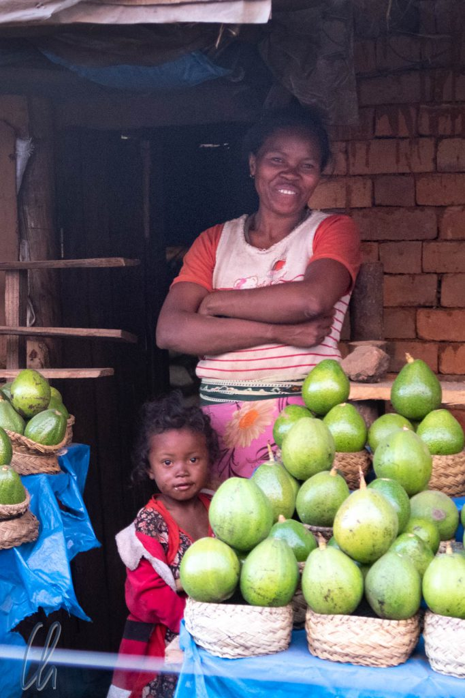

# Fotografien als Bindeglied: Madegassen im Portrait

Das Fotografieren auf Reisen ist manchmal problembehaftet, vor allem bei Fotos von Menschen. Besteht eventuell ein Verbot z.B. aus kulturellen oder religiösen Gründen? Ist es den Menschen denn recht, fotografiert zu werden? Dies sind Fragen von Respekt und Anstand. Gelingt diese Gradwanderung, kann eine Aufnahme eine dauerhafte, wundervolle Erinnerung sein, die Brücken zwischen den Kulturen schlägt. Eine Möglichkeit, etwas zurückzugeben ist es, der fotografierten Person ihr Foto gleich auf dem Display zu zeigen. Noch viel schöner wäre es natürlich, eine echte gedruckte Aufnahme verschenken zu können, was nur leider viel zu selten funktioniert.

<!--more-->

## Fotos und gute Vorsätze

Viele gedruckte Reiseführer empfehlen das Verschenken von Fotos. Es leuchtet sicher jedem beim Lesen als gute Idee ein, wird jedoch trotzdem sehr selten in die Tat umgesetzt. Entweder hat man keine Möglichkeit, die fotografierten Personen zu finden, da einem Name und Adresse nicht bekannt sind, bzw. vielfach haben die Menschen schlichtweg keine (postalische) Anschrift. Vielleicht hält man es auch für unwahrscheinlich, dass die Bilder ankommen, oder man vergisst es einfach.

Eine Aufnahme direkt vor Ort zu übergeben funktioniert selbst im Digitalzeitalter selten, da eine Fotografie auch heute noch entwickelt bzw. gedruckt werden muss. Wer hat schon eine (digitale) Polaroidkamera ;)? Außerdem befindet man sich am kommenden Tag oft schon wieder auf dem Weg an den nächsten Ort, vielleicht kann man die Fotos nicht sofort sortieren oder nachbearbeiten. Oder es fehlt einfach die Möglichkeit (oder der Wille oder die Zeit), Abzüge erstellen zu lassen, oder, oder, oder. Was auch immer der Grund sein mag, schließlich setzt man den guten Vorsatz doch nicht um.

## Die Grüne Kiste

Natürlich kannten wir den Ansatz, Fotos im Sinne der Völkerverständigung zu verteilen, hatten davon gelesen, darüber nachgedacht und es selten genug durchgeführt. Das einzige Mal, dass wir gesehen hatten, dass es wirklich funktioniert, war auf unserer ersten Madagaskar-Reise 2011. Hasina, unser damaliger Reiseleiter, hatte seine Gäste ermuntert, ihm nach der Reise digitale Aufnahmen zu schicken, und er würde gerne auf der nächsten Reise den Boten spielen, was er auch tat! So waren wir Zeugen so mancher Bildübergabe und jedes Mal waren die so Beschenkten sehr glücklich, ein Foto von sich selbst überreicht zu bekommen.

Was damals angefangen hat, ist mittlerweile ein kleines Element des Projekts der "[Grünen Kiste](http://www.madagruenekiste.org/de/)" geworden. Die "Grüne Kiste" ist ein gemeinnütziger Verein, gegründet von Hasina Samoelinanja, der "die Förderung der Toleranz auf allen Gebieten der Kultur und des Völkerverständigungsgedankens in Bezug auf Madagaskar" [zum Ziel hat](http://www.madagruenekiste.org/files/upload_mada/NEUE_Satzung_6_05_2018.pdf). Zu diesem Zweck unterstützt die "Grüne Kiste" talentierte madegassische Schüler und Studenten. Die beteiligten Reiseleiter fördern einen verantwortungsvollen Tourismus, auch indem sie Fotos, die auf den Touren entstanden sind, im Land verteilen.

## Gegenseitiges Interesse und gemeinsame Erlebnisse

Reisen ist für die meisten von uns ohne Fotos fast unvorstellbar. Die Bilder sind ein wichtiger Teil unserer Erinnerung und werden als Gedächtnisstütze umso wichtiger, je länger eine Reise zurückliegt. Das Fotografieren kann jedoch auch zu einem sehr einseitigen Vorgang werden, wenn man (wie es im Englischen so treffend ausgedrückt wird), ein Foto von Personen "nimmt". Oftmals entstehen die schönsten Erinnerungen (und auch die besten Aufnahmen) jedoch bei einem gemeinsamen Erlebnis, das allen Beteiligten Freunde bereitet.

Wie aus unseren bisherigen Schilderungen über Madagaskar deutlich wird, setzte Tahina ein auf gegenseitiger Neugier und Verständnis basierendes Tourismuskonzept um, das offene Begegnungen zwischen Einheimischen und Besuchern förderte. Die Interaktion zwischen Madegassen und Vazahas mit authentischen Erlebnissen sollte das Ziel sein, so dass sich ein fast freundschaftliches Verhältnis entwickeln konnte. Dazu gehörten natürlich immer zwei Seiten und manchmal ein vermittelnder Reiseleiter. Ab und zu verteilte Tahina auch das eine oder andere Trinkgeld oder kleine Geschenk, aber niemals ohne Gegenleistung. Viele Madegassen hatten ebenso großes Interesse an uns wie wir an ihnen, ließen sich gerne fotografieren, schenkten uns ihr Lächeln und gaben uns ein Foto.

Damit gab es für uns keine Ausrede mehr, warum wir uns nicht wenigstens mit ein paar Fotos revanchieren könnten, ein Geschenk mit einem hohen emotionalen Wert, ein Bild von der portraitierten Person selbst, vielleicht das einzige Bild, das die Menschen je von sich besitzen würden. Von Morondava aus fuhren wir 2 Tage lang über Antsirabe wieder zurück nach Antananarivo, die gleiche Strecke, die wir gekommen waren. Am Vorabend unserer Rückfahrt besuchten wir also einen Copyshop, wo wir einige gelungene Fotos ausdrucken ließen.

## Die Rückfahrt von Morondava nach Antananarivo

Wie haben wir nun die portraitierten Menschen gefunden, um die Bilder zu verteilen? Natürlich war der Ort der Aufnahme immer der Ausgangspunkt der Suche, der sich aus der Erinnerung (oder mit GPS) relativ einfach rekonstruieren ließ. Tahina nahm das Foto, wir gingen sozusagen zum Tatort und Tahina fragte die Passanten, ob sie den Menschen auf dem Foto kennen würden. In der Regel bekamen wir schnell einen Hinweis darauf, wo sich die gesuchten Personen aufhielten, wo sie wohnten, oder ob sie gerade nicht da waren. In diesem Fall fand sich aber immer ein bereitwilliger Bote: Freunde, Familie, Bekannte.

Am Nachmittag suchten wir ein kleines Mädchen. Es stellte sich heraus, dass sie nur zwei Straßen entfernt wohnte. Tahina hatte das Interesse der Menschen und vor allem der Kinder geweckt, die sich in einer Traube um ihn scharten. Das Mädchen stand auch in der Gruppe, bekam einen Schreck und lief voller Scham weg. Die anderen Kinder ließen sie aber nicht so einfach davonkommen. Einige folgten ihr und trugen die Kleine buchstäblich zu uns zurück. Mittlerweile hatten sich etwa 30-40 Kinder und junge Erwachsene auf dem kleinen Hof versammelt. Das Mädchen war so viel Aufmerksamkeit offensichtlich nicht gewohnt, nahm ihr Bild eingeschüchtert entgegen und lief sofort wieder davon, so schnell sie ihre Füße trugen. Wir hoffen, dass sie sich trotzdem später über das Bild gefreut hat.

## Fotos vom Markt in Betafo

Den Markt in Betafo, auf dem wir einige Tage vorher Proviant eingekauft hatten, erreichten wir erst in der Dämmerung. Trotzdem war es nicht schwierig, die fotografierten Menschen zu finden. Manche Standbesitzer waren noch in ihren Buden, sie erkannten uns und wir sie.

Andere Händler hatten schon geschlossen oder waren an diesem Tag nicht zum Markt gekommen. Einige von ihnen müssen weite Wege bis zum Handelsplatz zurücklegen. Tahina fand allerdings jedes Mal freundliche Helfer, die gerne bereit waren, die Fotos an unserer Stelle zu übergeben. Vielen Dank!

## Zu Besuch bei einer Merina-Familie

Katja hatte gefragt, ob es möglich wäre, das Innere eines Wohnhauses zu sehen. Am zweiten Fahrtag zurück nach Tana bot sich die Gelegenheit. Wir hielten an der Straße, gingen eine Böschung hinab, an einem abgeernteten Reisfeld vorbei in Richtung einer Ansammlung von Häusern. Wie so oft bemerkten uns die Kinder als erste.

Sie begleiteten uns zu den Häusern, wo die Bewohner auf einer Art Hof mit gestampftem Lehmboden verschiedenen landwirtschaftlichen Tätigkeiten nachgingen. Tahina fragte, ob die Vazahas eine kleine Führung bekommen könnten. Eine Familie willigte bereitwillig ein und wir betraten das enge Lehmziegelhaus. Über eine Treppe gelangten wir direkt in den ersten Stock, wo sich das Schlafzimmer und die rußige Küche befanden. Nur durch wenige Fenster fiel das helle Sonnenlicht in die dämmerigen Zimmer. Die Räume waren eng, aber funktional und mit nur wenigen Möbeln ausgestattet. Weitwinklig fotografiert wirken sie größer als sie waren.

Das alltägliche Leben der Menschen spielte sich allerdings sowieso die meiste Zeit draußen ab. Die Familien waren im Hof versammelt, alle arbeiteten und redeten und scherzten. Da einige Frauen gerade damit beschäftigt waren, zeigten sie uns, wie sie [Sisalkordeln](https://de.wikipedia.org/wiki/Sisalfaser) hergestellten.

## Epilog

Leider konnten wir nicht alle Bilder selbst überreichen und möchten an dieser Stelle Tahina dafür danken, dass er diese Aufgabe für uns übernommen hat. Gerne wären wir selbst dabei gewesen, da allein schon die Suche nach den fotografierten Personen immer ein kleines Abenteuer war und sich alle sehr über das unerwartete Vazaha-Geschenk gefreut haben. Natürlich ist es ein schöneres Erlebnis, in dem Moment persönlich dabei zu sein, als nur zu wissen, dass das Foto angekommen ist.

Sind wir durch diese kurzen Begegnungen zu Freunden geworden? Vermutlich nicht, aber hoffentlich sind wir uns dennoch etwas näher gekommen. Oder waren wir doch nur die reichen Vazahas, die ihren inneren Wohltäterinstinkt durch das Verteilen von Bildern im Land befriedigt haben? Vielleicht. Aber selbst wenn es so war, könnte es trotzdem gut sein, dass solch ein Foto eines der wenigen (oder sogar das einzige) ist, dass diese Menschen von sich besitzen. Wenn sie sich selbst in dem Bild erkennen, wenn es ihnen eine Erinnerung an diese Zeit ihres Lebens sein wird, dann hätte die Aktion schon einen guten Zweck erfüllt.

Nur um abschließend zu bestätigen, was Ihr vielleicht schon vermutet habt: Dieser Artikel beinhaltet ausschließlich Bilder, die der/die Portraitierte auch erhalten hat bzw. die bei der Übergabe entstanden sind. Abgesehen von aller materiellen Armut kamen wir erneut zu dem Schluss, dass die liebenswürdigen Madegassen Madagaskars größter Reichtum sind.
