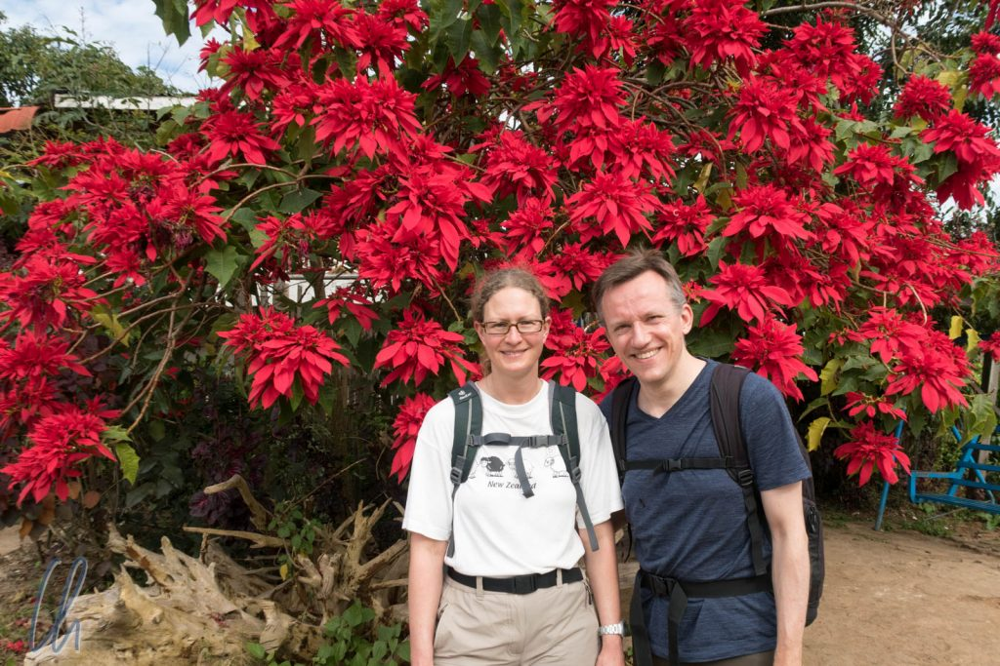
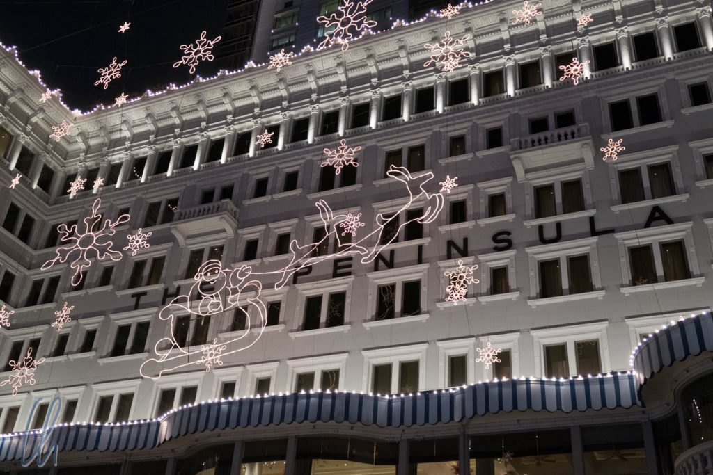
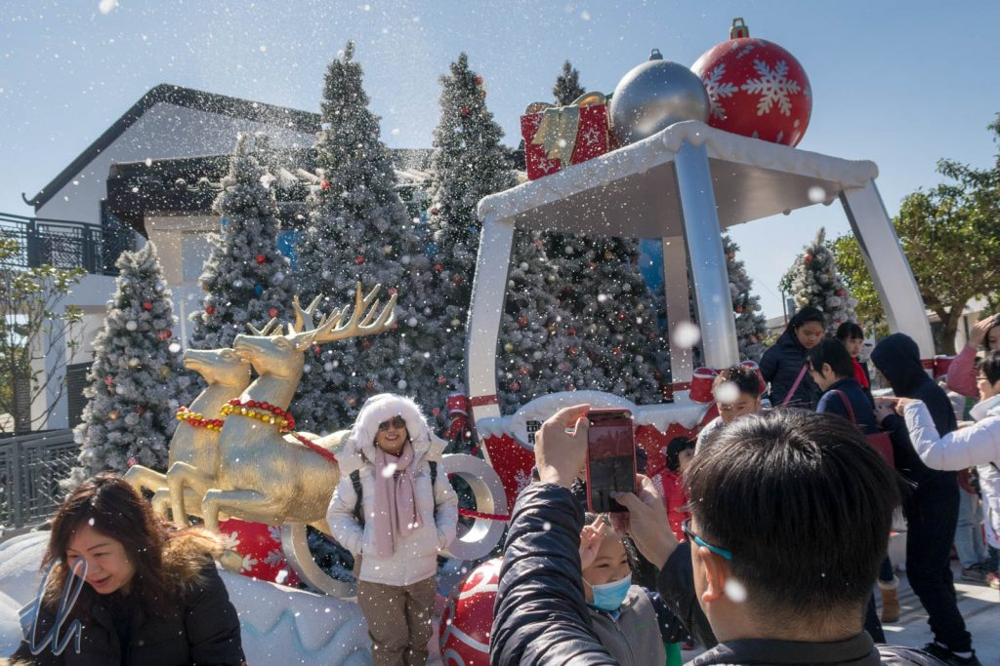
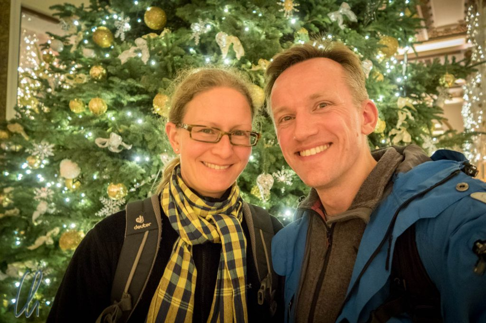
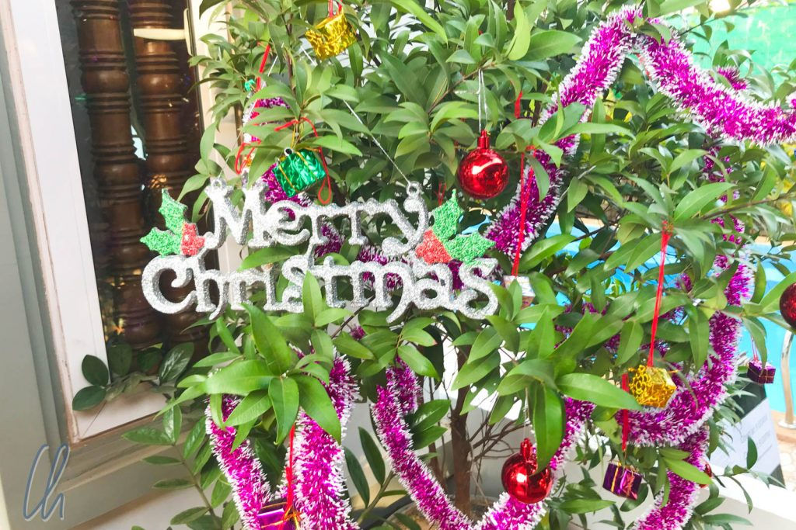

# Frohe Weihnachten!

Wir wünschen Euch allen ein frohes, friedliches und entspanntes Weihnachtsfest, kommt gut ins Neue Jahr und bleibt uns auf Wittmann-Tours treu oder plant am besten gleich selbst die nächste große Reise ;)

<!--more-->

Wir sind in Neuseeland bei Livia und Doris angekommen, um mit ihnen zusammen Weihnachten zu feiern und das neue Jahr zu begrüßen. Damit fällt dieser Artikel aus gegebenem Anlass aus der chronologischen Reihenfolge unserer Reiseroute. Das Schreiben und Bebildern dauert einfach immer ein bisschen ;)

## Weihnachtskitsch in Hongkong

Die vergangenen 5 Tage haben wir in Hongkong verbracht, wo an (fast) jeder Ecke ein großer Weihnachtsbaum stand, Geländer mit Christbaumkugeln geschmückt waren und Weihnachtsmusik dudelte, sogar Jingle Bells auf Chinesisch. Seasons Greetings stand auf großen Bannern und selbst auf den Hochhäusern der Skyline. Trotzdem, oder gerade deshalb, war es eher belustigend als besinnlich.

Beim Ausflug zum [großen Buddha](https://de.wikipedia.org/wiki/Tian_Tan_Buddha) auf der Insel Lantau kamen wir zunächst in einem Ausflugsdorf mit Restaurants und Souvenirläden an, wo eine der großen Attraktionen ein Plastikrentierschlitten war, der zu Selfies einlud. Gesteigert wurde dies nur noch durch die täglich zweimal 20 Minuten Schneefall. 2 Mini-Schneekanönchen versprühten künstlich riechenden Kunstschnee, der eher ein Schneeschaum war ;). Der Buddha selbst rückte ob soviel Weihnachtlichkeit etwas ins Hintertreffen.

Auch andere Details erschienen uns bemerkenswert. Auf einer Speisekarte entdeckten wir "Glühwein" - nicht schlecht! Direkt darunter auch "Iced Glühwein" - Paradox... Wir haben keines der beiden Getränke bestellt ;) Dennoch war Hongkong sehr sehenswert; wir werden in einem anderen Beitrag noch mehr darüber berichten.

## Die Weihnachtszeit in buddhistischen Landen

Die eigentliche Vorweihnachtszeit verbrachten wir allerdings dieses Jahr in [Myanmar](http://wittmann-tours.de/category/asien/myanmar/) und [Kambodscha](http://wittmann-tours.de/category/asien/kambodscha/) (kommt bald) ohne Adventskalender und Marzipan, ohne Lebkuchen oder Weihnachtsmarkt, ganz zu schweigen von Schnee und Eis. Im Gegenteil, normalerweise zeigte das Thermometer um oder über 30 Grad an. Nur gelegentlich bemerkten wir etwas Weihnachtsdekoration :).

In diesen buddhistischen Ländern haben wir eine andere Art von Spiritualität erlebt, mit anderen Bräuchen, Symbolen und Geschichten. Trotzdem verbindet uns mehr als uns trennt. Zum Beispiel schlägt ein einfaches Lächeln Brücken auf allen Kontinenten und in allen Kulturen.

Als buddhistische Weihnachtsbotschaft möchten wir Euch den kürzlich in der New York Times erschienen Artikel des Dalei Lama ans Herz legen: [Our Future Is Very Much in Our Hands](https://www.nytimes.com/2017/12/01/opinion/dalai-lama-despair-future.html),

Frohe Weihnachten!

Mona & Christian

