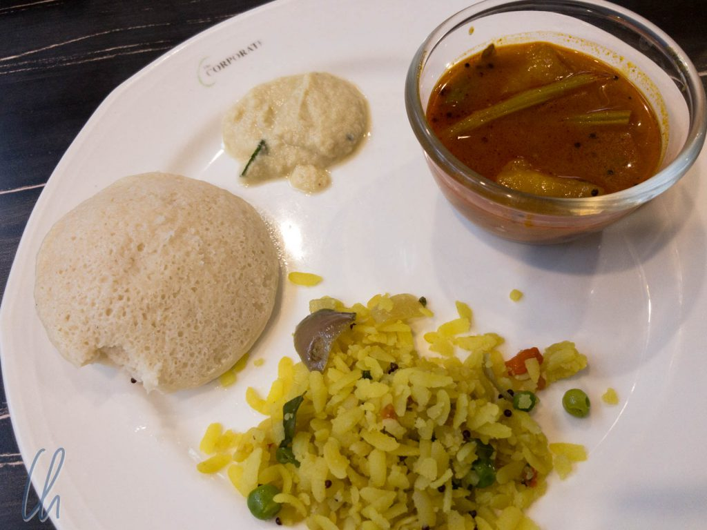
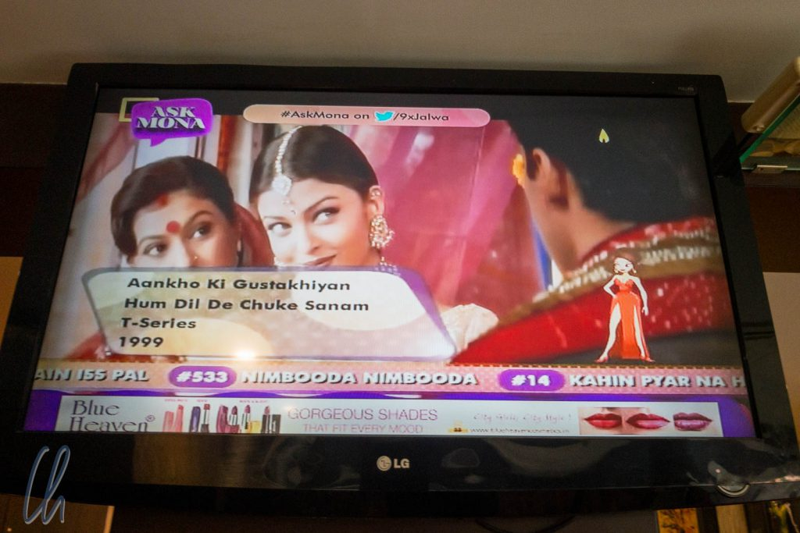

# Früher Calcutta, heute Kolkata

Kolkata hatten wir uns aus mehreren Gründen als unser erstes Ziel in Indien ausgesucht. Die Stadt liegt etwas abseits der üblichen Touristenströme, früher befand sich dort der Stützpunkt der Ost-Indien-Kompanie und an diesem Ort wurde die Hauptstadt der Kolonie Britisch-Indien gegründet. Mutter Teresa wirkte hier und half den Armen und Kranken. Außerdem hofften wir, mit Kolkata einen guten Ort gewählt zu haben, um Diwali, das indische Lichterfest, mitzuerleben.

<!--more-->

## Indisches Frühstück mit Bollywood-Untermalung

In Kolkata begann der Tag bereits sehr früh am Morgen. Der Sonnenaufgang fand um 5:45 Uhr statt, der Sonnenuntergang dafür schon um 17:00 Uhr. Auf dem gesamten indischen Subkontinent gilt nur eine einzige Zeitzone. Je weiter wir in den kommenden Wochen nach Westen reisen würden, desto später ging die Sonne auf. Immer starteten wir mit einem kulinarischen Höhepunkt in den indischen Tag. Neben Eiern und Toast gab es auf dem Frühstücksbuffet auch etliche lokale Gerichte. So aßen wir zum Beispiel gerne [Idlis](https://de.wikipedia.org/wiki/Idli), gedämpfte Küchlein aus Bohnen- und Reismehl, mit [Sambar](<https://de.wikipedia.org/wiki/Sambar_(Gericht)>), einem würzigen Hülsenfrüchtegericht und leckeren Chutneys. Dazu gab es Gemüsereis.

Während wir in anderen Teilen der Welt einen plärrenden Fernseher als unverschämte Belästigung empfanden, lief im Frühstücksraum unseres einfachen Business-Hotels, das wir wegen seiner zentralen Lage gewählt hatten, jeden Morgen ein sympathischer Bollywood-Mix in gemäßigter Lautstärke. Dank der stimmungsvollen Musik und der engagiert tanzenden Schauspieler starteten wir jeden Morgen äußerst gut gelaunt in den Tag.

## Kolkata oder Calcutta?

Nur um Missverständnissen vorzubeugen: Kolkata und Calcutta sind Bezeichnungen für dieselbe Stadt. Trotzdem ist der Name Calcutta bei uns wohl noch tief verwurzelt. Für mich war lange Zeit der Besuch von [Phileas Fogg](https://de.wikipedia.org/wiki/Reise_um_die_Erde_in_80_Tagen) dort auf seiner "Reise um die Erde in 80 Tagen" der erste und lange Zeit auch einzige Berührungspunkt mit der Metropole. Seit 2001 heißt der Ort offiziell Kolkata, so wie "Karl-Marx-Stadt" nach der Wende wieder in "Chemnitz" umbenannt wurde. Auch wenn der deutsche [Wikipedia-Artikel](https://de.wikipedia.org/wiki/Kalkutta) über die Stadt interessanterweise weiterhin mit "Kalkutta" betitelt ist, wollen wir sie mit ihrem aktuellen Namen "Kolkata" bezeichnen.

## Wann findet Diwali eigentlich statt?

Wir wussten, dass [Diwali](https://de.wikipedia.org/wiki/Diwali) eines der wichtigsten Feste des hinduistischen Kalenders darstellt. Deshalb hatten wir den Zeitpunkt unserer Ankunft so geplant, dass wir Indien pünktlich zu Diwali erreichen würden. Und wirklich waren die Vorboten der Feierlichkeiten nicht zu übersehen: Dekorationen und Grußbotschaften fielen uns schon am Flughafen ins Auge und die Stadt war prächtig geschmückt. Trotzdem blieb Diwali für uns schwer zu fassen und dabei ging es um ganz elementare Grundlagen, wie zum Beispiel das Datum des Festes. Nach ersten Recherchen meinten wir verstanden zu haben, dass Diwali 5 Tage dauert und der dritte Tag, der 7. November 2018, den eigentlichen Höhepunkt darstellt. Im Grunde genommen auch richtig, aber…

Diwali wird in Südindien bereits [einen Tag früher](https://www.india.gov.in/calendar?date=2018-11) gefeiert und im Hotel sagte man uns ebenfalls, dass der Höhepunkt der Feierlichkeiten schon am 6. November stattfände. Hintergrund dafür [sind die Mondphasen](https://de.wikipedia.org/wiki/Diwali#Zeitpunkt), die sich im sich über tausende Kilometer erstreckenden Subkontinent verschieben können, das Fest beginnt nämlich zu Neumond. Schließlich stellte nach unserer Wahrnehmung dann doch der 7. November den echten Höhepunkt dar. Wir hörten mehr Feuerwerk in den Straßen und bekamen Süßigkeiten zum Frühstück serviert. Am 8. November lief der Service im Hotel ein wenig auf Sparflamme, z.B. gab es wegen Diwali keinen Wäscheservice. Die Festivitäten ließen sich also nicht auf einen bestimmten Zeitpunkt festlegen, sondern erstreckten sich vielmehr über einen Zeitraum.

## Was sind die Hintergründe von Diwali?

Was feiert man nun eigentlich an Diwali? Wörtlich bedeutet Diwali "[das Lichterfest](https://de.wikipedia.org/wiki/Diwali#Etymologie)". Der Bezeichnung "Dipavali" bedeutet aus dem Sanskrit übersetzt in etwa "Lichterkette". Aber was ist die tiefere Bedeutung dieses Festes für die Inder? Auf diese schwierige Frage gibt es mehr als eine Antwort. Über Weihnachten wissen wir, dass es im Kern um die Geburt von Jesus Christus geht, aber solch ein singulärer Ursprung existiert bei Diwali nicht. Stattdessen hat Diwali unterschiedliche regionale [mythologische Hintergründe](https://de.wikipedia.org/wiki/Diwali#Bedeutung). In allen Landesteilen jedoch geht es um den Sieg des Guten über das Böse, des Lichts über das Dunkel. Nach unserer Wahrnehmung erinnerte Diwali entfernt an eine exotische Kombination aus Weihnachten und Silvester: Die Familie nimmt bei diesem Fest einen hohen Stellenwert ein, festliche Beleuchtung stellt einen wesentlichen Bestandteil der Feierlichkeiten dar und es hat Tradition, Feuerwerk abzubrennen.

Überall waren Straßen und Geschäfte mit Blumenketten und farbigen Lichtern geschmückt. An einem Obststand hatte der Händler Kerzen zwischen den Früchten angezündet. Durch die festliche Beleuchtung erinnerte die Stimmung in der Tat etwas an Weihnachten. Vor vielen Hauseingängen waren filigrane [Rangolis](https://en.wikipedia.org/wiki/Rangoli) geschaffen worden, traditionelle Muster aus buntem Reismehl, in denen kleine Öllämpchen aus Ton brannten. Begangen wird das Fest vor allem zu Hause in der Familie. Es ist üblich, sich gegenseitig zu beschenken.

## Happy Diwali!

Auch uns als Reisenden wünschten die Inder "Happy Diwali!" und wir taten es ihnen gleich. Große Firmen, zum Beispiel Fluggesellschaften, versendeten Diwaligrüße. In der Zeitung waren ganzseitige Anzeigen geschaltet, die ein fröhliches Diwali wünschten, und im Hotel gab es zum Frühstück extra Süßigkeiten, die uns mit einem freundlichen "Happy Diwali!" serviert wurden. Die Stimmung war festlich und alle Menschen wirkten gut gelaunt und voller Vorfreude.

Der Abend des 7. November erinnerte sehr an Silvester, überall gab es Feuerwerk auf der Straße. Das Böllern war zwar offiziell nur zwischen 20 und 22 Uhr erlaubt (um die ohnehin erhöhten Feinstaubwerte nicht über die Maßen in die Höhe zu treiben), aber auch außerhalb dieser Zeiten stiegen immer wieder Raketen in die Luft oder Kracher detonierten mit ohrenbetäubendem Lärm in den Straßen.

## Kali Puja, die Verehrung der Göttin des Todes

In [Bengalen](https://de.wikipedia.org/wiki/Westbengalen) wird die hinduistische Göttin Kali sehr verehrt. Sie steht für Tod und Zerstörung, aber auch für Erlösung und Erneuerung. Die Bezeichnung der Stadt Kolkata geht auf ihren Namen zurück: Ursprünglich hieß das kleine Fischerdorf Kalikata. Das größte Fest zu Ehren der streitbaren Göttin ist [Kali Puja](https://en.wikipedia.org/wiki/Kali_Puja), in dieser Region Indiens der Höhepunkt der Diwali-Feierlichkeiten am dritten Tag. Um ihr Achtung zu erweisen, waren an zahlreichen Orten der Stadt üppig dekorierte Kali-Schreine aufgestellt worden.

Im Inneren stand eine Statue der kämpferischen Göttin mit ihren furchteinflößenden Attributen, die, prächtig geschmückt, den Besuchern die Zuge entgegenstreckte. Diese Mimik soll Scham darstellen. Die indische Mythologie berichtet, dass Kali, trunken vom Blut ihrer Feinde, unglaublich wild auf dem Schlachtfeld getanzt haben soll. Die Raserei hatte sich ihrer so bemächtigt, dass sie das gesamte Universum zu zerstören drohte. Um sie zu zügeln, soll sich der große Gott [Shiva](https://de.wikipedia.org/wiki/Shiva), ihr Ehemann, wie tot vor ihr auf den Boden gelegt haben. Als Kali auf ihn trat, kam sie zu sich, wurde ihrer Taten gewahr und streckte vor lauter Schreck die Zunge heraus.

## Der Kalighat-Tempel

Neben den temporären Verehrungsstätten für Kali befindet sich in Kolkata der bedeutende [Kalighat-Tempel](https://de.wikipedia.org/wiki/Kalighat-Tempel), der dieser Göttin geweiht ist und einen der wichtigsten hinduistischen Wallfahrtsorte Indiens darstellt. Unser Besuch des Heiligtums blieb uns als sehr authentisch in Erinnerung, aber es ist ein wenig Vorsicht geboten, da sich auf dem Tempelgelände auch einige Schlitzohren herumtreiben, die schräge Geschäfte auf Kosten ahnungsloser Reisender machen wollen. Ende 2018 konnten wir der offiziellen Webseite des Tempels (<http://kalighattemple.com/precautions.htm>) noch sehr hilfreiche Informationen zu Verhaltensregeln an der und Hintergründe zur Wallfahrtsstätte entnehmen, aber leider scheint die Seite nicht mehr online zu sein. Der Kalighat-Tempel war der einzige Ort in Kolkata, wo wir als Nicht-Inder von den Einheimischen, wenn auch auf diskrete Weise, beäugt wurden.

Sobald wir, einen Tag vor Kali Puja, das Tempelgelände betraten, wurden wir von einem Führer angesprochen (vor angeblichen Priestern wird gewarnt), der uns herumführen wollte. Den Preis für eine solche Dienstleistung sollte man natürlich immer im Voraus verhandeln und bedenken, dass 100 Rupien (etwas mehr als ein Euro) in Indien viel Geld sein können. Wie es Sitte ist, zogen wir unsere Schuhe aus, die wir bewacht neben einem Stand ablegen konnten und machten mit dem Guide einen Rundgang über das Tempelgelände. Der Besuch ist nichts für zartbesaitete Naturen. Die schmalen Gänge zwischen den Geschäften sind voller Menschen, Tiere werden als Opfer geschlachtet. Wir kauften ein paar Hibiskus-Blüten als Ehrengabe für Kali (100 Rupien sind vollkommen angemessen, auch wenn erst einmal 1000 Rupien vorgeschlagen werden) und stellten uns in einer langen Warteschlage an, um in das Innere des Tempels zu gelangen.

## Die Kali Statue im Kalighat-Tempel

Die Schlange bewegte sich zügig, wir unterhielten uns während der Wartezeit mit unserem Führer und wechselten freundliche Worte mit anderen Pilgern. Unser Guide erklärte uns, was im Tempel geschehen würde. Das war auch gut so, weil dann auf einmal alles ganz schnell ging. Wer einen besinnlichen Ort erwartet, der täuscht sich. Stattdessen konnten es einige Gläubige auf einmal nicht mehr erwarten, von hinten wurde gedrängelt, und in Ekstase warfen die Hindus (und wir auch) die Hibiskusblüten in die grobe Richtung der mythenumrankten Kali Statue. Ein Verweilen war unmöglich, die Menge schob uns weiter. So war der Höhepunkt des Besuchs intensiv, aber schnell vorbei.

Im Tempel selbst war das Fotografieren nicht gestattet. Wenn Ihr Euch gerne zu Hause in Ruhe ein Bild von der Statue der schwarzen Göttin im Kalighat-Tempel machen möchtet, findet Ihr hier immerhin die Aufnahme einer Replik: <https://en.wikipedia.org/wiki/Kali_Puja#/media/File:Kalighater_Kali.JPG>

## Stadtrundgang durch Kolkata

Sobald wir unser Hotel verließen, umgab uns der indische Trubel auf den Straßen. Wir hätten den ganzen Tag ziellos umherlaufen, in das Leben der Stadt eintauchen können, es wäre uns mit Sicherheit keine Sekunde langweilig geworden, auch ohne dass wir den Besuch einer der in unserem Reiseführer beschriebenen Sehenswürdigkeiten geplant hätten. Aber dennoch wollten wir uns natürlich die interessantesten Punkte der Metropole ansehen und nahmen dies zum Anlass, Kolkata meist zu Fuß zu erkunden. Auch wenn der Zahn der Zeit, das tropische Klima und der Monsun vielen der eindrucksvollen kolonialen Gebäuden sehr zugesetzt hatten, begegneten wir dem Widerhall der britischen hauptstädtischen Glanzzeiten Calcuttas noch in vielen Straßen. An den architektonischen Ehrgeiz der früheren Kolonialmacht erinnerten Prachtbauten wie zum Beispiel der High Court, das Currency Building oder die [St. Paul's](<https://de.wikipedia.org/wiki/St.-Pauls-Kathedrale_(Kalkutta)>) Cathedral, um nur einige zu nennen.

Das mit Abstand beeindruckendste Gebäude war zweifelsohne das [Victoria Memorial](<https://de.wikipedia.org/wiki/Victoria_Memorial_(Indien)>) aus weißem Marmor, welches zu Ehren der verstorbenen Königin Victoria errichtet worden war. Es erinnert entfernt an den Taj Mahal und befindet sich in einer weitläufigen Parkanlage, in der man etwas Abstand zum hektischen Treiben auf den Straßen Kolkatas gewinnen kann. Unser Besuch der Anlage fiel auf einen Samstag, Diwali war gerade vorüber, und so nutzten auch viele Inder den Park zum Flanieren und Entspannen.

Ebenfalls eine Oase der Ruhe, allerdings mit leicht morbider Ausstrahlung, war der historische [South Park Street Friedhof](https://en.wikipedia.org/wiki/South_Park_Street_Cemetery). Dort liegen zwischen 1767 und 1840 verstorbene Engländer in repräsentativen Mausoleen begraben. Aber all die Pracht der Grabmale konnte eine traurige Wahrheit nicht verbergen: Die Kolonialisten überlebten meist nach ihrer Ankunft in Indien nur wenige Jahre und fielen rasch tropischen Krankheiten zum Opfer.

## Das Mutterhaus

Nicht weit entfernt vom Friedhof lag das Mutterhaus, wo [Mutter Teresa](https://de.wikipedia.org/wiki/Mutter_Teresa) viele Jahre gewirkt hatte und wo sich jetzt ihre letzte Ruhestätte befindet. Es ist ein unscheinbares Haus, fast schon versteckt in einer ruhigen Gasse, nur wenige kleine Schilder weisen den Weg dorthin. Wir wurden freundlich empfangen und die Ordensschwester am Einlass schenkte uns je ein Bildchen und ein kleines Medaillon mit dem Konterfei der Heiligen. Obwohl gänzlich ohne Prunk handelte es sich bei dem Raum mit ihrem schlichten marmornen Sarkophag unübersehbar um den wichtigsten Ort des Mutterhauses.

Im Obergeschoss, direkt über der Küche, befand sich das kahle und zweckmäßige Zimmer, in dem sie gearbeitet und geschlafen hatte. In einem weiteren Raum zeigte eine kleines Museum einige persönliche Gegenstände z.B. ihre abgetragenen Sandalen und beschrieb ihr Leben, ihre Ehrungen und die Heiligsprechung. Auch wenn Mutter Teresa keine unumstrittene Person ist, hat sie zweifelsohne Großes geleistet.

## Auf den Straßen Kolkatas

Auf unseren Wegen durch die Stadt umfing uns das bunte alltägliche Treiben Kolkatas, das für all unsere Sinne eine wahre Reizüberflutung darstellte. Wie so häufig in Indien wurde uns immer wieder bewusst, dass das Leben voller Gegensätze steckt. Häufig stank es nach Abgasen oder Abwasser, einige Meter weiter umgab uns der Duft nach Räucherstäbchen oder uns lief beim Geruch frisch zubereiteten, aromatischen Street Foods das Wasser im Munde zusammen. Kolkata klingt wie eine nie enden wollende türkische Hochzeit, ein Konzert aus Motorengeräuschen und Hupen in allen Tonlagen, schrill von Mopeds, Rollern und Tuktuks, sonor und ein bisschen schräg von den alten Hindustan Taxis und einfach sehr laut, wenn ein Fahr sein Signalhorn in wenigen Metern Entfernung betätigte, was mit schöner Regelmäßigkeit geschah. Dann wieder klang von irgendwoher Musik an unsere Ohren.

Um das Chaos auf den Straßen perfekt zu machen, durchzieht Kolkata ein Gewirr von Einbahnstraßen. Die Straßen haben oft einen alten, englischen und einen neuen Namen und wenn es überhaupt ein Schild gibt, dann meistens nur mit der Bezeichnung aus der Kolonialzeit. Damit aber nicht genug, die Richtung mancher Einbahnstraßen ändert sich zeitabhängig, bei manchen von 8-20 Uhr, bei anderen von 8-14 Uhr, bei wieder anderen von 14-12 Uhr. Diese Regeln gelten aber ggf. nur abschnittsweise, nicht immer am Sonntag oder an Feiertagen. Wer sich umfassend auf einen Aufenthalt in der Stadt vorbereiten möchte oder eine geistige Herausforderung sucht, kann [dieses Dokument](http://kolkatatrafficpolice.gov.in/ONEWAY_REGULATION.pdf) auswendig lernen. Wer soll denn da noch durchblicken?

Nicht nur auf den Straßen, sondern auch auf den Gehwegen nahm das Leben seinen Lauf. Gemüse- und Obststände standen im Weg, an einem mobilen Wagen kochte ein Verkäufer duftenden Chai, den er in kleinen Tonbecherchen ausschenkte. Fahrradrikschas bahnten sich ihren Weg, jemand machte ein kleines Nickerchen im Schatten eines Baumes, neben einer Wasserpumpe wuschen sich Leute, nachdem sie auf ihrem Körper durch rigoroses Einseifen enorme Mengen von Schaum erzeugt hatten, dann wieder balancierte ein Bote eine Kiste auf seinem Kopf vorbei und das alles spielte sich mit einem Vielfachen der Menschen ab, die sich normalerweise an einem verkaufsoffenen Sonntag in einer durchschnittlichen deutschen Fußgängerzone bewegen. Verglichen mit Kolkata wirkt selbst New York wie ein verschlafenes Dorf. Zum Glück stellte unser Hotelzimmer einen Ort relativer Ruhe dar, wo wir uns Pausen vom lebhaften indischen Alltag genehmigen konnten ;).

## Wir waren wieder Reisende

Kolkata war für uns ungemein spannend und anstrengend zugleich. Auf alle Fälle empfanden wir es als sehr befreiend, dass wir nicht mehr ständig im Mittelpunkt der Aufmerksamkeit der Einheimischen standen. Kolkata wird nicht sehr stark von Touristen aus dem Westen frequentiert und somit waren wir nur ein weiteres Kuriosum auf den belebten Straßen. Inmitten dieses Trubels fühlten wir uns, anders als in [Äthiopien](http://wittmann-tours.de/category/afrika/aethiopien/), wieder als echte Reisende.

Gerne erinnern wir uns an unsere Begegnungen mit Albert, einen Kioskbetreiber in der Nähe unseres Hotels, zurück. Albert (so hieß er wirklich!) befand sich scheinbar zu jeder Tages- und Nachtzeit in seinem kleinen Laden und wir kauften regelmäßig unser Trinkwasser bei ihm, wechselten aber auch immer ein paar freundliche Worte. Er beschenkte uns jedes Mal mit einigen [Tulsi](https://de.wikipedia.org/wiki/Indisches_Basilikum) Bonbons, erzählte von seiner Arbeit, seinen langen Arbeitszeiten und beschrieb, wie er jeden Tag nach Hause in einen Vorort pendelte. Dieser persönliche Austausch mit dem netten und interessierten Mann bereitete uns Freude.
