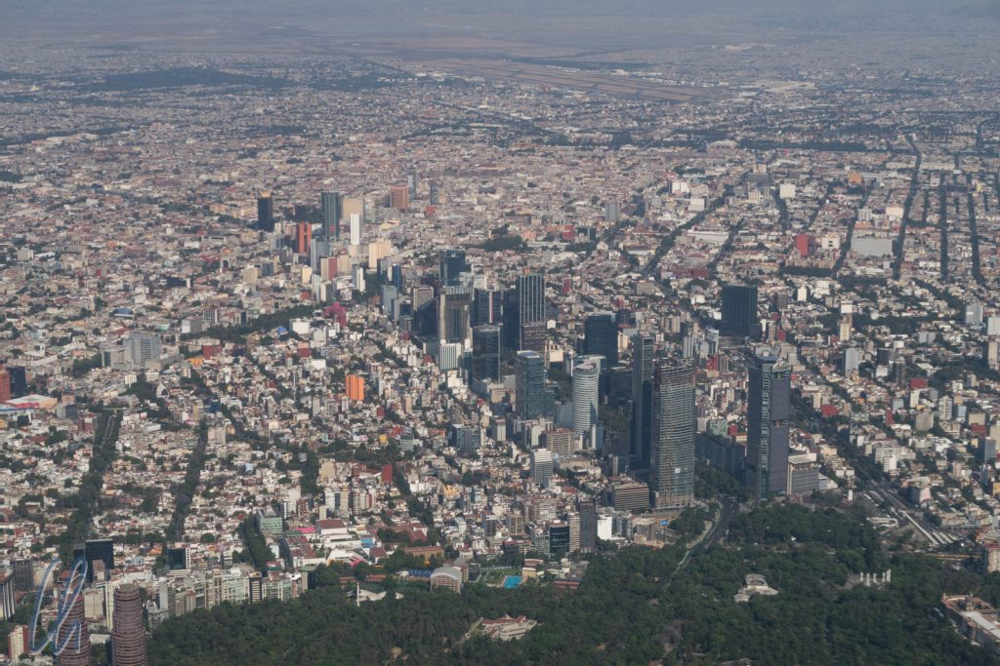
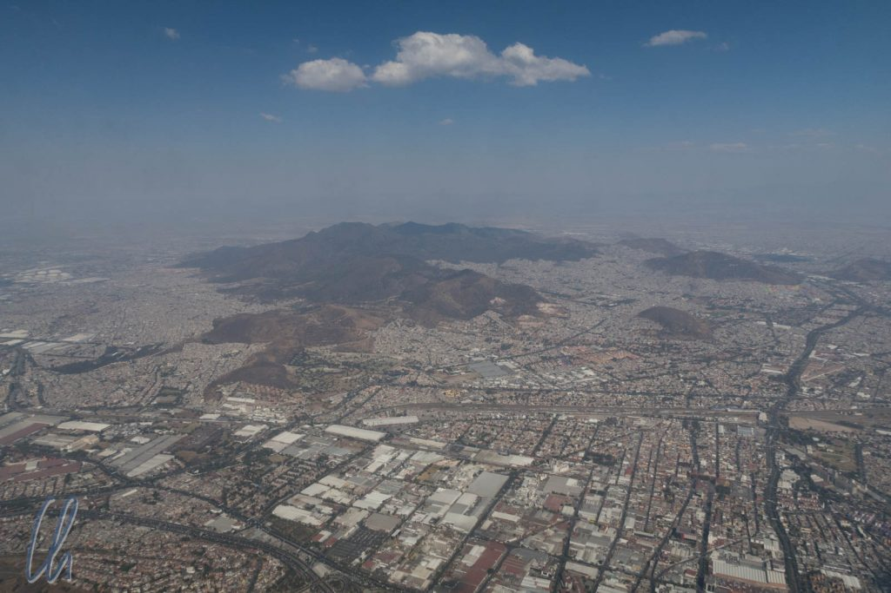
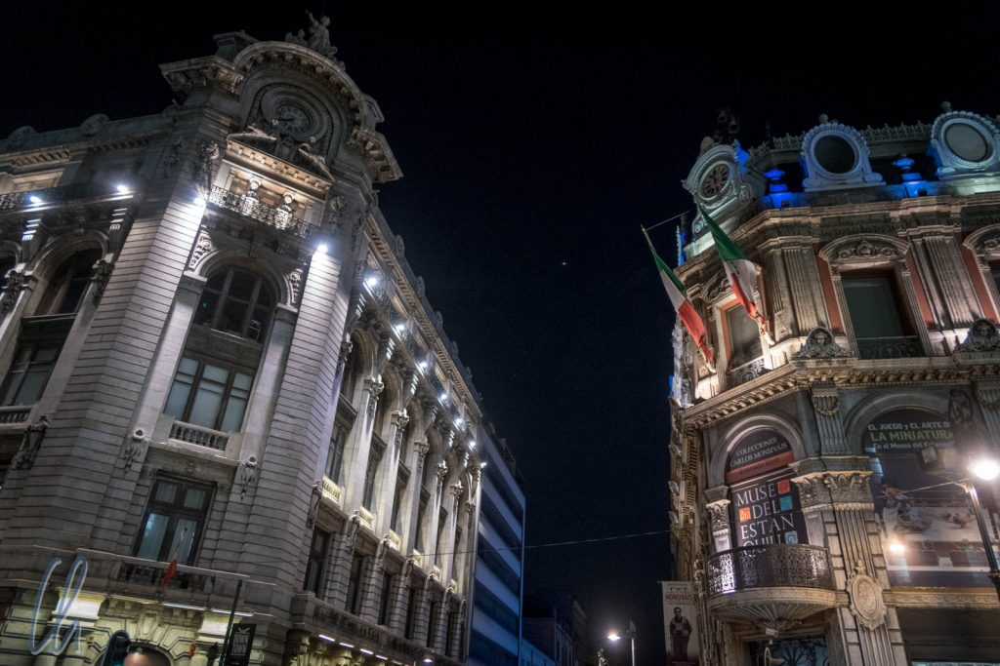
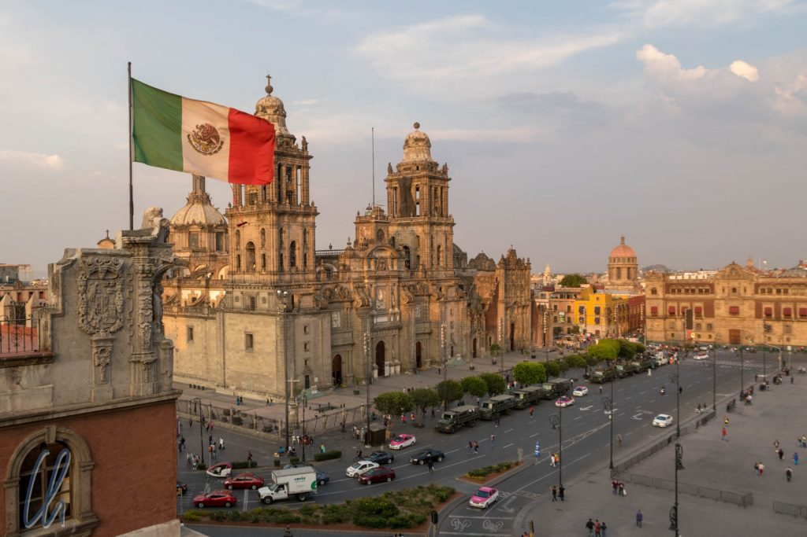

Von Los Cabos an der Südspitze der Baja California flogen wir nach Mexiko City, um die Hauptstadt Mexikos kennenzulernen. Mexiko City ist nicht nur die moderne Hauptstadt des Landes. Der Ort, wo heute Millionen von Menschen leben, war auch der Ausgangspunkt der Kolonialisierung Lateinamerikas und in präkolumbianischer Zeit befand sich dort [Tenochtitlan](https://de.wikipedia.org/wiki/Tenochtitlan), die Hautstadt des Aztekenreiches.

<!--more-->

## Unsere ersten Eindrücke

Mexiko City ist riesig und liegt in einem Hochtal auf ca. 2200 Metern. Wie auf dem folgenden Bild zu erahnen ist, wirkt die Stadt von oben wie ein riesiger Teppich aus Häusern, der bis an die angrenzenden Hügel reicht. Erbaut wurde die Stadt auf dem trockengelegten [Texcoco-See](https://de.wikipedia.org/wiki/Texcoco-See), der keinen sehr stabilen Baugrund abgibt. Das sieht man vielen schweren kolonialen Gebäuden an: Die Außenmauern stehen etwas schief, wenn ein Teil des Bauwerkes abgesunken ist, die Fassaden zeigen Risse und innen wirkt der Fußboden abstrus schräg. Vermutlich ist dies auch der Grund, warum es nur wenige Hochhäuser gibt.

Vom Flughafen mitten in der Stadt erreichten wir das Zentrum zügig in einem Taxi, die Rushhour war nicht so ausgeprägt wie befürchtet. Sowohl im Auto als auch zu Fuß unterwegs in der Stadt auf einem ersten Rundgang fiel uns sofort die massive Polizeipräsenz auf. In der Innenstadt stand an jeder Ecke ein Polizist, entweder nur zur Überwachung oder zur Regelung des Verkehrs. Außerdem waren viele Fenster vergittert und private Sicherheitsdienste ergänzten die Polizeipräsenz. Zur Unrechtsbekämpfung wird offensichtlich stark auf Abschreckung gesetzt.

Trotzdem gefiel uns Mexiko City auf den ersten Blick sehr gut, wir hatten eine gesichtslosere Stadt erwartet. Außerhalb des Zentrums lagen einige Viertel mit bunten, niedrigen Häusern. Die Innenstadt erinnerte uns teils an Paris, teils an südspanische Städte mit ihren 4- bis 5-stöckigen Häusern. Außerdem gab es beeindruckende Prachtbauten, zum Beispiel den Palacio de Bellas Artes (außen Jugendstil, innen reinster Art Deco), und natürlich den [Zócalo](<https://de.wikipedia.org/wiki/Plaza_de_la_Constituci%C3%B3n_(Mexiko-Stadt)>), den Hauptplatz und zweitgrößten Platz der Welt mit seinen angrenzenden Sehenswürdigkeiten.

## Die Spuren von Tenochtitlan

Eine dieser Sehenswürdigkeiten ist der [Templo Mayor](https://de.wikipedia.org/wiki/Templo_Mayor), das Herz des Tempelbezirkes von Tenochtitlan. Nicht nur die Funde an sich sind interessant, sondern auch ihre Lage. Nach dem Sieg der Spanier über die Azteken 1521 begannen die Kolonialisatoren, Kirchen, Paläste und Wohnhäuser über den Bauwerken der Azteken zu errichten. Seit 1978 wird der Templo Mayor systematisch freigelegt. Sogar einige Regierungsgebäude wurden zu diesem Zwecke abgerissen. Die archäologische Ausgrabungsstätte liegt im Zentrum, direkt neben dem Zócalo und der [Kathedrale](https://de.wikipedia.org/wiki/Kathedrale_von_Mexiko-Stadt) von Mexiko City. Einige der antiken Gebäude befinden sich auch unter dem sakralen Bauwerk.

Vermutlich ist es einzigartig auf dieser Welt, dass mitten im Zentrum einer Großstadt eine Fläche von ungefähr 2 Blocks nicht bebaut ist, sondern dass dort die Überreste einer vor circa 500 Jahren untergegangenen Hauptstadt zu sehen sind. Bei der Besichtigung des Templo Mayor kann man die Ausgrabungsstätte begehen und das sehenswerte angeschlossene Museum mit einer Ausstellung der Fundstücke besuchen.

## Das Anthropologische Museum in Mexiko City

Ein weiteres extrem sehenswertes Museum ist das [Anthropologische Museum](http://www.mna.inah.gob.mx/) in Mexiko City, welches nicht nur Erkenntnisse über die [Azteken](https://de.wikipedia.org/wiki/Azteken), sondern auch über andere vorangegangene Hochkulturen des heutigen Mexiko vermittelt und entsprechende, teils sehr kunstvolle und beeindruckende Fundstücke zeigt. Am bekanntesten sind sicher die [Maya](https://de.wikipedia.org/wiki/Maya). Direkt vor den Toren Mexiko Cities befand sich die Hauptstadt einer weiteren sehr alten und bedeutenden Kultur: Teotihuacan. Darüber werden wir im nächsten Beitrag berichten (Link folgt sobald veröffentlicht). Außerdem gibt es im Museum Ausstellungen über [Tolteken](https://de.wikipedia.org/wiki/Tolteken), [Mixteken](https://de.wikipedia.org/wiki/Mixteken) und einige weitere Völker. So konnten wir uns ein paar Grundlagen für die Besuche verschiedener archäologischer Stätten in den kommenden Tagen und Wochen aneignen.

Beim Besuch des Anthropologischen Museums gefiel uns die Präsentation der Exponate sehr gut, die den archäologischen Ausstellungsstücken Leben einhaucht. Dort stehen nicht nur verstaubte Keramiken, bröckelnde alte Steine oder verblichene wissenschaftliche Hinweisschilder herum. Einige bedeutende Originale, zum Beispiel die Jade-Totenmaske des Maya-Herrschers von Palenque, [Pakal](https://de.wikipedia.org/wiki/K%27inich_Janaab_Pakal_I.), wird aufwändig in Szene gesetzt, in diesem Fall in einer originalgetreuen Rekonstruktion seiner Grabstätte.

Sogar Nachbauten historischer Gebäude kann man im Garten des Museums begehen. Darin bewunderten wir auch Kopien prächtiger Wandbemalungen, von denen man in den Originaltempeln nur Überreste sehen kann, so sie denn überhaupt zugänglich sind. Wieder andere Exponate sind als Repliken ohne Glaskasten ausgestellt, damit man Details besser erfassen kann. Es geht zwar nichts über das Original, dennoch gab uns diese anschauliche Präsentationsform einen geradezu plastischen Einblick in die Welt der präkolumbianischen Hochkulturen.

## Stadtrundgang in Mexiko City

In Mexiko City gab es nicht nur Präkolumbianisches zu sehen, sondern auch koloniale und moderne Kultur und Architektur. Die gewaltige Kathedrale am Zócalo ist eines der zahlreichen prachtvollen Gebäude, die die Spanier hinterlassen haben. Im Gotteshaus selbst erinnert der deutlich abschüssige Fußboden aber trotzdem auch an Tenochtitlan, das von den Azteken auf einer sumpfigen Insel im inzwischen trockengelegten Texcoco-See gegründet worden war.

Die wohl bekannteste Malerin Mexikos ist [Frida Kahlo](https://de.wikipedia.org/wiki/Frida_Kahlo), in deren Wohn- und Elternhaus, dem sogenannten „Blauen Haus“ („Casa Azul“) ein Museum eingerichtet worden ist. Bei der Besichtigung erfährt man viel über das bewegte und aufgrund der Folgen eines schweren Unfalls qualvolle Leben der emanzipierten Künstlerin, Nationalistin und Marxistin. Einige ihrer Werke sind ausgestellt, ebenso wie historische Fotografien, ihre Sammlung religiöser Votivbilder, Dinge des täglichen Lebens, und man kann die Räumlichkeiten ihres Heims betreten. Spannend war auch eine Sonderausstellung ihrer Kleidung. Sie trug als eines ihrer Markenzeichen und vermutlich auch als Hinweis auf ihre nationale Gesinnung stets die traditionelle Tracht der Frauen aus Oaxaca.

Keine Besichtigung von Mexiko City ist vollständig ohne einen Besuch der modernen [Wandgemälde](https://de.wikipedia.org/wiki/Muralismo) (auf Spanisch "Murales") von [Diego Rivera](https://de.wikipedia.org/wiki/Diego_Rivera), Frida Kahlos Ehemann. Seine Kunstwerke schmücken zahlreiche öffentliche Gebäude. Am berühmtesten (oder nur am meisten besucht?) sind seine Arbeiten im [Palacio Nacional](<https://de.wikipedia.org/wiki/Palacio_Nacional_(Mexiko)>). Dort ist ein Treppenhaus mit einem Resümee der Geschichte Mexikos ausgeschmückt, keine bedeutende historische Persönlichkeit fehlt. Auch ein Bildnis Frida Kahlos hat Eingang in das Wandgemälde gefunden. Interessanterweise ist auch Karl Marx und der Kampf der Arbeiter und Bauern dargestellt, was zwar die politischen Überzeugungen von Rivera widerspiegelte, bestimmt aber nicht die seiner Auftraggeber.

Ein anderer, von außen vergleichsweise unscheinbarer architektonischer Schatz ist das Hauptpostamt der Stadt. Der spanische Name "Palacio Postal" trifft den Nagel auf den Kopf. Bei einem so reich verzierten Postgebäude bekommt man richtig Lust, mal wieder eine Postkarte statt einer WhatsApp zu schreiben ;)

"Geht ins Ohr, bleibt im Kopf." Dieses Zitat könnten wir in Mexiko City sinnvoll [falsch zuordnen](https://www.youtube.com/watch?v=NzR93cgMhOc). Eines der typischen Geräusche auf den Straßen der Altstadt waren die Drehorgelspieler, die auf dem Zócalo, am Templo Mayor und scheinbar auch sonst an jeder Ecke in der Innenstadt die gleiche Melodie spielten. Nach einiger Zeit hörten wir die Musik auch, wenn gerade keine Drehorgel in Hörreichweite war ;) - aber lauscht selbst!

https://www.youtube.com/watch?v=q1bzsxJw8bk

## Die Jungfrau von Guadalupe

Das heutige Lateinamerika ist sehr stark katholisch geprägt und eine der wichtigsten Objekte der Heiligenverehrung ist die [Virgen de Guadalupe](https://de.wikipedia.org/wiki/Unsere_Liebe_Frau_von_Guadalupe). Die zu ihren Ehren gebaute Kirche, die Basílica de Santa María de Guadalupe, ist der bedeutendste Wallfahrtsort in Lateinamerika. Aufgrund des großen Ansturms von Pilgern wurde in den 70er Jahren ein neues Gotteshaus in modernem Stil errichtet, in der anscheinend dauerhaft eine Messe stattfindet. Als wir ankamen, waren alle Außentüren der runden Kirche geöffnet und die Gläubigen standen auch noch auf dem Platz vor dem religiösen Bauwerk. Daher besuchten wir zunächst die anderen Sehenswürdigkeiten des weitläufigen Geländes: Es gab mehrere Kirchen und ein Museum mit sakralen Gegenständen und Kunstwerken zu sehen.

Welche Geschichte begründet die Verehrung der Virgen de Guadalupe? Im Jahre 1531 erschien dem Indio [Juan Diego Cuauhtlatoatzin](https://de.wikipedia.org/wiki/Juan_Diego) im Stadtviertel Guadalupe die Jungfrau Maria. Sie beauftragte ihn, den Bischof aufzufordern, eine Kapelle auf dem Berg der Erscheinung zu bauen. Der kirchliche Würdenträger glaubte ihm jedoch nicht und forderte ein Zeichen. Daraufhin erschien die heilige Maria erneut (insgesamt viermal) und bat Juan Diego, mitten im Winter auf dem nahe gelegenen Berg blühende Rosen zu pflücken. Der Indio sammelte die duftenden frischen Blüten in seinem Mantel. Als er diesen vor dem Diener Gottes ausbreitete, erschien darauf das Abbild der Jungfrau. Dieses Wunder überzeugte nicht nur den Bischof, so dass zunächst eine Kapelle errichtet wurde, sondern auch Millionen von Indios, die sich in den folgenden Jahren zum Christentum bekehrten. Die Virgen de Guadalupe wird bis heute nicht nur in Mexiko, sondern auch in anderen Ländern Lateinamerikas angebetet.

Am Ende unseres Besuches war die Besucherzahl des Dauergottesdienst etwas abgeebbt, so dass wir die Basilica betreten konnten, auf der Suche nach dem Allerheiligsten, dem Umhang von Juan Diego mit dem Abbild der heiligen Maria. Im Bereich hinter dem Altar wirkte die moderne Kirche eher wie ein kleines Einkaufszentrum, in dem man Andenken und Devotionalien erstehen konnte. Dort gab es aber auch einen eher nüchtern gehaltenen Eingang, der zu einem Laufband führte. Das Förderband soll dafür sorgen, dass es vor dem Gnadenbild der Jungfrau keinen Stau gibt - und tatsächlich, da war sie, die Virgen de Guadalupe.

https://www.youtube.com/watch?v=7wB5ieyBvGs

## Die Metro von Mexiko City

Die [Metro](https://de.wikipedia.org/wiki/U-Bahn_Mexiko-Stadt) in Mexiko City war für uns das öffentliche Verkehrsmittel der Wahl, da sie zuverlässig und günstig ist (5 Peso pro Fahrt, entspricht ca. 25 Euro Cent), regelmäßig fährt, und im Gegensatz zu den Bussen nicht im Verkehr stecken bleiben kann. Eine unserer Busfahrten verlängerte sich verkehrsbedingt von 30 auf 90 Minuten... Die Metro ist zwar nicht wirklich schnell, aber trotzdem am schnellsten, da sie immer freie Fahrt hat. Interessanterweise fährt sie nicht auf Schienen, sondern auf Gummireifen, laut Wikipedia angeblich, um eine erschütterungsfreie Fahrt zu gewährleisten. In ihrer Anlage erinnert sie etwas an das U-Bahnsystem in Berlin, da sie auch hier aufgrund des hohen Grundwasserspiegels nur gerade so tief unter der Erde ist, wie eben notwendig.

Trotzdem wird die Metro anscheinend nicht von Menschen aller Schichten genutzt. Anzugträger oder feine Kleider sind in der Untergrundbahn eher selten. Stattdessen fährt hauptsächlich das normale Volk mit. Zuweilen wird Mariachi gespielt, um eine Spende zu erbitten, oder religiöse Missionierungsansprachen werden vorgetragen. Häufiger gehen Verkäuferinnen oder Verkäufer durch die Waggons, um Hundeleinen, Süßigkeiten, religiöse Schriften, Desinfektionsmittel oder Kaugummi zum Einheitspreis von 10 Pesos zu verkaufen.

Die Metro ist damit ein eher raues Pflaster: Während der Stoßzeiten recht eng, nur durch den Fahrtwind klimatisiert, sie ist laut und ruckelig (von wegen erschütterungsfrei), nicht dreckig, aber auf keinen Fall auf Hochglanz poliert. Bei Fahrten mit öffentlichen Verkehrsmitteln wird immer wieder vor Taschendiebstahl gewarnt - zu Recht wie wir an unserem letzten Tag in Mexico City leider feststellen mussten. Vermutlich im Gedrängel beim Einsteigen auf unserer letzten Fahrt (schockierenderweise auf dem Rückweg von unserer Wallfahrt zur Jungfrau von Guadalupe!) wechselte unser Portemonnaie ungeplant den Besitzer. Viel hat es dem Dieb nicht gebracht, es waren nur noch ca. 300 Peso (umgerechnet etwa 13 Euro) übrig. Uns bescherte dieser Zwischenfall leider etwas Ärger, da (selbst Schuld) auch eine Kreditkarte darin war.

## Eine beeindruckende Stadt

Was Mexiko City anbetrifft hatte unser Reiseführer nicht zu viel versprochen. Die Stadt ist sehr aufregend und abwechslungsreich. Wir lernten viel über die Jahrhunderte alte Geschichte, tanzten zu „[Cielito Lindo](https://www.youtube.com/watch?v=YywnlQpSdEc)“, der Mariachi-Hymne Mexikos, auf der Plaza Garibaldi, aßen fantastisches mexikanisches Essen, erlebten 2 Stunden lang Energie pur auf der Bühne des [Ballet Folklórico](http://www.balletfolkloricodemexico.com.mx/) im wunderschönen Palacio de Bellas Artes (klingt touristisch, ist aber authentisch!) und wurden in der Metro beklaut - man könnte meinen wir hätten alles mitgenommen ;)

Auch wenn man jetzt das Vorurteil bestätigt sehen könnte, dass Mexiko City ein gefährliches Pflaster ist, so sind wir doch eher durch eigene Nachlässigkeit Opfer geworden. Ohne die Kreditkarte im Portemonnaie hätten wir es schnell abhaken können - das soll uns eine Lehre sein! Auf der anderen Seite haben uns viele Menschen (auch in der Metro) sehr nett und zuvorkommend geholfen. Zum Beispiel sprach uns auf dem Weg ins Anthropologische Museum in der Metro-Endstation eine ältere Dame an und fragte, ob wir ins Museum wollten (sonst verirren sich wohl keine Touristen hierher?). Wir bejahten und sie machte uns darauf aufmerksam, dass der Ausgang, auf den wir zusteuerten, in der falschen Richtung lag. Sehr freundlich und aufmerksam. Muchas Gracias!

Auch wenn wir für die Einheimischen als Ausländer erkennbar waren, hatten wir doch im Vergleich zur Baja California eher das Gefühl, in der Großstadt nicht ständig eine erhöhte Aufmerksamkeit auf uns zu ziehen. In vielen Restaurants waren wir die einzigen Ausländer, die Kirchen besuchten mehr Gläubige als Touristen und selbst in den Museen herrschte ein ausgewogenes Gleichgewicht zwischen Mexikanern und Gästen. Es gefällt uns immer gut, wenn die Attraktionen vor allem für die Einheimischen da sind und wenn man nicht hauptsächlich Touristen begegnet. Wie so oft war am Ende die Zeit viel zu kurz. Statt 5 Tagen wären 5 Wochen angemessener gewesen, um Mexiko City erschöpfend zu erkunden.
