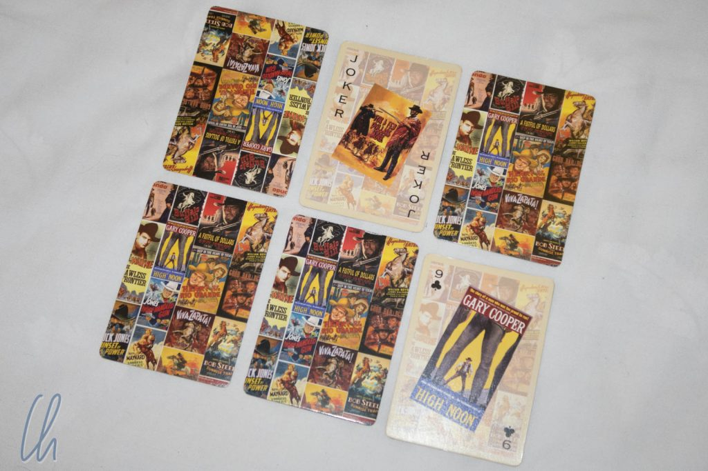
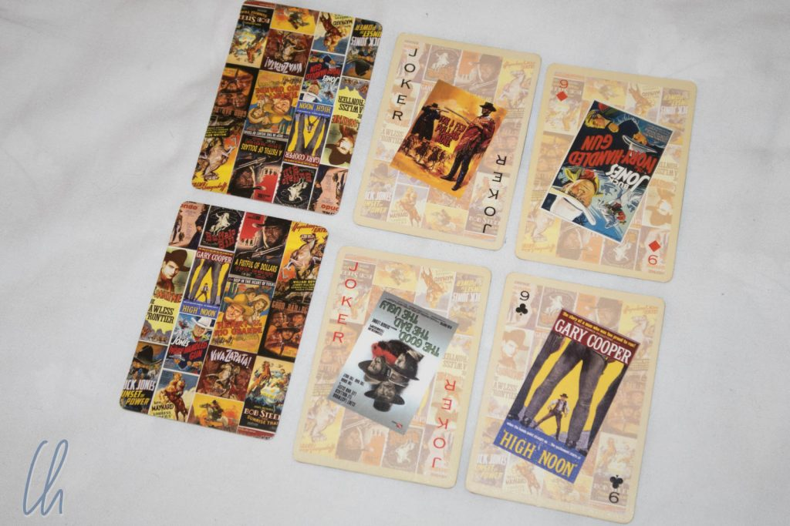

Ähnlich wie in Neuseeland absolvierten wir auch in den USA kein Besichtigungsprogramm. Dafür besuchten wir Mary-Alice, Marie und trafen viele andere aus dem Familienclan - schließlich gab es Marie's 92. Geburtstag zu feiern! Außerdem war es für uns an der Zeit, uns ein paar Ideen anzulesen, was wir in Lateinamerika würden anstellen wollen. Als willkommene Abwechslung zum Studium der Reiseführer spielten wir wie üblich in Kalifornien viel Karten. Am häufigsten droschen wir „Six“ und „Spite and Malice“, die sogar zu zweit gut funktionieren. Dieser Post ist ein Mitmach-Post: Unten erklären wir die Regeln der beiden Spiele. Viel Spaß beim Ausprobieren!

<!--more-->

## Six - für jeden Spieler 6 Karten

Für „Six“ benötigt man einen vollen Kartensatz mit Jokern (also von 2 bis Ass mit zwei Jokern, 54 Karten). Das Ziel des Spieles ist es, wie so oft, möglichst wenig Punkte zu kassieren. Gespielt wird bis ein Spieler nach mehreren Partien 100 Punkte oder mehr akkumuliert hat. Dieses Spiel kann mit bis zu 4-5 Personen gespielt werden.

Jeder Spieler bekommt sechs Karten, die er verdeckt in zwei Reihen mit je drei Karten vor sich legt. Dann muss er zwei beliebige Karten aufdecken. Anschließend zieht man reihum entweder vom verdeckten Stapel mit den restlichen Karten oder nimmt die Karte auf, die der vorherige Spieler abgeworfen hat. Mit dieser neuen Karte tauscht man entweder eine verdeckte oder offene Karte der eigenen, vor einem liegenden sechs Karten aus. Die ausgetauschte Karte wird abgeworfen, die neu erhaltene Karte legt der Spieler aufgedeckt an den leeren Platz vor sich. Alternativ kann auch einfach die gezogene Karte wieder abgeworfen werden (d.h. kein Kartentausch), wenn diese nicht zu den eigenen Karten passt oder zu viele Punkte zählt.

Welche Karten sind nun gut, welche schlecht? Pauschal gesagt sind niedrige Karten besser als hohe Karten. Es wird folgendermaßen gezählt: Joker minus 2, König minus 1, Ass ein Punkt. Bei Zahlen-Karten gilt der Wert der Ziffer. Buben und Damen schlagen mit 10 Punkten zu Buche. Kann man zwei identische Karten übereinander zu legen (z.B. zwei Buben oder zwei Siebenen), ist das sehr gut: Sie heben sich bei der Abrechnung auf, zählen also in Summe 0 Punkte. Vorsicht, das gilt auch für negativ zählende Karten, zwei Joker übereinander zählen nicht minus 4, sondern 0 Punkte.

Eine Partie endet, sobald der erste Spieler alle sechs Karten vor sich aufgedeckt hat. Alle anderen Spieler dürfen noch einmal ziehen und Karten tauschen (wenn sie passende Karten ziehen), aber nicht mehr die Karte des Vorgängers aufnehmen. Ist diese letzte Runde beendet, wird abgerechnet. Dann beginnt die nächste Partie. Das Spiel endet, wenn ein Spieler die 100-Punkte-Marke erreicht oder durchbrochen hat. Gewonnen hat der Spieler mit der geringsten Anzahl an Punkten.

## Spite and Malice - Vorbereitung

Ziel des Spiels „[Spite and Malice](https://en.wikipedia.org/wiki/Spite_and_Malice)“ ist es, alle Karten seines Hauptkartenstapels loszuwerden, indem man diese auf maximal vier gemeinsame Stapel in der Mitte des Tisches ablegt und dabei die aufsteigende Reihenfolge der Karten beachtet (Ass, 2 bis 10, Bube, Dame, König). Gespielt wird mit zwei oder drei Spielern. Wenn das noch etwas kryptisch klingt: kein Problem, hier kommen die Regeln ;).

„Spite and Malice“ wird mit zwei Kartenspielen mit vollem Kartensatz und Jokern gespielt, also 108 Karten. Das Austeilen der Karten ist etwas speziell, dies soll ein flüssigeres Spiel ermöglichen. Zunächst werden die Joker aussortiert. Anschließend wird die erste Charge ausgeteilt. Diese Karten werden nicht aufgenommen, sondern nur auf einen Stapel (den "Hauptkartenstapel") vor jeden Spieler gelegt. Bei zwei Spielern erhält jeder 26 Karten, bei 3 Spielern 17 Karten. Nun werden die Joker in die verbleibenden Karten gemischt. Jeder Spieler erhält fünf weitere Karten, die aufgenommen werden und die „Hand“ bilden. Die restlichen Karten ergeben den Stapel zum Kartenziehen für alle.

## Spite and Malice - Das Spiel beginnt

Jeder Spieler deckt nun die erste Karte seines Hauptkartenstapels auf und ein Spieler beginnt, z.B. der jüngste, der älteste, der Verlierer der vorherigen Partie… Jeder Spieler führt pro Zug immer 3 Schritte in dieser festgelegten Reihenfolge aus: „Draw“ (Karte(n) ziehen), „Meld“ (Karte(n) ausspielen) und „Discard“ eine Karte ablegen.

Der erste Schritt („Draw“) ist der einfachste: Wenn man weniger als fünf Karten auf der Hand hat, zieht man so viele Karten, bis man wieder fünf Stück hat (d.h. man zieht in der ersten Runde nicht, weil man initial fünf Karten bekommen hat). Dabei sind die Karten der Hand für die anderen Spieler nicht sichtbar, die aufgedeckte Karte des Hauptkartenstapels schon.

## Spite and Malice - The Meld

Beim „Meld“ geht es ans Eingemachte, jetzt werden die Karten - wenn möglich - ausgespielt. Beim Ablegen der Karten bedient man sich bevorzugt der offenen Karte des Hauptkartenstapels, schließlich muss man diesen Stapel abarbeiten, um zu gewinnen. Ist es gelungen, eine Karte loszuwerden, kann gleich die nächste Karte aufgedeckt und, wenn möglich, gespielt werden. Die Karten auf der Hand (für die anderen Spieler nicht einsehbar) oder auf den persönlichen Ablagestapeln (wird unten bei „Discard“ erklärt) dienen einzig dazu, das Ausspielen der Karten des Hauptkartenstapels zu ermöglichen.

Zum Ablegen der Karten dürfen maximal vier Stapel (für alle Spieler gemeinsam) gebildet werden. Hat man ein Ass auf der Hand und gibt es weniger als vier Stapel, so muss dieses zwingend gespielt werden, um einen neuen gemeinsamen Stapel zu eröffnen.

Mit einem Ass auf der Hand startet man also einen neuen gemeinsamen Ablagestapel. Hat man zusätzlich eine 2 (auf dem eigenen Stapel, auf der Hand oder auf einem persönlichen Ablagestapel), so legt man diese auf das Ass, dann eine 3, 4, 5 etc. Joker können alle Karten ersetzen außer einem Ass. Wenn ein Stapel vollständig ist, d.h. ein König zuoberst liegt, wird dieser gemischt und abdeckt unter den Nachziehstapel gelegt. Auf diese Weise kommen immer wieder brauchbare Karten ins Spiel.

Es ist also gut, wenn man möglichst viele Karten ausspielen kann, um sich den Weg zu bereiten, die Karten vom eigenen, entscheidenden Hauptkartenstapel zu spielen. Außerdem kann man dann in der nächsten Runde mehr (hoffentlich gute) Karten für die Hand ziehen, wenn man viel ausspielen konnte. Ist es gelungen, in einer Runde sogar alle fünf Karten von der Hand ausspielen, bekommt man fünf neue und kann direkt weiter ablegen. Aber Vorsicht: Man sollte auch immer die aufgedeckten Karten der Mitspieler im Auge behalten, um den Gegnern keine Vorteile zu verschaffen. Schließlich heißt das Spiel „Spite and Malice“. Man darf sich auch durchaus gegen einen der Spieler verbünden.

## Spite and Malice - The Discard

Hat man alle möglichen Karten gespielt - hoffentlich auch einige vom eigenen Hauptkartenstapel, folgt der letzte Schritt: „Discard“. Jeder Spieler muss eine Karte abwerfen. Hierzu darf man maximal vier persönliche Ablagestapel bilden, die man offen vor sich hinlegt und von denen man sich in der nächsten „Meld“-Phase wieder bedienen kann. (Allerdings jeweils nur die oben liegenden Karten.) Es macht also Sinn, seine Ablagestapel entweder in umgekehrter Reihenfolge anzuordnen (d.h. die Karten mit dem höchsten Wert zuerst abzulegen, um evtl. beim nächsten Zug in Serie ausspielen zu können) oder Karten eines Wertes (z.B. mehrere Damen) zu sammeln. Im Gegensatz zu den fünf Karten auf der Hand sind die persönlichen Ablagestapel für die Mitspieler sichtbar.

Nach dem Ablegen („Discard“) ist der nächste Spieler mit den drei erläuterten Schritten an der Reihe: „Draw“, „Meld“, „Discard“. Das Spiel endet, wenn ein Spieler alle Karten seines Hauptkartenstapels hat loswerden können. Möchte man um Punkte spielen, zählt man einfach die verbleibenden Karten des Hauptstapels des/der Verlierer (eine Karte, ein Punkt). Die Karten, die auf der Hand oder den persönlichen Ablagestapeln verblieben sind, werden dabei nicht mitgerechnet. Wer die wenigsten Punkte hat gewinnt.

Hoffentlich konnten wir die Regeln verständlich machen! Wenn nicht, hinterlasst einfach einen Kommentar und wir bessern nach ;). Viel Spaß beim Zocken!
