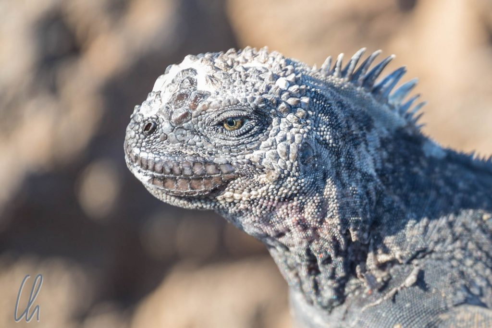

# Galapagos, die verwunschenen Inseln

Nach unserem Puffertag in [Quito](http://wittmann-tours.de/erste-eindruecke-aus-ecuador/) war unsere erste echte Station in Ecuador die Galapagos-Inselgruppe. Auf den Spuren von Charles Darwin heuerten wir zusammen mit 11 weiteren Passagieren (Edna & Ned, Carolyn & Brian, Simon, Karin & Dietrich, Amy & Bob, Natalia & Chris) auf dem Schooner Beagle an - die Wilde 13 von Galapagos ;). Der Kurs führte uns für eine Woche auf einer südöstlichen Route zu verschiedenen Vulkaninseln des Archipels und ihren tierischen Bewohnern.

<!--more-->

## Faszination Galapagos

Was genau macht die Faszination der Galapagos-Inseln aus? Es sind keine tropischen Inselparadiese, obwohl sie am Äquator liegen. Stattdessen wirken sie eher karg, vulkanisch und es mischt sich nur wenig grün ins Landschaftsbild. Galapagos weist außerdem keine große Biodiversität auf (kein Vergleich z.B. mit einem Regenwald). Man findet auch nicht die spannenden Säugetiere, die man auf Safari in Afrika oder im Dschungel beobachten kann (Löwen, Elefanten, Affen etc.). Die Tiere, die es gibt, sind jedoch sehr interessant, einzigartig, seltsam und teilweise auch ungemein unterhaltsam. Man sieht nicht nur bizarr anmutende Tiere wie Riesenschildkröten oder verblüffend große Leguane (Iguanas), die an Mini-Drachen erinnern, sondern auch neugierige und verspielte Seelöwen und lustige Blaufußtölpel (Blue-footed Boobies).

Viele der dort heimischen Spezies kommen ausschließlich auf den Galapagos-Inseln vor, auf manchen Eilanden haben sich speziell an die dortigen Bedingungen angepasste Unterarten entwickelt. Der Besuch der Inselgruppe 1835 veranlasste [Charles Darwin](https://de.wikipedia.org/wiki/Charles_Darwin), seine Evolutionstheorie aufzustellen.

Außerdem ist das Verhalten der Tiere bemerkenswert. Schon nach kurzer Zeit auf den Galapagos-Inseln merkten wir, dass der ehemalige Name "Islas Encantadas" ("Die verwunschenen Inseln"), viel besser passt. Die Tiere verhalten sich, als hätte der Sündenfall nicht stattgefunden, als gäbe es keine Räuber. Sie sind überhaupt nicht scheu. Vögel flogen zum Beispiel nicht weg, wenn wir uns ihnen nähern. Am Dock, von dem aus wir mit einem Dinghy zur Beagle übersetzten, schlief seelenruhig ein Seelöwe auf einer Bank und schnarchte gelassen vor sich hin. Er ließ sich auch nicht von mehr oder weniger großen Gruppen von Touristen stören, die ihn umringten, sich über ihn belustigten oder ihn knipsten.

Damit die Fauna so furchtlos bleibt und es nicht zu einer für beide Seiten unangenehmen Begegnung kommt, lautet die offizielle Regel, dass man mindestens zwei Meter Abstand halten soll. Die Tiere kannten allerdings offensichtlich diese Bestimmung nicht, da sie uns des Öfteren aus freien Stücken wesentlich näher kamen.

## Charles-Darwin-Forschungsstation

Bevor wir in See stachen, besuchten wir die [Charles-Darwin-Forschungsstation](https://de.wikipedia.org/wiki/Charles_Darwin_Foundation) auf der Insel Santa Cruz. Dort bekamen wir einen kleinen Vorgeschmack auf das, was uns in den kommenden Tagen erwarten würde und gewannen einen Einblick in das Schildkrötenzuchtprogramm.

Die Schildkröten, genauer gesagt die Form ihres Panzers, ist namensgebend für Galapagos. Auf spanisch bedeutet "galapagos" "Wulstsattel", aha ;). Bei einigen Riesenschildkrötenarten ist der Nackenbereich wie ein traditioneller Sattel aufgewölbt. - Naja, „die verwunschenen Inseln“ hören sich für unsere Ohren wesentlich besser an! Zwei Landschildkrötenarten (von den Inseln Floreana und Pinta) sind mittlerweile ausgestorben. Sie waren wohl eine zu leichte Beute für Walfänger, Piraten und die ersten Siedler. Ein fast schon dramatisches Ende nahm die Art der Pinta-Riesenschildkröten, deren letzter Vertreter [Lonesome George](https://de.wikipedia.org/wiki/Lonesome_George) war.

Lonesome George verbrachte viele Jahre in der Charles-Darwin-Forschungsstation, alle Paarungsversuche scheiterten jedoch und so starb er am 24. Juni 2012 im Alter von etwa 100 Jahren und mit ihm die letzte Pinta-Riesenschildkröte. Wesentlich produktiver war [Super-Diego](https://www.galapagosislands.com/blog/super-diego-the-second-most-famous-tortoise-in-galapagos/), der seinen Namen seiner Herkunft aus dem Zoo in San Diego verdankt. Als das Aussterben der Española-Riesenschildkröten drohte, wurde weltweit nach Schildkröten dieser Art gesucht. So stieß man auf Diego. Seit seiner Rückkehr nach Galapagos im Jahre 1977 ist Diego im Rahmen des Schildkröten-Zuchtprogramms ungefähr 800mal Schildkröten-Vater geworden und das mit über 100 Jahren! So bekam er dann den Spitznamen Super-Diego. ;)

## Wir lernten Galapagos per Schiff kennen

Für uns war es eigentlich keine Frage, wir wollten Galapagos mit dem Schiff erkunden. Tagesausflüge sind von den drei bewohnten Inseln aus zwar möglich, aber mit langen Transferzeiten verbunden und nur zu ausgewählten Zielen möglich, vom zusätzlichen Organisationsaufwand ganz zu schweigen. An Bord eines Schiffes sieht man einfach mehr. Außerdem trafen wir immer wieder auf interessante Meeresbewohner. Von Deck aus entdeckten wir immer mal wieder Meeresschildkröten, Rochen, Haie oder [Mola Molas](https://de.wikipedia.org/wiki/Mondfisch). Einmal begleiteten uns Delphine ein Stück auf unserer Fahrt. In klaren Nächten konnten wir die Sterne bewundern und bei wenig Wellengang die Biolumineszenz im Wasser.

Die Tage verliefen ungefähr so: Frühstück gab es um 6:30 oder 7 Uhr, morgens und nachmittags je eine oder zwei Aktivitäten, also ein Spaziergang auf einer Insel und/oder Schnorcheln (oder Kajakfahren). Mittagessen wurde um 12 und Abendessen gegen 7 Uhr nach dem Briefing für den nächsten Tag serviert. Nachts fuhr die Beagle oft schon weiter zur nächsten Insel. Das sparte natürlich Zeit, bedeutete aber auch die eine oder andere schaukelige Nacht (je nach Seegang) in unserer Kajüte. In der ersten Nacht starteten die Motoren gegen 1:30 Uhr morgens, so dass wir die Insel Floreana um 6:00 Uhr erreichten. Die Segel setzten wir leider nur einmal als zusätzliche Unterstützung der Maschine.

Das hört sich nicht nur wie ein Vollzeitjob für uns Besucher an, erst recht war die Besatzung quasi rund um die Uhr beschäftigt. Unser Guide Harry begleitete die Gruppe bei allen Aktivitäten und sorgte dafür, dass wir stets bestens informiert waren. Washington, der Kapitän, steuerte die Beagle. Unterstützt wurde er von Fausto, dem ersten Offizier, der in der Regel das Dinghy fuhr. Triki war Mädchen - oder besser Junge - für alles an Bord und Fernando sorgte hervorragend für unser leibliches Wohl.

## Floreana

Als wir in Floreana an Land gingen, warteten die Tiere anscheinend schon auf uns. Seelöwen lagen auf dem Steg und wir mussten die vorgeschriebenen zwei Meter deutlich unterschreiten, um über sie zu steigen. Außerdem sonnten sich riesige Iguanas auf den Felsen in direkter Nähe unserer Anlegestelle. Noch hatten wir nicht begriffen, dass solch ein Begrüßungskomitee nichts Außergewöhnliches war, trotzdem war es just in diesem Moment eine ziemliche Reizüberflutung. Und die Galapagos-Show ging gleich weiter: Die Blue-footed Boobies (Blaufußtölpel) kreisten in weitem Bogen über die kleine Bucht, um dann gezielt in den Sturzflug überzugehen, kurz vor der Wasseroberfläche die Flügel eng anzulegen und wie ein Pfeil ins Wasser einzutauchen.

Das Begrüßungskomitee stellte aber nicht die eigentliche Sehenswürdigkeit dar. Die echten Stars auf Floreana waren die Riesenschildkröten, die zwar nicht in Freiheit lebten, sondern in einem Areal, das eine für die Schildkröten unüberwindliche Steinmauer umgab. Der Grund für die Absperrung lag in der Tatsache, dass ein Teil der Reptile Nachfahren von Super-Diego waren (also Española-Riesenschildkröten), die eigentlich auf eine andere Insel gehörten. Trotzdem war es sehr spannend, die Tiere quasi in ihrer natürlichen Umgebung zu erleben.

## Die Galapagos-Affäre…

Floreana ist eine der drei von Menschen bewohnten Inseln von Galapagos. Hier spielte sich ein echtes menschliches Drama ab, die [Galapagos-Affäre](https://de.wikipedia.org/wiki/Gal%C3%A1pagos-Aff%C3%A4re), über das mehrere Bücher geschrieben und Filme gedreht wurden. Wir wollen nur kurz ein paar Eckpunkte der Geschehnisse zusammenfassen.

Die ersten Protagonisten waren die beiden Deutschen Dr. Friedrich Ritter und Dore Strauch. Sie ließen sich 1929 als echte Aussteiger auf der bis dahin unbewohnten Insel Floreana nieder. Ritter veröffentlichte ein Buch "[Als Robinson auf Galapagos: Dr. Ritters Berichte von der Insel Floreana](https://www.amazon.de/Als-Robinson-auf-Galapagos-Berichte/dp/383700547X/)" und mehrere Artikel, wodurch die beiden medial bekannt wurden. Unter anderem dadurch inspiriert wanderte 1932 das deutsche Ehepaar Wittmer (Heinz und Margret) ebenfalls nach Floreana aus, wovon die ersten Bewohner nicht erbaut waren. 1932 kam auch eine exaltierte Österreicherin und selbst ernannte Baronin in Begleitung von zwei Männern (Rudolf Lorenz und Robert Phillipson) auf die Insel. Damit war die Besetzung für das Drama komplett.

## …endete mit rätselhaften Todesfällen

Das Zusammenleben gestaltete sich alles andere als harmonisch. Die „Baronin“ spielte sich als Regentin von Floreana auf und plante, ein Luxushotel bauen. Es gab Streit um die limitierten Wasservorkommen. Die „Baronin“ las heimlich die Post der anderen und ließ Pakete verschwinden. Zudem gab es auch innerhalb der drei Einzelgruppen erhebliche Spannungen. 1934 überstürzten sich auf einmal die Ereignisse.

Rudolf Lorenz überbrachte Frau Wittmer die Nachricht, dass die „Baronin“ und Phillipson auf einem Schiff (das keiner gesehen hatte) die Insel verlassen hätten, sie verschwanden spurlos. Sämtliche Habseligkeiten der beiden blieben unerklärlicherweise zurück. Lorenz selbst verkaufte kurze Zeit später das Eigentum der „Baronin“ und verließ ebenfalls Hals über Kopf die Insel. Auf der Überfahrt nach Santa Cruz erlitt er Schiffbruch und kam ums Leben, seine Leiche wurde später gefunden. Friedrich Ritter verstarb an einer Lebensmittelvergiftung durch Hühnerfleisch (obwohl er Vegetarier war), es besteht jedoch der Verdacht, dass er vergiftet wurde. Floreana war alles andere als ein Paradies für die Aussteiger.

Die Geschichte wurde mehrmals recherchiert. Es gibt zahlreiche Bücher und Filme über die damaligen Geschehnisse. Die beiden Bücher "[Postlagernd Floreana](https://www.amazon.de/Postlagernd-Floreana-Margret-Wittmer/dp/B0000BPQXL)" von Magret Wittmer und "[Satan Came To Eden](https://www.amazon.de/Satan-Came-Strauch-Walter-Brockmann/dp/B00085CAL4/)" von Dore Strauch stellen die Geschichte aus den verschiedenen Blickwinkeln der damaligen Protagonisten dar. An Bord der Beagle schauten wir den Film "[The Galapagos Affair: Satan Came to Eden](https://www.imdb.com/title/tt2960450/)", der ebenfalls versucht, die Ereignisse aufzuarbeiten. Die überaus skurrile und mysteriöse Geschichte wird sich wohl nie aufklären.

## Punta Cormorant

Am Punta Cormorant, im Norden von Floreana, waren wir zum ersten Mal Schnorcheln. Galapagos erschien nicht nur an Land wie ein riesiger Freiluftzoo, sondern auch im Meer. Das Wasser war trotz der Lage direkt am Äquator sehr kalt, je nach Ort in etwa 20 Grad. Dagegen hatte das karibische Meer vor Belize an eine Badewanne erinnert ;). Der Grund für die niedrigen Wassertemperaturen ist der kalte [Humboldtstrom](https://de.wikipedia.org/wiki/Humboldtstrom), der von Süden aus der Antarktis kommt und viele Nährstoffe enthält. Der Neoprenanzug, den wir erhielten, bewährte sich also zur Isolierung, als Sonnenschutz und für den Auftrieb.

Unter Wasser war die Vielfalt beinahe noch größer als an Land. Große Schwärme von Doktorfischen (Yellow-tailed Surgeonfish) zogen immer wieder unsere Aufmerksamkeit auf sich. Außerdem sahen wir Papageienfische, Mexican Hogfish und viele viele mehr. Zurück an Bord hatten wir unsere liebe Mühe, sie im Bestimmungsbuch zu identifizieren.

## Galapagos-Haie

Am Abend nach dem Essen gab es eine ganz besondere Überraschung: Neben dem Schiff schwammen ungefähr 20 bis 30 Galapagos-Haie. Es war ein majestätischer Anblick, wie sie ihre Bahnen parallel zur Bordwand zogen. Sie schienen zu patrouillieren. Auf einmal kam Bewegung in die Szene. Ein fliegender Fisch huschte über das Wasser, viele Haie schwammen ihm nach, zielstrebig wie Torpedos. Er hüpfte mehrmals über das Wasser, die Raubfische schnappten nach ihm, das Wasser schien zu kochen. Ein Seelöwe erwischte den Fisch wenige Momente später, er hatte die Beute den Haien um Haaresbreite abgejagt. Das Schauspiel wiederholte sich mehrere Male, mal siegten die Raubfische, mal die Seelöwen. Manchmal klatschten die fliegenden Fische auf der Flucht hörbar gegen die Bordwand des Schiffes und fielen für einige Sekunden wie gelähmt ins Wasser. Wir Besucher fieberten für das Überleben der fliegenden Fische, aber nur wenigen gelang es, zu entkommen.

https://www.youtube.com/watch?v=dUoIZDWtOKI

(leider mit sehr schlechtem Ton)

Auch unser Guide und die Besatzung beobachteten dieses Schauspiel fasziniert. So etwas hatten sie noch nie gesehen, ein paar Haie, klar, aber nicht so viele! Die Haie waren in einem wahrhaften Fressrausch.

Da es noch viel mehr über Galapagos zu berichten gibt, machen wir hier eine kleine Pause. In Teil 2 berichten wir weiter über die spannende Tierwelt dieser Inselgruppe.
