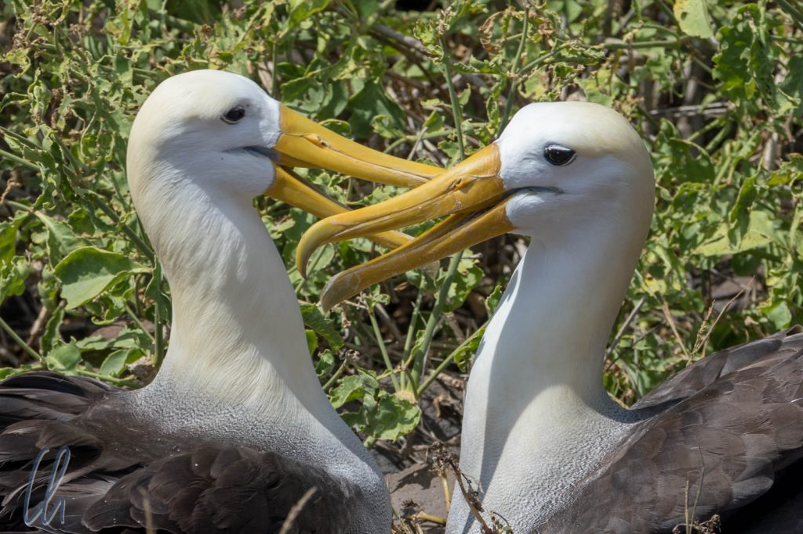

# Galapagos, sieben Tage live bei „Planet Erde“

Weiter ging es mit der Erkundung der Galapagos-Inseln! Das Feuerwerk der atemberaubenden Eindrücke der [ersten beiden Tage](http://wittmann-tours.de/galapagos-die-verwunschenen-inseln/) setzte sich im wesentlichen so fort. Die von uns gänzlich unbeeindruckte Tierwelt ließ bei uns das Gefühl aufkommen, in einer Episode der Naturdokumentation „Planet Erde“ live dabei zu sein. Die Seelöwen, die Blaufuß- und anderen Tölpel, die Iguanas, alle ohne Ausnahme boten ein unglaubliches Schauspiel. Als erstes besuchen wir in diesem Beitrag die Albatrosse.

<!--more-->

## Punta Suarez: Albatrosse und mehr

Auf der Insel Española am Punta Suarez war der [Galapagosalbatros](https://de.wikipedia.org/wiki/Galapagosalbatros) (Waved Albatros) die große Attraktion. Wir hatten Glück, die Albatros-Saison hatte gerade begonnen. Bei diesen Vögeln bleiben männliche und weibliche Tiere sich ein Leben lang treu, sie treffen sich allerdings nur einmal im Jahr zur Paarungs- und Brutzeit an derselben Stelle. Nachdem das Junge flügge geworden ist, fliegen sie getrennt davon. Einige Männchen waren schon angekommen und warteten sehnsüchtig auf ihr Partnerinnen. Nur ein Pärchen war schon glücklich vereint. Die beiden schnäbelten selbstversunken und richteten sich gegenseitig die Federn. Es ist eigentlich überflüssig zu erwähnen, dass auch die Albatrosse direkt auf den Wegen saßen ;). Wie groß sie wirklich sind, kann man auf den Bildern leider nicht ermessen.

Auf dem Weg zu den Albatrossen durchquerten wir eine Kolonie von [Nazcatölpeln](https://de.wikipedia.org/wiki/Nazcat%C3%B6lpel) (Nazca Boobies). Die Nazcatölpel haben im Gegensatz zu den Blaufußtölpeln ein strahlend weißes Federkleid mit schwarzen Federn an den Flügelspitzen, orangefarbene Schnäbel und gelbe Augen. Die Jungvögel sind im Gegensatz dazu eher gräulich. Dafür veranstalteten sie ein reges Treiben. Einige von ihnen unternahmen die ersten mehr oder weniger erfolgreichen Flugversuche.

Die Landschaft war - charakteristisch für Galapagos - vulkanisch schroff mit dunklem Lavagestein. Die Vegetation reichte uns maximal bis zu den Knien und die Insel hatte kaum Erhebungen. Sie bildete ein Plateau wenige Meter über dem Meeresspiegel. Zwar war der Wellengang nicht wirklich stark, aber durch die felsige Küste bildete sich ein weiß schäumender Ring rund um Española. An einer Stelle spritze das Wasser sogar meterhoch aus einem Blowhole.

## Unterwasserwelt

Am späten Vormittag und am Nachmittag bot sich wieder die Gelegenheit zum Schnorcheln. Neben den alten Bekannten der Vortage sahen wir zum ersten Mal Meeresschildkröten und ein neugieriger Seelöwe glitt behände durch unsere Gruppe. An einem steil abfallenden Felsen sahen wir große Schwärme von kleinen roten, wenige Zentimeter großen Fischen, die sich erstaunlich wenig mit der Dünung bewegten. Der kurioseste Meeresbewohner, den wir an diesem Tag sahen, war eine riesige Flunder, die wie aufgeklebt auf einem Felsen lag. Auch von vorbeitauchenden Schnorchlern ließ sie sich, auf ihre Tarnung vertrauend, nicht aus der Ruhe bringen.

Bei weiteren Erkundungen im Wasser entdeckten wir auf den diversen Schnorchelgängen immer wieder neue Fische und andere Meeresbewohner. Blaugelbe Hawkfische, Seesterne (sogar von der Sorte mit Chocolate Chips!), diverse pastellfarbene Papageienfische, Rochen oder Hummer. Ein besonders ulkiger Meeresbewohner war der Panamic Fanged Blenny (s. Foto unten), der auf Felsen im Meer saß und sich dadurch gut getarnt fühlte.

## Punta Pitt: Blue-footed Boobies (Blaufußtölpel)

Am vierten Tag besuchten wir Punta Pitt auf der Insel San Cristóbal. Auch wenn wir vorher schon viele Blaufußtölpel gesehen hatten, boten sie hier die beste Show. Wir sahen die außergewöhnlichen Vögel beim Liebestanz, beim Brüten und zusammen mit ihren frisch geschlüpften Küken und schneeweißen Jungvögeln.

Besonders interessant war es, das Balzritual der Tölpel zu beobachten. Dabei spielen die blauen Füße eine wesentliche Rolle. Je leuchtender das Blau der Schwimmflossen, desto attraktiver der Partner. Die Männchen präsentieren ihre blauen Füße in einem amüsanten Watschelgang, fast so, als hätte man ihnen Taucherflossen angezogen. Er pfeift und zeigt eine Art Verbeugung, indem er seine Flügel hebt und mit dem Schnabel gen Himmel weist. Auch sammelt er kleine Holzstückchen in einer Art Nestbauprozedur, um sie der Angebeteten zu Füßen zu legen. Ist sie von ihrem Verehrer beeindruckt, antwortet sie ihm mit tiefen Lauten und stellt ihre Schwanzfedern als Zeichen der Akzeptanz auf.

https://www.youtube.com/watch?v=R62unFveKfA

Beim Brüten dienen die auffälligen blauen, gut durchbluteten Füße dazu, die Eier zu wärmen. Die Blaufußtölpel stehen geradezu auf den Eiern. Auch wenn sie zwei oder drei Eier legen, kommt meistens nur das Erstgeborene durch, da es den jüngeren Geschwistern das Futter streitig macht.

## Birding

Selbst für eingefleischte Vogelfreunde sind die [Darwinfinken](https://de.wikipedia.org/wiki/Darwinfinken) (oder auch Galapagos-Finken) eine echte Herausforderung. Auch wenn sie seinen Namen tragen, erkannte Charles Darwin die Unterschiede zwischen den 13 verschiedenen Spezies, die die Evolution auf den einzelnen Inseln hervorgebracht hatte, nicht ohne die Hilfe eines Kollegen. Eigentlich müssten sie [John Gould](https://de.wikipedia.org/wiki/John_Gould)-Finken heißen. Für uns waren die berühmten Vögel eine kleine Enttäuschung. Aus evolutionsbiologischer Sicht mögen sie hochinteressant sein, auch wenn man als Laie die feinen Unterschiede der Arten nicht gut erkennen kann. Ansonsten sind es kleine grau-braune Vögelchen. Auch dass wir ein Pärchen bei der Paarung in unserer direkten Nähe beobachten durften, machte die Sache nicht spannender. Liebesspiel und Akt dauerten ungefähr fünf Sekunden, dann war alles vorbei.

Wesentlich interessanter fanden wir die [Galapagos-Pinguine](https://de.wikipedia.org/wiki/Gal%C3%A1pagos-Pinguin), die Pinguinart, die am weitesten nördlich auf unserem Globus lebt. Bei den erfrischenden Wassertemperaturen rund um Galapagos hatten wir keine Zweifel, dass sie sich hier wohlfühlten ;). Trotzdem wirkten die kleinen Frackträger etwas deplatziert unter der tropischen Sonne des Äquators. Wir sahen sie an der Küste der Insel Bartolomé. Sie standen entweder auf den Felsen oder schwammen geschickt durch die Wellen.

Als wahre Flugkünstler zeigten sich die [Galapagos Shearwaters](https://en.wikipedia.org/wiki/Gal%C3%A1pagos_shearwater), die in den Aufwinden an den steilen Klippen der South Plaza-Küste versuchten, in kleinen Nischen zu landen. Viele Landeanflüge brachen sie ab, um eine weitere Runde zu drehen und einen neuen Anlauf zu starten. Auf derselben Insel beobachteten wir auch die [Red-billed Tropicbirds](https://de.wikipedia.org/wiki/Rotschnabel-Tropikvogel), die mit ihrem weiß-schwarzen Federkleid, orangefarbenen Schnäbeln und langen Schwanzfedern sehr elegant aussahen.

## Iguanas: Meerechsen und Drusenköpfe

Die Iguanas, eine für Galapagos sehr charakteristische Tierart, muten wie kleine Dinosaurier an, die schon längst ausgestorben sein müssten. Es gibt die Wasser-Leguane bzw. [Meerechsen](https://de.wikipedia.org/wiki/Meerechse) und die Landiguanas bzw. [Drusenköpfe](https://de.wikipedia.org/wiki/Drusenkopf). Ähnlich wie bei den Finken haben sich auf den verschiedenen Inseln unterschiedliche Arten dieser Echsen entwickelt. Am Punta Suarez z.B. fielen die Leguane durch ihre vielfarbige Haut auf: grau, rötlich und türkis. Dort beobachteten wir auch, wie weibliche Iguanas Auseinandersetzungen um die besten Eiablageplätze führten. Das wirkte wie ein archaischer Kampf zwischen Drachen in Miniaturformat.

Auf der Insel South Plaza erfuhren wir, dass die Drusenköpfe fast alle Kakteen aufgefressen hatten. Die eigentliche Ursache dieses Mißstandes waren aber nicht die Iguanas, sondern - wie sollte es anders sein - der Mensch. Für die Weidewirtschaft waren große Flächen auf der Insel Santa Cruz (direkt nebenan und wesentlich größer) gerodet worden. Durch die Abholzung verringerte sich der Lebensraum und die Population der Galapagosfalken. Da die Greifvögel sich u.a. von Iguanas ernähren, hatte dies wiederum zur Folge, dass die Anzahl der Drusenköpfe zunahm. Diese fraßen als Konsequenz davon auf South Plaza fast alle Kakteen. Mittlerweile läuft ein Aufforstungsprogramm. Der Zeithorizont ist hier aufgrund des langsamen Wachstums sehr ausgedehnt, das Programm ist Teil von [Galapagos Verde 2050](http://www.galapagosverde2050.com/).

Die Meerechsen begeben sich zur Nahrungssuche auf ausgedehnte Tauchgänge ins Wasser, müssen aber immer wieder an Land kommen, um sich in der Sonne aufzuwärmen. Daher ist auch ihre dunkle Hautfarbe nützlich, so kann die Wärme schneller absorbiert werden. Das Salz, das sie im Meer aufnehmen, wird an Land über spezielle [Drüsen](https://de.wikipedia.org/wiki/Exokrine_Dr%C3%BCse) in der Nähe der Nasenlöcher wieder ausgeschieden. Dadurch sieht es so aus, als ob sie ab und zu kräftig niesen müssten, wobei ihnen das Wasser aus diesen Drüsen spritzt.

https://www.youtube.com/watch?v=JsGDmv9_HcY

## Seelöwen an Land, im Wasser und vom Kajak aus

Die Seelöwen bereiteten uns bereits in den ersten Tagen auf Galapagos sehr viel Freude. Nicht nur hatte einer von ihnen uns schnarchend am Pier empfangen, sie schwammen auch um das Dinghy herum oder sonnten sich in großen Kolonien auf den Stränden. Besonders die kleinen Seelöwen waren sehr neugierig und wollten die Besucher von ganz nah anschauen. Ein Seelöwenjunges robbte am dritten Tag direkt auf uns zu und schien nicht zu verstehen, warum wir immer Abstand hielten. An Natalia war es besonders interessiert.

So richtig in ihrem Element waren die Seelöwen allerdings erst im Wasser. Am vierten Tag bot sich an der Isla Lobos (eine kleine Insel an der Westküste von San Cristóbal) die Gelegenheit, zusammen mit ihnen zu schnorcheln. Auch hier waren die jungen Seelöwen wieder die neugierigsten und schwammen agil und elegant um uns herum. Einige von ihnen ließen sich dadurch, dass wir selbst abtauchten, dazu animieren, kleine Kunststückchen zu vollführen.

Im Nordosten der Insel Santa Fe fuhren wir Seekajak und trafen dabei eine Gruppe von jungen Seelöwen. Sie tummelten sich in einer flachen und felsigen Bucht. Für uns sah es so aus, als ob sie ihre Hälse so weit wie möglich aus dem Wasser reckten, um zu sehen, wer denn da angepaddelt kommt. Wir näherten uns langsam, mussten aber darauf achten, dass wir nicht zu nah an die Felsen getrieben wurden. Wie so oft missachteten die Seelöwen die Zwei-Meter-Regel und schwammen direkt an unser Kajak heran. Wieder einmal war die Unterwasserperspektive noch beeindruckender als das Schauspiel über Wasser, wie ihr am Ende des folgenden Videos, eines Zusammenschnitts unserer Seelöwenbegegnungen, sehen werdet.

https://www.youtube.com/watch?v=7jVI5kn9N1Q

## Die majestätischen Fregattvögel

In den Lüften von Galapagos machten die Fregattvögel am meisten her. Nicht zu unrecht heißen die beiden Arten "Great Frigatebird" (zu deutsch eher sparsam [Bindenfregattvogel](https://de.wikipedia.org/wiki/Bindenfregattvogel)) und "Magnificent Frigatebird" ([Prachtfregattvogel](https://de.wikipedia.org/wiki/Prachtfregattvogel)). Ihre charakteristischen, leicht unheimlichen schwarzen Silhouetten sahen wir oft hoch über unseren Köpfen dahingleiten. Fregattvögel bestreiten einen nicht unwesentlichen Teil ihrer Ernährung damit, dass sie anderen Vögeln die Beute abjagen. Kleptoparasitismus nennt sich das, wie wir erfuhren. Einige Fregattvögel benutzten die Beagle als Transportmittel und setzten sich oben in die Takelage, um ein Stück weit mit uns zu fahren. Wahrscheinlich wussten sie auch, dass manchmal Essensreste im Meer entsorgt wurden. Auf alle Fälle stürzten sie sich immer sofort auf die „Leckerbissen“ ;)

Auf Española und North Seymour spazierten wir durch eine Kolonie von Fregattvögeln. Die Jungen sind (wie auch bei anderen Vogelarten) noch nicht ganz so beeindruckend und tragen ein gräuliches Gefieder. Dafür sind die Männchen der Prachtfregattvögel echte Machos. Beim Werben um die Weibchen protzen die Angeber mit ihren stattlichen knallroten Kehlsäcken, was für uns Laien fast ein wenig albern aussah. Diese können sie bei Bedarf aufplustern oder die Luft wieder ablassen, was allerdings etwas dauert. Selbst im Flug ist er gut sichtbar und auf dem Boden saßen sie mit aufgeblasenem Kehlsack, um die Damenwelt zu sich zu locken.

Auch wenn sich bereits ein Weibchen zu ihnen gesellt hatte, zeigten die Prahlhanse weiterhin ihre rote, aufgeblasene Brust, vielleicht um anderen Männchen zu signalisieren, dass es nichts zu holen gibt oder um ihre Holde darin zu bestärken, dass sie sich einen tollen Hecht gefangen hat.

## Fahrt durch die Mangrove

Am letzten Morgen fuhren wir mit dem Dinghy durch die Mangroven von Black Turtle Cove bei Santa Cruz. Die Mangroven dienen Haien, Meeresschildkröten und Rochen als Kindergarten. In den geschützten Gewässern können sie in Ruhe wachsen und gedeihen. Das Wasser ist nicht so klar wie draußen im Ozean und so mussten die Meeresbewohner schon direkt neben dem Boot schwimmen, damit wir sie erkennen konnten. Was sie auch brav taten, schließlich waren wir ja in Galapagos!

Nach gut 20 Minuten Fahrt parkte Harry das Dinghy an einem kleinen Kanal. Einige kleine Haie und Meeresschildkröten schwammen durch die Passage direkt am Boot vorbei. In der Lagune, in der wir uns befanden, sahen wir etwas später auch Schwärme von Rochen und weitere Haie sowie Meeresschildkröten.

https://www.youtube.com/watch?v=Zt9dOvebXFk

## Bedrohtes Naturparadies Galapagos

Trotz all dieser faszinierenden Tierwelt steht auf Galapagos nicht alles zum Besten. So sind zum Beispiel zwei Schildkrötenarten bereits ausgestorben. Nun stehen die verbliebenen zwar unter Schutz, aber aufgrund ihres langsamen Wachstums wird das Zuchtprogramm lange brauchen, bis es wieder viele Schildkröten der bedrohten Arten geben wird. Eingeschleppte invasive Spezies (Tiere, Pflanzen und Pilze) gefährden das Gleichgewicht der Ökosysteme und schaden der endemischen Fauna und Flora. Die Bevölkerung der Inseln wächst trotz Zuzugsbeschränkung vom ecuadorianischen Festland, da gute Verdienstmöglichkeiten im boomenden Tourismussektor locken. Mehr Einwohner führen angesichts der limitierten Ressourcen zu neuen Herausforderungen.

Ein weiteres Beispiel sind die Meere rund um Galapagos, die seit Gründung des [Galapagos Marine Reserve](https://en.wikipedia.org/wiki/Gal%C3%A1pagos_Marine_Reserve) unter Schutz stehen. Vor der Etablierung des Schutzgebietes waren Seegurken und Haie (wegen der Haifischflossen) fast ausgerottet worden. Heute ist die Ernte von Seegurken und Fischfang allgemein (aber keine Haie) unter Auflagen erlaubt. Die Fischer fühlen sich durch die auferlegten Quoten eingeschränkt, obwohl sich einige Arten weiterhin [nicht nachhaltig regenerieren können](https://de.wikipedia.org/wiki/Galapagosinseln#Naturschutz). Ein ewiger Konflikt zwischen ökonomischen Interessen und Umweltschutz.

Der Besuch der Galapagos-Inseln war für uns ein einzigartiges Naturerlebnis und wir hoffen, es ist uns gelungen, Euch in diesem und dem [vorherigen Artikel](http://wittmann-tours.de/galapagos-die-verwunschenen-inseln/) ein wenig mit auf die Reise zu nehmen. Wir hatten den Eindruck, in eine sieben Tage dauernde Episode von „Planet Erde“ geraten zu sein, live, in Farbe und in Stereo. Eigentlich hat nur noch gefehlt, dass David Attenborough höchstpersönlich uns geführt hätte ;). Unser Reiseführer Harry war allerdings eine würdige Vertretung. Die verzauberte Tierwelt von Galapagos werden wir nie vergessen und wir hoffen, dass sie gegen alle Bedrohungen geschützt und erhalten werden kann.

