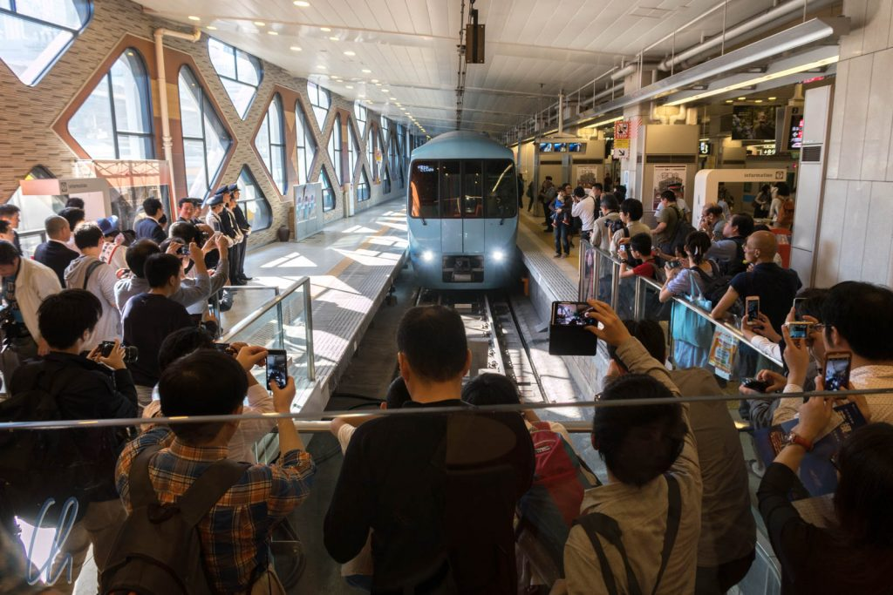
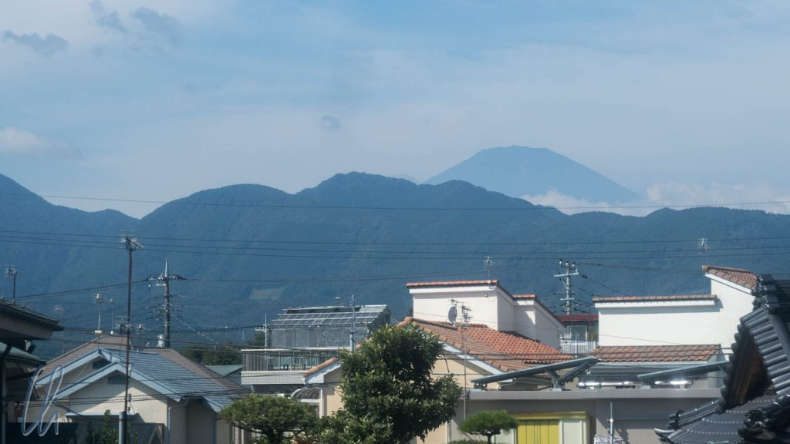
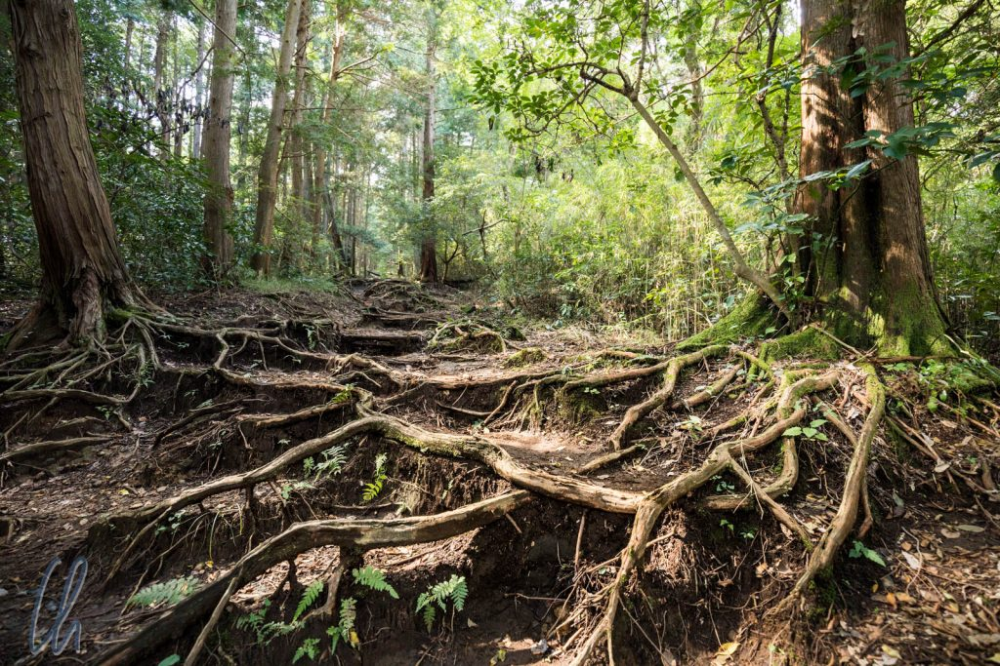
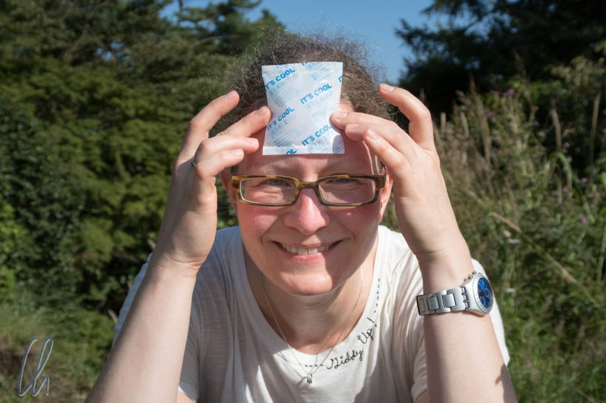
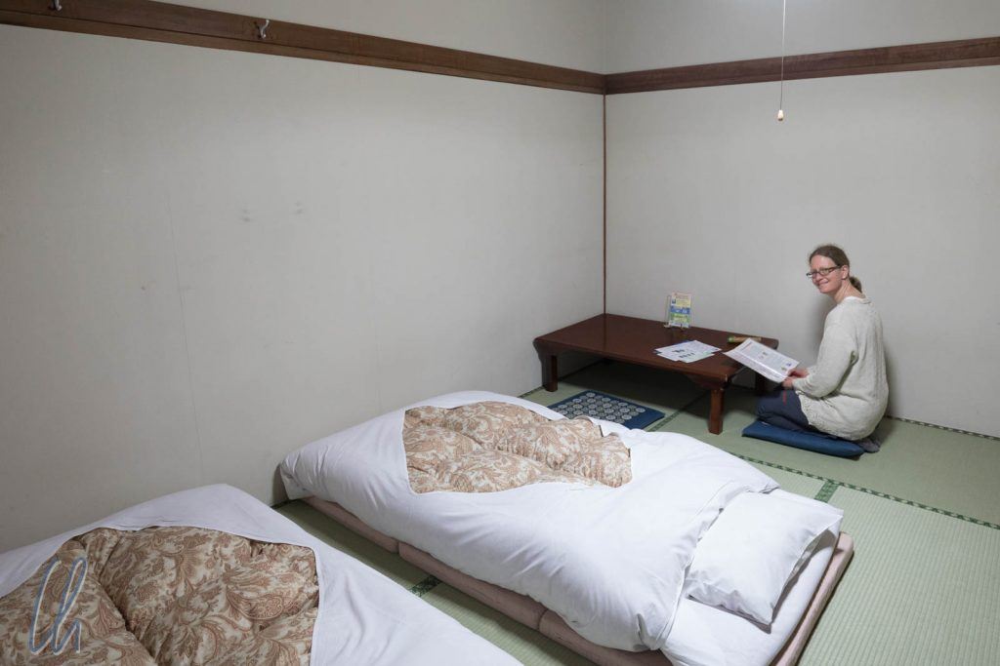
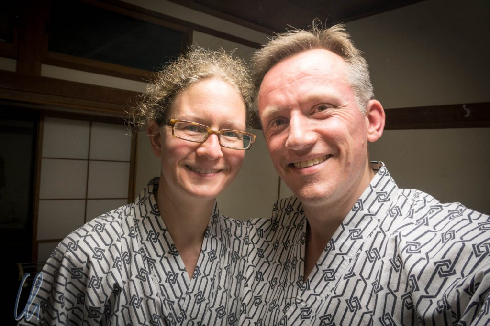

Nach [6 Tagen in Tokyo](http://wittmann-tours.de/sightseeing-in-der-mega-city-tokyo/) haben wir die Großstadt gegen Natur bzw. Kleinstadt eingetauscht. Wir sind mit dem Romance Car nach Hakone gefahren, um dort zu Wandern und Mount Fuji zu sehen.

<!--more-->

## Mit dem Romance Car nach Hakone

Wenn man es nüchtern betrachtet, ist der [Romance Car](https://en.wikipedia.org/wiki/Romancecar) so etwas wie ein Regional Express ("limited express"), er verbindet Tokyo mit Hakone und weiteren Ausflugszielen südlich der Metropolregion. Der Romance Car ist aber mehr, er weckt Emotionen, allein der Name ist bemerkenswert, der "Romantische Zug". Der Name kommt daher, dass man die Mittelarmlehne der Zweiersitze hochklappen kann, um mit dem Sitznachbarn zu kuscheln :) - Wie verrucht! Zu Zeiten des ersten Romance Cars 1957 eine Sensation!

So ließen wir in romantischer Zweisamkeit die Stadt an uns vorrüberziehen, die zunächst kaum enden mochte. Wir bummelten häufig bei gefühlten 40 bis 60 km/h zusammen mit den echten Bummelzügen durch die Vororte und überholen sie in den Bahnhöfen, da der Romance Car bei weitem nicht überall hält. Der echte Expressanteil kam erst später, als wir an einigen abgeernteten Reisfeldern vorbeifuhren. Von dort sahen wir auch das erste mal [Fuji-san](<https://de.wikipedia.org/wiki/Fuji_(Vulkan)>) majestätisch in der Ferne :)

Bei gutem Fuji-Blick wäre es ideal gewesen, von Hakone aus direkt weiter in Richtung Ashi-See zu fahren, um dort das Panorama anzuschauen. Da dieser Tag jedoch ein Feiertag war ([Health and Sports Day](https://en.wikipedia.org/wiki/Health_and_Sports_Day): Danke Ken, das hätten wir nicht gewusst!), zogen wir unsere Wanderung auf den ersten Tag in Hakone vor, um die Besucherströme zu umgehen. Dank Gepäcktransport-Service vom Bahnhof zum Hotel für wenig Geld konnten wir direkt loswandern.

## Wanderung zum Sengenyama

Auf den ersten Metern gingen wir an der engen Hauptstraße (quasi der einzigen) in Hakone entlang, die gesäumt war von Souvenirläden. Autos schoben sich dicht an dicht über die Straße, ein Anblick, den wir so aus Tokyo nicht gewohnt waren. Schilder wie "Ortsumgehung Hakone, Jetzt!" wären angebracht gewesen. Zum Glück konnten wir nach wenigen 100 Metern in einen versteckten Waldweg abbiegen.

Ein alter Pilgerweg, teils mit großen Steinen gepflastert, führte steil hinauf, so dass wir schnell ins Schwitzen gerieten. Außerdem gab es mit Holzbalken befestigte Stufen oder wir kletterten über die Wurzeln der Bäume. Mitten im dichten Wald zwischen den hohen Bäumen wurde der Straßenlärm schnell leiser, lange war er jedoch noch in der Ferne zu hören. Eigentlich wären während des Aufstiegs Reste einer alten Burgruine zu sehen gewesen, aber sie waren wohl so überwuchert, dass wir sie verpasst haben.

Unterwegs trafen wir nur ca. 30 andere Wanderer und eine ca. 20-köpfige Gruppe rüstiger Renter, die uns überschwänglich begrüßten ("Konnichiwa!") und uns auf dem Weg nach oben anfeuerten: [Ganbatte](http://www.oai.de/de/wissen/ostasienlexikon/g.html?id=2442:ganbatte)! Danke Eva, dass Du mir diesen Begriff beigebracht hast, so dass wir die aufmunternden Worte verstanden.

Auf dem Gipfel des Sengenyama angekommen waren wir der Meinung, dem Health and Sports Day gerecht geworden zu sein und machten ein kleines Picknick. Dabei waren wir erneut vom Ordnungssinn und der Kundenorientierung der Japaner restlos begeistert. Dem Pudding, den wir am Bahnhof eingekauft hatten, waren nicht nur Löffel beigelegt, sondern auch ein kleines Kühlpäckchen, so dass der Pudding lecker und immer noch leicht gekühlt war!

## Ryokan - Übernachtung auf Japanisch

Aufgrund der vorgerückten Zeit fuhren wir mit einer niedlichen Bummelbahn und einem Bus zu unserer Unterkunft im japanischen Stil, einem Ryokan.

Im mit Tatami-Matten ausgelegten Zimmer lagen die Futons. Es gab einen niedrigen Tisch und 2 Sitzkissen. Die Waschräume waren dort Gemeinschaftseinrichtungen und es gab ein Onsen, ein japanisches Thermalbad. Um modisch nicht aus dem Rahmen zu fallen, kleideten wir uns mit den bereitliegenden Yukatas an.

Das Onsen ist ein Thermalbecken, welches mit ca. 42°C zum Entspannen nach einer anstrengenden Wanderung einlud. Bevor man sich in das wohltuend heiße Becken gleiten lässt, verlangt die Etikette (und der Anstand), dass man sich gründlich wäscht. Gebadet wird nackt und seit der Meji-Zeit normalerweise nach Geschlechtern getrennt. Unsere Unterkunft hatte sowohl ein Außen- als auch ein Indoor-Onsen. Draußen war es nicht nur stimmungsvoller, sondern man konnte sich auch besser nach dem Baden oder zwischen den Badegängen abkühlen.

## Unterwegs mit Seilbahn und Piratenschiff

Am kommenden Morgen starteten wir zur offiziellen Standard-Hakone-Tour. Wir fuhren mit Bus, Cable Car (keburuka), Seilbahn (ropu-ueï) und Piratenschiff zu verschiedenen Aussichtspunkten und genossen die schöne Landschaft.

Schnell verstanden wir, warum Hakone ein beliebter Tagesausflug von Tokyo ist. Die Seilbahn trug uns zunächst auf einen Berg, von wo wir ein sehr aktives Geothermalfeld sehen und riechen konnten. Dort werden die legendären in den geothermischen Quellen zubereiteten schwarzen Eier angeboten. Es heißt, mit dem Verzehr eines der besonderen Eier könne man seine Lebensdauer um 7 Jahre verlängern. Dennoch widerstanden wir der Versuchung.

Als es mit der nächsten Seilbahn auf der anderen Seite wieder abwärts in Richtung Ashi-See ging, sahen wir, diesmal wesentlich näher, den ebenmäßigen Gipfel des Fuji-san. Kurz gab er sich die Ehre bevor er hinter den Wolken verschwand.

Unten angekommen wartete schon das nächste Verkehrsmittel auf uns. Mit einem Piratenschiff überquerten wir den See. Neben anderen offensichtlichen Touristen waren anscheinend vor allem japanische Großeltern mit ihren Enkeln unterwegs, beide Gruppen umlagerten die überlebensgroßen Figuren von Plastikpiraten an Deck, um lustige Fotos zu machen. So genossen wir die 30-minütige Fahrt, ließen die grünen Hügel an uns vorbeiziehen und sonnten uns.

An der Südküste angekommen waren wir wieder zu Fuß unterwegs, besichtigten die Rekonstruktion einer Grenzstation aus der Edo-Zeit, schlenderten durch die Parkanlagen, bestaunten eine Allee, die im Schatten jahrhundertealter mächtiger Zedern verlief, und besuchen den Hakone-Schrein. Bevor wir in Richtung Kyoto aufbrachen erschien zum Abschied sogar noch einmal Mount Fuji aus den Wolken!

Abschließend die Bilder dieses Artikels und weitere in der dazu passenden Sammlung:

\[envira-gallery id="805"]
