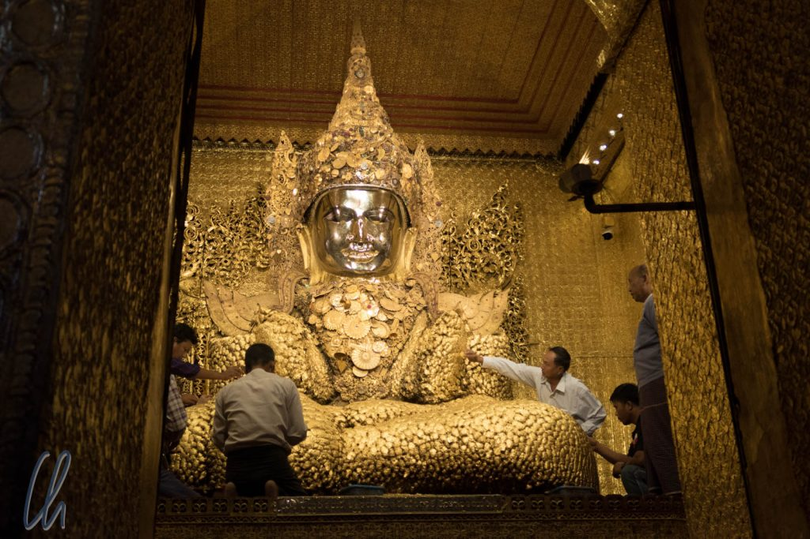
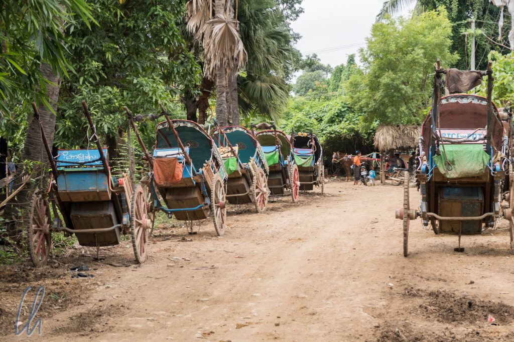
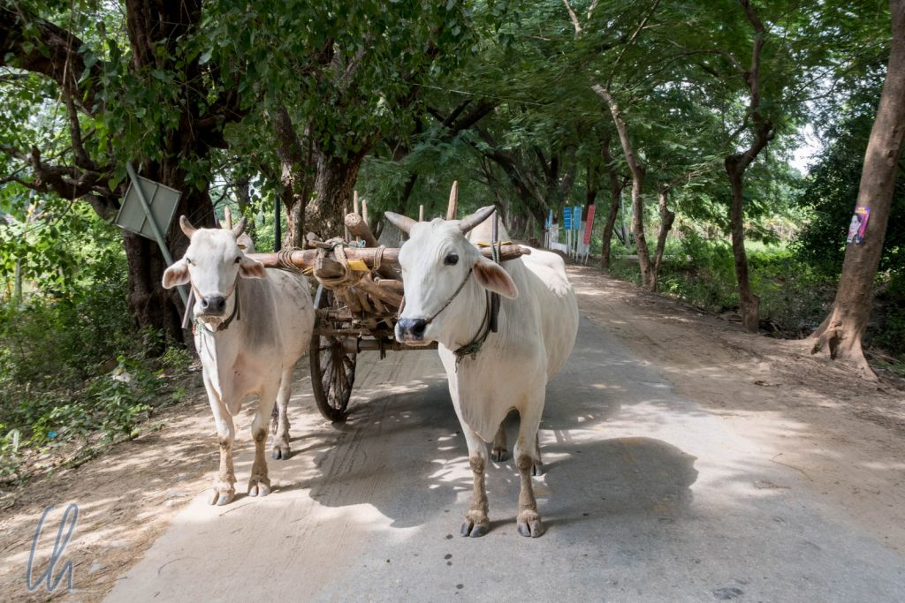

In Myanmar ist es anscheinend gute Tradition, die Hauptstadt zu verlegen. Viele Könige verschiedener Ethnien in Myanmar gründeten einen neuen Herrschersitz, sobald sie an die Macht gekommen waren. Auch die britischen Kolonialherren machten erst Moulmein (heute Mawlamyine), dann Rangoon (heute Yangon) zur Kapitale. 2005 tat es ihnen die damalige Militärregierung nach: Nay Pyi Taw (=königliche Sonnenstadt), eine Retortenstadt, wurde inmitten von Reisfeldern zu immensen Kosten aus dem Boden gestampft. Viel interessanter sind jedoch die historischen Hauptstädte. Davon liegen je nach Zählweise 5-7 auf unserer Reiseroute. In unseren ersten Tagen in Myanmar erkundeten wir das Trio aus Mandalay, Inwa und Sagaing, deren Blütezeit im 14. bis 19. Jahrhundert lag.

<!--more-->

## Mandalay: Hauptstadt der letzten Könige

Mandalay wurde erst 1861 Hauptstadt und war die letzte Königsstadt, bevor die Briten 1885 den Herrscher besiegten und Burma ihrem Kolonialreich hinzufügten. Die Stadt ist sehr weitläufig. Es wurde in die Breite, nicht in die Höhe gebaut. Mit ca. 1 Million Einwohnern würde gesamt Mandalay einwohnermäßig in 3 Toykoter Stadtteile passen, ist aber zu Fuß auf keinen Fall zu besichtigen.

Neben Klöstern und Tempeln mit vielen goldenen Stupas und dem [Mandalay Hill](http://wittmann-tours.de/erste-eindruecke-aus-myanmar/) ist eine der Hauptsehenswürdigkeiten eine Rekonstruktion des Königspalastes. Die Anlage selbst wurde im zweiten Weltkrieg komplett zerstört und erst in den 90er Jahren wieder aufgebaut. Zu sehen sind um die 40 mehr oder weniger prächtige, hallenartige Gebäude aus Teakholz in mehr oder weniger gepflegtem Zustand. Die meisten sind leer, in den Hauptgebäuden sind einige wenige königliche Exponate ausgestellt. Trotzdem vermittelt die Anlage ein gewisses palastartiges Flair, und wir bemerken auch zum ersten Mal, dass das Militär in Myanmar sehr präsent ist.

Die gut 2 mal 2 Kilometer große Fläche des Palastes ist zu großen Teilen Sperrgebiet. Bei der Einfahrt musste unser Taxifahrer sein Taxi registrieren lassen und für uns war nur der kleine Bereich mit den Holzgebäuden im Zentrum zugänglich. [Vom Mandalay Hill aus betrachtet](http://wittmann-tours.de/wp-content/uploads/2017/11/CW-20171031-192954-0750-1.jpg) sieht der Palastbezirk wie ein quadratischer, von einem Wassergraben und einer Wehrmauer umgebener Stadtwald aus. Was dort wirklich geschieht ist streng geheim.

## Inwa: viermal Hauptstadt

Von Mandalay aus erreichten wir Inwa nach ca. 40 Minuten mit dem Taxi und einer kurzen Überfahrt mit dem Boot über den Myitnge River, einen Seitenarm des gewaltigen Ayeryawady River. Heute mutet Inwa (ehemals auch als Ava bezeichnet) noch nicht einmal mehr wie ein Dorf an, es ist bemerkenswert ländlich.

Kaum waren wir angekommen stürzten sich sofort die Kutscher der Pfedefuhrwerke auf uns. Dahinter steckten gute Absichten für den eigenen Geldbeutel und die Füße der Besucher: Die Sehenswürdigkeiten verteilen sich auf dem ehemaligen Haupstadtgebiet von ca. 10 Quadratkilometer, das heute eher aus landwirtschaftlichen Nutzflächen und vereinzelten kleinen Siedlungen besteht. Wir wollten aber zunächst zu Fuß die Landschaft erkunden, was die Kutscher natürlich nicht verstehen konnten.

## Rundgang in Inwa

Nach wenigen hundert Metern erreichen wir den ersten Tempel. Die ehemals gelben, nun aber mit schwarzen Flecken übersäten Mauern strahlten einen eher morbiden Charme aus. Eine benachbarte Stupa war gerade passgenau mit Bambus eingerüstet, um den ehemaligen Glanz aufzupolieren. Ein Teil der Tempel sind heute noch aktive Heiligtümer. Hinter dem Tempel konnten wir auf einer kleinen Anhöhe den Blick über den Ayeyarwady in Richtung Sagaing genießen, unser Ziel für den Nachmittag.

Auf unserem Rundgang durch das ehemalige Inwa wanderten wir durch die Felder. Immer wieder standen ehemalige Tempel verstreut in der Landschaft. Mit der Nogatataphu Paya erreichten wir schließlich das erste renovierte religiöse Bauwerk. Mit den leuchtenden Farben, blendendem Weiß und strahlendem Gold, wirkte sie im Gegensatz zu den bisher gesehenen Heiligtümern fast schon zu neu und damit etwas künstlich.

Authentischer erschien dagegen das noch aktive Bagaya Kloster. Es ist vollständig aus Teakholz erbaut und steht prächtig in der grünen Landschaft: Dunkelbraun mit roten Dächern. Damit bietet es einen interessanten Kontrast zum sonst so dominanten Gold. Die Wände und Giebel sind reich mit filigran gearbeiteten Holzschnitzereien verziert. Im Inneren beherbergt es eine prächtige Buddha-Statue, und in den Bäumen um das Kloster tollten zu unserer Freude myanmaresische Eichhörnchen umher :)

Nachdem unser 8km-Rundgang beendet war, waren zunächst leider nur Motorrad-Taxis im Angebot. Zum Glück fanden wir nach gut einem Kilometer aber doch eine freie Kutsche, die uns zurück zum Bootsanleger brachte. So konnten wir die Landschaft an uns vorüberziehen lassen, die wir vorher zu Fuß durchquert hatten.

## Sagaing: Eine alte Hauptstadt der Shan

Auf der gegenüberliegenden Seite des Ayeryawady, einige Kilometer nördlich, liegt Sagaing. Schon von weitem erblickten wir die bewaldeten Hügel oberhalb der Stadt. Verteilt in der grünen Vegetation glänzten goldene Tempel und Stupas. Mit diesem Anblick wurde für uns ein Abglanz der Pracht der ehemaligen Hauptstadt spürbar. Auch heute ist Sagaing noch ein aktives spitituelles Zentrum Myanmars.

Auf dem höchsten Hügel befindet sich die Soon U Pon Nya Shin Paya - ein Paradebeispiel dafür, dass wir die meisten burmesischen Bezeichnungen einfach nicht behalten können. Einzig das letzte Wort "Paya" ist uns mittlerweile geläufig. Es bedeutet Heiligtum und taucht immer wieder auf. Neben dem schwer zu merkenden und auszusprechenden Namen bietet der Tempel eine fantastische Aussicht über die Stadt und den Ayeryawady. Von dort versuchten wir alle Pagoden zu zählen, die wir sehen konnten, und kamen beide auf ca. 70 Stück. Der Reiseführer spricht von hunderten…

Zum Abschluss besuchten wir die unter Touristen unbekanntere aber nicht weniger prächtige Shin Pin Nan Kain. Sie steht auf einem anderen Hügel, und eine lange Treppe führt bis zum Tempel hoch. 2 [Chinthe](https://en.wikipedia.org/wiki/Chinthe), mythische löwenartige Tempelwächter, fletschen am Fuße der Stiege drohend die Zähne. Einige hundert Stufen später erreichten wir den Tempel und genossen auch hier die spektakuläre Aussicht. Die ersten Minuten waren wir erstaunlicherweise komplett alleine. In der sich senkenden Abendsonne erschienen die Tempel sogar noch goldener.

