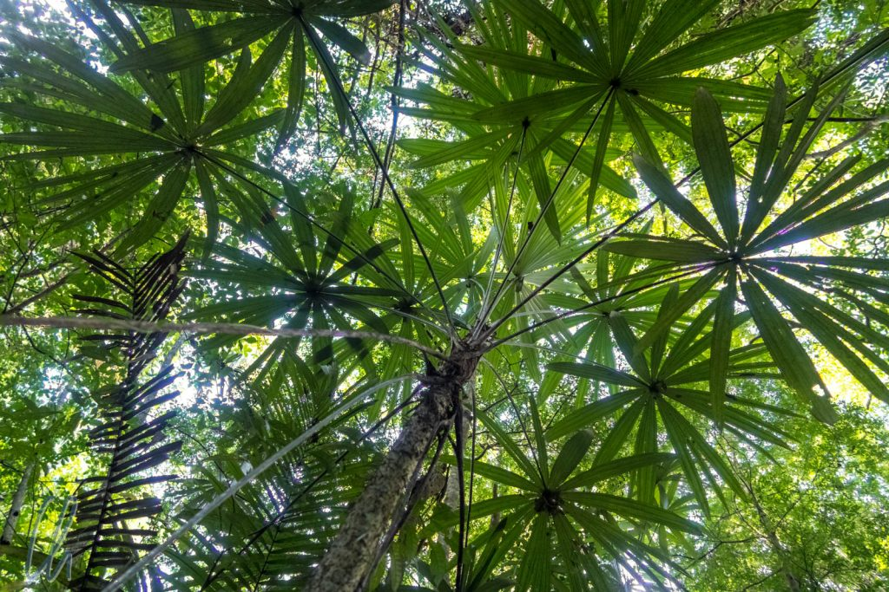
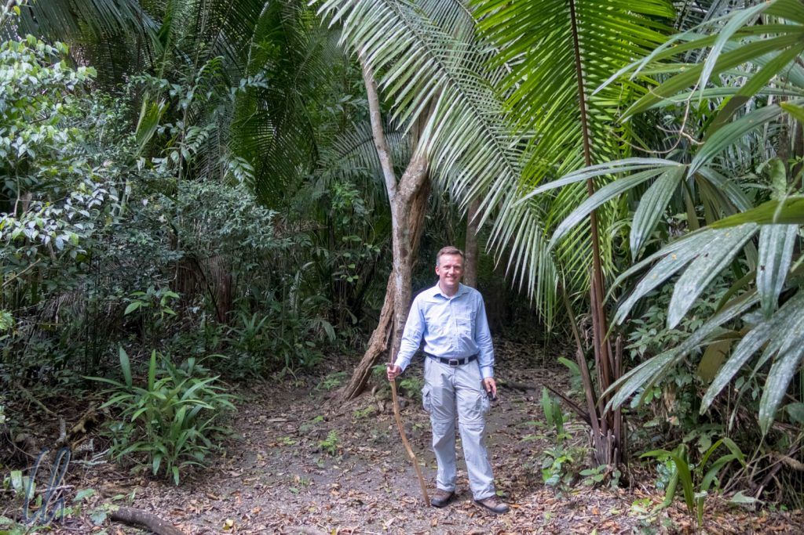
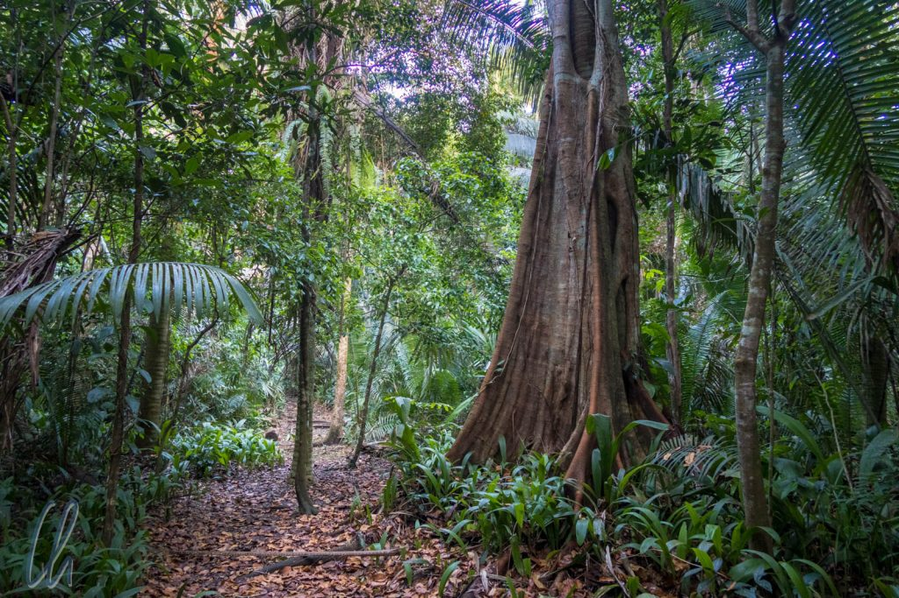

Der Regenwald ist eine der Hauptattraktionen von Belize. Unsere erste Unterkunft im Dschungel war die Chan Chich-Lodge. Vom Standard her ist die Unterkunft deutlich am oberen Ende der Bequemlichkeits- (und Preis-)skala angesiedelt, aber der ausschlaggebende Punkt für uns war, dass es mit viel Glück die Möglichkeit geben sollte, wilde Katzen zu sehen. Ob sie sich wohl zeigen würden?

<!--more-->

## Auf Ruinen der Maya gebaut

Die Lodge befindet sich in einem riesigen geschützten Waldgebiet nahe der Grenze zu Guatemala. Vor einigen hundert Jahren befand sich dort eine Maya-Siedlung. Daher leitet sich auch der Name des Hotels her: „Chan Chich“ heißt „kleiner Vogel“ in der Sprache der Maya. Heute sind im Dschungel und um die Unterkunftsbungalows herum einige Hügel zu sehen, unter denen sich nicht freigelegte Bauwerke der Maya befinden. Die Lodge wurde also auf dem zentralen Platz der früheren Ortschaft errichtet. Was sich zunächst erstaunlich anhört, ist gar nicht so ungewöhnlich, schließlich waren die Maya ein Volk von mehreren Millionen Menschen.

Der Bau der Lodge ist aufgrund der archäologischen Stätte sicher reichlich kontrovers, aber die Begründung liegt darin, dass schon einige der historischen Gebäude durch Plünderer mittels Schächten eröffnet und Funde entwendet worden waren. (Ein interessanter Hintergrundartikel zu illegalen Grabungen ist kürzlich auf [spiegel.de](http://www.spiegel.de/wissenschaft/mensch/maya-archaeologie-in-guatemala-auf-der-spur-der-raubgraeber-a-1210456.html) erschienen.) Das Hotel an diesem Ort soll weitere solche sogenannte Mondschein-Archäologen abschrecken. Bei unseren Wanderungen um die Lodge herum besuchten wir auch einige der überwucherten Gebäude und konnten durch die Tunnel der Plünderer einen Blick in die ausgeraubten Grabkammern werfen. Die archäologische Stätte hatte allerdings nicht annähernd so viel Interessantes zu bieten wie die rekonstruierten Städte der Maya, die wir in [Mexiko](http://wittmann-tours.de/die-untergegangene-pracht-der-maya/) besucht hatten.

## Die frühere Nutzung des Waldes

Nach den Maya kamen Baumfäller und Chicleros in dieses Gebiet. Tropenholz war (und ist heute noch) eine der wichtigsten Einnahmequellen von Belize. So wurde der Wald früher selektiv abgeholzt, d.h. die Edelhölzer wurden geschlagen und abtransportiert, meistens über die Flüsse. Heute ist der Wald damit eigentlich ein Sekundärwald, aber er mutet wie ein echter Dschungel an, da er schon 30 Jahre unter Schutz steht, nur die echten Baumriesen fehlen.

Als Chicleros wurden Männer bezeichnet, die den Urwald auf der Suche nach Gummibäumen durchstreiften und den wertvollen Rohstoff abzapften. Auf dem Gelände von Chan Chich befand sich einst ein Chiclero-Camp und daher gibt es auch heute noch viele schöne Wege zum Wandern durch den Dschungel. Die Chicleros hingegen sind mittlerweile arbeitslos, da die Kautschukproduktion heute auf großen Plantagen in Asien betrieben wird.

Mitte der 1980er Jahre kaufte [Barry Bowen](https://en.wikipedia.org/wiki/Barry_Bowen), einer der reichsten Männer Belizes, der als Abfüller für Coca Cola ein Vermögen gemacht hatte, das große Gebiet des Dschungels rund um die heutige Lodge und teilte es auf. Ein Areal des Landes wurde zu einer Farm ("Gallon Jug"), wo heute Getreide, Mais und Kaffee angebaut werden. Außerdem betreibt der Hof Weidewirtschaft mit Rindern. Der größte Teil der Fläche hingegen wurde unter Schutz gestellt und die Chan Chich-Lodge gebaut.

## Heute sehr luxuriös

Die heutige Lodge hat keine Ähnlichkeit mehr mit dem ursprünglichen Chiclero-Camp. Wir bewohnten unseren eigenen luxuriösen Bungalow mit einem großzügigen Doppelzimmer, einem voll ausgestatteten Bad und mit Strom, Licht und eigenem Kühlschrank rund um die Uhr, kein Vergleich mit unserem Dschungel-Trekking in [Kambodscha](http://wittmann-tours.de/dschungel-trekking-in-chi-phat/)! Dabei war die bescheidene Hütte trotzdem rundum offen, Glasscheiben gab es nicht. Stattdessen waren Insektengitter und Holzjalousien in den Fenstern befestigt. So hörten wir Tag und Nacht die unterschiedlichen Geräusche des Dschungels: Laut zirpende Zikaden, zwitschernde exotische Vögel, krächzende Papageien, brüllende Affen, quakende Frösche…

Allein schon auf dem Gelände der Lodge sahen wir viele interessante Tiere und das aufmerksame und extrem sachkundige Personal machte uns auf einiges aufmerksam. So befand sich eines morgens eine Mini-Boa direkt neben dem Restaurant oder ein sogenannter [Squirrel Cuckoo](https://en.wikipedia.org/wiki/Squirrel_cuckoo) saß wenige Meter von uns entfernt in einem Baum. Außerdem war ein Specht im Garten dabei, eine Nisthöhle in einen Stamm zu hämmern.

## Den Moskitos zum Fraß

Um mehr Tiere zu entdecken, unternahmen wir jeden Tag mindestens eine Wanderung auf dem umfangreichen Wegenetz rund um die Lodge. Obwohl wir vor Aufbruch das gute 40%-DEET-Spray großzügig verwendeten, wurden wir unterwegs immer wieder von den Moskitos traktiert. Anscheinend war ihnen nicht bekannt, dass DEET ein hochwirksames Insektengift ist ;). Sobald wir anhielten, um Bäume oder Tiere zu betrachten, fielen sie sofort über uns her, stachen uns sogar durch die Kleidung und summten penetrant um unsere Ohren.

Eine typische Handbewegung war das Wedeln mit den Händen zum Verscheuchen der aufdringlichen Blutsauger. Trotzdem erwischten sie uns immer wieder. Lange Kleidung war also unabdingbar, obwohl bei den Temperaturen tagsüber T-Shirt und kurze Hose sehr angenehm gewesen wären.

## Unterwegs im Dschungel

Neben den vielen lästigen Insekten begegneten wir auch einigen sympathischeren Tieren, obwohl es nicht leicht war, sie zu sichten. Die Vegetation war dicht und beim Wandern machten wir natürlich Geräusche, die die Fauna verscheuchen konnten. Wesentlich leichter ließen sich Pflanzen und Bäume betrachten. Der Dschungel unterschied sich deutlich von dem in Kambodscha. Wir sahen unter anderem Gummibäume und verschiedene Arten von Palmen, allen voran die riesigen [Cohune Palmen](https://en.wikipedia.org/wiki/Attalea_cohune). Letztere befanden sich in großer Zahl in der Umgebung der Lodge, da die Maya die Samen zur Ölherstellung zu verwenden pflegten.

Fast jeden Tag konnten wir Familien von Affen hoch oben in den Bäumen beobachten. Dabei galt auch hier wieder, dass wir sie zunächst hörten und dann vielleicht auch sahen. Sie verrieten sich entweder durch das Rascheln der Blätter und Zweige, dadurch, dass sie Reste von Früchten, die sie verspeisten, fallen ließen oder durch ihre Lautäußerungen (im Fall der Brüllaffen nicht zu überhören). Sehr agil waren die [Klammeraffen](https://de.wikipedia.org/wiki/Klammeraffen) (Spider Monkeys), die sich mit allen Vieren und ihrem Schwanz, den sie wie eine zusätzliche Greifhand einsetzen können, spielend leicht durch die Wipfel bewegten.

Außerdem sahen wir Eichhörnchen und natürlich viele Vögel. Der definitiv größte war der [Guan](<https://en.wikipedia.org/wiki/Guan_(bird)>), der ein bisschen wie ein großer Truthahn aussieht, aber erstaunlich behände durch den Wald fliegen kann und gerne - erstaunlich schwierig zu entdecken - auf dickeren Ästen ausharrt.

## Pirschfahrten zum Sonnenaufgang

Neben den Wanderungen im Wald unternahmen wir einige Pirschfahrten mit einem Führer, immer auf der Suche nach Vögeln und Säugern. Da die lieben Tierchen rücksichtsloserweise früh aktiv werden, ging es morgens zum Sonnenaufgang los. Wir fuhren meistens durch den Wald bis zur Farm, wo es offeneres Gelände gab und damit bessere Möglichkeiten für Sichtungen. Immer wenn wir, meistens jedoch unser Guide, etwas Interessantes entdeckten, hielten wir an. Jeden Tag sahen wir Rehe und verschiedene, teilweise kunterbunte Vögel.

Wenn es auch für wilde Katzen keine Garantie gab, so waren doch regelmäßig viele interessante Vögel zu sehen. Nicht umsonst ist Chan Chich unter Birdern (Vogelbeobachtern) sehr beliebt. Eine engagierte US-amerikanische Gruppe lief immer professionell ausgestattet mit gewaltigen Ferngläsern und Scopes herum. Ganz so entschlossen waren wir nicht, aber wir konnten uns trotzdem sehr für die bunten Tukane, die [Oropéndolas](https://de.wikipedia.org/wiki/Montezumastirnvogel) mit ihren kuriosen hängenden Nestern, die [Flycatcher](https://de.wikipedia.org/wiki/Tyrannen) mit den langen Schwänzen, die bunten Spechte und die grünen krächzenden Papageien begeistern.

## Pirschfahrten bei Nacht

Eine ganz andere Perspektive bot sich bei den Nachtfahrten, die mit einem Kleinlaster durchgeführt wurden. Auf der Ladefläche waren Bänke aufgeschraubt, so dass die Gäste und ein Guide dort Platz fanden. Gegen den Scheinwerfer unseres Führers erschienen unsere Taschenlampen wie schwache Funzeln. Und so folgten unsere Blicke meistens dem Scheinwerferlicht von links nach rechts, von oben nach unten, immer durch das Laub der Bäume und über den Boden streifend auf Suche nach interessanten Lebewesen.

https://www.youtube.com/watch?v=-L9MYBWsBKU

Eigentlich war es erstaunlich, dass wir überhaupt Tiere entdeckten. Die Strategie ist, nicht nach den Silhouetten der Körper zu suchen, sondern nach dem Widerschein des Lichts in den Augen Ausschau zu halten. Nachts zeigte sich ein ganz anderes Spektrum der Fauna: vor allem nachtaktive Vögel, wie der [Common Pauraque](https://de.wikipedia.org/wiki/Pauraque), [Chachalacas](https://en.wikipedia.org/wiki/Chachalaca) und ein [Northern Potoo](https://en.wikipedia.org/wiki/Northern_potoo). Außerdem sahen wir prächtige Eulen wie [Schleiereulen](https://de.wikipedia.org/wiki/Schleiereule) (Barn Owl) oder die Vermiculated Screech-Owl (s. Foto unten). Nur die scheuen Katzen blieben leider in ihren Verstecken.

## Die Kolibris von Chan Chich

Tagsüber kamen verschiedene Arten von Kolibris ab dem späten Vormittag zu den Futterstationen, die rund um das zentrale Restaurant aufgehängt waren. Die Vögelchen waren ein konstanter Quell der Freude für uns, wie sie sich in die Sträucher setzten und immer wieder zu den Feeding Stations summten, dicht über unsere Köpfen brausten, sich zuweilen aber auch gegenseitig mit den Schnäbeln traktierten. Das Licht der Sonne brachte das bunt schimmernde Gefieder zum Leuchten und verwandelte die kleinen Kreaturen in fliegende Edelsteine.

Wie könnte man dieses bunte Treiben wohl einfangen? Schließlich sind die kleinen Vögelchen unglaublich schnell und agil… Da kam mir eine Idee: Wäre es nicht schön, die Kolibris aus direkter Nähe zu filmen? Der "Aufbau" war etwas kniffelig, aber schließlich hing die Kamera direkt an einem der Feeder. Zunächst waren die Kolibris eher zurückhaltend, aber nach ca. 10 Minuten lockte der Zuckersaft dann doch zu sehr. Im Video seht ihr ein (oder mehrere?) [White-necked Jacobin](https://en.wikipedia.org/wiki/White-necked_jacobin)-Männchen.

https://www.youtube.com/watch?v=1gmw-fndnxM

## Paddeln mit Brüllaffen

An einem Nachmittag fuhren wir zur nahegelegenen Laguna Verde (die grüne Lagune), um dort Kanu zu fahren. Vielleicht würden wir ein paar Krokodile, bestimmt aber den Sonnenuntergang sehen. Wir paddelten eine Runde um den See, aber die Krokos waren anscheinend abgetaucht oder hatten sich in für uns unzugängliche Bereiche zurückgezogen. Dafür übernahmen die [Brüllaffen](https://de.wikipedia.org/wiki/Br%C3%BCllaffen) (Howler Monkeys) lautstark die Bühne.

Auf der entgegengesetzten Seite des Sees fingen sie zu brüllen an, viel anders lässt es sich wirklich nicht beschreiben, da es alles andere als melodisch ist. Es hört sich an wie eine Mischung aus dem Hollywood-Löwen, einem heiser knurrenden und bellenden Hund und einem lauten Keuchen. Am liebsten hätten wir ihnen ein paar Hustenbonbons angeboten ;). Es dauerte gut 15 Minuten, bis wir quer über den See gepaddelt waren, aber die Affen waren sehr ausdauernd. Sie brüllten immer noch aus voller Kehle und wir konnten sie in den Baumwipfeln beobachten.

https://www.youtube.com/watch?v=PM-Hus7nzcg

Leider bekamen wir bis zum Ende keine wilden Katzen zu Gesicht und ganz so viel Luxus hätte es gar nicht sein müssen, aber die Lage und Umgebung der Lodge waren wirklich wunderschön. Unsere Führer waren Spitzenklasse und dadurch haben wir wesentlich mehr interessante Tiere gesehen, als wir selbst entdeckt hätten. Außerdem haben wir einen ganz anderen Eindruck vom Dschungel bekommen als zuvor in anderen Ländern. So verließen wir Chan Chich um einige schöne Erfahrungen und viele, viele Mückenstiche reicher, die uns noch eine ganze Weile an unseren Aufenthalt dort erinnern sollten.
