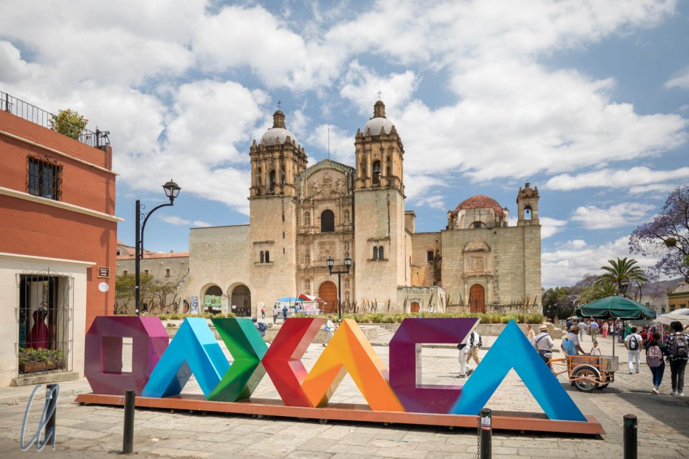
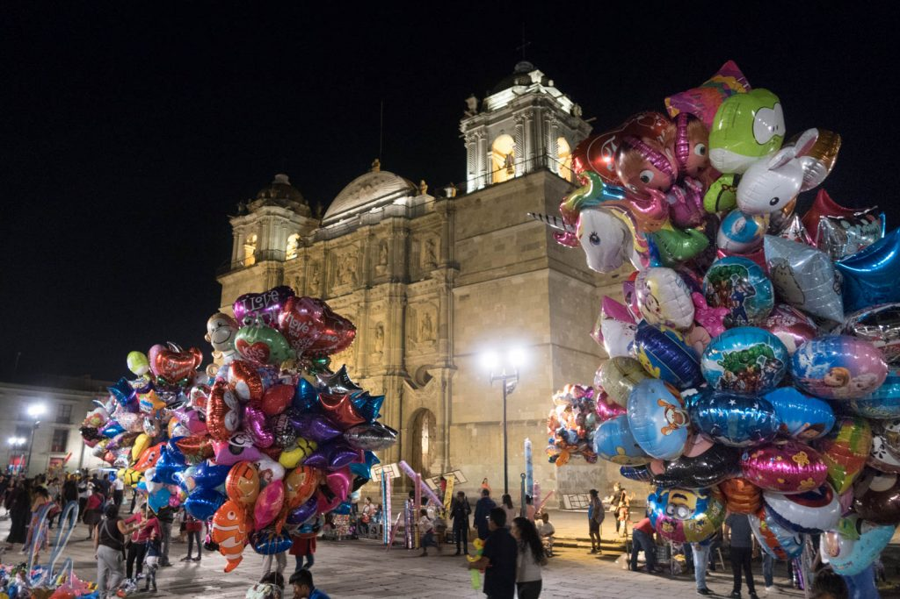
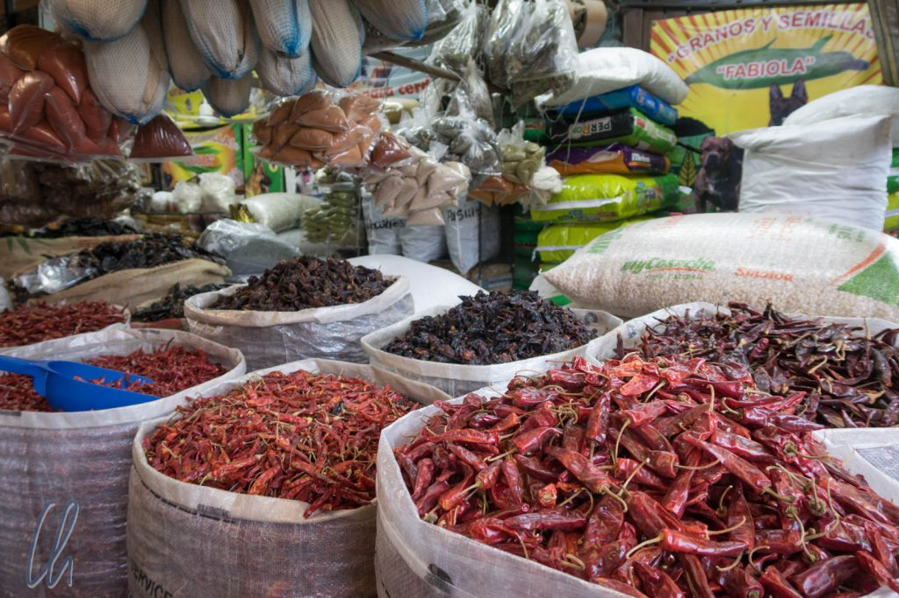
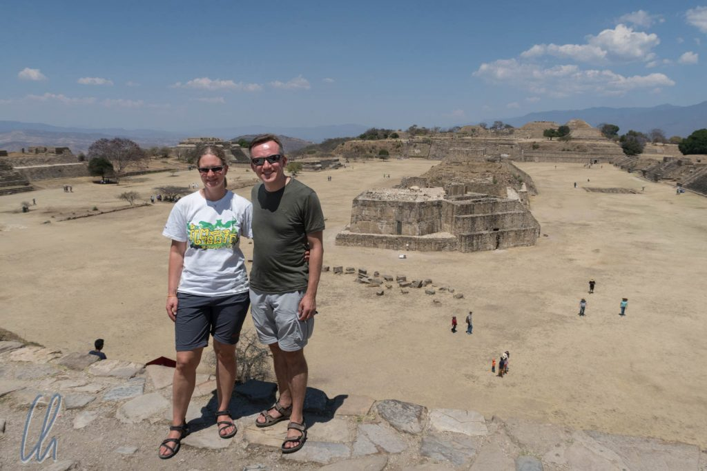
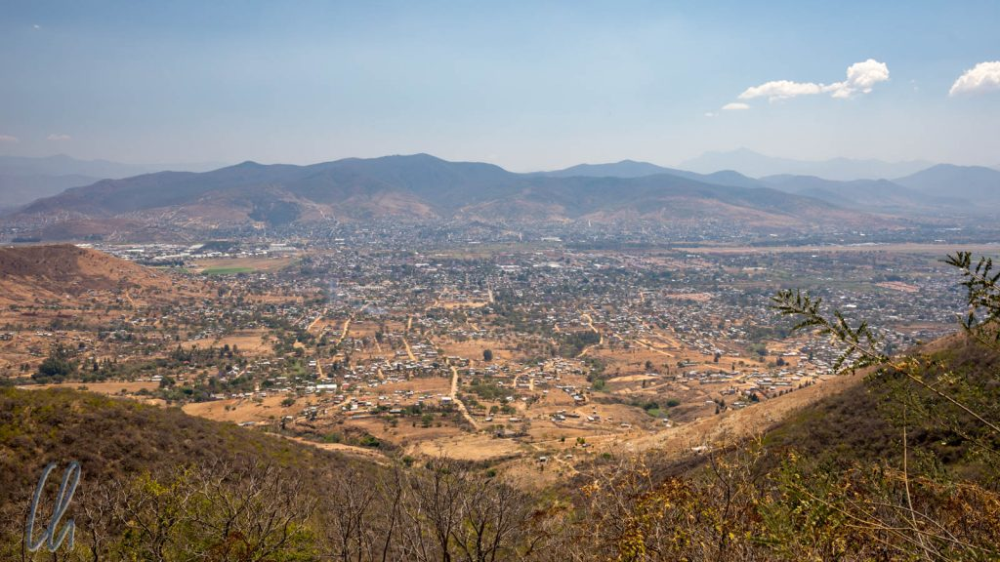
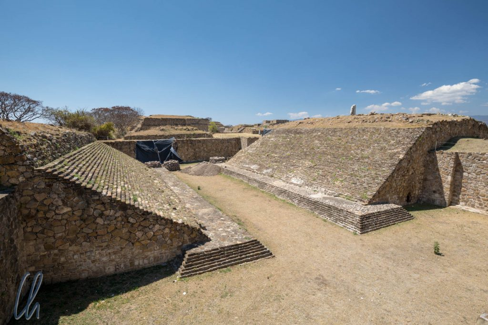

# In Oaxaca und um Oaxaca herum

Nach [Mexiko City](http://wittmann-tours.de/frueher-tenochti…eute-mexiko-city/) war Oaxaca unsere nächste Station, gut 8 Busstunden Richtung Südosten von Mexiko City entfernt. Trotz seiner fast 500.000 Einwohner wirkte Oaxaca auf uns fast wie eine Kleinstadt. Die höchsten Gebäude der Stadt sind die zahlreichen Kirchen. Die Straßen sind schmal, eng und abseits des Zentrums oft nicht geteert, stattdessen weisen sie ein holperiges Kopfsteinpflaster auf. Außerdem fiel uns sofort auf, dass die Gesichtszüge der Bevölkerung deutlich indigener sind und manche Frauen traditionelle Tracht tragen.

<!--more-->

## Lateinamerika wie aus dem Bilderbuch

Während Mexico City viele interessante Museen und Sehenswürdigkeiten bot, war hingegen in Oaxaca mehr das scheinbar seit Kolonialzeiten unveränderte Stadtbild an sich die Attraktion. In der Innenstadt, deren Straßen im Schachbrettmuster verlaufen und die nur aus Einbahnstraßen besteht, spielt sich vor der Kulisse der historischen Gebäude das normale Leben ab. Die prächtigen Kirchen der Stadt dominieren die Plätze und dort flanieren, essen, tanzen, musizieren und feiern die Oaxaqueños abends.

Neben dem Stadtbild sind auch die Märkte der Stadt sehr sehenswert. Samstags findet der große Markttag statt und damit sind die Markthallen, Plätze und Straßen übervoll mit vielen bunten, typisch lateinamerikanischen Waren: Tropisches Obst, frische und getrocknete Lebensmittel, traditionell bestickte Textilien, bunte Körbe, Lederartikel, Elektrozubehör, Spielsachen, Haushaltsgegenstände, diverse Plastikartikel und vieles mehr.

Die meisten Touristen besuchen zwar die Märkte, aber die Menschen aus Oaxaca und den umliegenden Dörfern sind deutlich in der Überzahl, vor allem wenn es um Mole und Schokolade (dazu in einem weiteren Beitrag mehr), Kinderspielzeug und alles rund ums Telefon geht. Außerdem gibt es Hüte, Schuhe, Insekten (zum Essen), Brot, Käse (typisch für die Region von Oaxaca), Honig, Blumen, Mais und Chilis in den verschiedensten Formen, Farben und Schärfegraden, um nur einige der gehandelten Artikel zu nennen.

## Monte Albán

Auch im Umland von Oaxaca gab es viel zu sehen. Ganz in der Nähe befindet sich zum Beispiel eine weitere ehemalige Hauptstadt eines präkolumbianischen Volkes. [Monte Albán](https://de.wikipedia.org/wiki/Monte_Alb%C3%A1n) war die Kapitale der [Zapoteken](https://de.wikipedia.org/wiki/Zapoteken) und erlebte seine Blütezeit von 300 bis 900 n. Chr. Ähnlich wie unser Ausflug nach [Teotihuacán](http://wittmann-tours.de/teotihuacan/) war der Besuch von Monte Albán für uns ein Tagesausflug.

Eine Verbindung und ein kultureller Austausch mit Teotihuacán fand damals über Handelsbeziehungen statt. Beide Städte waren einflussreiche Zentren. Auch die Gesellschaft der Zapoteken in Monte Albán war eine hoch entwickelte und arbeitsteilige Kultur, die ihre Macht über die Menschen und ihre Kontrolle der Natur schon durch die Lage der Hauptstadt demonstrierte. Wie der Name schon sagt, liegt Monte Albán auf einem Berg. Damit betonten die Machthaber symbolisch ihre Überlegenheit und Herrschaft über das landwirtschaftliche Umland. Ab ungefähr 200 n. Chr. wurde der Gipfel des Berges sogar abgetragen, um eine ebene Fläche zu schaffen, auf der dann große Teile der Stadt erbaut wurden. Alles musste mühsam dorthin gebracht werden, nicht nur die Handelswaren, sondern auch Lebensmittel und in der Trockenzeit sogar Wasser. Monte Albán verfügte über keine eigene Quelle.

## Landschaftlich und archäologisch interessant

Monte Albán besticht damit nicht nur durch seine archäologischen Qualitäten, sondern auch besonders durch seine Lage. Bei strahlendem Sonnenschein boten sich immer wieder spektakuläre Ausblicke über das rund 400 Meter tiefer liegende Tal von Oaxaca. Neben der reinen Ausdehnung der Anlage und den Plattformen, auf denen Tempel errichtet waren und die den Hauptplatz einrahmten, waren die archäologischen Höhepunkte der sehr gut erhaltene [Ballspielplatz](https://de.wikipedia.org/wiki/Mesoamerikanisches_Ballspiel) und die sog. „Danzantes“ (wörtlich die Tänzer).

Als „Danzantes“ werden eine ganze Serie von Flachreliefs bezeichnet, die verschiedene nackte Männer in unterschiedlichen Posen darstellen. Bei den Tänzen der „Danzantes“ handelte es sich allerdings keineswegs um einen Ausdruck von Lebensfreude. Stattdessen waren die Wandreliefs eine öffentliche Demonstration der kriegerischen Erfolge Monte Albáns. Abgebildet wurden gefangengenommene Anführer und Würdenträger unterworfener Städte, entkleidet, gedemütigt und den Zeichen ihres Standes beraubt. Sie wurden misshandelt, verstümmelt und den Göttern geopfert. Krieg zwischen den heute teilweise stark idealisierten präkolumbianischen Völkern war demnach eine grausige und brutale Angelegenheit, vor allem für die Verlierer.

Dass archäologische Stätten auch heute noch eine Bedeutung haben, erfuhren wir bei einer sehr interessanten Begegnung mit einem Hopi-Indianer aus Nordamerika auf der Südplattform von Monte Albán. Er war ebenfalls ein Besucher und auf der Suche nach seinen eigenen Wurzeln. Die Hopi betrachten ihr Volk und die präkolumbianischen Kulturen als Nachfahren gemeinsamer Ahnen. Neben vielen anderen Dingen erzählte er uns, dass sich die Hopi, wie auch die heutigen Bewohner der Region um Oaxaca, als "People of Maize" verstehen. Nach dem uralten Schöpfungsmythos wurden die ersten Menschen aus Maismehl geformt. Dies ist ein Konzept, das es in vielen mesoamerikanischen Kulturen (u.a. bei den Maya) gab und gibt. Nach Ansicht des Hopi-Indianers seien die präkolumbianischen Kulturen für ihre Verirrungen und ihre Unmenschlichkeit (z.B. das Praktizieren von Menschenopfern) bestraft worden und hätten darum ihren Einfluss verloren.

## Ausflug auf die Dörfer

Außerhalb von Oaxaca beginnt direkt das Land mit kleinen, bäuerlich geprägten Dörfern. Um die Logistik zu vereinfachen, buchten wir einen Tagesausflug bei einer lokalen Agentur, die uns zu vielen interessanten Orten führte. Wir sahen die Herstellung einiger lokaler Produkte, denen wir auf dem Markt schon begegnet waren: Textilien, Webarbeiten und natürlich Mezcal. Zusätzlich besuchten wir eine weitere interessante präkolumbianische Stadt und bekamen unerwartete Naturwunder zu Gesicht.

Der [Baum von Tule](https://de.wikipedia.org/wiki/%C3%81rbol_del_Tule) wird in Oaxaca und um Oaxaca herum gerne als der größte Baum der Welt bezeichnet. In gewisser Hinsicht ist das ein Aspekt der Wahrheit, aber bekanntlich kommt es immer darauf an, wie man die Statistik fälscht ;). Laut [Wikipedia](https://en.wikipedia.org/wiki/List_of_superlative_trees) ist diese mexikanische Sumpfzypresse "the stoutest tree in the world", also der stämmigste Baum der Welt, soll heißen, derjenige mit dem größten Stammdurchmesser. Wir hatten eher eine B- oder C-Sehenswürdigkeit erwartet, aber der Baum war wirklich sehr, sehr beeindruckend. Er überragte alles in der Umgebung bei weitem, sogar die direkt daneben stehende Kirche.

## Traditionelle Textilien & Mezcal

Ohne dass es in eine Kaffeefahrt ausartete, besuchten wir auch eine Weberei und eine Mezcalfabrik. Bei der Herstellung der Textilien war besonders interessant, wie die Wolle für die sorgfältig hergestellten Webarbeiten gefärbt wird. Der rote Farbstoff wird zum Beispiel aus [Cochenilleschildläusen](https://de.wikipedia.org/wiki/Cochenilleschildlaus) gewonnen, die auf bestimmten Kakteenarten leben. Was auf den Opuntien wie ein weißer Belag und nach dem Trocknen wie ein gräuliches Pulver aussieht, wandelt sich zu einem kräftigen Rot, sobald die Insekten zerdrückt werden.

Auch wenn die traditionelle Weberei sehr interessant war, stieg die Stimmung der Gruppe beim Mezcal-Tasting doch deutlich mehr. Vor das Probieren hatte die Reiseleitung jedoch die Wissenvermittlung gestellt ;) [Mezcal](https://de.wikipedia.org/wiki/Mezcal) ist der Oberbegriff für Schnaps, der aus Agaven, genauer gesagt aus ihren süßen Herzen, hergestellt wird. Tequila ist somit eine spezielle Sorte von Mezcal, da für Tequila nur die blaue Agave verwendet werden darf. Bei Mezcal gibt es mehr Freiheiten und es werden viele verschiedene Agavenarten verarbeitet. Den besten Schnaps liefern angeblich diejenigen Pflanzen, die wild gesammelt (d.h. nicht in Plantagen angebaut) werden.

Wir probierten also die verschiedenen Qualitätsstufen joven (klar und nur sehr kurz gelagert), reposado (mindestens 2 Monate in Holzfässern gereift) und anejo (längere Lagerung in Holzfässern, ein Jahr oder (viel) länger). Für alle diejenigen, denen der Mezcal zu stark oder zu rauchig war, gab es auch diverse Liköre mit Früchten, oder - unwiderstehlich - mit Dulce de Leche (Karamell) ;)

## Mitla

Mitla, eine wichtige Stadt der [Zapoteken](https://de.wikipedia.org/wiki/Zapoteken), gewann an Bedeutung, als Monte Albán schon seinen Zenit überschritten hatte. Der Ort wurde zunehmend zu einem kultischen Zentrum und einer Nekropole. Im 15. Jahrhundert eroberten und plünderten die Azteken die Stadt. Die Spanier ließen im Rahmen ihrer Missionierungsbemühungen eine Kirche mit dem Baumaterial der alten Gebäude auf dem Fundament der Tempel errichten, um der Ausübung der bisherigen Religion durch die indigenen Einwohner eine Ende zu bereiten. Heute ist Mitla vor allem für seine prachtvollen Mosaike und Steinreliefs mit einmaliger Wandornamentik bekannt.

In Mitla begegneten wir wieder den Spuren von Leopoldo Batres, dem ehemaligen mexikanischen Generalinspekteur der Monumente, unter dessen Leitung 1901 Ausgrabungen und Rekonstruktionen der Anlage durchgeführt wurden. Er ließ an einer der Originalwände im sogenannten „Saal der Säulen“ eine Inschrift anbringen, nach der das Beschmieren, Verschandeln und Beschädigen der historischen Stätten unter Strafe verboten sei...

Auch beim Ausflug nach Mitla erlebten wir wieder, dass die alten Völker in der Gegenwart nicht in Vergessenheit geraten sind. Unser Führer ("Antonio") bezeichnete sich selbst stolz als Zapoteken. Wenn er über religiöse Aspekte sprach, nannte er den Katholizismus gerne "die neue Religion".

Den Abschluss des Ausflugs auf die Dörfer bildete der spektakuläre Ausblick auf den "Hierve el Agua" (in etwa als "kochendes Wasser" zu übersetzen), etwas 25 Kilometer von Mitla entfernt. Dort befindet sich eine riesige Mineralformation am Berghang. Massive Ablagerungen mineralreicher Quellen sehen wie ein versteinerter Wasserfall aus.

## Mexiko in all seinen Facetten

Während die Baja California uns sozusagen als "Mexico light" erschienen war, so machte Oaxaca im Gegensatz dazu auf uns den Eindruck von 100% Mexiko. Die Stadt ist sehr sehenswert und aus gutem Grund im Zentrum recht touristisch. Kulturell haben Oaxaca und seine Umgebung viel zu bieten, außerdem haben wir die teils authentische, teils innovative Restaurantszene erkundet und fabelhaft gegessen. Nicht zuletzt war Oaxaca trotz vollen Programms für uns recht entspannt.

Nicht zuletzt war Sicherheit in Oaxaca anscheinend kein Thema. Niemand hat uns proaktiv vor bestimmten Orten gewarnt, auch nicht vor dem belebten Zócalo. Als wir am ersten Abend unser Hotel verließen, um zum Abendessen zu gehen, fragten wir an der Rezeption, ab wann die Haustür abgeschlossen sei und ob unser Schlüssel dafür passen würde. Die Fragen hätten wir uns sparen können, die Tür wird nie abgesperrt. Es gab auch kein Wachpersonal im Hotel. Todo tranquilo!

Unvergesslich wird das Geräusch von "Gas de Oaxaca" für uns bleiben. Täglich fährt ein Kleinlaster durch die Straßen, der Gas (i.S.v. Brennstoff) in Flaschen verkauft. Sein Kommen kündigt er über ein Megaphon an, aus dem aber keine hektischen Werbesprüche schallen. Stattdessen erklingt das sonore Muhen einer Kuh ("Muuuuhhhh!") :) gefolgt von der Durchsage "Gas de Oaxaca!" - das war's. Mehr Werbung ist nicht notwendig!
