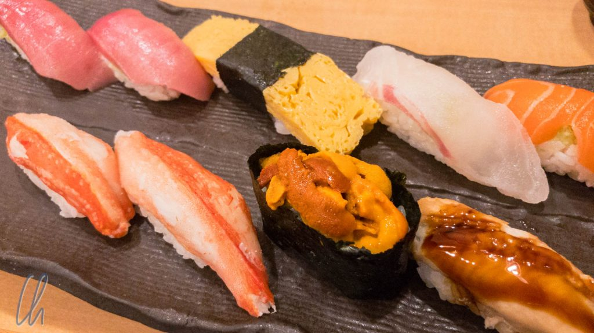
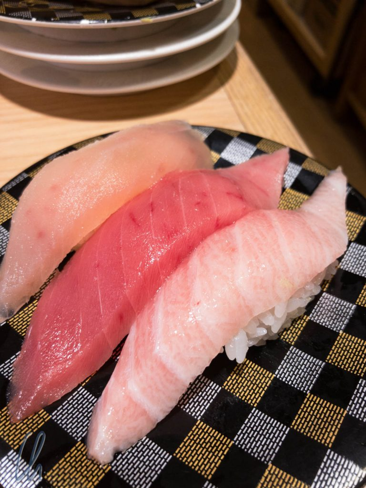
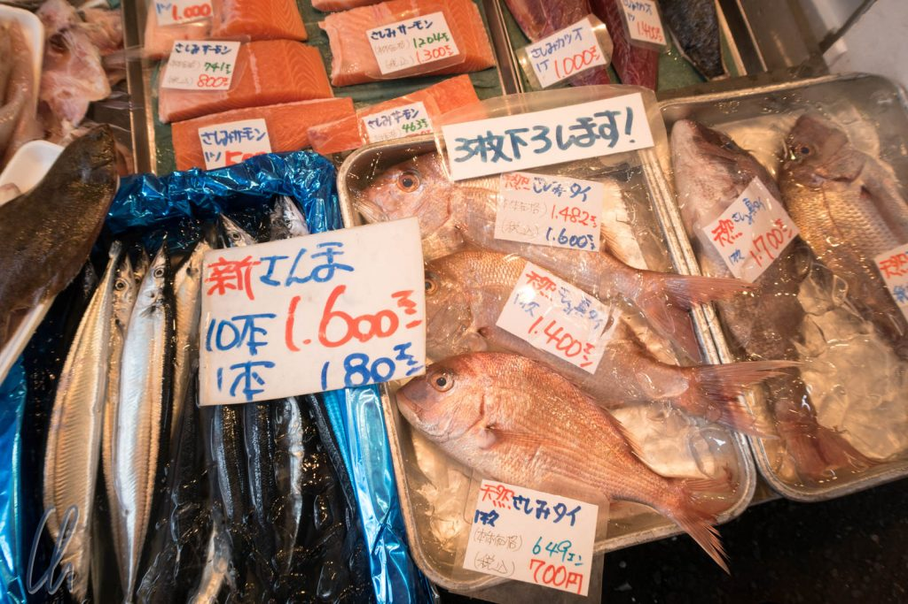

Was isst man in Japan? Sushi! Natürlich ist das ein Klischee, dennoch lag gleich am ersten Tag Sushi auf unseren Tellern. Aber was kommt den Japanern noch so zwischen die Stäbchen? Lasst uns kleinen kulinarischen Rundgang durch die japanische Küche machen!

Wie der Titel schon erahnen lässt, ist das Essen und Trinken in Japan ein größeres Thema. Daher teilen wir es in mehrere leichter verdauliche Häppchen auf. Es gibt so vielfältige, qualitativ gute, leckere und wunderbar angerichtete japanisches Gerichte!

<!--more-->

## Sushi und Sashimi

Bleiben wir aber zunächst beim Sushi, das in der Tat sehr beliebt ist. Ob als Laufband-Sushi, mit dem messerschwingenden Sushi-Meister hinter der Theke, oder als Kombination, Sushi gibt es in vielen Variationen und Preislagen. Das Sushi-Restaurant, welches wir am [ersten Tag ](http://wittmann-tours.de/erste-eindruecke-aus-tokyo/)besuchten, hatte sowohl ein Förderband, von dem wir die Tellerchen nehmen konnten, als auch ein iPad am Tisch, auf dem wir in einer bunt bebilderten App aussuchen und bestellen konnten. Kurze Zeit später kam die Bestellung auf einer anderen Ebene in einem Sushi-Shinkansen zu uns gefahren.

Als Vorspeise brachte uns der Shinkansen eine Sashimi-Auswahl. Die Theorie besagt, dass man Sashimi, also nur den rohen Fisch ohne Reis, am Anfang essen soll, um den feinen Geschmack besser würdigen zu können. Auch wenn unser erstes Sushi-Restaurant im Food-Court eines Einkaufszentrums und am unteren Ende der Preisspanne lag, so war die Sashimi-Variation sehr schön angerichtet und schmackhaft.

Danach kamen die Sushi auf den Teller. Thunfisch (Maguro) ist auch bei uns in Deutschland sehr bekannt und beliebt. Interessanterweise wird hier beim Thunfisch zwischen normal (dunkelrote Farbe) und verschiedenen Sorten von "Fatty Tuna" unterschieden: je heller desto fettighaltiger und desto höher die Qualitätsstufe und der Preis. Neben Thunfisch gibt es viele verschiedene andere Fischsorten, Muscheln, Krebse, Tintenfische, Rogen, See-Igel. Vieles davon sehr gut, einiges gewöhnungsbedürftig ;)

## Tsukiji Fischmarkt

Wer wissen möchte, wo all der Fisch in Tokyo herkommt, sollte den [Tsukiji Fischmarkt](https://de.wikipedia.org/wiki/Tsukiji-Fischmarkt) besuchen. Tsukiji ist zwar alles andere als ein Geheimtipp, aber trotzdem sehr sehenswert. Es ist angeblich der größte Fischmarkt der Welt!

Das Spektakel fängt mitten in der Nacht an. Weltberühmt ist die Thunfischauktion, für die man wohl gegen 2-3 Uhr morgens anstehen müsste, wenn man sie sehen wollte. (Das Kontingent an Besuchern pro Tag ist sehr klein). Auch wenn im Reiseführer steht, dass man das jetlag-geplagt gut machen kann, so trifft das nur für Touristen zu, die von Osten kommen, nicht also für uns. Somit haben wir auf die Thunfischauktion verzichtet und sind gegen 8:30 auf den Fischmarkt gegangen, um dort zu frühstücken und uns das Treiben anzuschauen.

## Der äußere Fischmarkt

Der Fischmarkt teilt sich in zwei Bereiche auf. Im inneren Fischmarkt (dem Großmarkt) wird gehandelt, und das Touristenvolk (von den wenigen Auserwählten abgesehen) darf erst hinein, wenn die Arbeit quasi getan ist, also ab 10 Uhr morgens. Der äußere Fischmarkt präsentiert sich als öffentlicher Markt mit vielen kleinen Gässchen, unzähligen Ständen, Geschäften und Restaurants, in denen der frische Fisch, Fischgerichte und Zutaten zur Zubereitung angeboten werden.

Auf den ersten Blick sieht der Fischmarkt etwas un-japanisch aus, ein Getümmel vom Menschen in engen Gassen und etwas Müll auf den Straßen (meist Styropor-Kartons). So verstehen wir, warum der Fischmarkt eigentlich umziehen soll, aber auch, warum es vermutlich nicht so einfach ist. Der Markt ist auf engstem Raum hocheffizient und lässt sich bestimmt nicht so einfach in eine moderne Variante überführen - zu allem Überfluss wäre damit das Flair des Markts vermutlich für immer verloren. Auch eher un-japanisch gibt es etwas öffentliches Aufbegehren: Einige Leute sammeln Unterschriften für die Erhaltung des Fischmarkts in seiner jetzigen Form. Für Tsukiji gilt aber anscheinend: "Totgesagte leben länger". Seit Jahren ist der Umzug geplant, aber er wurde schon mehrmals verschoben. Hoffen wir, dass eine gute Lösung gefunden wird.

Aber zurück zu unserer Verkostung: Erst gab es ein Fischküchlein mit Maiskörnern "paniert", diverse Spießchen mit Jakobsmuscheln, Oktopus, Gelbflossen-Thun und etwas später Sashimi-Variationen - wenn das mal kein Vollwertfrühstück ist ;). Was wäre nicht sonst noch alles im Angebot gewesen: Riesen-Austern, Aal, Mini-Calamari, cremiger Seeigel, allerhand getrockneter Fisch, Schalentiere, Hummer und vieles mehr.

## Der innere Fischmarkt

Nachdem wir uns gut gestärkt und viele Eindrücke gewonnen hatten, war es bereits 10 Uhr und auch wir durften den inneren Fischmarkt betreten. Im wesentlichen waren die Händler mit Aufräumen beschäftigt und die kleinen elektrisch angetriebenen Mini-LKWs fuhren durch die Gassen.

Wir als Touristen wurden nahe des Eingangs auf definierten Pfaden gehalten. Weiter im Markt konnten wir uns freier bewegen, aber oberste Maxime war: Nicht im Weg stehen! Hier wird gearbeitet, dies ist keine Touristenattraktion! Daher sind Führungen auf dem Fischmarkt auch verboten.

Hier und da wurde Fisch zerlegt, sorgsam eingewickelt oder mit Eis bedeckt, welches mit Schaufeln aus überdimensionalen Eismaschinen geholt wurde. Es gab Behälter mit lebendigen Meerestieren, die teilweise Fluchtanstrengungen unternahmen. Man sah die übriggebliebene großen Köpfe von Thunfischen, unglaublich riesige Muscheln und Krustentiere, aus übervollen Eimern lief Wasser auf den Beton, es wurde geschrubbt, stellenweise stand Blut in Pfützen auf dem Boden, Fischabfälle wurden gesammelt. An anderen Ständen zählten die Händler das eingenommene Geld oder waren schon in Freizeitlaune.

Weitere Impressionen rund um den Sushi, Sashimi und den Tsukiji-Fischmarkt findet ihr in der zugehörigen Bildersammlung:

\[envira-gallery id="632"]
