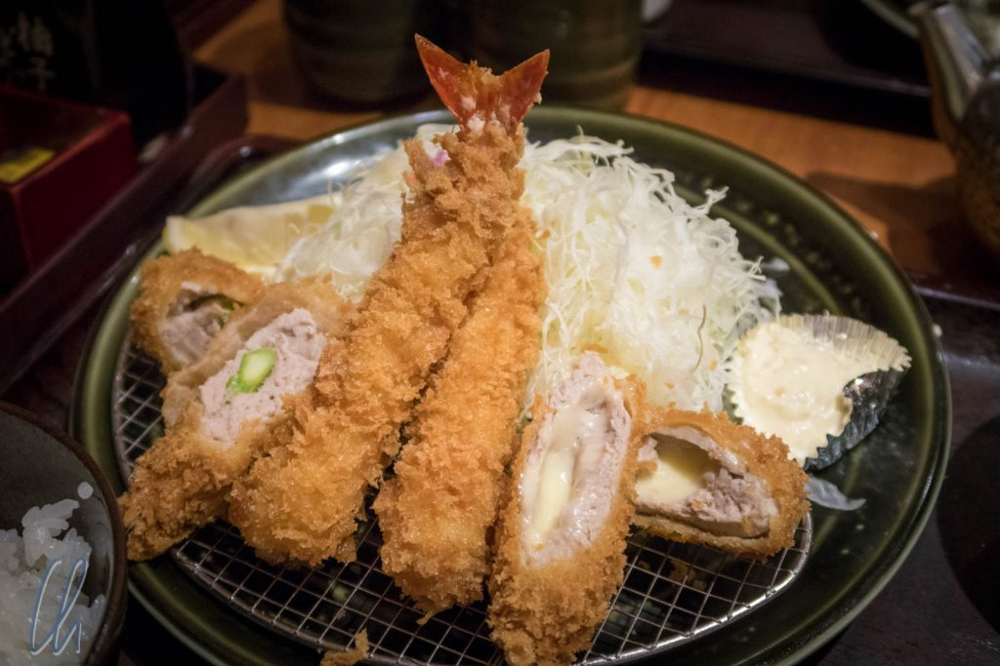

Wenn unser [erster kulinarischer Beitrag](http://wittmann-tours.de/japan-kulinarisch-sushi-sashimi-und-tsukiji/) etwas exotisch war, dann kommen wir jetzt zu den handfesten japanischen Köstlichkeiten: Wir essen ein japanisches Schnitzel, das hier Tonkatsu heißt.

<!--more-->

## Alles aus Plastik

[Japanische Speisekarten](http://www.wako-group.co.jp/menu/) sind manchmal schwierig zu lesen ;). Dort wo Touristen oder Ausländer unterwegs sind, gibt es in der Regel auch eine [Speisekarte auf englisch](http://www.wako-group.co.jp/en/menu.html). Beide Varianten sind meist ausgiebig bebildert - also kann kaum etwas schiefgehen. Zusätzlich gibt es bei der Auswahl noch eine weitere Hilfe: Ganz oft wird die komplette (!) Speisekarte im Form von Plastikatrappen ausgestellt. Man kann sich also im wahrsten Sinn des Ausdrucks ein sehr genaues Bild davon machen, was serviert wird und ist vor unangenehmen Überraschungen relativ sicher.

Dieses Bild entstand, während wir auf unseren Tisch im Restaurant warteten. Neben dem ausgestellten Essen kann ein weiterer Indikator für die Güte eines Restaurants die Schlange vor dem Restaurant sein. Je länger die Schlange, desto besser natürlich! Normalerweise bewegt sich die Schlange auch recht zügig, da es anscheinend nicht üblich ist, nach dem Essen lange im Restaurant zu verweilen. Während wir also in der Schlange immer weiter vorrückten, konnten wir die Speisekarte mit den Bildern studieren und natürlich auch das ausgestellt Plastikessen. Die Wahl fiel auf dieses Gericht:

Auf dem Foto sehr Ihr Tonkatsu, japanisches Schnitzel. Das Fleisch wird in einer extrem krossen Panade serviert. Wir bestellten ein Dreierlei aus Schwein mit Käse und Spargel gefüllt, sowie Garnelen. Es gibt natürlich aber auch größere Schnitzel aus Hühnchen, Schwein oder Hackfleich. Diese werden dann in Streifen geschnitten, damit sie mit Stäbchen gut zu essen sind. Als Beilagen werden ein Krautsalat, eine Misosuppe, eingelegtes Gemüse und natürlich Reis serviert.

## Tonkatsu wird serviert

Keine 20 Minuten später sind ca. 5 weitere Gruppen vor uns aufgerufen worden, und wir bekommen unseren Tisch. Natürlich müssen wir nicht lange aussuchen, geben sofort unsere Bestellung auf und erwarten voller Vorfreude unser Tonkatsu.

Bis auf die Anordnung der Schälchen stimmen Plastikmodell und Wirklichkeit erstaunlich gut überein. Was wohl passieren würde, wenn die Kellner aus Spaß mal ein Plastikessen verteilen würden? Wir sind froh, dass unsere Gerichte echt sind und köstlich duften. Wir geben etwas Salatsoße über den Krautsalat und etwas Spezial-Tonkatsu-Soße in das leere Tellerchen zum Dippen und lassen es uns schmecken - köstlich! Als kleinen Bonus fanden wir in der Misosuppe noch einige Mini-Muscheln :)
