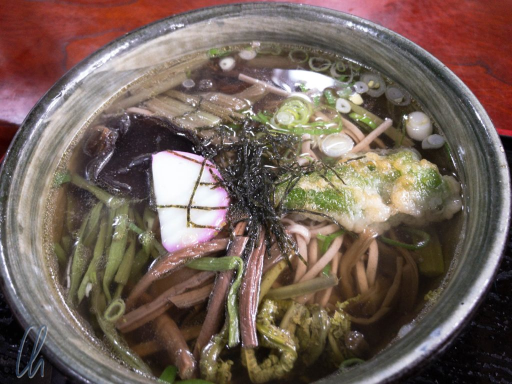
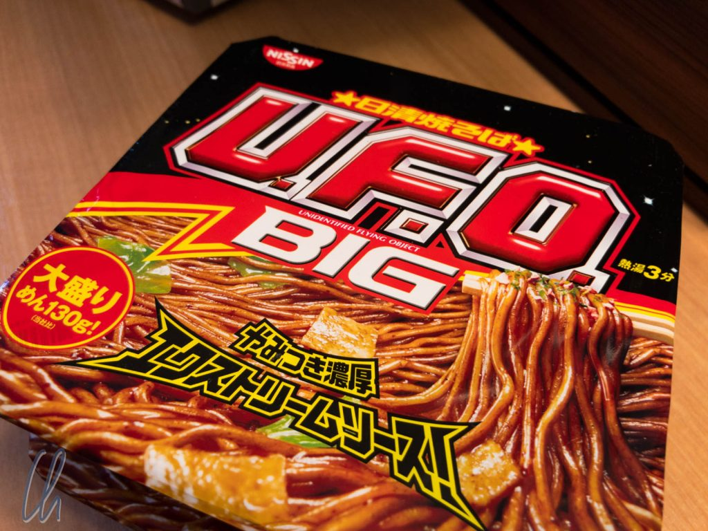
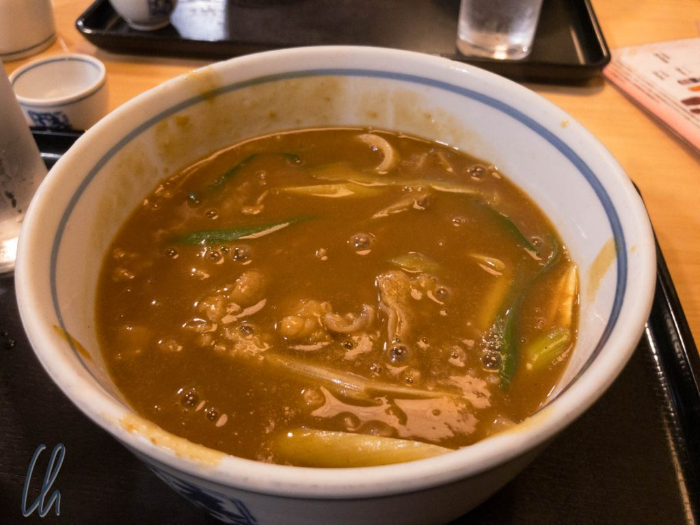
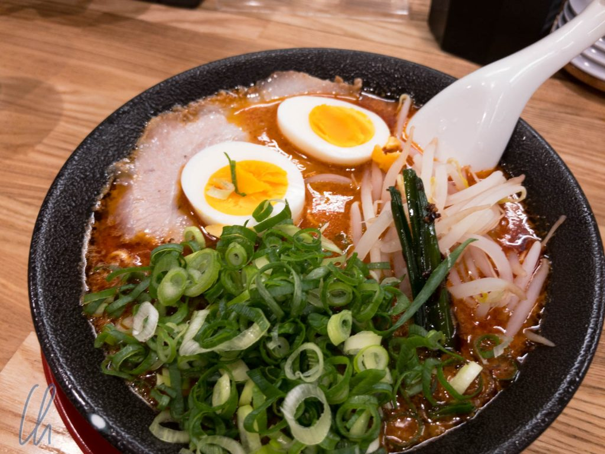
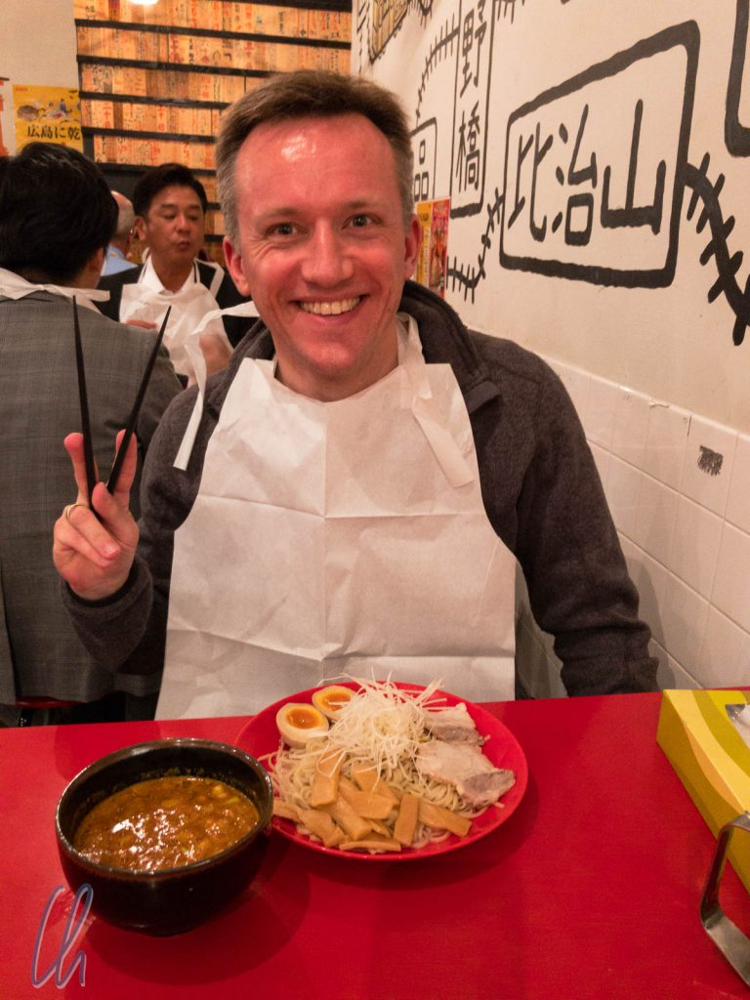

Was isst man in Japan? Reis natürlich! Das ist das Klischee, und es stimmt auch. Reis wird zum japanischen Frühstück, als Snack in Form von [Onigiris](http://wittmann-tours.de/wp-content/uploads/2017/10/APC_0460-1.jpg) (ein Bild ist direkt verlinkt), im Sushi, als Beilage oder Grundlage für verschiedene Gerichte und und und serviert. Egal welcher Statistik man glaubt ist Japan auf alle Fälle [einer der größten Reiskonsumenten der Welt](https://www.statista.com/statistics/255971/top-countries-based-on-rice-consumption-2012-2013/): Platz 9 in absoluten Zahlen. Beim pro Kopf Konsum ist Japan jedoch [nicht unter den Spitzenreitern](https://www.statsmonkey.com/bar/20600-list-of-countries-by-rice-consumption-per-capita.php). Ziemlich sicher liegt das an vielen schmackhaften Alternativen, allen voran den Nudeln, die in vielen verschiedenen köstlichen Varianten serviert werden!

<!--more-->

## Instant Nudeln

Verlässliche Statistiken rund um die Nudeln sind noch schwieriger zu finden als zu Reis. Auf der Suche fand ich die International Pasta Organization (was es nicht alles gibt!), aber die [listet leider keine asiatischen Länder](http://www.internationalpasta.org/index.aspx?idsub=118).

Eine weitere spannende [Quelle](https://instantnoodles.org/en/common_en/pdf/EN_MARKET_VOLUME_3LG_A4_2016.pdf) befasst sich mit Instant Nudeln, die auch in Japan von Herrn [Momofuku Andō](https://de.wikipedia.org/wiki/Momofuku_And%C5%8D) erfunden wurden. Hier mischt Japan ganz vorne mit und belegt den dritten Platz im weltweiten Ranking (in absoluten Zahlen). Als [Taifun Lan](http://wetterkanal.kachelmannwetter.com/starker-taifun-lan-trifft-heute-auf-japan/) unser Programm für 2 Tage zum Stillstand brachte, haben wir uns auch "Notfall-Nudelsuppen" gekauft, um nicht in die Verlegenheit zu geraten, durch den Taifun zum Essen spazieren zu müssen.

Da es also DIE Nudel-Statistik nicht gibt, schauen wir uns doch einfach um: Es gibt Ramen, Soba und Udon als Hauptvarianten japanischer Nudeln. Zusätzlich gibt es noch lokale Varianten, wie zum Beispiel Kishimen in Nagoya. Aber was zeichnet diese verschiedenen Nudeln eigentlich aus? Schauen wir genauer hin!

## Ramen Nudeln

Es gibt sehr viele Restaurants, die sich auf bestimmte Arten von Nudeln spezialisiert haben, allen voran die beliebten [Ramen](https://de.wikipedia.org/wiki/Ramen) Nudeln, die bei uns sogar die [erste Mahlzeit auf japanischem Boden](http://wittmann-tours.de/erste-eindruecke-aus-tokyo/) darstellten. Dabei handelt es sich um Eiernudeln, die ursprünglich aus China kommen. Mitlerweile haben sie tiefe japanische Wurzeln.

Ramen-Restaurants zielen gefühlt eher auf ein junges Publikum und bieten vielfältige Variationen an. Eine typische Ramen-Nudelsuppe kommt nach unserer Wahrnehmung in einer beachtlichen Schüssel daher. Neben den Nudeln befinden sich durchwachsene Schweinefleischstücke, ein bis zwei halbe, wachsweich gekochte Eier, Frühlingszwiebeln, Sojasprossen und vielerlei mehr in der Brühe. Diese gibt es in verschiedenen Varianten: auf Basis von Soya, Miso oder als Brühe, die durch Auskochen von Schweinefleisch und -knochen entsteht.

Auch wenn viele Restaurants stark auf Durchsatz getrimmt sind, indem z.B. Automaten den Bestell-Prozess übernehmen, so sollte man mind. 30 Minuten einplanen. Ramen ist also im engsten Sinne kein Fast-Food, auch wenn es vielleicht zuweilen so wahrgenommen wird. Die Mindestgenussdauer der dampfende Nudelsuppe richtet sich stark nach dem persönlichem Temperaturempfinden, so dass es vor allem am Anfang ein heißes Vergnügen sein kann. Im Gegensatz zum Ketten-Burger ist die Nudelsuppe natürlich nicht lauwarm.

## Nudel-Etikette

Die perfekte Schlürftechnik, die von den einheimischen Meistern praktiziert wird und gesellschaftlich akzeptiert zu sein scheint, mag durchaus dabei helfen, die Nudelsuppe zügiger zu inhalieren. Ähnlich wie bei einer gelungenen Weinprobe wird aber auch auf den Geschmacksgewinn durch das Schlürfen hingewiesen. Wir halten uns dabei aber eher vornehm zurück ;).

Ehrensache ist, dass Nudelsuppen mit Stäbchen und Löffel gegessen werden. Dabei werden die Nudeln mit den Stäbchen gegriffen, zum Mund geführt und dann quasi angesaugt, wodurch das Schlürfen entsteht. Mit den Stäbchen schiebt man parallel mehr Nudeln nach, strukturiert das Nudelknäuel und sorgt nach einer mundgerechten Portion dafür, dass die die Nudelzufuhr beendet wird - abbeißen ist auch möglich. Der Löffel wird dazu benutzt, die Brühe zu trinken. Die wahren Profis halten die Stäbchen in der einen und den Löffel in der anderen Hand, um auch hier parallel zu arbeiten.

Wer jetzt den Eindruck hat, dass Ramen (ähnlich wie Spaghetti mit Tomatensoße) der größte Feind von frisch gewaschener Kleidung sind, der hat vollkommen Recht! Aber auch hier haben die Japaner natürlich wieder mitgedacht. In vielen Ramen-Restaurants gibt es wunderbare Papier-Lätzchen von durchaus ansehnlicher Größe, die man sich umbinden und so die eigene Kleidung fleckenfrei halten kann. Und tatsächlich benutzen sehr viele Gäste die Lätzchen!

## Soba und Udon

Soba und Udon sind eher die traditionellen japanischen Nudeln. Dabei sind, ganz vereinfacht, Soba die dünnen und Udon die dicken Nudeln. Genauer gesagt sind Udon Nudeln aus Weizenmehl. Sie sind deutlich dicker als die durchschnittlichen Nudel der westlichen Welt, dabei durchaus glitschig (aber griffiger als Glasnudeln) und recht lang, was es nicht einfacher macht, sie mit Stäbchen zu essen. Auch hier bewährt sich natürlich die oben beschriebene Technik.

Soba sind dünne Buchweizen-Nudeln, die zuweilen bräunlich aussehen, zumindest deutlich dunkler als Udon. Außerdem sind sie griffiger als Udon und damit vermeintlich am einfachsten zu essen.

Besonders in der Udon-Suppe schwimmt gerne ein rosa-weißes, künstlich aussehendes, mysteriöses Scheibchen. Hierbei handelt es sich um ein [Kamaboko](https://de.wikipedia.org/wiki/Kamaboko), eine spezielle Art von [Surimi](https://de.wikipedia.org/wiki/Surimi), das auch [Narutomaki](https://en.wikipedia.org/wiki/Narutomaki) heißt, wenn es spiralförmig aussieht. Alles klar? Nicht? Ok, es ist pürierter Formfisch, analog zum Leberkäse, wenn wir Wikipedia glauben dürfen. Legenden, es handele sich dabei um Teile von Haifischen, sind damit widerlegt.

Soba und Udon treten auf der Speisekarte häufig im Doppelpack auf. So kann man in den meisten Nudelrestaurants bei vielen Gerichten zwischen beiden Nudelarten wählen. Beide werden nicht unbedingt als Suppe serviert, sondern auch als Trennkost. Nudeln und Soße, sei es Sojasoße oder andere Kreationen, werden separat serviert. Beim Verzehr dippt man die Nudeln dann in die Soße. Zusätzlich hat man oft die Wahlmöglichkeit, heiße oder kalte Nudeln serviert zu bekommen. Bisher haben wir die kalten nicht bestellt, aber wir stellen es uns im Sommer sehr erfrischend vor.

Weitere Darreichungsformen sind Yaki-Soba (gebratene Soba-Nudeln), was schon in die Richtung eines Okonomiaki geht oder Currys (die es natürlich auch mit Reis gibt; ein Curry-Beispiel war oben schon abgebildet). Der Kreativität rund im die Nudel sind also keine Grenzen gesetzt.

