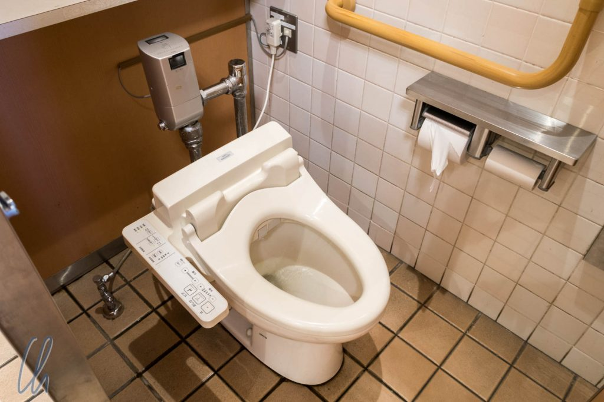

# Japans Toiletten

Auf Reisen sind zuweilen die beiden wichtigsten Grundbedürfnisse ein Bett zum Schlafen und eine saubere Toilette. Beides ist in Japan in der Regel kein Problem, aber die japanischen Toiletten können auch ein echtes Erlebnis sein. Auch wenn es vielleicht etwas befremdlich klingt: Lasst uns die japanischen stillen Örtchen aufsuchen!

<!--more-->

## Die High-Tech Toiletten

Das Klischee einer japanischen Toilette besteht aus einem Toilettensitz, wie wir ihn in der westlichen Welt kennen, und einer Schaltzentrale aus Knöpfen, die vermuten lassen, es handele sich um den Schleudersitz eines Space Shuttle:

Manchmal findet man vor lauter verschiedenen Knöpfen und berührungslosen Sensoren erst nach einigem Suchen den, der schlicht die Spülung auslöst.

In der Tat findet man solche Toiletten häufiger: In Hotelzimmern und sogar auf öffentlichen Toiletten. Zu den typischen Austattungsmerkmalen gehören das Bidet mit regulierbarem Wasserdruck, einstellbarer Positionierung und variabler Wasserstrahlart und -frequenz. Aber wie kommt man als Ausländer in den Genuss all dieser Funktionen? Hoffentlich hängt eine Gebrauchsanleitung daneben!

Auf öffentlichen stillen Örtchen gibt es meistens die Möglichkeit, ein Wasserplätschern zur akustischen Untermalung in variabler Lautstärke zuzuschalten, um eigene Körpergeräusche zu übertönen. Manche WCs verfügen zusätzlich noch über eine Verbindung zur Lüftung des Bads: Die Lüftung wird eingeschaltet, wenn man sich auf’s Töpfchen setzt. Sobald man sich wieder vom Thron erhebt, erhöht die Lüftung ihre Leistung, um unerwünschte Gerüche schleunigst abzusaugen. Deluxe-Modelle verfügen sogar über eine Sitzheizung, unabdingbar im Winter! Das Non-Plus-Ultra sind sich automatisch öffnende oder schießende Deckel und/oder Brillen, einige sogar mit Bewegungsmelder. Stellt Euch vor, ihr betretet die Kabine, und auf einmal öffnet sich der Deckel wie von Geisterhand!

https://www.youtube.com/watch?v=3H9NEv8DZA0

## Back to the Basics

Am anderen Ende der Skala gibt es - seltener - diese Variante, mit der wir Westler oft wenig anfangen können.

Interessant ist nicht nur der rosa Frottee-Toilettenpapierhalter, sondern auch das separate Mini-Waschbecken auf dem Spülkasten. Der Wasserhahn ist mit der Spülung kombiniert und läuft beim Spülen, so dass man sich die Hände waschen kann. Das zum Waschen verwendete Wasser läuft dann in den Spülkasten. Zum richtigen Spülen sind die 2 folgenden Kanji-Zeichen wichtiges Grundvokabular: 小 bedeutet klein und 大 bedeutet groß - leider stehen die beiden nicht auf dieser Anleitung:

## Die besondere Erfahrung

An vielen heiligen Orten (hier sind jetzt echte Tempel gemeint) oder auch in japanischen Häusern heißt die Losung: “Schuhe ausziehen“. Auf japanischen Toiletten hingegen heißt es “Slipper anziehen”. Übernachtet man in einem Ryokan (einer traditionellen japanischen Unterkunft), so findet man auf dem Örtchen besondere Hausschuhe vor, die NUR für die Toilette gedacht sind. Wer die Slipper auch woanders trägt, tappt damit gehörig ins Fettnäpfchen. Einmal fand ich sogar klassische japanische Holzschuhe auf einer öffentlichen Herrentoilette vor:

Auch wenn sich das jetzt alles vielleicht recht exotisch anhört, die zahlreichen Extrafunktionen der Toiletten gibt es nicht immer, und man muss sie schließlich nicht benutzen. So gestaltet sich der durchschnittliche Besuch wenig aufregend, zuweilen amüsant, aber immer erleichternd :).

Ein lobendes Fazit zur japanischen Toilettenkultur: Öffentliche Toiletten sind immer kostenlos, und es gibt sie fast überall: An Bahn- oder U-Bahn-Stationen, in Kaufhäusern, bei Sehenswürdigkeiten... Außerdem sind sie fast immer vorbildlich sauber und mit Toilettenpapier ausgerüstet - da bleiben keine Wünsche offen!

Wir wünschen allerseits gute Geschäfte!
