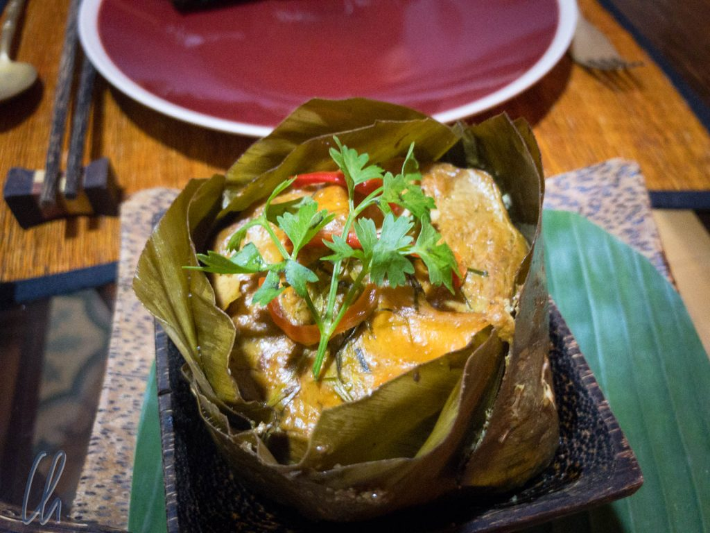
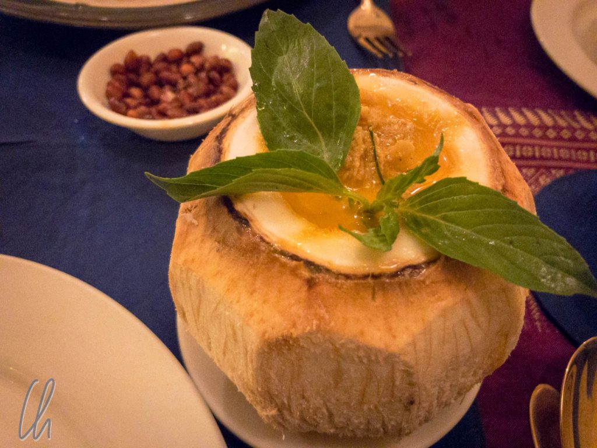
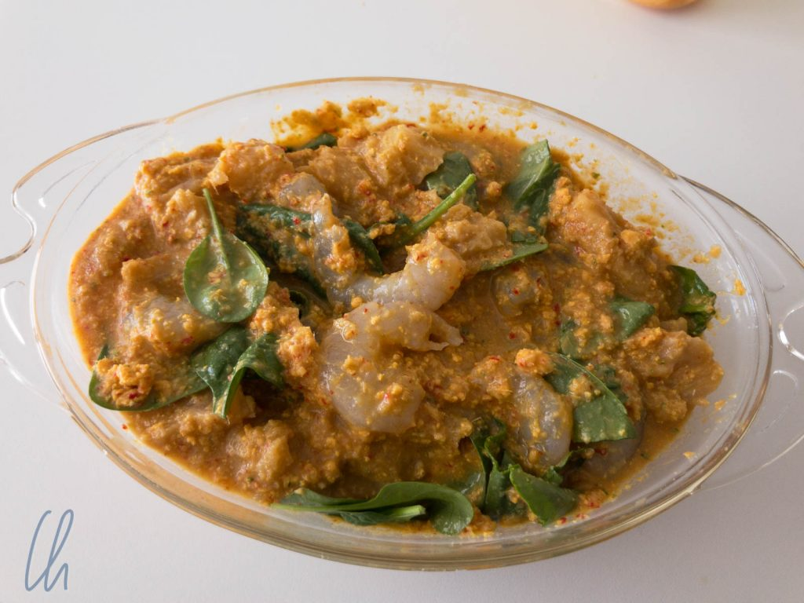
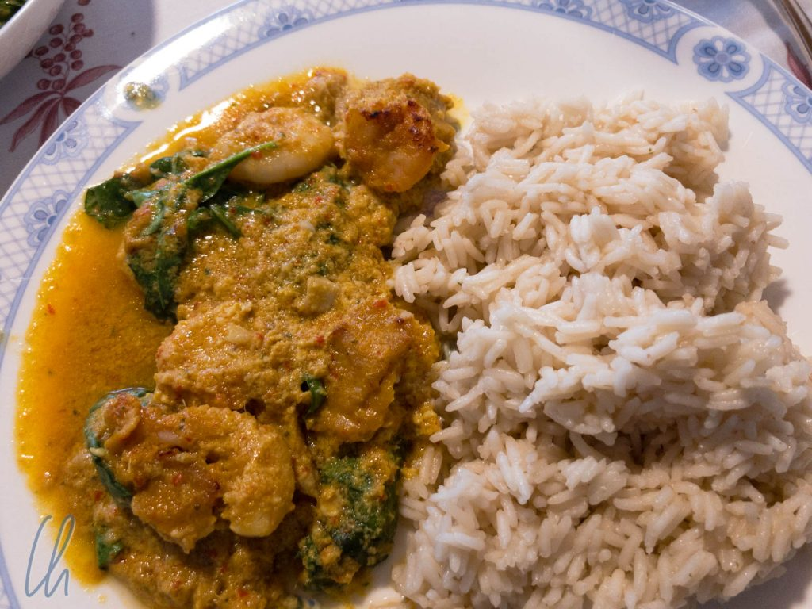

# Kambodscha kulinarisch: Amok

Das Nationalgericht Kambodschas heißt Amok und ist wesentlich ungefährlicher, als es sich anhört. Amok zeichnet sich nicht durch Schärfe, sondern durch ein feines Aroma aus. Besonders verbreitet ist Fisch-Amok, aber es existieren auch viele andere Varianten: Mit Hühnchen, Schwein, Gemüse, ganz nach Belieben. Dies ist ein Mitmach-Blog-Post. Unten findet Ihr das Rezept zum Nachkochen!

<!--more-->

## Amok im heroischen Selbstversuch

Was genau ist dieses Amok? Schwierig zu sagen: Wenn man es Curry nennen würde, dann wäre dies nur die halbe Wahrheit. Vielleicht könnte man es am ehesten als eine Art Auflauf bezeichnen: Der Fisch wird in einer speziellen Gewürzpaste mariniert und anschließend in einem Körbchen aus Bananenblättern gedämpft und mit Reis serviert. So haben wir es in Kambodscha gerne und häufig gegessen. Zwischen den Jahren in Neuseeland hat Mona der Ehrgeiz gepackt: Wir kochen Amok!

Das Nachkochen solcher Gerichte in westlichen Ländern scheitert oft schon an der Beschaffung der Zutaten. Die offensichtliche Hürde sind hier die Bananenblätter, aber auch im Detail mussten wir ein paar Abstriche machen. Mona hat lange und ausführlich recherchiert und ein [Rezept](http://mjamm.com/rezept-fisch-amok-kambodscha) so angepasst, dass es auch außerhalb von Kambodscha funktioniert, vorausgesetzt man hat Zugriff auf ein gut sortiertes asiatisches Lebensmittelgeschäft.

## Die Zutaten für ein köstliches Amok

Unser Einkaufszettel war lang und dank eines exzellenten Asialadens in Christchurch haben wir auch bekommen, was wir brauchten. Hier die Liste der Zutaten mit Mengenangaben für 3-4 Personen:

7 Stangen Zitronengras 3 cm Galangawurzel (Galgant) 2 TL Kurkuma 6 Kaffirlimettenblätter 4 Knoblauchzehen 0,5 Limetten (Saft) 2 frische rote Chilis (ohne Kerne) 0,5 Zwiebel 2 EL Fischsauce 1,5 TL brauner Zucker 200 ml Kokoscreme (keine Kokosmilch!) 0,5 TL Salz 250g Kabeljau (oder einen anderen Fisch mit festem weißen Fleisch) 250g Garnelen 1 Ei, vielleicht eher 2 (kommt auf die gewünschte Konsistenz an) 1/3 TL Ingwer Paste Ein paar Spinatblätter

## Die Zubereitung

Bei der Zubereitung wird zunächst die Gewürzpaste angefertigt. Hierzu zunächst vom Zitronengras die äußeren, gröberen Blätter entfernen und die Stängel in kleine Stücke schneiden. Von den Kaffirlimettenblättern den mittleren Stiel entfernen und ebenfalls in kleine Stücke schneiden. Die Galangawurzel putzen, ggf. braune Stellen entfernen und in kleine Würfel zerteilen. Die Chilies entkernen und in Stücke schneiden. Zwiebel und Knoblauch würfeln. Ins Zerkleinern braucht ihr nicht zu viel Mühe stecken, da später sowieso alles in den Mixer kommt.

Anschließend im Mixer aus den folgenden Zutaten die Gewürzpaste herstellen: Zitronengras, Kaffirlimettenblätter, Galangawurzel, Knoblauch, Zwiebel, Chillies. Nach und nach weiterhin hinzufügen: Kurkuma, Limettensaft, Fischsauce, Zucker, Salz, Ingwer. Alles mehrmals gut und ausdauernd durchmixen, bis eine wirklich feine Paste im Mixer entstanden ist. Anschließend die Kokoscreme hinzufügen und erneut durchmixen. Abschmecken und nach eigenem Geschmack nachwürzen.

Nun die Garnelen und den Fisch putzen und den Fisch in mundgerechte Stücke schneiden. Das Meeresgetier für mindestens 2 Stunden im Kühlschrank in der Gewürzpaste marinieren.

## Ab in den Ofen

Den Ofen auf 180°C (Ober- und Unterhitze) oder 160°C Umluft vorheizen. Das rohe Ei und den Spinat unterrühren und in eine gefettete Auflaufform geben. (Im Original füllt man die Masse portionsweise in kleine, selbst angefertigte Körbchen aus Bananenblättern und dämpft die Pakete dann.) Die ofenfeste Form sollte nicht zu breit sein, das Amok sollte ca. 10cm hoch hinein gefüllt werden. Ca. 40 Minuten im Ofen garen. Im Endergebnis sollte das Gericht leicht stocken, also keinesfalls flüssig sein.

Am besten serviert Ihr Amok mit Jasminreis als Beilage und nach Belieben mit einem grünen Salat.

Lasst es Euch schmecken!

