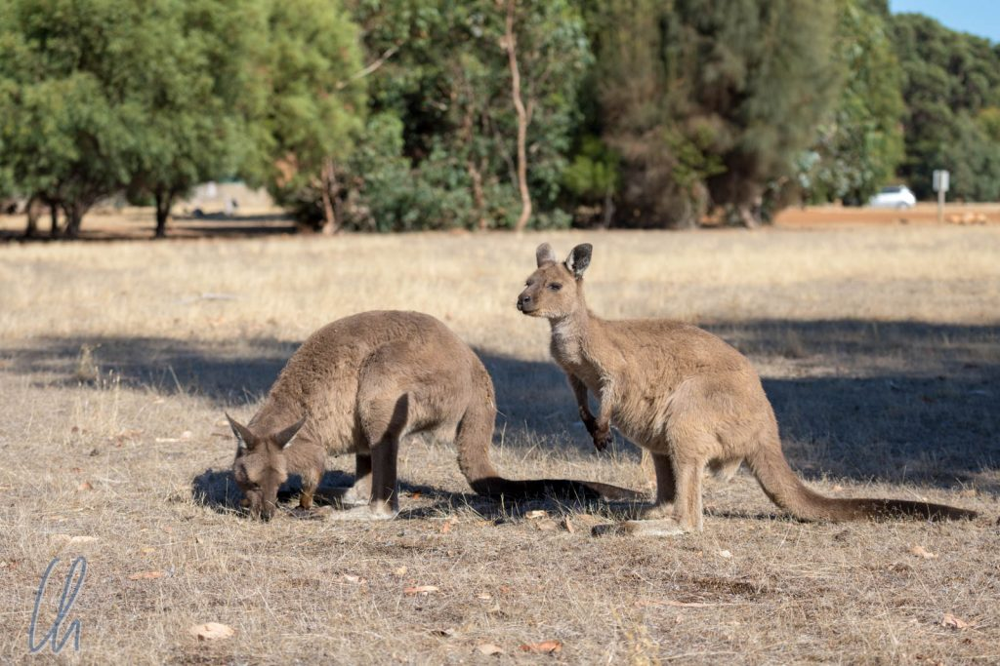
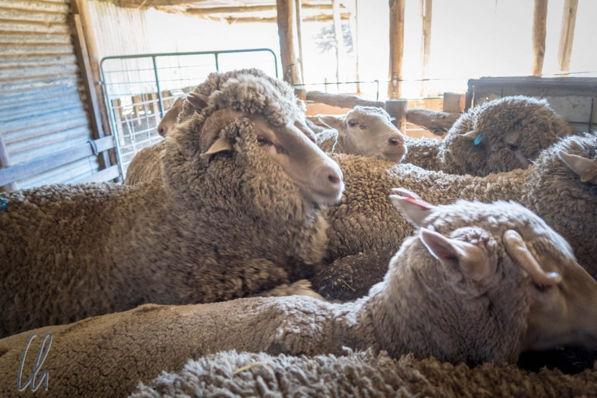

# Kangaroo Island

Warum fährt man nach Kangaroo Island? In der Tat gibt es reichlich Gelegenheit, Kängurus zu sehen, auch wenn sich der Name nicht nur aus dem Vorkommen der Beuteltiere ableitet. Außerdem genehmigte sich der Entdecker und Kartograf [Matthew Flinders](https://de.wikipedia.org/wiki/Matthew_Flinders) nach seiner ersten Ankunft auf dem Eiland sich und seiner Mannschaft ein Festessen aus dem Fleisch der Tiere. Interessanterweise unterscheiden sich die dortigen Kängurus in ihrem Aussehen etwas von ihren Verwandten auf dem Festland. Die drittgrößte Insel Australiens hat aber wesentlich mehr zu bieten. Auf einer 2-tägigen Tour durften wir einige der zahlreichen Attraktionen erleben.

<!--more-->

## Sheepdog und Sheering Show

Noch vor Einsetzen der Morgendämmerung wurden wir in Adelaide mit einem Bus abgeholt. Nach einer windigen und wellenreichen einstündigen Überfahrt erreichten wir Kangaroo Island gegen 9:30 Uhr. Der erste Programmpunkt war der Besuch einer Sheepdog und Sheering Show. Was kann man sich darunter vorstellen? Nun, auf Kangaroo Island war die Schafzucht historisch betrachtet der wichtigste Wirtschaftszweig. Die Merinoschafe werden wegen ihrer Wolle gehalten.

Einmal pro Jahr werden die Schafe geschoren und von ihrem dicken Pelz befreit. Die [Sheepdogs](https://en.wikipedia.org/wiki/Sheep_dog), keine Schäferhunde (Vorsicht, false friend!), sondern in diesem Falle Border Collies, sind unentbehrliche Helfer bei der Arbeit mit den Schafen. Wie die Farmer sagen ersetzt ein guter Hund 2-3 Menschen. Sie treiben die Schafe zusammen und zum gewünschten Ziel. Wenn's richtig eng wird, klettern sie sogar über die Rücken der Schafe, um einen Stau in der Schafherde aufzulösen.

Auf der Farm, die wir besuchten, trieb der Border Collie ein paar Demo-Schafe zu uns und eines der Schafe wurde anschließend geschoren. Der Hund hatte die Schafe in null Komma nichts in die Umfriedung getrieben und der Farmer suchte das zu scherende Schaf aus. Dieses wurde quasi auf den Hintern gesetzt und aus dem Vlies geschält. Die Schafschur dauerte vielleicht 3 oder 4 Minuten und anschließend hatte das Schaf eine schicke Kurzhaarfrisur ;)

## Der Seelöwen-Strand und die kleine Sahara

Nach dem Mittagessen war die Seal Bay der nächste Stopp. Dort besuchten wir die [australischen Seelöwen](https://de.wikipedia.org/wiki/Australischer_Seel%C3%B6we). Diese wurden leider in der Vergangenheit wegen ihres Pelzes stark bejagt und auch heute haben sich ihre Populationszahlen nicht erholt, obwohl sie unter Schutz stehen. Das besondere an diesem Ort ist, dass man die Meeressäuger nicht nur von einer Aussichtsplattform aus der Ferne anschauen darf, sondern auf den Strand laufen kann, wo sie sich von ihren 3-tägigen Ausflügen ins Meer erholen. So kamen wir den Tieren sehr nahe, der Abstand war etwa 30 oder 40 Meter, und beobachteten ihre Interaktionen. Da es in der Vergangenheit ein paar Zwischenfälle gegeben hat, ist der Zugang nur noch mit Ranger erlaubt, was aber sehr informativ war.

Anschließend ging es zum Sandboarding in die Sanddünen der sogenannten Little Sahara. Da wir keine Snowboarder sind, wählten wir den Schlitten als Sandsportgerät. Die Besteigung der Dünen war bei gefühlten 35 Grad in der Sonne recht anstrengend und schweißtreibend. Die Mühe wurde aber durch die rasante Abfahrt belohnt. Auch wenn sich die Geister in Bezug auf die beste Technik schieden, auf dem Bauch liegend funktionierte es bei mir am besten :)

## Wenn Koalas zur Plage werden

Am nächsten Morgen - der Morgennebel hing noch in den Bäumen - war unser erster Stopp das [Hanson Bay Wildlife Sanctuary](https://www.hansonbay.com.au/), wo wir endlich die ersten Kängurus auf der Insel aus nächster Nähe sahen ([erstes Foto dieses Beitrags](http://wittmann-tours.de/wp-content/uploads/2018/04/CW-20180204-090532-5679-1.jpg)). Der eigentliche Grund für den Besuch des Tierschutzgebietes aber waren die [Koalabären](https://de.wikipedia.org/wiki/Koala), die dort sehr zahlreich vertreten sind. Es war gar nicht so einfach, die Tierchen im Laub zu entdecken, die sich die meiste Zeit wenig oder gar nicht bewegten. So mussten wir zwar die Baumkronen der Eukalyptusbäume sorgfältig absuchen, fanden aber wirklich vergleichsweise einfach mehrere Tiere. Es gab auch ein paar Junge zu sehen, und einige der Koalas waren sogar wach!

Eigentlich sind die Koalas auf Kangaroo Island nicht heimisch, sondern sie wurden dort angesiedelt. Wie so häufig, wenn eine Geschichte so beginnt, endet sie nicht unbedingt gut. Die knuffigen Tierchen vermehrten sich prima und brachten leider das natürliche Gleichgewicht der einheimischen Flora durcheinander. Vor allem die [Manna Gum Bäume](https://de.wikipedia.org/wiki/Rutenf%C3%B6rmiger_Eukalyptus) (Rutenförmiger Eukalyptus) leiden unter den großen Beständen der Koalas. Natural Resources Kangaroo Island ist daher aktiv damit beschäftigt, die [Koalazahlen zu reduzieren](http://www.naturalresources.sa.gov.au/kangarooisland/plants-and-animals/native-animals/koala-management) und die Pflanzen zu rehabilitieren. Dies geschieht durch gezielte Sterilisierung der Männchen, durch Aufforstung und durch Umsiedlung von Tieren auf das Festland.

## Flinders Chase National Park

Anschließend fuhren wir zum [Flinders Chase National Park](https://en.wikipedia.org/wiki/Flinders_Chase_National_Park) an der Westspitze von Kangaroo Island. Erst beguckten wir uns die [Remarkable Rocks](https://en.wikipedia.org/wiki/Remarkable_Rocks), die wirklich sehr bemerkenswert waren. Skurrile Felsformationen und grandiose Ausblicke über die Küste luden zum Fotoshooting ein. Die ausgefallenen Formen der riesigen oder kleinen Felsbrocken boten vielfältige Möglichkeiten für phantasievolle Aufnahmen.

Das [Cape du Couedic](https://en.wikipedia.org/wiki/Cape_du_Couedic) bildet die Südwestspitze von Kangaroo Island. Dort gibt es gleich zwei Sehenswürdigkeiten: Eine Kolonie [Neuseeländischer Seebären](https://de.wikipedia.org/wiki/Neuseel%C3%A4ndischer_Seeb%C3%A4r) und den sogenannten Admirals Arch ([Bild siehe unten](http://wittmann-tours.de/wp-content/uploads/2018/04/CW-20180204-110354-5756-HDR-1.jpg)).

Vom Parkplatz aus spazierten wir einen ungefähr 500 Meter langen Weg mit einigen Stufen zur rauen Küste hinab. Unten angekommen sahen (und rochen) wir eine ganze Menge Seebären. Die meisten sonnten sich auf den Felsen, einige schwammen in der Brandung und ließen sich souverän von den Wellen tragen. Junge Tiere ärgerten die dösenden erwachsenen, spielten miteinander oder übten in kleinen Wasserbecken das Schwimmen. Auch diese Meeressäuger wurden früher durch die Jagd fast ausgerottet, glücklicherweise waren in ihrem Fall die Schutzbemühungen aber von Erfolg gekrönt.

Noch ein paar Treppenstufen weiter erreichten wir am Endpunkt des Weges den Admirals Arch. Hier hat sich in einer Klippe ein riesiger Bogen mit dekorativen Stalaktiten gebildet und bietet einen herrlichen Ausblick auf schroffen Klippen und das blaue, blaue Meer. Auch an dieser Stelle tummelten sich die Seebären.

## Australien im Kleinformat

Im Rückblick waren die Kängurus (und auch einige Wallabies) auf keinen Fall die Hauptattraktion auf Kangaroo Island. Uns kam die Insel wie eine Art Australien im Kleinformat vor, so viele Sehenswürdigkeiten hatte sie zu bieten. Wir sahen ganz unterschiedliche Landschaftsformen: abgelegene Farmen und beschauliche Ortschaften, dramatische Küstenabschnitte, Naturschutzgebiete mit dichter Vegetation, deren Pflanzen sich durch die Isolation vom Festland etwas anders entwickelt haben. Zusätzlich zu den vielen Säugetieren, die wir teilweise ganz aus der Nähe erleben durften, gab es auch die in Australien verbreiteten bunten Papageien. Auf der Insel bieten sich viele sportliche Aktivitäten an. Neben Sandboarding und Wandern kann man auch zahlreiche Wassersportarten betreiben oder Angeln. Zum Abschluss verschaffte uns das einladend türkisfarbene Wasser in der Hanson Bay eine willkommene Abkühlung.

