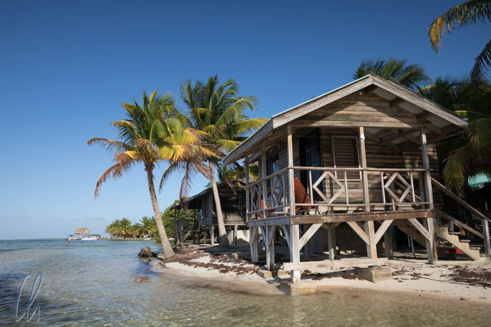
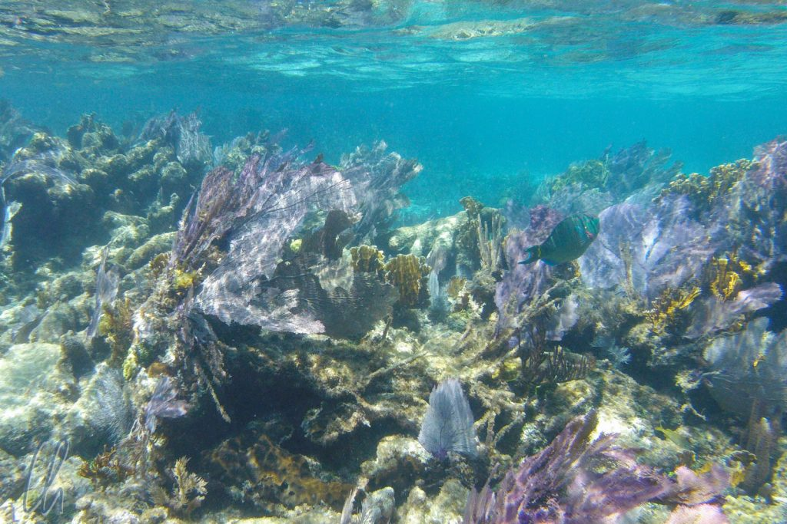

Nach unserem Aufenthalt im Dschungel fuhren wir ans Meer. Belize ist für seine Unterwasserwelt berühmt und hat nach Australien das zweitgrößte [Barrier Reef](https://de.wikipedia.org/wiki/Belize_Barrier_Reef) der Welt. Bei der Suche nach einer einsamen Insel stießen wir auf das Glover’s Reef Atoll, das außerhalb des Hauptriffs liegt und ca. 60 Kilometer vom Festland entfernt ist. Benannt wurde es interessanterweise nach einem Piraten. So strandeten wir für vier Tage auf einer einsamen Insel, dem Southwest Caye.

<!--more-->

## Inselparadies mit Rissen: Glover's Reef Atoll

Auch wenn es verlockend gewesen wäre, die Tage beim Rauschen der Wellen in einer Hängematte an sich vorbeiziehen zu lassen, so waren wir doch gekommen, um die Unterwasserwelt von Belize zu erkunden. Also schnallten wir in der Regel zweimal täglich die Flossen an, um mit den vielen bunten Fischen zu schwimmen. Nach nur wenigen Minuten im Boot erreichten wir immer das designierte Schnorchelareal.

Über Wasser sah die Inselwelt des Glover´s Reef Atoll wie ein echtes Tropenparadies aus, Sonne, blauer Himmel, türkisfarbenes Wasser und winzige Inseln mit Kokospalmen (ehemalige Plantagen). Durch den Schutz der Korallenriffe des Atolls gab es kaum Wellengang und die Wassertiefe lag dort, wo wir schnorchelten, zwischen zwei und fünf Metern. Vor allem wenn sich die Sonne nicht gerade hinter einer Wolke versteckte, hatten wir eine tolle Sicht im kristallklaren Wasser. Wermutstropfen jedoch waren kleinteiliger Plastikmüll und ein Algenteppich, die an den Strand getrieben wurden.

## Faszination Unterwasserwelt

Sobald wir vom Boot in das wohltemperierte Nass eintauchten, offenbarte sich eine andere Welt. Vielgestaltige Korallen standen prächtig auf den Riffen und Schwärme der verschiedensten Fische durchquerten sie. Es gab viele kleine blaue, gelbe, gestreifte, schwarz-weiße, neongelbe, bunte, gepunktete, kurzum Fische in allen Farben des Regenbogens. Gelegentlich sahen wir auch einige größere, spektakulärere Meeresbewohner wie Hummer, Rochen, Barrakudas oder Haie. Das Wasser war so klar, dass man manche Fische schon vom Boot aus sehen konnte.

Eine ganz andere Perspektive gewannen wir beim Nachtschnorcheln. Der Ausflug ging zum Sonnenuntergang in der Dämmerung los und endete in völliger Dunkelheit ca. eine Stunde später. Eigentlich war es erstaunlich, dass wir überhaupt etwas sahen, da wir vergleichsweise schwache Taschenlampen bekamen. Die Fische schienen sich nicht an uns zu stören, nur die Seeläuse (Sea Lice) fühlten sich magisch vom Licht angezogen (je heller, desto mehr), so dass unsere Funzel sogar von Vorteil war. Wir begegneten anderen bunten Fischarten, einem Rochen und einem kleinen Hai.

https://www.youtube.com/watch?v=ckkmdJp0jIU

## Auf der Suche nach den Walhaien

Unseren Aufenthalt auf Southwest Caye hatten wir zeitlich so geplant in der Hoffnung, vielleicht mit Walhaien schnorcheln zu können. Die besten Chancen bestehen angeblich zu Vollmond und die Tage davor und danach, wenn Snapper und andere Fische ihre Eier ablegen. Für die Walhaie ist der Laich eine reichhaltige Nahrungsquelle. Zwei Tage nach Vollmond war es soweit, eine Tour wurde angeboten. Nach einem frühen Mittagessen stachen wir in See in Richtung Südwesten. Ungefähr 25 km vom Glover's Reef Atoll entfernt gab es einen vielversprechenden Ort: Gladden Spit. Die Gruppe bestand aus dem Bootsführer, zwei Tauchern, vier Schnorchlern (wir waren zwei davon) und den beiden Guides, einer für die Taucher, einer für die Schnorchler.

Nach gut einstündiger Fahrt waren wir am geplanten Ort angekommen. Von einem befreundeten Boot bekamen wir die Info, dass sie gestern hier einen Walhai gesehen hätten, was uns sehr positiv stimmte.

Der erste Tauch-/Schnorchelgang diente nur der Erkundung. Die Taucher gingen zuerst ins Wasser, um in der Tiefe nach den Schwärmen der Snapper zu suchen, den Futterspendern für die Walhaie. Sobald sie in der Tiefe fündig würden, sollten wir Schnorchler ins Wasser gehen, um ggfs. auch etwas zu sehen. In der Tat kam bald das Signal für uns, ebenfalls ins kühle Nass zu hüpfen. Das Wasser war sehr klar und die Sichtweite betrug etwa 20 bis 30 Meter. Die scheinbar bodenlose blaue Tiefe, in die die irisierende Reflexion der Sonnenstrahlen zu weisen schien, wirkte geradezu hypnotisch.

## Das Meer ist voller Überraschungen

Von den Snappern sahen wir an der Oberfläche leider nichts, obwohl die Taucher später von großen Schwärmen dieser Fische und Haien, aber (noch?) keinen Walhaien berichteten. Für uns gab es jedoch eine andere Überraschung. Ein Schwarm Delfine wollte auch an der Party teilnehmen und sie schwammen für einige Minuten in unserer Nähe, zuweilen so nah, dass wir sie hätten berühren können, was man jedoch nicht soll. Unter anderem glitt eine Mutter mit ihrem Nachwuchs an uns vorbei.

https://www.youtube.com/watch?v=YW3lt1BifJE

Die erste Erkundung des Wassers war also erfolgreich. Die Voraussetzung für eine Sichtung war mit der Anwesenheit der laichenden Snapper gegeben. Unsere Führer waren sehr zuversichtlich, dass wir den Walhaien am späten Nachmittag würden begegnen können, da sie normalerweise um diese Zeit zum Fressen näher an die Oberfläche kommen. Also machten wir landwärts des Riffs eine Pause, da dort der Wellengang nicht so stark war. Wenn man wollte, konnte man etwas um die Korallen herum schnorcheln.

Am Nachmittag versuchten wir es erneut am gleichen Ort, aber leider ließen sich die Walhaie nicht blicken. Dafür fanden sich wieder einige Delfine ein. Es war ein großartiges Erlebnis, in ihrer Nähe zu schwimmen, ihre Eleganz und Wendigkeit bewundern zu dürfen und sie unter Wasser sogar hören zu können. Damit war es auf jeden Fall ein wunderbarer und ereignisreicher Ausflug.

