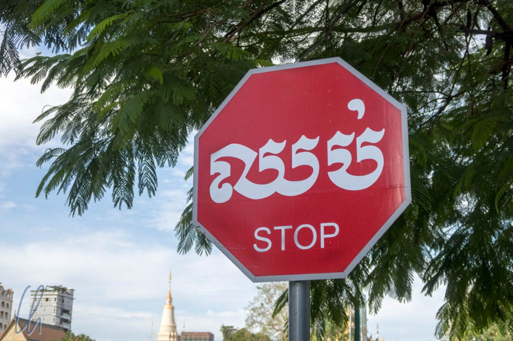
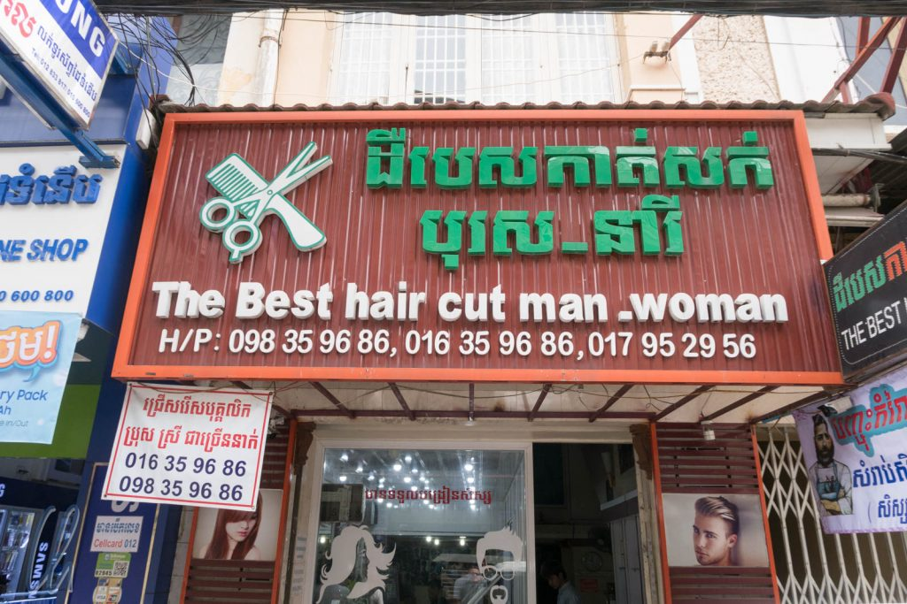

Alles fing ganz harmlos mit Monas Wunsch an, mit Khmer Air zu fliegen. Diese Fluggesellschaft muss jedoch erst noch gegründet werden, vielleicht sind einfach die Khmerosinpreise zu hoch für noch eine Khmerline? Die Khmer Air Force war auch [keine echte Alternative](https://en.wikipedia.org/wiki/Khmer_Air_Force) - viel lieber würden wir sie Khmerforce nennen. Wenigstens sind wir mit einem Khmerbus von Yangon nach Phnom Penh geflogen - immerhin etwas ;)

<!--more-->

## Deutsch und Khmer, das mischt sich sehr

Kambodscha ist das Land der Khmer, der mit 85% zahlenmäßig vorherrschenden Ethnie Kambodschas. Khmer bezeichnet außerdem die Sprache. Man spricht nicht Kambodschanisch, sondern Khmer. Und wir hatten zuweilen unsere helle Freude daran, "Khmer" und Deutsch zu mischen :).

Der Weg von "Khmer Air" zu "Khmer Hair" war offensichtlich nicht weit. Und was soll ich sagen, nachdem mein Haupt das letzte Mal in Japan geschoren wurde und schon khmer wollig geworden war, war auch der Khmercut nicht khmer weit. Die Kommunikation war nicht einfach, und ich musste den Friseurmeister mehrmals bitten, noch khmer abzuscheiden. Auch die [Ausdünnschere](<http://LINK: https://www.google.co.nz/search?q=ausd%C3%BCnnschere&source=lnms&tbm=isch&sa=X&ved=0ahUKEwj3wMfryKjYAhXIwLwKHR92CKYQ_AUICigB&biw=1249&bih=820>) musste ich erst ergooglen. Aber dann war klar, war ich wollte - und das Endkhmergebnis war wunderbar!

## Mit dem Tuk Tuk unterwegs

Der Preis des Khmercut war mit 4 Dollar ein ausgeschriebener Festpreis - für uns khmer günstig. Aber immer wenn Preise nicht explizit sichtbar sind, muss bis auf's Messer khmerhandelt werden. Sonst besteht gerade für uns Ausländer die Gefahr, deutlich zu viel zu bezahlen. Khmerfahrung zahlt sich also in jedem Fall aus! Für uns haben sich besonders 2 Strategien bekhmert.

Bei Stadtfahrten in Phnom Penh sollte das Tuk Tuk maximal 2 bis 3 Dollar kosten. Je nach eigener Khmerhandlungsposition, die sich maßgeblich aus dem Angebot an Tuk Tuks ableitet, kann man bei dem üblichem Überangebot im Extremfall sogar einfach selbstbewusst auf dem gewünschten Endpreis bestehen und keine Khmerhandlung zulassen. So geht man von Tuk Tuk zu Tuk Tuk. Die ersten Anläufe werden nicht gleich khmerfolgreich sein, es sei denn, das eigene Preisangebot war doch zu hoch ;). Nach kurzer Zeit wird ein Tuk Tuk-Fahrer selbst den gewünschten Preis anbieten und damit den Deal besiegeln.

Die andere khmerfolgversprechende Strategie war es, ein Folgegeschäft für den nächsten Tag, also ein Paket, zu khmerhandeln. Sowohl in Siem Reap als auch in Phnom Penh hatten wir auf diese Weise bald unseren persönlichen Tuk Tuk-Chauffeur. Das ist vielleicht nicht fair den anderen Fahrern gegenüber, hatte für uns aber khmerere Vorteile: Der Kontakt wird wesentlich persönlicher und die Preise sind automatisch realistisch(er). Nach einigen Tagen und mit wachsendem Vertrauen haben wir Fahrten nicht khmer verhandelt, sondern den Preis gezahlt ("It's up to you"), den wir für angemessen hielten. Das war für die Fahrer ein gutes Geschäft und für uns khmer angenehm :)
