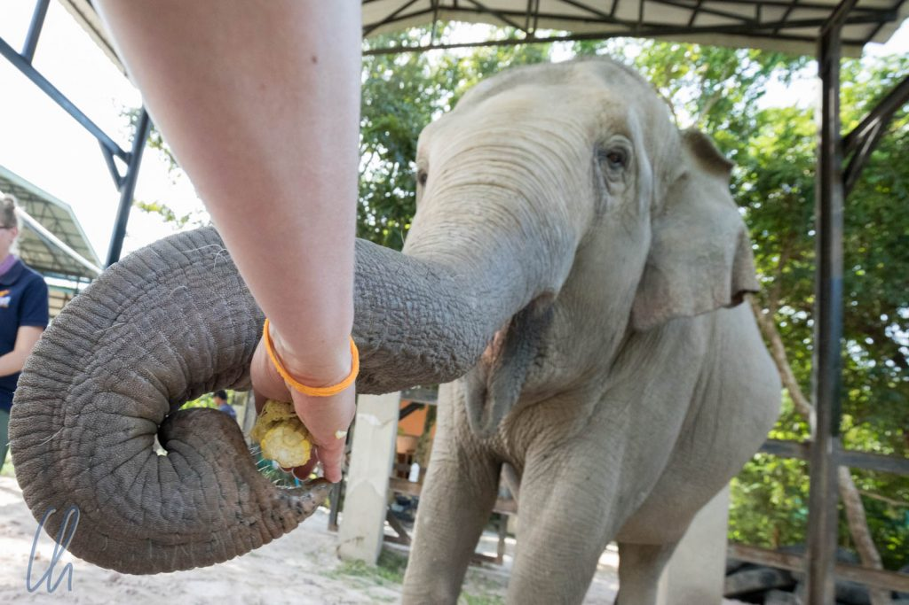
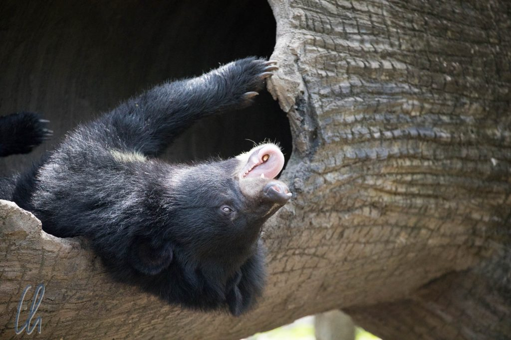
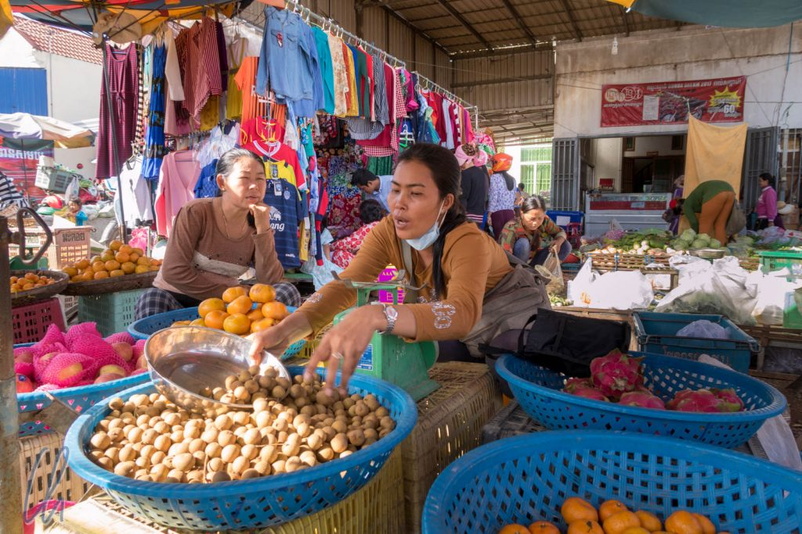
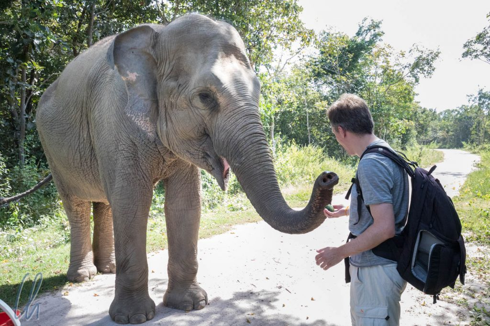

# Kuscheln mit Elefanten in Phnom Tamao

Wie mittlerweile fast überall in unserer modernen Welt geraten auch in Kambodscha Wildtiere immer stärker unter Druck, sei es, weil ihre Lebensräume schrumpfen, sie in Konflikt mit den Menschen kommen oder weil sie gejagt werden. Selbst in den abgelegenen Dschungelgebieten Kambodschas sind einige einheimische Tierarten schon ausgerottet worden: Der große Ibis, der indochinesische Tiger oder der [Kouprey](https://de.wikipedia.org/wiki/Kouprey), eine wild lebende Rinderrasse. [Wildlife Alliance](https://www.wildlifealliance.org) ist eine Tierschutzorganisation, die sich vielfältige Aufgaben gestellt hat. Sie engagiert sich unter anderem in Phnom Tamao, einem Wildschutzpark und Naturschutzgebiet nicht weit von Phnom Penh. Hier erhalten Tiere in Not Hilfe, sie werden gegebenenfalls medizinisch behandelt und gesundgepflegt. Letztendlich ist jedoch immer das Ziel, sie wenn möglich wieder in die Wildnis zu entlassen.

<!--more-->

## Phnom Tamao - mehr als ein Zoo

Wir haben viel Gutes über Phnom Tamao gelesen. Die Tiere werden unter sehr guten Bedingungen und in großen Gehegen gehalten. Das oberste Ziel ist nicht, die Tiere zur Schau zu stellen, sondern sie wieder auszuwildern. Außerdem betreibt Wildlife Alliance in Phnom Tamao einige Zuchtprogramme, um den Bestand bedrohter Tierarten zu vermehren. All dies waren für uns Gründe genug, die empfohlene Mindestspende von 150 Dollar zu leisten, um auf einer persönlichen Führung einen Tag in Phnom Tamao zu verbringen und die Arbeit der Organisation und einige Tiere näher kennenzulernen.

Auf den ersten Blick ist Phnom Tamao ein riesiger Zoo in einem Waldgebiet mit großzügigen Gehegen. Es ist sehr spannend, hier den verschiedensten Tieren zu begegnen. Tatsächlich ist dieser Teil von Phnom Tamao so etwas wie die PR-Abteilung. Die Tiere sind Botschafter und Sympathieträger, um ein ökologisches Bewusstsein zu schaffen oder die Opfer von Wilderei oder Tierhandel (also sich selbst) einer breiteren Öffentlichkeit zu präsentieren.

Damit nicht nur wir uns an den Tieren erfreuen konnten, sondern um auch selbst bei den Bewohnern von Phnom Tamao Sympathiepunkte erwerben zu können, kauften wir zusammen mit Casey und Samedi (unseren beiden Begleitern) auf dem Weg dorthin auf einem Markt Leckereien ein: 2 Eimer aufgeschnittene Wassermelone, Maiskolben, zusätzlich Bananen, Kokosnüsse und [Longans](https://de.wikipedia.org/wiki/Longan).

## Elefanten ganz nah

In Phnom Tamao angekommen besuchten wir zuerst die Elefanten, und die Elefantendame Lucky begrüßte uns höchstpersönlich auf ihrem Morgenspaziergang. Lucky hatte wirklich ziemlich viel Glück in ihrem bisherigen Leben. Als Jungelefant mit 6 Monaten kam sie nach Phnom Tamao, nachdem sie einem Tierhändler abgenommen worden war. Anschließend wurde sie von einem engagierten Pfleger aufgezogen, der auch heute noch den Spitznamen "Lucky's Mother" hat. Vor einigen Monaten überlebte sie eine sehr gefährliche [Herpes-Erkrankung](http://elefanten.wikia.com/wiki/Herpesvirus), und jetzt standen wir mit frischer Wassermelone vor ihr!

Durch ihren frühen und intensiven Kontakt mit Menschen ist Lucky auch fremden Menschen gegenüber sehr aufgeschlossen, vor allem, wenn sie etwas Leckeres mitbringen. So konnten wir uns ihr gefahrlos nähern und sogar ihre raue Elefantenhaut berühren - streicheln wäre vielleicht in diesem Kontext das falsche Wort ;). Die Melonenstücke griff Lucky mit ihrem Rüssel und nahm sie uns bereitwillig aus den Händen. Auf Kommando hob Lucky auch ihren Rüssel und erlaubte es uns, ihr die Melone direkt ins Maul zu legen: Ein interessantes Gefühl, die Wärme ihrer gigantischen Zunge zu spüren.

## Die vielen Bewohner von Phnom Tamao

Anschließend besuchten wir Tiger, Bären, Leoparden, Otter, Binturongs, Bantengs, Affen und viele andere Tiere. Die meisten hatten ähnliche Geschichten hinter sich, bevor sie nach Phnom Tamao gekommen waren. Einige wurden illegal auf dem Schwarzmarkt gehandelt, um ein "Haustier" (und ggf. später ein Problemtier) zu werden. Andere wurden unter teilweise erbärmlichen Bedingungen als Haustier oder in privaten Zoos gehalten. Auch die traditionelle Medizin spielt eine große Rolle, da nur Hörner, Knochen, Federn oder diverse teils bei lebendigem Leibe entnommene Körperflüssigkeiten echter Wildtiere angeblich heilende Wirkung haben. Wir trafen darüber hinaus einige Tiere, die aufgrund von immer kleiner werdenden Lebensräumen mit Menschen in Konflikt geraten waren.

Zum Abschluss unseres Besuchs durften wir ins Affengehege. Auch hier waren wir sehr populär, da wir schmackhafte Longans mitbrachten. Kaum waren wir in der Umfriedung und präsentierten die Leckereien, sprangen die Affen überall auf uns herum, auf unseren Armen, Beinen, Schultern. Um die Affen aufgrund ihrer festgelegten Rangordnung nicht zu provozieren, legte Casey uns die Früchte in die geöffneten Hände und die Affen konnten zugreifen.

## Die vielfältigen Bedrohungen

Beim Besuch in Phnom Tamao hatte wir viel Spaß bei den vielen spannenden Tierbegegnungen, die so an einem anderen Ort kaum möglich gewesen wären. Vielleicht noch interessanter war es, etwas über die Ziele und die Strategie der Tierschützer zu erfahren. Der Schutz, die Zucht und die Auswilderung vieler Tiere ist durchaus erfolgreich. Wildlife Alliance bekämpft nicht nur die Symptome sondern auch die Ursachen der Bedrohung vieler Tierarten.

Zum Beispiel bekommen kambodschanische Kinder beim Besuch von Phnom Tamao Einblicke in Ökologie, Tier- und Umweltschutz. Zum Thema traditionelle Medizin lernen die Kinder, dass Haare, Fingernägel und Elfenbein (gemahlen) im wesentlichen das gleiche sind. So verschwindet hoffentlich irrationaler Aberglaube in der heranwachsenden Generation.

Solange es allerdings noch Abnehmer für wilde Tiere als Haustiere oder für traditionelle Medizin gibt, solange es Menschen gibt, die bedrohte Wildtierarten lieber essen als schützen, ist der Kampf nicht gewonnen. Auch nachhaltige Jobs im Ökotourismus oder im Tierschutz sind keine Lösung sondern nur ein weiterer Baustein. Bei den immensen Preisen, die für Wildtiere gezahlt werden, wird sich immer ein schwarzes Schaf finden, das zum Erfüllungsgehilfen von skrupellosen Menschen wird. Nur ein Wandel in den Köpfen der Menschen ist ein echter Schutz für die Tiere.

