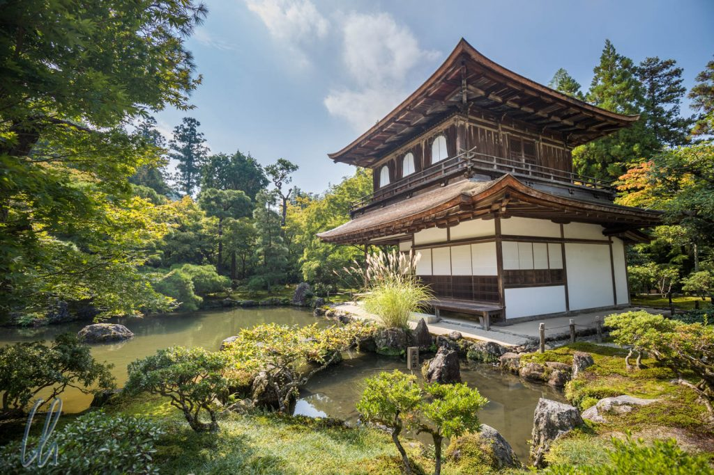
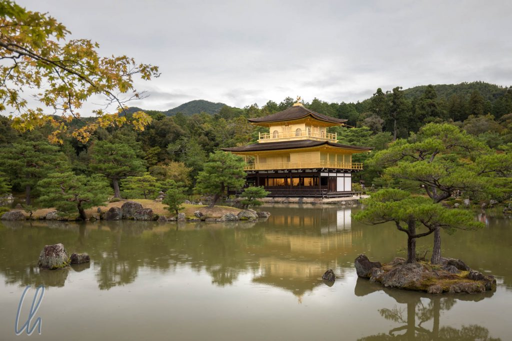
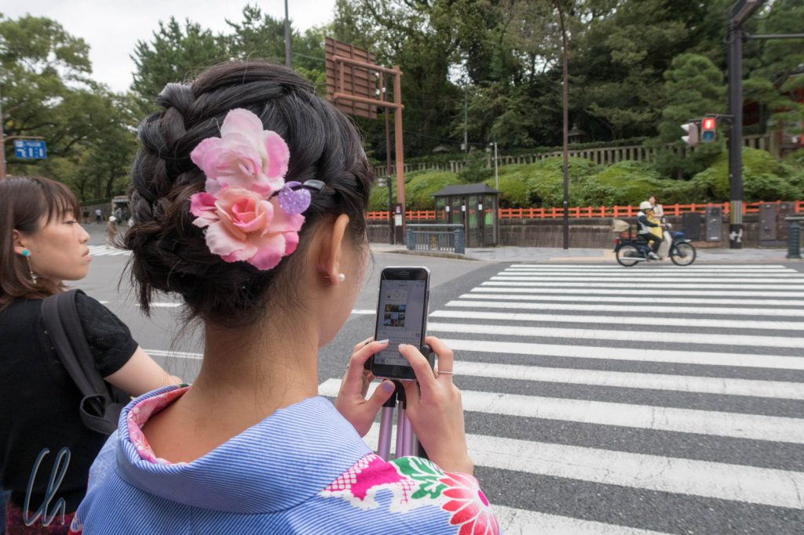
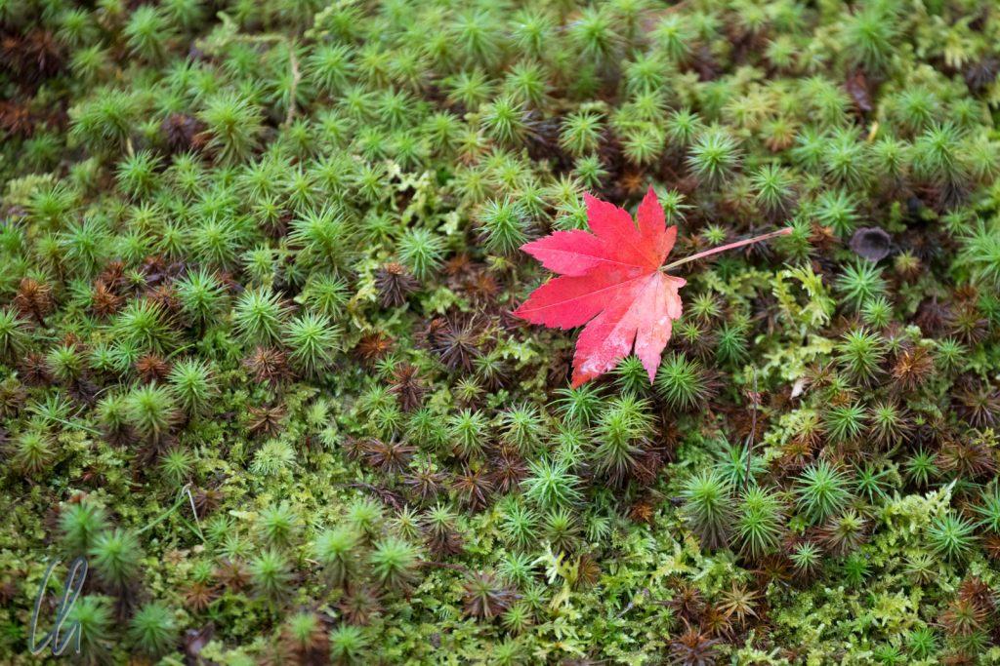

Nach [Moderne in Toyko](http://wittmann-tours.de/sightseeing-in-der-mega-city-tokyo/) und [Natur in Hakone](http://wittmann-tours.de/hakone-wandern-ryokan-und-fuji/) fuhren wir nach Kyoto, der ehemaligen Hauptstadt (1000 Jahre lang) und sicherlich weiterhin des kulturellen Zentrums Japans. Dass sich die Namen Kyoto und Tokyo aus den gleichen Silben in umgekehrter Reihenfolge zusammensetzen, scheint Zufall zu sein, auch wenn beide das Zeichen für Hauptstadt enthalten (京). Tokyo (東京) ist die “Ost-Hauptstadt“ und Kyoto (京都) die „kaiserliche Residenz“. In Kyoto wartet also die große Kultur: Tempel, Schreine und Gärten.

<!--more-->

## Kyoto, die kulturelle Hauptstadt Japans

An wirklich jeder Ecke steht in Kyoto ein Schrein oder ein Tempel. Soviele, dass es ein Running-Gag wurde: "Schau mal ein Schrein!" - und dann war da wirklich einer! Selbst von den bedeutenden gibt es so viele, so dass es schwer fällt, eine Auswahl zu treffen. Auch wenn alle ihren eigenen Reiz und Charme haben, so liest sich ihre Beschreibung doch oft erstaunlich ähnlich. Aber Vorsicht! Hier wird jetzt stark übertrieben und verallgemeinert.

Die Gründung war vor vielen Hunderten von Jahren. Manche waren früher Villen, die nach dem Tod Ihrer Besitzer zu Tempeln oder Schreinen umgewidmet wurden. Im Laufe der Geschichte richteten Erdbeben oder Feuer große Verwüstung an, so dass sie regelmäßig wieder aufgebaut wurden. Bekannte Persönlichkeiten der japanischen Geschichte, z.B. die Shogune [Toyotomi Hideyoshi](https://de.wikipedia.org/wiki/Toyotomi_Hideyoshi) oder [Tokugawa Ieyasu](https://de.m.wikipedia.org/wiki/Tokugawa_Ieyasu) spielten in der Geschichte der religiösen Stätten zuweilen eine tragende Rolle. Die heutige Form stammt oft aus dem 18. Jahrhundert. Seit den späten 1990er Jahren sind die Hauptsehenswürdigkeiten UNESCO Weltkulturerbe geworden, und eigentlich alles ist entweder ein "Japanese National Treasure" oder "Important Cultural Property". Die besten Besuchszeiten (i.S.v. optisch am attraktivsten und am meisten besucht) sind die Kirschblüte und wenn sich die Blätter im Spätherbst verfärben.

## Touristen überall

Wenn Kyoto die Stadt der 1000 Tempel und Schreine ist, dann ist sie leider definitiv auch die Stadt der 100.000 Touristen. An den Top-Sehenswürdigkeiten waren wir nicht unbedingt allein unterwegs, um es zurückhaltend japanisch zu formulieren. Wie so oft im Leben gibt es auch ungeahnt positive Seiten: Besonders hervorzuheben sind die meist chinesischen Touristinnen, die gerne Geisha-Kostüme ausleihen und im historischen Look auf Sightseeingtour gehen. So werten sie das Straßenbild deutlich auf und tragen zum traditionalen Charme der Stadt bei - auch wenn sie mit Smartphone und Selfie-Stick herumlaufen. Zusätzlich gibt es schön renovierte Straßen und Gassen. An vielen Orten in der Stadt fühlten wir uns in die Filmkulissen von historischen Samurai- oder Ninja-Filmen versetzt.

## Kyotos Gärten

Die japanischen Gärten sind eigentlich begehbare Kunstwerke. Auch wenn vieles sehr natürlich aussieht, so wird doch nichts dem Zufall überlassen. Heerscharen von Gärtnern sogen nicht nur dafür, dass die Muster in den Zen-Steingärten geharkt werden, sondern auch dafür, dass maximal eine natürlich erscheinend Anzahl von Blättern auf den Moosflächen liegt. Richtig gelesen, Moos wird hier sehr gepflegt. Es ziert Steine, Wurzeln, ganze Baumstämme und auch den Boden. Der Vertikutierer scheint nicht zur typischen Gärtnerausrüstung zu zählen.

Die Bäume werden auch einzeln intensiv gepflegt. Die Nadeln der Kiefern werden so präpariert, dass sie büschelweise nach oben zeigen. Selbstredend werden braune Nadeln gezupft, um das Auge des Betrachters nicht zu irritieren. Gleichermaßen werden die Ahornbäume, die sich im Herbst feurig rot verfärben, so geschnitten, dass von außen gesehen eine Blätterkugel entsteht. Von der Ferne aus betrachtet, wirkt das Blätterdach somit sehr dicht und prächtig. Steht man jedoch unter dem Baum, ist es schön luftig, und das Blätterdach lässt, so die Sonne denn scheint, auch ein paar Sonnenstrahlen durch.

Die Teiche in den Gärten beherbergen oft prächtige und sehr große Koi-Karpfen. Manche Exemplare sind wahre Goldfische, die im Sonnenlicht glänzen. Allen Kois ist gemein, dass sie gerne bei den Besuchern um Leckerlis betteln.

In den Teichen gibt es kleine Inseln, die oft als Schildkröten- oder Kranich-Inseln bezeichnet werden. Sie sind zuweilen über kleine Brücken begehbar und laden zum Lustwandeln ein. Weitere Attraktionen sind die Teehäuser in den Gärten.

## Shintoistische Schreine

Religion ist in Japan etwas undurchsichtig und kompliziert für die Besucher aus dem westlichen Abendland. Auch wenn es eine Durchmischung von Shintoismus und Buddhismus gibt, so lassen sich die buddhistischen Tempel von den shintoistischen Schreinen recht gut unterscheiden. Es ist aber durchaus verbreitet, dass ein Tempel ein paar kleine Schreine enthält. Es gibt Tempel von unterschiedlichen buddhistischen Strömungen und Schreine für unzählige shintoistische Gottheiten und Geister (Kami), die auch mal in Naturerscheinungen wie Bäumen, Wasserfällen oder Bergen in Erscheinung treten können.

Der Vielleicht berühmteste Schrein ist der Fushimi Inari-Taisha, dessen markante rote Toriis häufig als typisches Japan-Motiv herhalten müssen. Diese Toriis symbolisieren Spenden an den Schrein. Ein kleines Torii ist für umgerechnet 3.000 Euro zu bekommen, ein großes kostet deutlich über 10.000 Euro. Der Inari-Schrein ist spirituell einer der bedeutendsten in Japan, da er der Hauptschrein von Tausenden weiteren Inari-Schreinen ist. Inari ist der u.a. der Reisgott, und Reis ist bekanntlich die traditionelle Lebensquelle in Japan. In der modernen Gesellschaft gilt er auch als zuständige Gottheit für Handel und Gechäfte, so dass viele Firmen gerne Toriis spenden - in der Hoffnung auf Erfolg im Business.

Der Fuchs gilt als Bote und als mögliche Erscheinungsform des Inari-Kami. Kami sind die Gottheiten oder Geister im Shintoismus. In einem Schrein ist ein Kami (oder mehrere) eingeschreint, was in etwa bedeutet, dass die Kami dort zuhause sind.

## Buddhistische Tempel

Der Zen-Buddhismus ist eine buddhistische Strömung und die typischen fein säuberlich geharkten Kies-Gärten gibt es in Kyoto, genau wie wir sie von Bildern her kennen. Zen ist in Japan aber nur eine von vielen buddhistischen Strömungen. Zusätzlich gibt es z.B. noch Shingon, Tendai, Jodo und mehr.

Ein buddhistischer Tempel sieht in Japan nicht unbedingt so aus wie in anderen asiatischen Ländern. Goldene Buddha-Statuen gibt es, aber sie sind eher selten. Am Tenryu-ji ("Drache des Himmels") ist die bekannteste Buddha-Statue aus Holz geschnitzt. Wie der Name schon sagt gibt es einen bekannten Drachen, ein Deckengemälde, welches über den Buddha wacht und nicht fotografiert werden darf. Drachenabbildungen gibt es aber auch an anderer Stelle im Tempel:

## Fazit zu Kyoto

Eine Japanreise ohne Kyotobesuch ist unvollständig. Hier erscheint Japan wie man es sich traditionell vorstellt, nur die Samurai fehlen im Straßenbild. Die Touristenmagneten sind auch hier absolut sehenswert, einzig der immer wieder empfohlene [Arashiyama Bamboo Grove](https://www.insidekyoto.com/arashiyama-bamboo-grove) fiel etwas ab, da im Unterholz ein enges Dickicht aus Selfie-Sticks gewachsen ist, der sich durch die an sich eindrucksvolle Allee aus dichtem hohem Bambus bewegt. Von einsamem Naturerlebnis also leider keine Spur. Die Touristenmassen sind einfach da; am besten man versucht, sie zu akzeptieren. Glücklicherweise scheint die japanische Höflichkeit auf viele Touristen abgefärbt zu haben, so dass vielfach Rücksicht aufeinander genommen wird. Auch die etwas unbekannteren Sehenswürdigkeiten waren Weltklasse. Unser Favorit war der relativ schlichte [Ginkaku-ji](https://de.wikipedia.org/wiki/Ginkaku-ji) (erstes Bild ganz oben) mit seinem schönen Garten und überschaubaren Besucherzahlen. Weitere Eindrücke findet ihr in der folgenden Bildersammlung.

\[envira-gallery id="930"]
