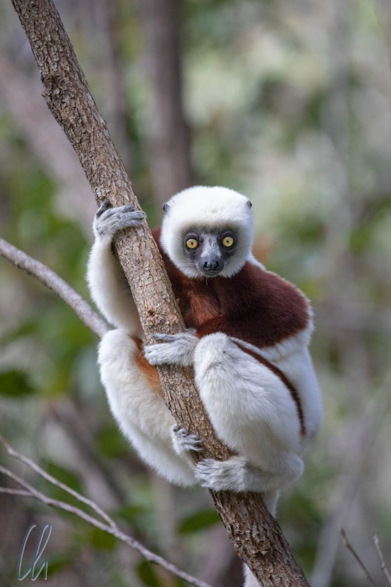
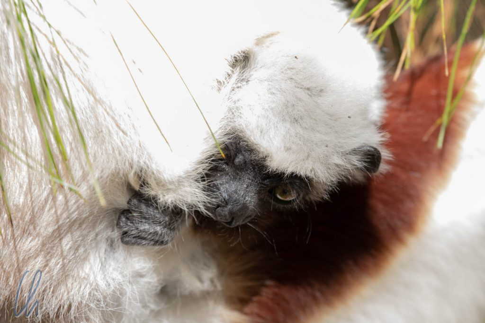

# Madagaskars Tierwelt: Lemuren, Chamäleons und anderes Getier

Die Tierwelt Madagaskars ist einzigartig. Seit 90 Millionen Jahren ist Madagaskar schon vom afrikanischen Festland abgespalten. Damit ist die große Insel ein sehr lang andauerndes Experiment der Evolution. So gibt es nur auf Madagaskar [Lemuren](https://de.wikipedia.org/wiki/Lemuren) und man findet dort die meisten [Chamäleonarten](https://de.wikipedia.org/wiki/Cham%C3%A4leons) weltweit. Von beiden Spezies sollten wir auf dem Weg in den Osten einige Exemplare zu Gesicht bekommen und sie sowohl in Schutzgebieten als auch in freier Wildbahn erleben.

<!--more-->

## Sifakas im Réserve Peyrieras

Das [Réserve Peyrieras](https://de.wikipedia.org/wiki/R%C3%A9serve_Peyrieras) liegt etwa 70 kurvige Kilometer östlich von Antananarivo an der Route Nationale Numéro 2 und ist eine Mischung aus Zoo und Schutzgebiet. Die meisten tierischen Bewohner leben in angemessenen Gehegen und viele weitere "Inoffizielle" frei im Wald, unter anderem einige Arten halbwilder Lemuren. Diese sind sehr an Menschen gewöhnt, werden gefüttert und halten sich daher selten weit entfernt auf. Um sie zu sehen, folgten wir unserem Führer eine Anhöhe hinauf, wieder hinunter durch den Wald und in das nächste Tal. Nach etwa 20 Minuten hatten wir eine Gruppe [Larvensifakas](https://de.wikipedia.org/wiki/Larvensifaka) gefunden.

Sie waren nicht sehr scheu, ließen uns näher herankommen, verhielten sich aber bestimmt nicht wie Schoßtiere. Die angebotenen Bananen nahmen sie mit einer gewissen Vorsicht und zogen sich dann schnell wieder ein paar Meter zurück. Solange wir einen Abstand von etwa 3 Metern einhielten, ließen sie sich problemlos beobachten und fotografieren. Ein Baby-Lemur klammerte sich an seine Mutter und versteckte sich schüchtern in ihrem Fell. Nur selten lugte es vorsichtig hervor.

## Ein Gehege voller Chamäleons

Nach einer guten halben Stunde zusammen mit den Sifakas kehrten wir zum Zoo-Bereich zurück. Neben Krokodilen und Fröschen waren Chamäleons die große Attraktion. In einem großen Gehege, in dem zwischen Bereichen mit buschartigen Pflanzen Gänge angelegt waren, lebten zahlreiche Arten dieser eigenartigen Echsen. Somit war die Umfriedung ein großes Chamäleon-Suchspiel, schließlich sind diese Geschöpfe bekanntermaßen Meister der Tarnung und einige können sich ihrer Umgebung farblich gut anpassen. (Auch wenn bei den Spezies, die ihre Farbe ändern können, diese Fähigkeit meist zur Kommunikation mit anderen Artgenossen eingesetzt wird.)

Außerdem bewegen sie sich wie ein Blatt im leichten Windhauch. Ganz gemächlich, um keine Aufmerksamkeit auf sich zu ziehen, tasten sie sich förmlich vorwärts. Ein Stückchen vor, Wippen, noch ein Stückchen vor, Wippen, so schaukeln sie voran, das ist Teil ihrer Tarnstrategie. Leicht schwingend, sehr langsam und ein wenig albern sieht es aus. Nur selten wagten sie sich aus den Büschen heraus, um den Weg zu überqueren.

https://www.youtube.com/watch?v=EPWvqcOTT2M

Aber die Chamäleons sind nicht nur potentielle Beute, sondern selbst auch Jäger. Gut getarnt im Blattwerk halten sie mit ihren beiden unabhängig voneinander bewegbaren Augen Ausschau nach Beute. Wie ihr Gehirn es schafft, die beiden örtlich vollkommen verschiedenen Wahrnehmungen miteinander in Einklang zu bringen, ist auch heute noch ein Rätsel.

## Die Chamäleon-Fütterung

Dann fand eine Chamäleon-Fütterung mit auf einem Stöckchen aufgespießten Heuschrecken statt. Sobald das Chamäleon die Beute in seiner Reichweite wahrnahm, fixierte es das Insekt mit beiden Augen, brachte seinen Kopf in Position, öffnete sein Maul einen Spaltbreit und dann schoss auf einmal die überraschend lange Zunge (mindestens so lang wie die Echse selbst) hervor, packte die Heuschrecke mit der Spitze und zog Zunge und Fang blitzschnell zurück ins Maul, alles in Sekundenbruchteilen. Schaut selbst im folgenden Video:

https://www.youtube.com/watch?v=TCvO_-0QCrE

## Klein, kleiner, am kleinsten

Kleinere Chamäleon-Spezies wurden in separaten Käfigen gehalten, sonst würde man sie kaum wiederfinden. Diese Zwerge waren in verschiedenen Größen zu bewundern: klein (ca. 15cm) und ganz winzig (ca. 5cm).

Unser Führer holte die Chamäleons behutsam aus ihrer Behausung und setzte sie uns auf die Hände. Von dort aus fingen sie an, ihre neue Umgebung zu erkunden. Sie spazierten über unsere Arme und ihre kleinen Krallen pieksten ein wenig.

Den Besuch im Réserve Peyrieras empfanden wir als sehr lohnenswert. Sicher könnte man über die artgerechte Haltung der Tiere trefflich diskutieren. Insgesamt erschienen uns die Haltungsbedingungen im Réserve allerdings sehr gut. Die Tiere dort sind Botschafter Ihrer Spezies in einer Nation, für deren Menschen das unmittelbare Überleben oft Vorrang vor dem Naturschutz hat, auch wenn uns Europäern das aus unserem Blickwinkel als kurzsichtig erscheinen mag. Wenn man die Tiere nicht kennt, die es zu erhalten gilt, fällt es womöglich schwer, Interesse zu entwickeln, einen Schutzgedanken umzusetzen. Das Réserve Peyrieras könnte in diesem Sinne bestimmt Brücken bauen. Allerdings waren alle Besucher des Réserve Ausländer, nur die Führer waren Madegassen…

## Nachtwanderung in Andasibe

Am Abend des gleichen Tages erreichten wir den [Andasibe-Mantadia Nationalpark](https://en.wikipedia.org/wiki/Andasibe-Mantadia_National_Park), in dessen direkter Nähe wir übernachteten. Die vielleicht bekanntesten Bewohner des Parks sind die [Indris](https://de.wikipedia.org/wiki/Indri), die sich allerdings zu diesem Zeitpunkt schon zur Ruhe begeben hatten. Wir unternahmen eine Nachtwanderung, die uns auch in den Regenwald führte, aber die meiste Zeit gingen wir an der engen, kaum befahrenen Straße entlang. Das gab uns die Gelegenheit, zahlreiche Bewohner des Nationalparks zu entdecken.

Wir beobachteten zahlreiche Frösche, die auch für eine melodische Untermalung unseres Mondscheinspaziergangs sorgten. Einige Maus-Makis huschten durch die Bäume, mehr als die im Taschenlampenkegel leuchtenden Augen waren allerdings nicht zu sehen. Erstaunlicherweise sahen wir vor allem Chamäleons. Die großen waren gut getarnt, die kleinen für unsere Augen ohne weitere Hinweise vollkommen unsichtbar. Einmal zeigte uns unser Führer Evariste eine Pflanze von der Größe einer europäischen Topfpflanze, in der ein Chamäleon sitzen sollte. Wir gaben ratlos auf zu suchen, weil wir es nicht finden konnten, aber da war es, mitten zwischen den grünen Blättern.

## Suchbild im Urwald

Ähnliche Situationen wie diese gab es auch im weiteren Verlauf der Wanderung. Wir gingen den Weg bzw. die schmale Straße entlang. Evaristes Taschenlampe huschte durch die Bäume und Sträucher und auf einmal hatte er etwas entdeckt, was auf den ersten Blick so aussah:

Kleiner noch als die Blätter saß das Mini-Chamäleon auf dem Zweig, aber wie Evariste es erspähen konnte, ist für uns bis heute unbegreiflich.

## Indris, die Riesenlemuren

Am nächsten Morgen kehrten wir wieder in den Nationalpark zurück und fanden ganz andere Tiere vor als nachts. Wir hofften darauf, Indris zu sehen, begegneten aber auch anderen Tieren, zum Beispiel einen [östlichen Bambuslemuren](https://de.wikipedia.org/wiki/%C3%96stlicher_Bambuslemur) nahe eines Baches.

[Indris](https://de.wikipedia.org/wiki/Indri) sind die größten Lemuren der Welt, in etwa so groß wie ein 5-jähriges Kind. Wie der Indri zu seinen einheimischen Namen "Babakoto" kam, erklärt die folgende [Legende](https://www.madamagazine.com/english-why-the-biggest-lemurs-of-the-worlds-is-called-babakoto/). Hier die Kurzfassung: Ein Mann kletterte mit seinem Sohn im Urwald auf einen hohen Baum, um Honig zu sammeln. Als ein Unwetter aufzog, rutschte der Vater ab, fiel tragischerweise vom Ast und starb bei dem Sturz. Bei Sturm und Gewitter blieb der Junge die Nacht über verängstigt auf dem Baum, da er nicht ohne Hilfe herabklettern konnte. Am nächsten Morgen brachte ihn ein Indri auf seinem Rücken wieder sicher auf den Boden zurück. Der Junge hieß Koto; der Indri, der ihn rettete, erhielt folglich die Ehrenbezeichnung "Babakoto", der "Vater von Koto", weil er sich um den Waisen gekümmert hatte.

## Der Gesang der Indris

Indris sind nicht nur die größten Lemuren, sondern auch die lautesten. Ihr Gesang ist kilometerweit zu hören, nicht zuletzt deshalb, weil sie zum Singen immer ganz nach oben in die Bäume klettern. Damit war es nicht allzu schwer, die Primaten zu finden. Im Nationalpark gibt es ein gut ausgebautes Wegenetz. Immer den Ohren nach! Da Andasibe von Tana aus relativ einfach zu erreichen ist, waren wir nicht die einzige Gruppe im Park. In absoluten Zahlen waren es zwar wenige Besucher, insgesamt war hier nach unserem Empfinden die verträgliche Obergrenze an Touristen allerdings schon erreicht, wenn nicht sogar überschritten.

https://www.youtube.com/watch?v=5sMbeR7h2Fk

Der Gesang der Indris (Ihr könnt ihnen im obigen Video lauschen) dauert bis zu ein paar Minuten und danach sind die Lemuren so erschöpft, dass sie erstmal ruhen müssen. Die Lautäußerungen dienen dazu, das Revier der in Gruppen lebenden Tiere zu markieren. Der Indri-Gesang ist auf seine Art recht melodisch und erinnert entfernt an die Geräusche von Buckelwalen.

Oben in den Wipfeln der Bäume verhielten sich die Indris ganz natürlich, unbeeindruckt von den Besuchergruppen, und kauten hingebungsvoll einige Blätter. Manchmal sprangen sie von Baum zu Baum, und wie! Die gewaltigen Sätze können bis zu 7 Meter weit sein, fast so, als hätten die Hinterbeine eingebaute Sprungfedern.

## Kuscheln mit Lemuren

Am Nachmittag besuchten wir die das private Réserve Vakôna. Dort kann man den Lemuren ganz nah kommen. Die Tiere leben frei auf mehreren Inseln, die durch Kanäle voneinander getrennt sind. Da die Primaten wasserscheu sind, ist dies Barriere genug für sie. So fuhren wir mit zwei Kanus von Insel zu Insel und besuchten die jeweils dort lebenden Arten. Die Lemuren waren so sehr an Menschen gewöhnt, dass sie freiwillig auf unsere Schultern sprangen. Sicher nicht ganz ohne Hintergedanken: Die Führer hatten Bananen als Lockmittel dabei.

Dennoch hatten wir den Eindruck, dass die Lemuren im Grunde genommen wild waren. Sie ließen sich nicht streicheln und sprangen sofort wieder davon, wenn sie ein Stückchen Banane erbeutet hatten. Die Bambuslemuren verschmähten das mitgebrachte Obst und fraßen lieber Blätter. Die Sifakas durften wir nur vom Wasser aus beobachten. Die Kattas hingegen kamen direkt auf unser Boot gesprungen, als wir kurz anlegten.

Tierschützer mögen nun wieder aufbegehren. Klar, die Inseln sind keine gänzlich natürliche Umgebung für die Lemuren. Trotzdem fanden wir das Konzept deutlich artgerechter als einen klassischen Zoo und wir möchten erneut den Botschaftergedanken aufgreifen. Wäre es nicht wunderbar, wenn sich viele Madegassen in die drolligen Lemuren verlieben würden? Das wäre der beste Anreiz für sie, die Lebensräume der Primaten zu schützen. Die Zahl der madegassischen Besucher war allerdings auch hier eher gering, aber die Hilfsorganisation [grüne Kiste](http://www.madagruenekiste.org/de/) zum Beispiel fördert den [Besuch von Jugendlichen](https://youtu.be/-Abzbkoo2KM) in der Natur, um Flora und Fauna lieben und schätzen zu lernen. Uns machte es jedenfalls große Freude, den Lemuren so nahe zu kommen.

## Suchbild zum Quadrat

Auch im Réserve Vakôna gab es weitere angeschlossene Gehege mit Fröschen und Chamäleons. Das kurioseste Tier war jedoch ein Uroplatus, ein sog. [Blattschwanzgecko](https://de.wikipedia.org/wiki/Blattschwanzgeckos), ein Großmeister der Tarnung. Das folgende Bild zeigt ihn klar und deutlich, nicht wahr?

Habt Ihr ihn sofort gefunden? Die Augen sind fast zentral im Bild. Er sitzt mit dem Kopf nach unten auf dem Stamm, seine perfekte Tarnung macht ihn nahezu unsichtbar. Man hat fast den Eindruck, als würden Flechten und Moos auf seiner Haut wachsen, so sehr verschmilzt er optisch mit der Rinde des Baumes.

## Die Fossa

Große Raubtiere gibt es auf Madagaskar nicht, mit einer Ausnahme. Der einzige größere Jäger ist die [Fossa](https://de.wikipedia.org/wiki/Fossa), eine Art Raubkatze. Ursprünglich stammt die Spezies wohl von den [Mangusten](https://de.wikipedia.org/wiki/Mangusten) ab. Sie ist in etwa so groß wie eine [Europäische Wildkatze](https://de.wikipedia.org/wiki/Europ%C3%A4ische_Wildkatze) oder ein Fuchs, hat aber ein vergleichbar kurzes, glattes, rotbraunes Fell. Das scheue Tier in freier Wildbahn zu sehen, wäre ein absoluter Zufall. Einzig in [Kirindy](http://wittmann-tours.de/der-kirindy-trockenwald/) hätten wir das Tier erspähen können, aber leider hatten wir kein Glück gehabt. Im Réserve Vakôna bekamen wir den seltenen Jäger allerdings doch noch zu Gesicht.

Durch die privaten Schutzgebiete und wirklich guten Zoos, die wir besucht hatten, ist die Vielfalt der madagassischen Tierwelt, die wir zu Gesicht bekamen, sicher ein bisschen ermogelt. Trotzdem sahen wir eine erstaunliche Auswahl und dennoch nur einen kleinen Ausschnitt dessen, was Madagaskars exotische Fauna ausmacht. Ein paar Tage später im Masoala Regenwaldgebiet sollte es nur noch den Dschungel und uns geben. Welche Tiere wir dort wohl vorfinden würden?
