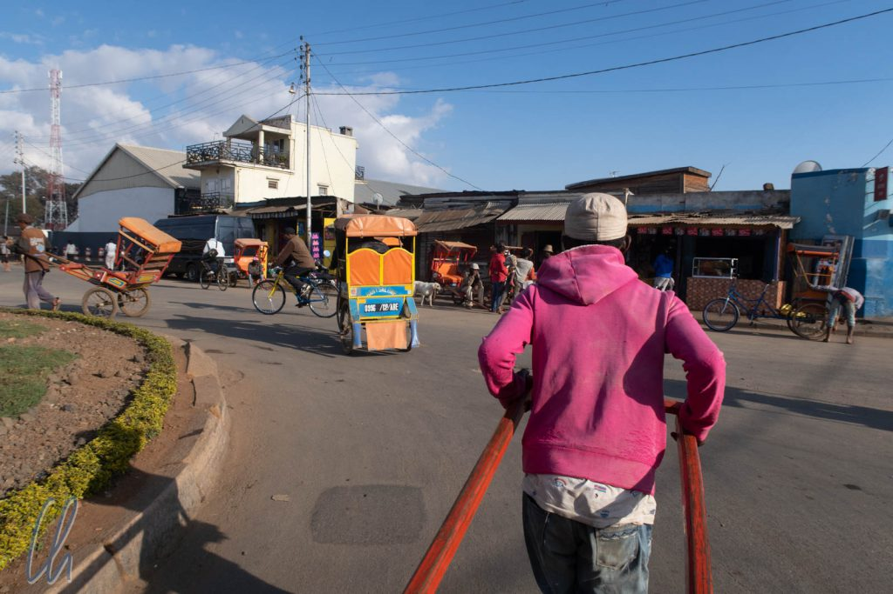
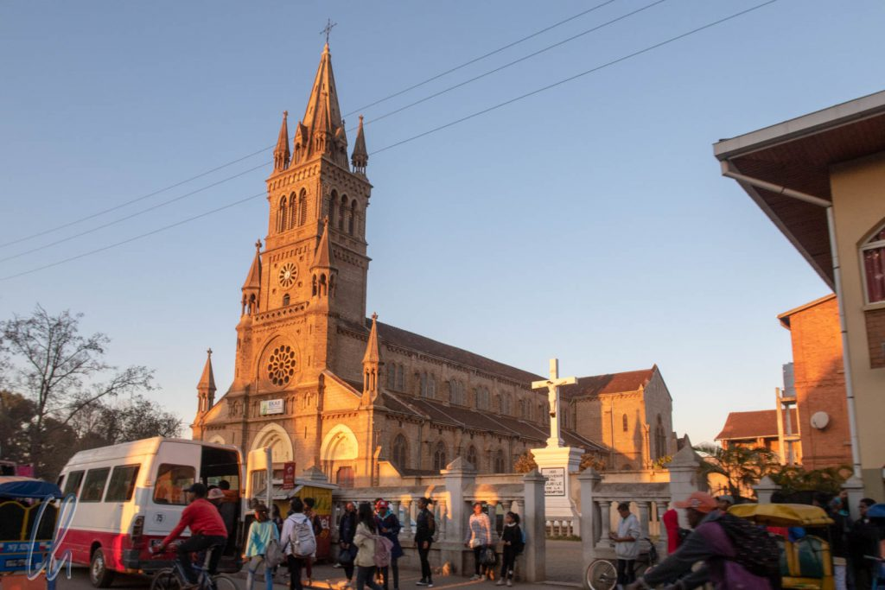

Dass Madagaskar eines der materiell ärmsten Länder der Welt ist, war nicht zu übersehen. Statt sich ausschließlich in einer touristischen Parallelwelt zu bewegen, erlebten wir auch unmittelbar das normale Leben der Menschen. Mit einem Mal waren wir mittendrin statt nur dabei, obwohl unser Mietwagen und die Hotels sicher sozusagen kleine Touristenbläschen darstellten. Neben unseren Erlebnissen in Antsirabe und auf der Fahrt nach Morondava soll in diesem Artikel mehr um die alltägliche Realität im Land gehen und damit auch um die Armut. Paradoxerweise begegnete uns das Elend gerade in und um Antsirabe, das während der französischen Kolonialzeit wegen seiner heißen Quellen als luxuriöser Badeort bekannt war.

<!--more-->

## Im Pousse-Pousse durch Antsirabe

Als wir am Morgen in Antsirabe ins Freie traten, lag ein rauchiger Geruch in der Luft, erzeugt von den vielen Feuern in den Häusern der Menschen. Die Leute benutzen Holz bzw. Holzkohle als Brennstoff. In Antsirabe kann es empfindlich kalt werden. Eine Zentralheizung ist ein unbekanntes, futuristisches Konzept. Stattdessen kauft man sich einen Sack Holzkohle zum Kochen und wegen der Wärme, die sparsam verwendet wird, damit sie möglichst lange reicht. Ebenso normal ist es für die Menschen, sich mit Muskelkraft fortzubewegen. Die meisten gehen zu Fuß oder nehmen eine Rikscha.

Die Rikschas in Antsirabe werden meistens von Menschen gezogen (im Gegensatz zur Fahrradrikscha) und Pousse-Pousse genannt. Britische Missionare führten sie in Madagaskar ein und der Name ist ein französisiertes Push-Push ;). Unsere Rikscha-Piloten hießen Patrick und Bernhard. Sie verdienen ihr Geld damit, Lasten oder Passagiere von A nach B zu ziehen, und laufen dabei barfuß. An diesem Morgen hatten sie viele Pausen, da wir an den eleganten kolonialen Gebäuden anhielten, zum Beispiel dem Hôtel des Thermes, dem Bahnhof oder dem Postamt.

Wie anstrengend ist es, eine Rikscha zu ziehen? Das wollte ich ausprobieren und daher übernahm ich das Gefährt und fuhr Mona ein wenig durch die Gegend, während Patrick nebenher lief. Bei den Einheimischen sorgte das für großes Amüsement, ein Vazaha vor der Rikscha! Mona war ein Leichtgewicht und wir mussten keine Steigungen überwinden. Zudem war das Verkehrsmittel bestens gepflegt, es war also auf der kurzen Strecke nicht schwer.

Aber den ganzen Tag, bei jedem Wetter, oft mit viel Ladung, die Hügel hinauf und in zügigem Tempo, das ist eine körperlich fordernde Arbeit, um den täglichen Reis zu verdienen!

## Armut auf der Straße

Trotz der schönen alten Gebäude, die schon bessere Zeiten gesehen hatten, und der breiten Straßen dominierte der normale Alltag der Leute das Stadtbild. Straßenverkäufer, Rikschas (auch Fahrrad-Rikschas), Tuktuks, Handwagen und Zebu-Karren waren unterwegs. Leider fielen uns auch sehr viele offensichtlich arme Menschen (auch Kinder) auf. Vor allem im Vergleich zu 2011 hatte sich die Zahl der Bettler vervielfacht. Waren wir als Touristen vor 7 Jahren noch als Kuriosität angesehen worden, so hatten die Menschen mittlerweile erkannt, dass die Vazahas Geld in den Taschen haben. Immer wieder wurden wir von Bettlern und sehr anhänglichen Andenkenverkäufern umringt.

Tahina konnte auch hier die Situation für uns viel besser abfedern, als wir es alleine vermocht hätten. Statt auf der Straße Geschenke zu verteilen, sagte er den Menschen (vor allem den Kindern), sie sollten später zum Markt kommen. Dort spendierte er den wirklich Bedürftigen, meistens eben den Straßenkindern, ein Mittagessen. Auf dem Markt kostete eine Mahlzeit 1000 Ariary (25 Euro-Cent). So waren sie an diesem Nachmittag nicht hungrig und konnten (hoffentlich) statt zu betteln etwas Nützliches tun, in die Schule gehen oder ihre Familien unterstützen.

## Ausflug zum See Tritriva

Am Nachmittag unternahmen wir einen Ausflug zum [See Tritriva](https://en.wikipedia.org/wiki/Lake_Tritriva), um dort ein bisschen zu wandern. (Das kann auch wirklich nur den Vazahas einfallen!) Auf dem Weg erwartete uns eine Überraschung: Eine Hochzeit. Wir stiegen aus und waren sofort mitten im Geschehen. Die Menschen tanzten ausgelassen und einige hatten offensichtlich schon den einen oder anderen Schnaps getrunken. Vor allem Mona und Katja waren begehrte Tanzpartnerinnen. Als wir wieder zurück zum Auto gingen, fragten wir uns, was wohl passieren würden, wenn drei Madegassen uneingeladen auf einer deutschen Hochzeit auftauchen würden ;).

Nach einem idyllischen Mittagspicknick erreichten wir den See. Dort angekommen erwartete uns ein Empfangskomitee aus zahlreichen (fast ausschließlich) Mädchen im Teenageralter, die uns hartnäckig diverse Souvenirs verkaufen wollten. Dabei sprachen sie uns in mäßigem bis besserem, auf alle Fälle erstaunlich guten Englisch an. Manche kannten sogar einige deutsche Wörter. Die Tatsache, dass wir nicht unendlich viele bunte Steinchen kauften, konnten oder wollten sie aber nicht verstehen.

Auf die Wanderung durften uns die Mädchen glücklicherweise nicht begleiten, nur unser lokaler Guide. Da war sie also doch, die touristische Parallelwelt. Wir umrundeten den ruhigen See, der, hier eine Seltenheit, von einem kleinen Nadelwäldchen umgeben war. Das Gewässer liegt im Krater eines erloschenen Vulkans. Außerdem ranken sich einige Legenden um den See. Eine davon handelt von einer tragischen Liebesgeschichte. Ein junges Pärchen durfte nicht heiraten und daraufhin ertränkten sich die Liebenden verzweifelt im See. Auf einem schroffen Vorsprung über dem Wasser wachsen zwei ineinander verschlungene Dornenbäume. Es heißt, dass Blutstropfen aus dem Holz quellen, wenn die Äste angeschnitten werden.

## Die Lebensrealität der jungen Menschen

Zurück von der Wanderung erwarteten uns die Mädchen wieder. Um vom Souvenirverkauf abzulenken, versuchen wir, mit ihnen ins Gespräch zu kommen. Der Erlös sei natürlich für die Schulbildung bestimmt, versicherten sie uns, für die eigene oder für die der Geschwister. Kaufen müssten wir eigentlich nichts, wir könnten auch gerne einfach so spenden. Klingt natürlich erstmal gut, aber es ist leider in mehrfacher Hinsicht nicht zielführend, hier den Geldbeutel zu öffnen.

Zum einen werden diejenigen gefördert, die am meisten Aufmerksamkeit erregen, nicht die Bedürftigsten. Da Werktag war, fragten wir die Mädchen, wann sie denn eigentlich zur Schule gingen. Es wären gerade Ferien, erzählten sie. Tahina erklärte uns später, dass im Schnitt nur etwa 60% der Kinder die Schule besuchten. Die anderen 40% müssten zu Hause helfen, um die Familien zu unterstützen. Außerdem herrsche zurzeit ein [Lehrerstreik](https://www.garda.com/crisis24/news-alerts/131046/madagascar-teacher-strike-continues-june-25-update-1), der schon 4 Monate andauere. Die Lehrer protestierten gegen die lächerliche geringe Bezahlung, was aber bei der Regierung nicht auf großes Interesse stoße.

War es also verwunderlich, dass wir die Souvenirverkäuferinnen so aufdringlich erlebten? Vermutlich nicht. Selbst kleinste Beträge, wenige 1.000 Ariary, sind auf dem Land viel wert. Wovon profitieren also die Kinder vermeintlich mehr, davon zur Schule zu gehen (wenn sie denn stattfindet) oder bunte Steine anzubieten? Kurzfristig ist die Antwort klar: Andenken verkaufen. Und selbst langfristig, was bringt ihnen die Bildung? Arbeit im Tourismus? Das wäre sicher für einige von ihnen eine sichere Zukunft, aber auch dies ist natürlich ein begrenzter Markt.

## Gibt es Alternativen?

Viele andere Arbeitgeber gibt es nicht, obwohl gerade die Menschen in der Gegend am See noch finanziell relativ abgesichert sind, da sie Gerste für die in Antsirabe ansässige Star Brewery anbauen. Eine Firma gründen? Unmöglich, da es keine Möglichkeit gäbe, einen (Micro-)Kredit aufzunehmen. Die Menschen sind zweifelsohne ein Pfeiler des Reichtums Madagaskars, aber Madagaskar ist leider nicht das Land der unbegrenzten Möglichkeiten. Trotzdem ist unserer Meinung nach Bildung ein wesentliches Element einer besseren Zukunft.

Auf jeden Fall wäre es für alle Parteien keine dauerhaft tragfähige Lösung, den Menschen einfach ohne Gegenleistung Geld zu geben. Dann würden selbst die fleißigen und arbeitssamen Madegassen schnell lernen, dass es sehr einfach ist, den Vazahas Geld abzuschwatzen und würden sämtliche Eigeninitiative bald einstellen. Und die Touristen würden für die einfach erreichte Illusion, den armen Leuten geholfen zu haben, eine Menge abhängiger Bettler geschaffen haben.

## Auf den Straßen und Märkten

Am kommenden Tag brachen wir Richtung Westen auf. Ein langer Fahrtag von fast 500 km lag vor uns. Die Reise war dabei nicht immer komfortabel, da die Straße eher schlechter wurde, aber es gab meistens eine Menge zu sehen. Das Leben auf den Straßen ist für unsere Augen sehr bunt und abwechslungsreich: Märkte mit exotischen Lebensmitteln, ein Gewusel von Menschen und Nutztieren auf den Straßen, voll beladene Taxi Brousse, Zebu-Karren, auf dem Land Reisfelder, Palmen, kleine Holzkirchen, die traditionellen Familiengräber, Verkaufsstände für Holzkohlesäcke, Gemüse und so weiter.

https://www.youtube.com/watch?v=w4N2Fp3DffY

Zwischendurch legten wir kurze Stopps ein, um auf den Märkten die Zutaten für ein Mittagspicknick einzukaufen: Baguette (das Erbe der Franzosen), ebenso wie Camembert, Früchte (zum Beispiel frische Papaya) und Wasser. Außerdem gab es Stände mit Fleisch, Kleidung, Körben, lebendigen Hühnern, Kleinelektronik und Solarpanels aus Fernost und vielem mehr.

## Baustellen, Brandrodung und Zebus

Am späten Vormittag änderte sich die Landschaft allmählich. Wir verließen das Hochland und damit auch das Gebiet der Merina. Weiter im Westen, im Tiefland bis zur Meer, liegt das Land der [Sakalava](https://de.wikipedia.org/wiki/Sakalava). Sie sind keine Reisbauern, ihre Häuser sehen anders aus und ihr größter Stolz sind ihre Zebus, die madegassischen Buckelrinder. Viele Zebus bedeuten Reichtum und Wohlstand. Um möglichst gutes Gras für die Zebus zu bekommen, brennen die Leute das Land regelmäßig ab (Tavy). Wald gibt es in dieser Gegend schon lange nicht mehr. Leider führt das Feuer nicht nur Nährstoffe zurück, sondern tötet und vernichtet auch die Lebensgrundlage anderer Tiere und Pflanzen und fördert die Bodenerosion. Aber so ist die Tradition der Sakalava.

Immer wieder passierten wir unterwegs Mini-Baustellen, wo einzelne Leute, auch viele Kinder, die Straße reparierten und von uns durch Winken oder Handaufhalten Spenden einforderten. Einzelne Schlaglöcher waren mit festgeklopfter Laterit-Erde aufgefüllt worden. Die Menschen arbeiten nicht für den Staat, sondern auf eigene Rechnung. Sie haben allerdings nicht das Ziel, die Straße in einen Top-Zustand zu versetzen, sondern als kontinuierliche Einnahmequelle zu nutzen. Angeblich entfernen sie abends die Erde wieder aus den wenigen geflickten Schlaglöchern, um auch am nächsten Tag eine Tätigkeit zu haben. Not macht erfinderisch.

## Moderne Sklaverei

Die vielleicht ärmsten der Armen sahen wir mitten im Nirgendwo an einer Brücke, die über einen kleinen Bach führte. Dort zerkleinerte eine Gruppe von Frauen Steine zu Pulver, um daraus Goldpartikel zu extrahieren. Das Gestein wird in einer Mine gefördert, zum Fluss gebracht und dort zerstampfen die Menschen die Steine mit mannshohen, schweren Holzpfählen. Auf der Oberfläche des Felsens am Ufer haben sich im Lauf der Zeit Mulden (quasi kleine Mörser) gebildet. Anschließend waschen die Männer das Pulver im Fluss aus. Durchschnittlich können sie je Ladung Steine in mühsamer Schwerstarbeit circa 1 Gramm Gold gewinnen.

Wie in so vielen Ländern dieser Welt erledigten die Frauen die körperlich härtere Arbeit. Während die Männer das Gold auswuschen oder unter der Brücke im Schatten saßen, zerklopften die Frauen und Mädchen in der Mittagshitze unter der prallen Sonne das Gestein. Wie selbstverständlich arbeiteten die Kinder natürlich auch mit.

Das monotone Klopfen in der brütenden Hitze machte einen unwirklichen Eindruck und erinnerte an Trommelschläge auf einer Galeere. Die Ausbeutung der Menschen erscheint in der Gegenwart unglaublich. Uns wurde berichtet, eine reiche Frau habe das umgebende Land mit der Mine gekauft und sei damit de facto auch die "Eigentümerin" der Menschen, die dort leben. Von ihrem Hungerlohn müssten die Arbeiterinnen und Arbeiter überteuerte Nahrungsmittel von Ihrer "Besitzerin" kaufen und ihre Unterkunft mieten. Diesen Ort zu verlassen sei nahezu unmöglich, da es wenige Verkehrsmittel gäbe, den Menschen das Geld fehle und welche Alternative hätten sie, wenn sie von dort fortgingen? Ein Teufelskreis und eine moderne Form der Sklaverei, obwohl diese offiziell [seit 1896 in Madagaskar abgeschafft](https://en.wikipedia.org/wiki/History_of_Madagascar) ist. Diese Praktik ist natürlich illegal, aber es interessiert anscheinend auch niemanden. Vermutlich hat die reiche Frau gute Beziehungen zur Polizei.

## Alles wird wiederverwendet

Die letzten beiden Stunden fuhren wir durch dunkle Nacht. Es gab keine Straßenbeleuchtung, kaum Markierungen oder Schilder, nur den Lichtkegel der Scheinwerfer. Es waren noch viele Menschen unterwegs, so dass Christian (unser Fahrer) nicht nur einen Slalom um die Schlaglöcher, sondern auch um die Menschen und Zebus fahren musste. Kurz vor Morondava wurde es noch etwas gefährlicher, da es direkt neben der Straße brannte. Vermutlich handelte es sich um die lokale Form der Müllentsorgung. Beißender Rauch zog durch die Fenster unseres Wagens und hüllte uns ein. Unsere Scheinwerfer konnten den Weg nicht erhellen, so dass Christian sich ca. 200 Meter im Blindflug durch die dichte Qualmwolke tasten musste.

In den vergangenen Tagen hatten wir viel über den Alltag auf Madagaskar gelernt. Das Leben ist geprägt von harter Arbeit, ausgelassenen Festen zu gegebenem Anlass, materieller Armut und der Improvisationsfähigkeit der Menschen. Auf Madagaskar gab es aus diesem Grund (noch?) sehr wenig Müll, da alles wiederverwendet wird. Zwar existierte kein offizielles Recyclingsystem für Plastikbehälter, aber wir warfen keine leeren Flaschen in den Müll. Stattdessen sammelten wir sie, damit Tahina und Christian sie bei Gelegenheit verschenken konnten. Die Wasserflaschen waren sehr begehrt. Auf dem Markt erzielten sie einen Preis von 100 bis 200 Ar oder sie dienten als Behältnis zum Verkauf von Milch, Honig, Kokoswasser und vielem mehr.

Für die fast 500km benötigten wir mehr als 10 Stunden und erreichten damit im Schnitt eine Geschwindigkeit von knapp 50km/h. Schneller hätte man die Strecke nicht zurücklegen können, Christian hatte schon alles aus Auto und Straße herausgeholt. Tempo 80 fühlte sich zuweilen wie 180 km/h an. Verglichen mit dem madegassischen Alltag waren unsere durchgesessenen Hinterteile allerdings ein Luxusproblem.
