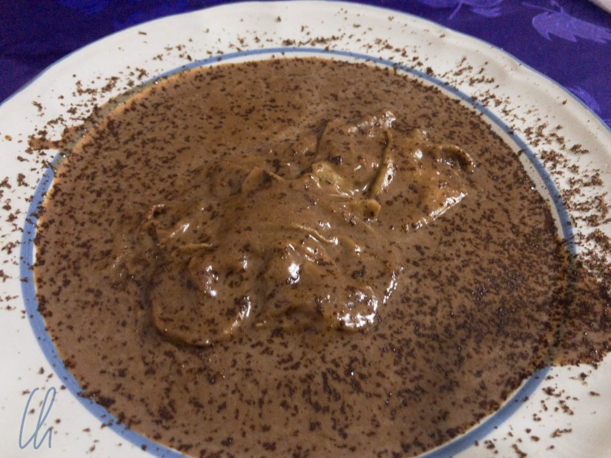

# Mexiko kulinarisch: Von Schokolade bis Mole

In Oaxaca befanden wir uns ziemlich nahe dem angeblichen [Geburtsort](https://de.wikipedia.org/wiki/Schokolade) der Schokolade. Das Wort „xocólatl“ (aus der Sprache der Atzteken [Nahuatl](https://de.wikipedia.org/wiki/Nahuatl)) bezeichnete ein bitteres und scharfes Kakaogetränk. Daraus entwickelte sich das spanische „chocolate“ und dann die deutsche Schokolade. Als wir durch die Straßen von Oaxaca gingen, duftete es aus einigen Geschäften, allen voran aus den Mayordomo-Filialen, herrlich nach frisch gemahlenen Kakaobohnen. Schokolade ist zwar nur eine von vielen Zutaten in bestimmten Sorten von Mole, aber ein wesentliche. Was es genau damit auf sich hat, erforschten wir im heroischen Selbstversuch.

<!--more-->

## Oaxaca duftet von oben bis unten nach Schokolade

Vielleicht ist diese Überschrift etwas übertrieben, aber immerhin duftete es in Oaxaca wesentlich häufiger nach Schokolade als in Panamá nach Bananen ;). Historisch belegt ist auf alle Fälle, dass die Olmeken ab ca. 1500 v. Chr. den Kakaobaum nutzten. Ab etwa 600 n. Chr. bauten auch die Maya Kakao an. Die Kakaobohnen wurden sogar als Währung benutzt, so wertvoll waren sie.

Die Schokolade, die wir in Oaxaca probierten, war dunkel und herb. Sie war nicht so fein (i.S.v. cremig), wie wir es von der industriell hergestellten Schokolade kennen. Sie zergeht nicht im Mund und wird nicht flüssig. Stattdessen fühlt es sich im Mund wie ein grober Schokoladensand aus Kakao- und Zuckerkörnern an. Einfach köstlich!

Das Kakaogetränk der Azteken ist heute durch heiße Schokolade ersetzt worden. Auch die schmeckt deutlich anders als der Pulverkakao (egal welcher Marke), den wir kennen. Der Grundgeschmack ist definitiv sehr schokoladig und weist die typische Oaxaca-Note auf. Häufig rundet eine Stange Zimt den Geschmack ab.

## Die Verbindung von Schokolade zur Mole

Mole ist sicher eines der Nationalgerichte Mexikos. Es gibt viele unterschiedliche Arten dieser köstlichen herzhaften Soße, die aus vielen verschiedenen Chili-Sorten, Nüssen, Gemüse, Kräutern, etlichen geheimen Zutaten und eben in einigen Fällen Schokolade besteht. In der Regel wird diese Art von Mole mit Hühnchen und Reis serviert. Am bekanntesten ist vermutlich die Mole Poblano ([aus Puebla](https://es.wikipedia.org/wiki/Mole_poblano)), die wir hier allerdings bewusst ignorieren, schließlich geht es ja um Oaxaca ;)

In Oaxaca ist es die schwarze Mole (mole negro) bzw. die Oaxaca Mole (mole oaxaqueño), die ebenfalls Schokolade enthält und einen kräftigen, auch rauchigen Geschmack hat. In Oaxaca gibt es angeblich sieben verschiedene Sorten von Mole und sie sind sehr unterschiedlich. Manche enthalten über 30 Zutaten. Meist sind sie nach ihrer Farbe benannt, aber es gibt auch die „Tischtuchkleckerer“-Mole (mole mancha manteles). Leider war nicht eindeutig zu bestimmen, welche diese sieben besagten Sorten nun wirklich sind. Auf den Speisekarten und im Internet kursieren die folgenden beiden Listen: [Diese hier](https://en.wikipedia.org/wiki/Mole_sauce#Oaxaca) und [diese hier](https://es.wikipedia.org/wiki/Mole_oaxaque%C3%B1o).

Auch wenn die Listen voneinander abweichen, so hatten wir uns doch für die Tage in Oaxaca zum Ziel gesetzt, die verschiedenen Arten von Mole zu probieren, um die Vielfalt kennenzulernen, die hinter dem Wort Mole steckt. Recht ähnlich zur schwarzen Mole ist die rote Mole (mole rojo). Auch sie enthält verschiedenste Chilis und Schokolade, unterscheidet sich aber wesentlich im Aroma und ist ein klein wenig scharf. Wir mochten sie lieber als die schwarze Mole. Bei der Auswahl der Beilage war Mona mutig und bestellte Reis mit chapulines, frittierten Grashüpfern. Auch wenn die Insekten gut gewürzt waren und nicht schlecht schmeckten, war das Gefühl im Mund gewöhnungsbedürftig.

## Mole ohne Schokolade

Bei weitem nicht jede Art von Mole enthält Schokolade. Die Coloradito erinnerte entfernt an ungarisches Paprika-Hühnchen, allerdings ist statt Paprika Chili und Tomate in der Soße, außerdem Zwiebel, Knoblauch und Mandeln.

Während die Coloradito noch eine gewisse Ähnlichkeit zu den bisher vorgestellten Arten von Mole aufweist, so ist die grüne Mole (mole verde) ganz anders. Bestandteile der milden, sehr aromatischen Kräutersauce sind neben den obligatorischen Zutaten wie Zwiebeln, Knoblauch und (hier grünen) Chilis zum Beispiel Sesam, Kürbiskerne und Koriander. Die Mole verde war auch die erste, die uns nicht mit Hühnchen serviert wurde, sondern mit stattdessen mit Fisch.

Nach der gelben Mole (mole amarillo) mussten wir etwas suchen. Mindestens zwei Versuche, sie zu bestellen, scheiterten, da sie gerade nicht verfügbar war. Schließlich und endlich landete sie aber doch auf unserem Teller. Die Mole amarillo wird gerne auch mit Rind serviert und sie ist nicht nur eine Soße, sondern enthält auch Gemüsestücke wie Karotten und Kartoffeln.

## Ein Außenseiter

Auch wenn einige Quellen Chichilo als eine der berühmten Moles von Oaxaca bezeichnen, so sind sich hier die Köche anscheinend nicht einig, sie wird nicht immer genannt. Da sie uns allerdings auf den Teller hüpfte, nehmen wir sie gerne in unsere Mole-Kollektion auf:

Chichilo wird anscheinend in der Regel mit Rind serviert, einige Rezepte nehmen auch Rinderzunge. Optisch erinnert Chichilo an Mole negro, ist aber flüssiger und enthält keine Schokolade. Ansonsten ist Chichilo aber auch ein köstlicher Mix aus verschiedensten Chilis, Mais, Tomate, Avokadoblättern und vielem mehr.

Damit endet unser delikater Ausflug in die Tiefen von Schokolade bis Mole. Solltet ihr Lust auf Mole bekommen haben, so könnt ihr relativ leicht den Selbstversuch starten, ohne ein Flugticket nach Mexiko erwerben zu müssen. Bei Amazon (und vielleicht sogar in gut sortierten Geschäften) gibt es [Mole von Doña Maria](https://www.amazon.de/dp/B003BPKWVI) quasi komplett fertig. Diese Mole hatten wir auch in Deutschland schon probiert. Die Zubereitung ist sehr einfach: Die Paste wird mit Wasser verdünnt und Hühnchen hinzugegeben. Buen provecho! Guten Appetit!
