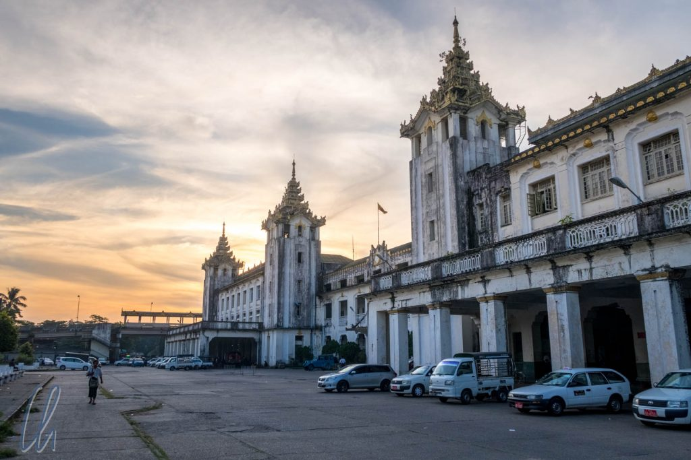
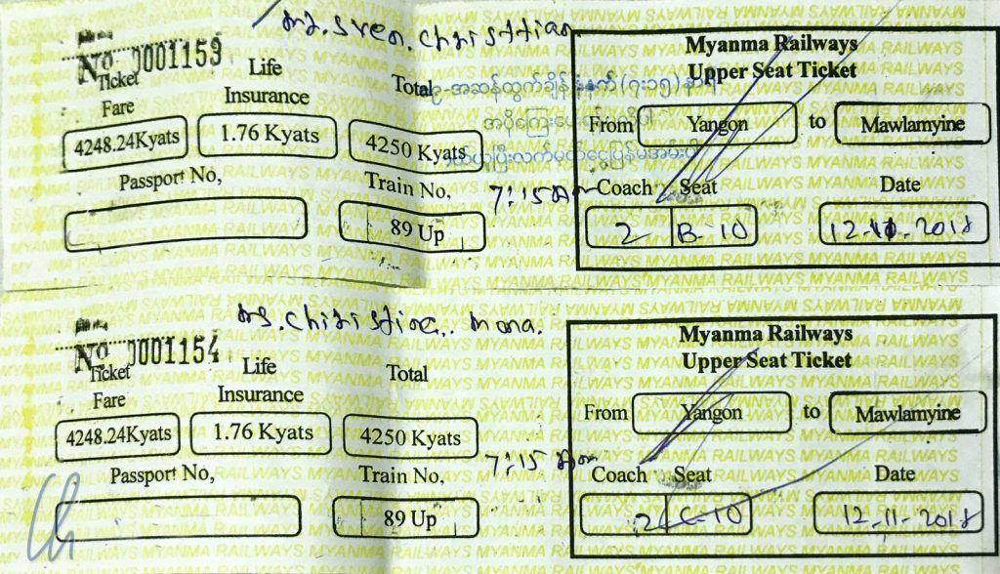

# Mit dem Zug von Yangon nach Mawlamyine

In Myanmar ist das Standard-Überlandverkehrsmittel der Bus. Da wir gehört hatten, daß eine Bahnfahrt in diesem Land noch ein echtes Abenteuer sein solle, wollten wir mindestens einmal mit dem Zug fahren. Dafür wählten wir die Strecke von Yangon nach Mawlamyine. Und in der Tat, hier galt das alte Sprichwort: "Der Weg ist das Ziel." Für gut 300 Kilometer brauchte der Zug 10 Stunden, und uns war keine Sekunde langweilig!

<!--more-->

## Erstes Abenteuer: Tickets buchen

Der Weg begann beim Buchen der Tickets. Oft sind die Hotels eine gute Anlaufstelle, um Reisepläne aller Art zu organisieren. Für die Zugfahrkarten ging das leider nicht. Zum Glück haben wir über die exzellente Seite [seat61](https://www.seat61.com/) eine Agentur gefunden, über die wir „online“ buchen konnten: Über ein Formular schickten wir unseren Reisewunsch ab. Daraufhin wurden wir am nächsten Tag per E-Mail kontaktiert. In der sich entwickelnden E-Mail-Kommunikation vereinbarten wir die Strecke, Uhrzeit, Klasse und die Lieferadresse unseres Hotels in Yangon. Als wir 3 Tage später abends im Beautyland - unserem Hotel ;) - ankamen, warteten dort tatsächlich 2 (teils von Hand ausgefüllte) Zugtickets für den nächsten Morgen auf uns!

Durch die Vermittlung hat das Ticket uns deutlich mehr als 4250 Kyat (ca. 2,70 Euro) gekostet. Trotzdem waren wir sehr beruhigt, unser Leben mit 1,76 Kyat bestens abgesichert zu wissen. Die Versicherungsbedingungen lagen leider nicht bei ;)

## Myanmar Railways

Morgens um halb sieben gingen wir bei schwülen 27 Grad die paar hundert Meter durch das um diese Zeit erwachende Yangon zum Hauptbahnhof. Die Angestellten von Myanmar Railways zeigten uns freundlich den Weg zum Gleis 3, wo der Zug schon wartete: Wagen 10 - Upper Class (höchste Buchungsklasse!).

Das Platzangebot war mit dem im Shinkansen vergleichbar. Dafür mussten wir andere leichte Abstriche in Kauf nehmen: Die Sitze waren durchgesessen, die dunkelgrüne Farbe bröckelte und der Fensterladen klemmte, ließ sich aber doch öffnen. Die Türen und Fenster standen im ganzen Zug sperrangelweit offen. Das war die Klimaanlage zusammen mit den rotierenden Ventilatoren unter der Decke.

## Der Zug fährt los

Es gab keine Durchsagen am Gleis, dafür erklang das sonore Signalhorn des Zugs: Pünktlich um 7:15 Uhr fuhren wir los. Die erste knappe Stunde bummelten wir mit maximal 20-30 km/h durch die Vororte von Yangon, vorbei an Wohnsiedlungen und Vierteln, die eher wie Slums aussahen. Auf den Grünstreifen lag leider sehr viel Plastikmüll. Es scheint Usus zu sein, alles einfach aus dem Fenster zu werfen. Bei Bio-Müll ist das natürlich kein Problem, aber immer wieder flogen auch Plastikverpackungen aus dem Zug.

Am Rande von Yangon sahen wir einige wenige Industriegebäude und Hallen, die den Schienenweg säumten. Dort nahm die Bahn zum ersten Mal Fahrt auf. Mit geschlossenen Augen fühlte es sich mindestens wie 160 km/h an. Der Blick nach draußen vermittelte jedoch eher 40, vielleicht maximal 50 km/h.

Der Takt des Zugs ist ein Viervierteltakt: Zwei Achtel, Pause, zwei Achtel, Pause, da capo ad infinitum in wechselnden Tempi und Tonlagen: Eins, zwei - drei, vier - eins, zwei - drei, vier - eins, zwei - drei, vier… Auf gerader Strecke andante, bei der Einfahrt in die Bahnhöfe adagio bis zum Stillstand, auf Brücken largo im tiefen Bariton. Auf manchen Abschnitten hüpfte der Zug im Takt über die Schienen, und die Wagons schunkelten im Rhythmus :) Tacktack-klappklapp-tacktack-klappklapp-tacktack-klappklapp…

## Kein Bordbistro, trotzdem bestens versorgt

Die burmesische Mitropa besteht aus einem nicht abreißendem Strom von fliegenden Händlerinnen und Händlern, die mit knusprig gebratenen Teigtaschen (Samusa), vielerlei Arten von Eiern, gebratenen Hühnchen, gekochten Maiskolben, abgepackten Snacks wie Chips oder Nüssen, Süßigkeiten, frischen Früchten, Steckerlfisch, frittierten Heuschrecken und anderen Leckereien durch den Zug ziehen und ihre Waren lautstark anpreisen.

Die Verkäufer kamen an den Bahnhöfen unterwegs an Bord. Einige stiegen schon während der Einfahrt des Zugs in den Bahnhof in bester Wild-West-Manier zu. Die Türen standen ja ohnehin offen. In der Bahn gingen sie im Mittelgang auf und ab, immer auf der Suche nach Kundschaft. Viele balancierten ihr Angebot in großen Körben oder auf silbernen Tabletts auf dem Kopf, freihändig unter der häufig schweren und hoch getürmten Last. Es wackelte und schaukelte, ruckelte und ratterte, trotzdem schwebten sie absolut souverän durch die Waggons, präsentieren ihre Waren der interessierten Kundschaft und sorgten für das leibliche Wohl der Fahrgäste. Wir mußten gut aufpassen, um keine der interessanten Köstlichkeiten zu verpassen, die aktuell vorbeigetragen wurden, da wir die Rufe der Händler dummerweise nicht verstanden. Zum zweiten Frühstück kauften wir 2 dampfend heiße Maiskolben und ein paar Samusas. Ratterdieklapper, ratterdieklapper, tacktack, tacktack, schaukelschuk, tut-tuuuuut!

Vom gleichmäßigem Rhythmus des Zuges mal gewiegt, mal durchgeschüttelt fuhren wir durch die burmesische Tiefebene. Ein leichter Fahrtwind wehte durch die Bahn. Trotzdem stieg die Temperatur im Wagen schnell an. Zur Abkühlung stellten wir uns ab und zu an die offene Tür. Die Bäume und Sträucher schrammten dabei oft so eng am Zug entlang, dass wir immer wieder die Köpfe einziehen mußten.

## Das Landleben

Die Diesellok arbeitete fleißig an der Spitze des Zugs. Oft stieß sie solche Rußschwaden in die Luft, daß wir uns nicht mehr ganz sicher waren, ob es sich nicht doch um eine historische Dampflokomotive handelte. Auch hatten wir bei der Fahrt über das Land den Eindruck, mit einer Zeitmaschine in die Vergangenheit gereist zu sein.

In der flachen Ebene dominierten kleinparzellige Reisfelder in allen Stadien: Überflutete Felder mit Setzlingen, saftig grüne Felder, gelblich verfärbte, zur Ernte bereite und abgeerntete Felder. Einige wurden auch abgebrannt, um das Feld für die nächste Saat vorzubereiten. Insgesamt wurden fast alle Arbeiten manuell durchgeführt. Bei der Ernte schnitten die Bauern die Reispflanzen von Hand. Auch das Dreschen lief so ab, wie wohl seit Hunderten von Jahren. Manchmal halfen Ochsen, die Felder zu bestellen, aber nur ganz selten sahen wir Maschinen, die den Bauern den Knochenjob abnahmen.

Die Häuser waren oft nur einfach Bambushütten, die auf Stelzen standen - vermutlich ist dies den Überflutungen während der Regenzeit geschuldet. Trotzdem machten die Menschen keinen unzufriedenen Eindruck. Die Kinder winkten den Passagieren der Bahn zu und freuten sich, wenn wir zurückwinkten.

In regelmäßigen Abständen sahen wir auch immer wieder golden glänzende Pagoden vorüberziehen. Nach ungefähr 2 Wochen in Myanmar gehörten die goldenen Stupas nach unserem Gefühl schon ganz natürlich zur üppig-grünen, burmesischen Landschaft. Dennoch erschienen sie uns immer wieder bemerkenswert und märchenhaft schön. Klappklipp-klappklapp-Klappklipp-klappklapp-Klappklipp-klappklapp…

## Essen auf Schienen

Um die Mittagszeit bekamen wir wieder Hunger. Da der Zug unterwegs wie eine gute Bummelbahn in jedem Dorf hielt, waren wir bester Dinge, dass das Essen auf Schienen bald an unseren Platz geliefert werden würde. In der Tat: Kurze Zeit später hielten wir in einem Bahnhof, in dem mehrere Garküchenbetreiber fieberhaft damit beschäftigt waren, Essen aus einer verheißungsvollen Batterie silbern glänzender Töpfe zu schöpfen und zu verpacken. Mehrere junge Männer bestiegen mit Bündeln von Plastiktüten den Zug. Eine davon sollte unsere werden: Hühnchen für 1500 Kyat (ca. 1 Euro).

Die Überraschungstüte enthielt eine gut verknotete kleine Plastiktüte mit einer roten Soße, eine weitere kleine Plastiktüte mit einem gegrillten Stück Hühnchen und ein in Zeitungspapier eingewickeltes Palmblatt, welches eine ordentliche Portion Reis enthielt, etwas Chili dazu und eine Art Gemüsedipp. Entfaltet diente das Bananenblatt als Bio-Teller auf unseren Knien. Mangels Besteck aßen wir mit den Fingern. Leider fehlte uns die richtige Technik, so dass uns das Hühnchen, Reis mit Chili und Soße zwar sehr gut schmeckten, wir aber mit eleganten Tischmanieren nicht glänzen konnten.

Kaum hatten wir das schmackhafte Hühnchen verspeist, balancierte ein Händler appetitlich aufgeschnittene Wassermelone durch den Zug. Wir schlugen natürlich zu. Als zweiten Nachtisch gab es später einen hauchdünnen Fladen aus karamellisiertem Zucker, in dem reichlich Sesam eingeschlossen war und burmesisches Bounty, eine Art länglicher Riegel aus Palmzucker und Kokosraspeln. So gut haben wir im Speisewagen der Deutschen Bahn noch nie gegessen!

## Angekommen in Mawlamyine

Auf den letzten ca. 50 Kilometern verwandelte sich das platte Land ein wenig. Im Osten tauchten die ersten Hügel auf und später wurde es sogar etwas bergig. Auf den Gipfeln, wie sollte es anders sein, standen goldene Pagoden. In ihrer Häufung erinnerten sie uns ein wenig an das Rheintal, wo eine Burg neben der nächsten steht.

Angekommen sind wir in Mawlamyine mit ca. 15 Minuten Verspätung, Gemessen an 10 Stunden Fahrzeit waren wir positiv überrascht. Wir haben die Fahrt sehr genossen und andere Eindrücke von Myanmar gewonnen, als es auf einer Busfahrt möglich gewesen wäre.

Den Abend nach der Ankunft fühlten wir uns noch etwas landkrank, nachdem wir uns so an das Geschaukel gewöhnt hatten. Auch wenn wir fast den ganzen Tag nur im Zug gesessen hatten, waren wir abends sehr müde und schlummerten mit einem Nachhall des Rhythmus des Zuges im Nu ein: Tacktack, tucktuck, tacktack, tucktuck, tacktack, tucktuck…

Statt weiterer Bilder folgt diesmal ein Film mit Eindrücken unserer Bahnfahrt. Er ist bewusst eher langsam geschnitten, um das meditative Element der Fortbewegung zu erhalten ;)

https://www.youtube.com/watch?v=kbpjfu-VUTE
