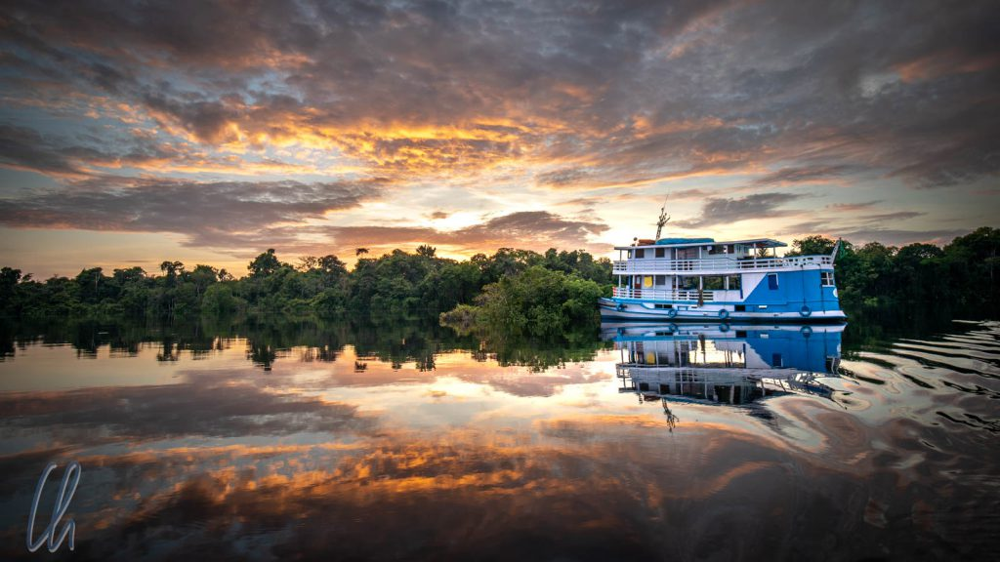

An unseren vorherigen Stationen in [Bolivien](http://wittmann-tours.de/der-bolivianische-dschungel-im-madidi-nationalpark/) und [Brasilien](http://wittmann-tours.de/tropical-treeclimbing-regenwald-auf-allen-etagen) hatte der Regenwald selbst im Vordergrund gestanden. Dieses riesige Dschungelgebiet würde es aber nicht geben ohne den Amazonas und sein weit verästeltes Flusssystem. Um den Fluss, genauer gesagt den Rio Negro, besser kennenzulernen, heuerten wir auf der "[Lo Peix](https://www.lopeix.com/)" (gesprochen "Lo Peïsch") an. Jordi war für 7 Tage unser Ober-Rio-Negro-Fluss-Schifffahrts-Kapitän. Zusammen mit zwei Spanierinnen (Carmen, Julia) und zwei Brasilianerinnen (Gabriella und Carolina) fuhren wir flussaufwärts bis zum [Parque Nacional do Jaú](https://de.wikipedia.org/wiki/Nationalpark_Ja%C3%BA) und wieder zurück nach Manaus.

<!--more-->

## Rio Negro? Warum nicht auf dem Amazonas?

Der Amazonas entspringt in Peru, auf der Reittour im Colca-Tal hatten wir die schneebedeckten Gipfel der Quellregion gesehen. Den Namen Amazonas trägt er ab der [Vereinigung](https://www.google.de/maps/place/4%C2%B027'21.0%22S+73%C2%B026'51.0%22W/@-4.4546597,-73.460918,13.5z/data=!4m5!3m4!1s0x0:0x0!8m2!3d-4.455833!4d-73.4475) seiner Quellflüsse Marañón und Ucayali (ebenfalls in Peru). Ab der brasilianisch-peruanischen Grenze heißt der Amazonas zunächst Rio [Solimões](https://en.wikipedia.org/wiki/Solim%C3%B5es_River). Erst ab dem Zusammenfluss von Rio Negro und Solimões einige Kilometer östlich von Manaus ändert er seinen Namen auf brasilianischem Staatsgebiet wieder in Amazonas. Dies bleibt dann aber auch so bis zu seiner Mündung in den Atlantik. Den Amazonas selbst sahen wir also nur ganz am Ende unser Flusskreuzfahrt beim "Meeting of the Waters", die meiste Zeit verbrachten wir auf dem Rio Negro.

Im gigantischen Flusssystem des Amazonas, das ein Fünftel des Süßwassers unseres Planeten mit sich führt, gibt es drei Arten von Fließgewässern: claro (klar), branco (weiß) und negro (schwarz). Die Klarwasserflüsse entspringen in Süd- oder Zentralbrasilien. Die Weißwasserflüsse (zum Beispiel der Solimões) kommen aus den Anden (wie wir auch ;) ), einem in geologischen Maßstäben jungen Gebirge, und transportieren daher viele Sedimente und Nährstoffe. Dadurch sind die milchigen Weißwasserflüsse voller Leben, was aber auch bedeutet, dass es viele Insekten und damit auch eine Menge Mücken gibt.

Die Schwarzwasserflüsse, wie der Rio Negro, entspringen hingegen weiter im Norden und fließen durch wesentlich ältere Gebiete. Dadurch können sie weniger Sedimente auswaschen. Ihre Fließgeschwindigkeit ist geringer und die Wassertemperatur höher, so dass Pflanzenmaterial im Fluss verrottet und [Tannine](https://de.wikipedia.org/wiki/Tannine) aus den Blättern gelöst werden. Diese verursachen die dunkle Farbe des Wassers, die in Wirklichkeit eher braun als schwarz ist. Die Schwarzwasserflüsse enthalten quasi einen Blätter-Schwarztee. Außerdem haben sie durch die freigesetzten organischen Säuren einen deutlich niedrigeren pH-Wert. All diese Faktoren zusammen genommen bedeuten unter anderem, dass es wesentlich weniger Moskitos gibt. Ein weiterer Pluspunkt ist, dass der Rio Negro touristisch kaum erschlossen ist.

## Abfahrt von Manaus

Nachdem wir in Manaus abgelegt hatten, musste das Schiff noch aufgetankt werden. Dafür gab es zu unserem großen Erstaunen eine schwimmende Tankstelle, die wie eine ebensolche Einrichtung an der Straße aussah, nur eben, dass sie sich auf der Oberfläche des Rio Negro befand. Neben den Zapfsäulen gab es auch einen kleinen Laden, der sogar Eis verkaufte ;).

Anfangs hatten wir nicht das Gefühl, mit der "Lo Peix" auf einem Fluss zu fahren, sondern eher auf einem See. Der Rio Negro war mehrere Kilometer breit und wir konnte keine Fließrichtung erkennen. Wir wussten nur, dass wir flussaufwärts fuhren.

## Zu Besuch bei den Tatuyu

Unser erster Landgang fand am späten Nachmittag bei einem Dorf der Tatuyo statt, einem ortsansässigen indigenen Volk, einer von 26 ethnischen Gruppen, die noch am Rio Negro leben. Direkt am Fluss empfingen sie uns in einem riesigen Versammlungshaus. Freundlich und geduldig boten sie dort zunächst etwas Kunsthandwerk zum Kauf an. Einige Minuten später startete die Vorführung.

Die Tatuyo waren prächtig herausgeputzt. Die Frauen trugen Röcke aus getrockneter Naturfaser, zahlreiche Ketten und lange Ohrringe mit herrlichen bunten Federchen. Die Männer waren mit einem Lendenschurz bekleidet, der auf beiden Seiten der Hüfte mit grünen Blätterbüscheln dekoriert war. Auf dem Kopf trugen sie prächtige Kronen aus blauen und roten Federn. So führten sie diverse Tänze auf, die musikalisch von selbst angefertigten Instrumenten rhythmisch untermalt wurden.

Nach den ersten Stücken kam, was kommen musste: Wir wurden auch zum Tanzen aufgefordert. Hier artete es aber nicht in Peinlichkeit aus, da alle mitmachten. Vermutlich hielten wir die Schrittfolge nicht exakt ein ;), aber es hat uns Freude bereitet :).

In der Fragestunde am Ende gaben sie unumwunden zu, dass sie normalerweise nicht auf diese Weise gekleidet seien. Zum einen war unser Besuch ein besonderer Anlass, für den sie ihre traditionelle Festkleidung angelegt hatten, zum anderen sind für sie im Alltag Shorts und T-Shirt mittlerweile deutlich bequemer. Bevor wir uns verabschiedeten, mussten wir unbedingt noch ein Gruppenfoto machen.

## Dschungelwanderung

Am nächsten Morgen war es Zeit für die erste Dschungelwanderung. Verglichen mit dem Madidi Nationalpark in Bolivien sahen wir relativ wenige Tiere, dafür aber umso mehr Pflanzen. Der Wald war nach einigen hundert Metern ein echter Primärwald, leicht daran zu erkennen, dass am Boden kein dichtes Gestrüpp wächst, da einfach nicht genug Licht durch das Blätterdach dringt. Sobald ein Urwaldriese fällt, startet "das Rennen nach oben". Dabei wachsen die jungen dünnen Baumstämme wirklich kerzengerade dem Himmel entgegen. Der Gewinner dieses Wettlaufes wird in einigen Jahren eine Baumkrone ausbilden können.

Eine interessante Baum-Spezies war der "Telefonbaum". Solch ein Baum hat große Brettwurzeln, die den Baum nicht von unten, sondern seitlich abstützen. Sie stehen sternförmig vom Stamm ab und haben eine dreieckige Form. Schlägt man mit einem Stock gegen eine dieser Wurzeln, kann man den erzeugten Klang im Regenwald noch überraschend weit hören. Mit Hilfe eines speziellen Codes können die Ureinwohner so über große Entfernungen miteinander kommunizieren und sich Nachrichten senden, "Ich bin hier", "Ich brauche Hilfe" etc.

## Regenschauer passend zum Regenwald

Zurück an Bord sahen wir, wie sich in der Ferne die ersten Gewitter zusammenbrauten. Als wir ablegten, war es aber weiterhin heiß und sonnig. Während der Fahrt versteckte sich die Sonne ab und zu hinter den Wolken. 2 Stunden später, wir saßen gerade beim Mittagessen, ging auf einmal alles sehr schnell. Jordi empfahl uns, rasch unsere Sachen hereinzuholen, die auf den Wäscheleinen trockneten und die Fenster und Türen der Kabinen zu schießen. Wir spurteten aufs Oberdeck und taten, wie uns empfohlen. Keine drei Minuten später fegte der Wind die ersten Regenböen von Steuerbord herein. Schnell halfen alle, die Plastikplanen herunterzulassen, die den Aufenthaltsbereich vor Nässe schützten. Jordi steuerte die "Lo Peix" in Ufernähe in eine Parkposition, denn die Schauer waren so dicht, dass sie die Sicht auf den Fluss unmöglich machten.

https://www.youtube.com/watch?v=-sPfidhZUZQ

Für 10 Minuten prasselten Sturzbäche auf das Schiff nieder, begleitet von einem Gewitter. Als der Regen nachließ, fuhren wir weiter und nach einer halben Stunde hörte es auf ganz auf. Der Blick vom Heck der "Lo Peix" offenbarte schon wieder ein Stück blauen Himmels.

## Parque Nacional de Anavilhanas

Weiter flussaufwärts gelangten wir in den [Parque Nacional de Anavilhanas](https://en.wikipedia.org/wiki/Anavilhanas_National_Park). Dort hatten wir "endlich" den Eindruck, auf einem Fluss unterwegs zu sein. Die Fahrrinne war noch etwa 400 Meter breit, trotzdem noch deutlich breiter als Rhein oder Mosel rund um Koblenz herum. Was wir als solches wahrnahmen, war jedoch keineswegs das Ufer des Festlandes, vielmehr fuhren wir zwischen vielen Inseln im Fluss entlang. Der Anavilhanas-Archipel ist der zweitgrößte Flussarchipel der Welt. Das tatsächlich vorhandene Labyrinth aus Eilanden zeigte uns Jordi auf dem Sattelitenbild.

Wir waren am Ende der Regenzeit im Übergang zur Trockenzeit unterwegs. Das bedeutete, dass der Wasserstand gerade sein Maximum erreicht hatte. Tatsächlich schwankt der Pegel des Flusses im Schnitt um 12 Meter zwischen Regen- und Trockenzeit. Wir sahen also nur den oberen Teil der überfluteten Inseln bzw. nur die Spitzen der Bäume, die aus dem Wasser ragten. In der Trockenzeit soll es Strände geben, an denen man baden kann.

Jordi hatte für den Tag viel Strecke eingeplant, wegen des Regens hatten wir jedoch etwas Zeit verloren. Die Sonne ging unter und wir fuhren im Fast-Vollmondschein weiter. Das Licht des Mondes war so hell, dass wir die Landschaft noch gut erkennen konnten. Die schwarzen Konturen der Bäume säumten unseren Weg und der weiße Himmelskörper spiegelte sich schimmernd auf der Wasseroberfläche.

Das Licht des Erdtrabanten beleuchtete auch die filigranen Wolken am nächtlichen Himmel. Für die Beobachtung der Sterne war es zu hell, dafür sahen wir um den Mond herum einen klaren [22°-Halo](<https://de.wikipedia.org/wiki/Halo_(Lichteffekt)#Physikalische_Grundlagen_des_22%C2%B0-Rings>). Dabei handelt es sich um einen Ring aus Licht um den Mond, der durch feine Eiskristalle in der Atmosphäre entsteht, die zu einer Brechung und Ablenkung der Strahlen führen.

## An Bord der "Lo Peix"

An Bord der "Lo Peix" ging es sehr familiär zu. Wir hatten eine kleine Kabine mit Doppelstockbett und sonst wenig mehr. Meistens hielten wir uns auf dem hinteren Sonnendeck oder unten im Gemeinschaftsbereich auf. Direkt daneben in der Kombüse werkelte die stets gut gelaunte Vita unermüdlich und zauberte vielseitige abwechslungsreiche Gerichte aus frischen Zutaten: Amzonasküche vom Feinsten. Sie war die gute Seele des Schiffes. João fungierte als zuverlässiger Kapitän der "Lo Peix". Nonato, der meistens das Beiboot bei den Bootsexkursionen steuerte und uns auch im Dschungel führte, komplettierte die Mannschaft. So waren wir zu zehnt, 6 Gäste und 4 Crewmitglieder.

Ein ganz besonderes Extra war die Freiluft-Dusche mit Ausblick auf dem Oberdeck, wo man, je nach Tageszeit, sich von der Hitze der Sonne abkühlen oder unter den Sternen mit dem Rio Negro-Wasser duschen konnte. Das Wasser, also der Blätter-Tee, war zum Waschen sauber genug, hatte aber gleichzeitig einen leicht organischen Geruch. Im Laufe der Woche verfärbten sich unsere Finger- und Zehennägel etwas orangefarben und die Haare fühlten sich nach einer Wäsche im sauren Wasser wie die einer Puppe an.

## Entschleunigung pur

Immer wieder fuhren wir lange Tagesetappen; von Manaus bis zum Jaú Nationalpark waren es 250 km (hin und zurück also gut 500 km) und das Schiff fuhr meistens 12-15km/h. Während der Fahrt glitt die herrliche Landschaft an uns vorbei und wir konnten die Natur in Ruhe auf uns wirken lassen. Es wurde nicht langweilig, sich die Baumkronen zu begucken, die aus dem Wasser ragten. Selten nur sahen wir Siedlungen am Ufer oder begegneten anderen Wasserfahrzeugen. Manchmal konnten wir Vögel in den Bäumen oder in der Luft beobachten. Einmal kreiste sogar eine kleine Gruppe von blau-gelben Aras laut krächzend über der "Lo Peix". Wundervoll, diese farbenfrohen Tiere in freier Wildbahn zu sehen.

https://www.youtube.com/watch?v=APbmKxETbzc

Abends saßen wir häufig noch lange im Gemeinschaftsbereich zusammen am Tisch und lauschten gebannt Jordis lebendigen Abenteuergeschichten von früheren Reisen, von seinen Begegnungen mit den am Fluss lebenden Mestizen, den sogenannten Caboclos, die für ihre Einsilbigkeit bekannt sind, von einem Aufenthalt beim indigenen Stamm der Yanomami und von Expeditionen in unberührte Dschungelgebiete.

## Ausfahrt durch die Baumkronen

Am Morgen des dritten Tages unternahmen wir zum Sonnenaufgang eine Ausfahrt im motorisierten Beiboot. Nonato steuerte uns durch das Labyrinth der Inselwelt des Parque Nacional de Anavilhanas. Nun sahen wir die Inseln und den Pegelstand aus nächster Nähe. Durch eine schmale Lücke in der Vegetation gelangten wir in ein komplexes System aus miteinander verbundenen Seen. Wir fuhren mit dem Boot wirklich an den Baumkronen entlang! Trotzdem ragten manche Stämme noch mindestens 10 bis 15 Meter aus dem Wasser. Bei anderen sah der Wipfel nur wie ein Busch aus, der im Wasser stand. Es war vollkommen windstill und die Wasseroberfläche wirkte wie ein riesiger Spiegel, der die Bäume und den Himmel perfekt reflektierte.

Nachdem wir den Hauptstrom verlassen hatten und uns auf engeren Wasserstraßen bewegten, sahen wir viele Vögel in den Bäumen. Greifvögel beobachteten ihre Umgebung, Kingfisher flogen direkt über der Wasseroberfläche, kleine Piepmatze turnten durch die Äste und Papageien flogen krächzend über unsere Köpfe. Einige konnten wir trotz ihrer guten Tarnung auch in den Bäumen entdecken.

Im Gegensatz zum Vortag war die Tierwelt hier sehr vielfältig uns abwechslungsreich. Nach dem Frühstück zurück an Bord setzten wir die Reise fort in Richtung Parque Nacional de Jaú. Darüber und über noch viel mehr werden wir im zweiten Teil berichten.

