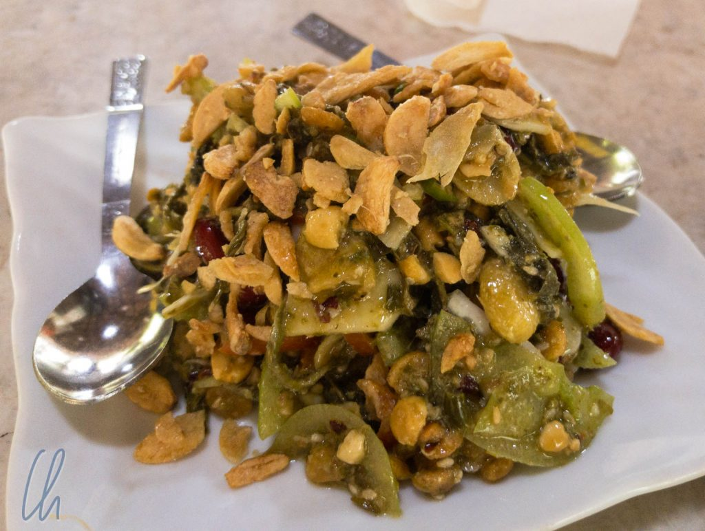
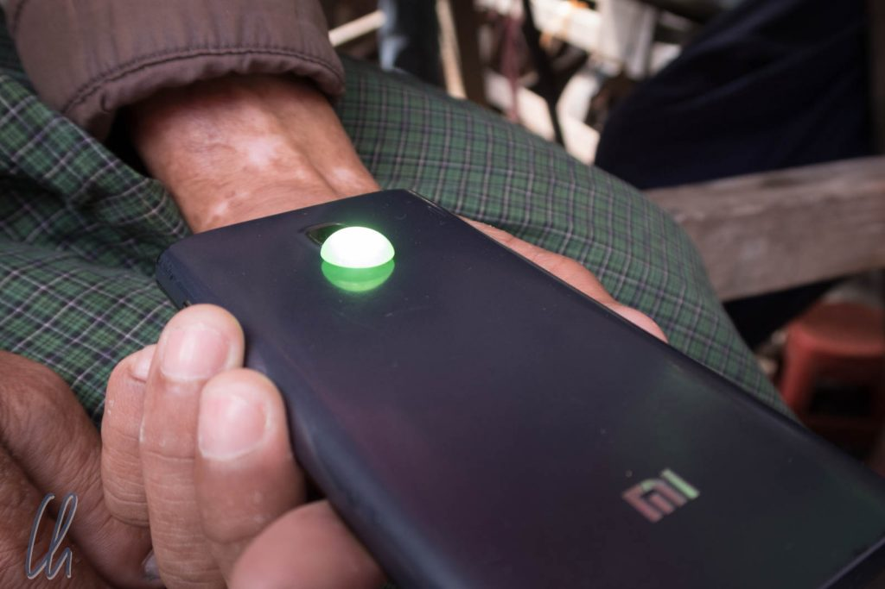
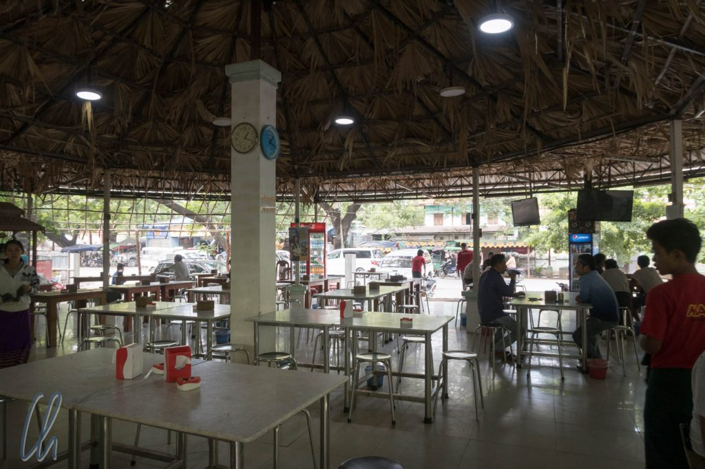
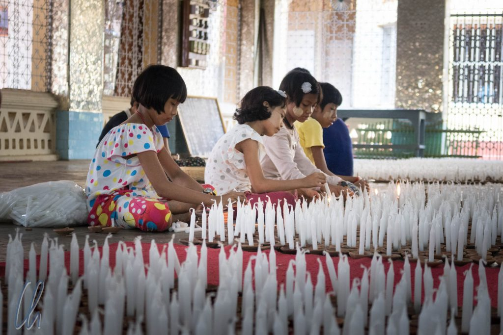
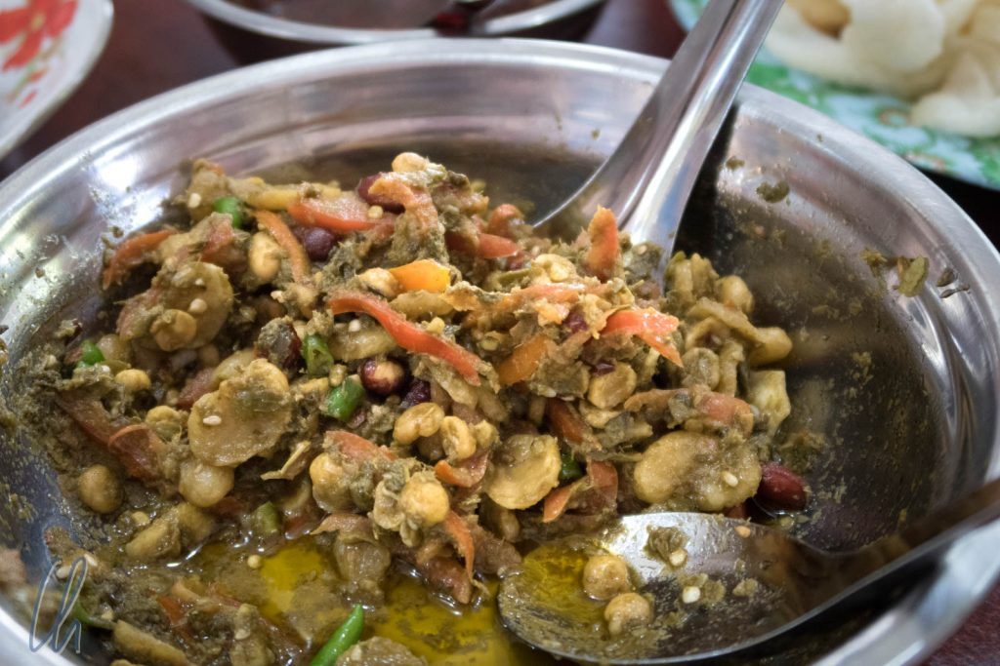
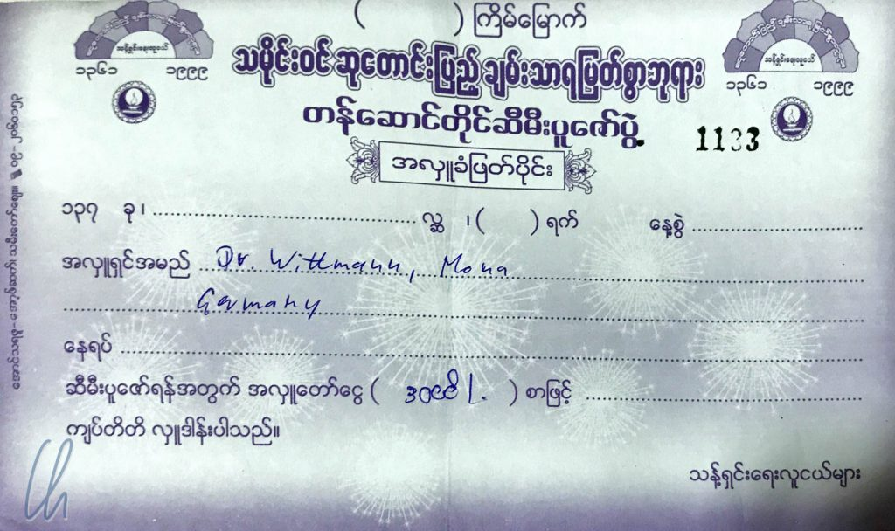

Neben verschiedenen Arten von Curry gibt es in Myanmar eine Spezialität, die uns so noch nicht auf den Teller gehüpft ist: Teeblättersalat (leq·p’eq). Jeder hat natürlich sein eigenes Spezialrezept, aber im wesentlichen gehören die folgenden Zutaten in jeden Teeblättersalat: Fermentierte Teeblätter, Bohnen, Knoblauch, grüne Tomaten und Erdnüsse. Das Ergebnis ist ein sehr erfrischender Salat, der schön würzig und knusprig ist. Durch den Tee enthält der Salat auch Koffein, daher ist er optimal für erschöpfte Reisende. Er vertreibt die Müdigkeit und stärkt die Willenskraft.

<!--more-->

## Teeblättersalat am Jademarkt

Unseren ersten Teeblättersalat probierten wir in einem Teehaus in der Nähe des Jademarkts in Mandalay. Vor dem Mittagessen hatten wir eben jenen Jade-Umschlagplatz besucht. Dort werden die wertvollen Steine in den verschiedensten Qualitätsstufen geschliffen und gehandelt, wie uns ein freundlicher Einheimischer spontan erklärte. Außerdem lernten wir, dass es neben der bekannten grünen auch noch weiße, gelbe und rote Jade gibt. Auch wenn die Gewinnung und der Handel mit der Jade ein [dreckiges Geschäft](http://www.daserste.de/information/politik-weltgeschehen/weltspiegel/sendung/myanmar-minen-jade100.html) ist, war es faszinierend anzuschauen, wie - teilweise noch mit Fußantrieb - die Steine geschliffen wurden.

Bei der Mini-Führung war eine gewisse Jade-Gräberstimmung zu spüren und die Hoffnung auf das große Geld. Vorbilder gab es genug: Händler liefen mit dicken Bündeln von Geldscheinen oder mit Jade von Tüten mit stecknadelkopfkleinen Steinchen bis zum kinderkopfgroßen Brocken herum. Die Qualität der Jade wird anhand der Lichtdurchlässigkeit und dem Vorkommen von Einschlüssen geprüft. Die Profis benutzen spezielle Taschenlampen. Für den Einstieg reicht auch die Jade-App "Taschenlampe" im Smartphone.

Das Unison Teehaus bestand aus einem runden, gefliesten Betonfundament, über dem ein Dachgestell stand, welches mit Palmwedeln gedeckt war und in dem einige Vögel ein- und ausflogen. Wände gab es nicht. Wir saßen auf Metallhockern an einem Tisch ziemlich in der Mitte, und es wehte eine leichte Brise. Als Ausländer wurden wir vom gestrengen Chef selbst betreut. Er nahm höchstpersönlich unsere Bestellung entgegen (gebratene Nudeln und den Salat), die er gleich in die Küche weiterrief - natürlich auf Burmesisch ;).

Die ersten Bissen probierten wir etwas skeptisch, aber wir waren sofort begeistert. Insgesamt war der Teeblättersalat überraschenderweise sehr knusprig. Es hat gedauert bis wir uns sicher waren, dass die geheime Zutat wirklich frittierte Knoblauchscheibchen waren, und nicht zu knapp. Tatsächlich waren vielleicht mehr Knoblauchscheibchen als Teeblätter im Salat ;). An diesem Abend (und auch häufiger in Myanmar) hätten Vampire uns nichts anhaben können!

## Teeblättersalat in der Chanthaya Paya

Unseren zweiten Teeblättersalat aßen wir in der Chanthaya Paya. Als wir sie besichtigen wollten, waren dort die Vorbereitungen für das [Tazaungdaing](https://en.wikipedia.org/wiki/Tazaungdaing_festival), einem Lichterfest, in vollem Gange.

In Myanmar spielt ein Mondkalender eine große Rolle, in dem die Monate mit burmesischen Namen bezeichnet werden. So wird das Tazaungdaing zum Vollmond des Monats Tazaungmon gefeiert, was auch das Ende der Regenzeit bedeutet. Unter anderem werden hunderte von Kerzen in den Tempeln aufgestellt und abends entzündet. In einem Nebenraum der Chanthaya Paya wurden gerade die Kerzen vorbereitet, als wir neugierig einen Blick hineinwarfen. Kurze Zeit später waren wir mittendrin und wurden spontan zum Essen eingeladen: Es gab Omelett, Teeblättersalat und dazu Reis - diesmal etwas weniger knusprig, der Knoblauch war nicht frittiert, dafür zusätzlich mit Chili. Außerdem war er erfrischend mit Limette angemacht.

Wir erfuhren etwas über das Fest, unsere Gastgeberinnen und versuchten, das Rezept des Teeblättersalates in Erfahrung zu bringen. Leider geriet die Unterhaltung zuweilen etwas ins Stocken, da es doch eine gewisse Sprachbarriere gab. Mit einem Lächeln, einem neuen Anlauf oder einem Themenwechsel ging es aber immer nett weiter. Bevor wir uns verabschiedeten fragten wir höflichkeitshalber, ob wir dem Tempel eine Spende zukommen lassen könnten. Für die 3000 Kyat, die wir gaben (umgerechnet 1,88 EUR), bekamen wir sogar eine offizielle Spendenquittung ;).

Gerade Begegnungen wie diese machen das Reisen in Myanmar sehr angenehm und spannend. Die meisten Menschen sind offen und freundlich und sehen in Ausländern (noch) keine wandelnde Geldquelle.

Nicht selten waren wir auf einmal die Sehenswürdigkeit: Häufig wurden wir fotografiert oder mußten mit aufs Bild. Vor allem Mona mit ihren goldenen Löckchen erregte viel Aufmerksamkeit. Außerdem spürten wir ein ernsthaftes Interesse, "die Ausländer" kennenzulernen oder auch einfach nur das eigene Englisch zu verbessern.

