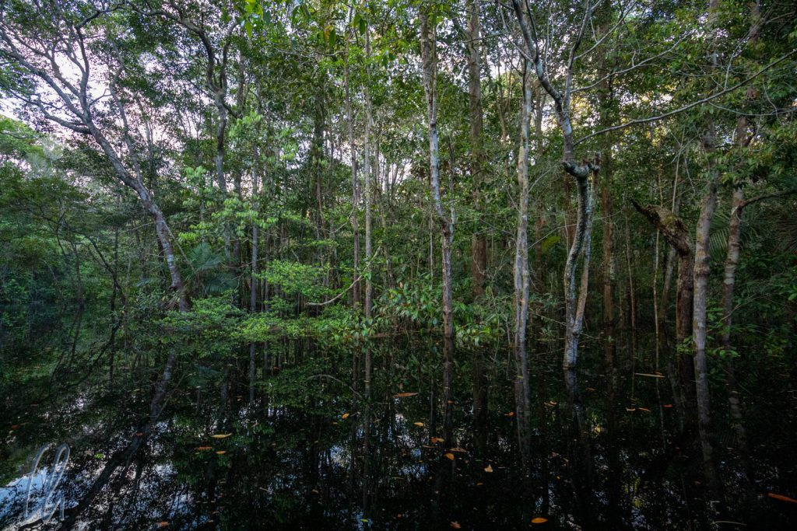

Bei unserer [Flusskreuzfahrt auf dem Rio Negro](http://wittmann-tours.de/mit-der-lo-peix-unterwegs-auf-dem-rio-negro) war bisher der Weg das (sehr) lohnenswerte Ziel gewesen. Es gab aber auch eine Endstation bzw. einen Umkehrpunkt, nämlich den Parque Nacional do Jaú, einen der [größten Nationalparks](https://de.wikipedia.org/wiki/Nationalpark_Ja%C3%BA) Brasiliens, ein gewaltiges ununterbrochenes und unberührtes Stück Regenwald, das man nur mit dem Boot erreichen kann. So bogen wir denn vom Rio Negro aus in den Rio Jaú ein.

<!--more-->

## Einfahrt in den Rio Jaú

Nachdem wir eine kurze Strecke auf dem [Rio Jaú](https://www.google.com/maps/place/1%C2%B054'13.5%22S+61%C2%B025'57.3%22W/@-1.9124477,-61.5865421,12z/data=!4m5!3m4!1s0x0:0x0!8m2!3d-1.903747!4d-61.432576?hl=en) zurückgelegt hatten, unternahmen wir am späten Nachmittag eine Ausfahrt mit dem Beiboot auf seinem Nebenfluss [Igarabe Preto](https://www.openstreetmap.org/way/627585899), der schon nach kurzer Zeit mit der "Lo Peix" nicht mehr befahrbar gewesen wäre. Die ersten Mäander waren wir flott auf der spiegelglatten Oberfläche des Flusses unterwegs. Wie so oft reflektierte das Wasser den Himmel und die Bäume und wir hatten den Eindruck, über ein Wolkenmeer zu fahren. Dieser Anblick hatte eine geradezu mystische Qualität.

Der Fluss wurde immer schmaler. Nonato verlangsamte die Fahrt und navigierte zusammen mit Jordi, der nun auf dem Bug des Bootes saß, zwischen den Bäumen hindurch. Nicht immer gab es eine eindeutige Fahrrinne, da auch hier alles überflutet war und es viele Seitenarme gab. Immer wieder schalteten wir den Motor aus, Jordi und Nonato paddelten, um möglichst wenig Geräusche zu verursachen und keine Tiere zu verscheuchen. So glitten wir über das wellenlose Wasser und ließen unsere Augen durch das uns umgebende Dickicht schweifen.

## Wasserfall als Umkehrpunkt

Wir erspähten nur wenige Tiere, zum Beispiel Fledermäuse, dafür aber Vogelnester (wir glitten schließlich durch die Baumkronen) und ausquellendes duftendes Baumharz, vor allem aber viele Pflanzen und Bäume. Die Vegetation wurde dichter und dichter, unser Wasserweg zunehmend enger. Immer mehr Schaum trieb uns entgegen, teilweise in großen bräunlich-gelben Flocken. Die Dämmerung setzte ein und wir erreichten einen urigen überwucherten Ort, wo das braune Flusswasser über eine steinige Stufe strömte. Die Ursache für die bemerkenswerte Schaumentwicklung war der kleine Wasserfall und angeblich auch der Säuregehalt des Wassers (pH-Wert von ungefähr 4).

Am Wasserfall legten wir an und stiegen aus. Wir konnten in einem seitlichen Felsbecken ein Bad nehmen, nachdem Nonato überprüft hatte, dass sich keine Anakonda (Sucuri) darin befand, oder einfach nur dem tosenden Wasser lauschen. Erst nach Sonnenuntergang machten wir uns wieder auf die Rückfahrt zum Schiff. Die Dunkelheit legte sich über uns.

## Fahrt in die Nacht

Zunächst ließen wir uns von der Strömung treiben, Jordi und Nonato steuerten das Boot mit wenigen Paddelstößen. Außerdem suchten die beiden die Umgebung mit ihren Taschenlampen ab. Es herrschte nahezu Stille, ab und zu quakten Frösche, ein gelegentliches Plätschern, aber es gab kein lautes Zikadenkonzert. So erspähten wir einige Fledermäuse, ein [Paca](https://de.wikipedia.org/wiki/Pakas), einen Kaiman (Jacaré) und zahlreiche blinkende Glühwürmchen.

Je dunkler es wurde, desto mehr bewunderten wir die Navigationskünste unserer Führer. Mit dem Schwenk der Taschenlampe wies Jordi vorne den Weg zurück zur "Lo Peix". Nachdem wir den dichten Wald verlassen hatten, wurde es gleich heller, der Mond beleuchtete den Parque Nacional do Jaú. Allein schon diese Ausfahrt war ein unglaublich eindrucksvolles Erlebnis!

https://www.youtube.com/watch?v=WZBCB4Yq1Io

## Floresta

Der Regenwald war wunderschön, ein Stillleben der üppigen ungezähmten Vegetation. Passenderweise gibt es im Portugiesischen ein würdiges Wort dafür: [Floresta](https://dict.leo.org/portugiesisch-deutsch/Floresta). Auch wenn wir kaum Blüten oder Blumen im Regenwald entdeckten, so ist der Urwald doch ein einzigartiges Kunstwerk der Natur.

Außerdem zählte der Parque Nacional do Jaú wohl zu den Orten unserer Reisen, wo wir uns am weitesten von dem entfernt hatten, was wir als Zivilisation bezeichnen. Dabei war es nicht unbedingt die Entfernung, sondern die Zeit, die man zum Erreichen der nächsten nennenswerten Ortschaft hätte veranschlagen müssen. Per Boot waren es mindestens 2 Tage bis Manaus. Selbstredend gab es keinen Mobilfunk, nur die Telefonbäume.

Damit war der Parque Nacional do Jaú noch ein echtes, relativ unberührtes Paradies. Wirklich erstaunlich, dass es so etwas auf der Welt noch gibt. Minimale menschliche Präsenz, kein Müll im Fluss oder im Wald, keine Straßen, nur der Fluss und der Wald. Nur ab und zu trifft man dort auf den Geist eines zerlumpten historischen Seringueiros (Kautschukzapfers), der sich durch den Dschungel bewegt und nicht antwortet, wenn man ihn anspricht.

## Flussdelfine

Öfters, wenn wir pausierten, bekamen wir Besuch. Morgens zum Sonnenaufgang, abends nach dem Anlegen, häufig wenn die "Lo Peix" vor Anker lag, hörten wir ein Atmen und Plätschern im Wasser. Das war ein sicheres Anzeichen dafür, dass sich Flussdelfine in direkter Nähe zum Schiff aufhielten. Manchmal schwammen sie nur vorbei, andere Male verweilten sie ein wenig, aber immer gut 10 Meter von uns entfernt.

Insgesamt sahen wir 2 Arten dieser Säugetiere, die bekannten und zutraulicheren rosa [Flussdelfine](https://de.wikipedia.org/wiki/Amazonasdelfin) (boto vermelho) und die kleineren, grauen [Tucuxi](https://de.wikipedia.org/wiki/Amazonas-Sotalia). Meistens waren sie in kleinen Gruppen unterwegs. Über die Botos gibt es zahlreiche Legenden. So sollen sie in der Lage sein, nachts in der Gestalt eines gut aussehenden jungen Mannes das Wasser zu verlassen. In einem eleganten weißen Anzug macht er einem Mädchen den Hof und verführt sie. Noch vor der Morgendämmerung hat er sie verlassen, lässt sich wieder in den Fluss gleiten und verwandelt sich zurück in seine eigentliche Gestalt als Delfin. Es soll im Amazonasgebiet sogar Kinder geben, auf deren Geburtsurkunde "Boto-cor-de-rosa" als Vater eingetragen ist.

## Tier- und Pflanzenwelt im Jaú-Nationalpark

Am nächsten Morgen fuhren wir noch ein Stück den Rio Jaú flussaufwärts und unternahmen eine weitere Dschungelwanderung. Um uns gegen die nicht so zahlreichen, aber durchaus vorhandenen Moskitos zu schützen, zeigte uns Jordi eine sehr biologische Methode. Wir gingen zu einem Termitennest nur wenige Meter vom Landungsort entfernt und Jordi klopfte an. Hunderte der kleinen Insekten kamen alarmiert hervorgewuselt. Nun hält man seine Hand auf das Ameisennest und lässt die Termiten darauf krabbeln. Dann ist Tempo angesagt! Schnell die kleinen Tiere zerreiben, bevor sie beißen, und zwar alle ;). Sonst findet man später noch zwickende Exemplare in allen möglichen und unmöglichen Falten des Körpers. Die etwas klebrigen Überreste, die man auf der Haut verteilt, sind ein wirksames Insektenmittel mit angenehm herb-zitronigem Geruch, Bio-Autan sozusagen!

Gut gegen Moskitos geschützt wanderten wir los und Nonato entdeckte kurze Zeit später eine leuchtend orange-rote Schlange auf dem Weg, eine "[Formosa False Coral Snake](https://animaldiversity.org/accounts/Oxyrhopus_formosus/pictures/collections/contributors/laurie_vitt/Ofor/)" ([Oxyrhopus formosus](https://en.wikipedia.org/wiki/Oxyrhopus_formosus)). Ob sie giftig war, haben wir besser nicht ausprobiert ;).

Nicht nur die großen Urwaldriesen konnten uns immer wieder beeindrucken, sondern auch die vielen anderen Pflanzen in allen Größen und Formen. Einige Schlingpflanzen wuchsen senkrecht an den Baumstämmen empor, als wären sie aufgeklebt, und andere wickelten sich wild um ihre Wirte. Überall entdeckten wir Pilze in allen möglichen Farben, harte und weiche, große und kleine, sogar ganz winzige feine Miniaturpilze.

## Zurück auf dem Rio Negro

Obwohl wir den Parque Nacional do Jaú nur gestreift hatten, war es an der Zeit umzukehren. Da es für uns unbedarfte Reisende jedoch keine Orientierungspunkte in diesem endlosen Dickicht gab, erlebten wir die Fahrt trotzdem wie eine Weiterreise.

Eigentlich hatten wir bei der Rückfahrt die Geisterstadt [Velho Airão](https://pt.wikipedia.org/wiki/Velho_Air%C3%A3o) besuchen wollen, eine ehemals große Stadt aus der Zeit des Kautschukbooms, die allerdings mittlerweile verlassen und vom Dschungel wieder zurückerobert worden war. Aber es hat nicht sollen sein. Auf dem Hinweg hatte gerade die brasilianische Mannschaft bei der WM gespielt, d.h. der Wächter der Stadt war zum nächsten Fernseher in eine Ortschaft gefahren. Auf der Rückfahrt mussten wir nun eine Zwangspause einlegen, da ein Schaden am Ruder die Weiterfahrt verzögerte. Nichts, was Jordi nicht reparieren konnte, aber dieser unfreiwillige Stopp vereitelte unseren Velho Airão-Besuch. Stattdessen lag das Schiff für 2 Stunden in der Mündung des Rio Jaú vertäut und es begann zu dämmern. Ein Glück nur, dass wir nicht gerade im Gebiet der Waimiri Atroari-Indios hatten anlegen müssen, da dieser Stamm aufgrund seiner schlechten Erfahrungen mit den Weißen diesen feindselig begegnet und Eindringlinge in ihrem Reservat nicht schätzt.

Als die "Lo Peix" wieder flott war, folgten wir dem Lauf des Rio Negro flussabwärts Richtung Manaus. Es war Vollmond, damit vollzog sich ein eigentlich nicht ungewöhnliches, aber in dieser Umgebung dramatisch wirkendes Schauspiel. Kurz nach Sonnenuntergang ging der Mond auf und wir fuhren direkt auf den Himmelskörper zu. Eine blutrote Kugel erhob sich aus den Fluten des Rio Negro. Allmählich wechselte sie ihre Farbe, erst ins Orangefarbene, dann ins Gelbliche. Das Wasser reflektierte das Mondlicht in einem golden glitzernden Band. Wir alle standen auf dem Oberdeck am Bug und schauten fasziniert zu.

## Die Madada Höhlen

Am nächsten Morgen, zurück im [Parque Nacional de Anavilhanas](https://en.wikipedia.org/wiki/Anavilhanas_National_Park), landeten wir erneut für eine Wanderung im Regenwald an. Unser Ziel waren die Madada Höhlen. Riesige Felsblöcke bilden Überhänge, die früher den Häuptlingen der Waimiri als Versteck vor den Portugiesen gedient hatten. Heute wohnen hier nur noch Fledermäuse und Frösche. Um zu den Höhlen zu gelangen, muss man ein wahres Labyrinth aus Pfaden zwischen überwucherten Steinwänden durchqueren.

Wie verschlungen die Pfade im Dschungel und zwischen den Felswänden waren, merkten wir erst so richtig, als Jordi beim Rückweg vorschlug, er würde den Weg nicht führen, sondern wir sollten dies übernehmen. Der Wald sieht in alle Richtungen geblickt anders aus, aber wir taten unser bestes, uns zu erinnern, ob wir auf dem Hinweg an diesem oder jenem umgefallenen Baum vorbeigekommen waren. An einem Punkt war sich die Gruppe sogar uneins, so dass einige mit Jordi, die anderen mit Nonato weitergingen. Kurze Zeit später jedoch trafen die verschiedenen Wege allerdings wieder aufeinander. Wir bewegten uns schließlich auf (anscheinend mehr oder weniger parallel verlaufenden) Pfaden durch den Dschungel, insofern waren vermutlich keine dramatischen Fehler möglich ;).

## Zivilisation und Tiere

Am sechsten Tag unserer Kreuzfahrt näherten wir uns offensichtlich schon wieder der Zivilisation. Auf dem Rio Negro begegneten wir einigen anderen Schiffen, jedoch weiterhin für die Dimension dieses Flusses sehr wenigen. Außerdem gab es kleine Siedlungen am Strom. Statt eines Schulbusses lag am Ufer ein gelbes Schulboot vor Anker und Jordi konnte frisch gefangenen Fisch von Dorfbewohnern erwerben, die mit ihrem Boot zur "Lo Peix" getuckert kamen.

Tiere hatten wir in den vergangenen Tagen vergleichsweise wenig gesehen. Dies sollte sich auf einer erneuten Ausfahrt mit dem Beiboot durch einige Seitenarme des Rio Negro ändern. Wir erreichten einen Ort, wo ein verlassenes Hotel stand, welches aufgegeben und vom Dschungel wieder in Besitz genommen worden war. Dort turnten munter einige Totenkopfäffchen durch die Baumkronen. Jordi navigierte das Boot aus der Fahrrinne unter die Zweige der Bäume und wir beäugten uns gegenseitig mit Neugier.

Kurze Zeit später entdeckten wir sogar ein Faultier, eigentlich perfekt getarnt, das in einem Baum schlief, meditierte, abhing - auf alle Fälle offenbar sehr tiefenentspannt.

## Der Abschied naht

Der Regenwald und die atemberaubende Landschaft des Rio Negro waren der Höhepunkt dieser Reise. Der überflutete Dschungel in saftigstem Grün, das unbewegte bräunliche Wasser, in dem sich der Himmel und die Bäume spiegelten und so verdoppelt erschienen, und die Ruhe und Abgeschiedenheit werden uns für immer im Gedächtnis bleiben.

Aus Crew und Gästen war eine kleine Familie geworden, so viel hatten wir gemeinsam erlebt. Und es gäbe noch viel mehr zu sehen, zum Beispiel die veränderte Landschaft am Ende der Trockenheit, wenn der Wasserstand 12 Meter tiefer liegt, als wir ihn erlebt haben.

## Wir treffen auf den Amazonas

Unsere Reise endete dort, wo sie begonnen hatte. Zurück in Manaus legten wir mit der "Lo Peix" im Hafen an und wechselten in ein kleineres und schnelleres Boot, um zum "[Encontro das Aguas](https://de.wikipedia.org/wiki/Encontro_das_Aguas)", dem "Treffen der Wasser" bzw. "Meeting of the Waters" zu fahren. Wie vorher schon beschrieben begegnen sich dort der Rio Solimões (also der weiße Hauptstrom des Amazonas) und der schwarze Rio Negro, die beide sehr unterschiedliche Arten von Wasser führen.

Der Rio Negro ist sauer, hat einen pH-Wert von nur 3,5(!) und ist relativ warm (28 Grad und mehr). Das Wasser des Solimões hat einen eher neutralen bis alkalischen ph-Wert (7,5) und ist deutlich kühler (22 Grad). Durch diese Unterschiede in pH-Wert und Temperatur fließen die Flüsse eine gute Strecke faul nebeneinander her, ohne sich zu vermischen. Wir wunderten uns darüber, wie gut die Grenze im Wasser sichtbar war. Erst nach 11 Kilometern hatten sich die zwei Flüsse vereint, faszinierend!

Bei unserem Abflug von Manaus hatten wir Glück. Der Pilot drehte eine Panoramarunde über die Stadt und das "Encontro das Aguas", zudem saßen wir auf der richtigen Seite, so dass wir quasi drei Flüsse auf einmal sehen konnten: den Rio Negro, auf dem wir eine Woche lang geschippert waren, den Weißwasserfluss Solimões und den resultierenden Amazonas.
