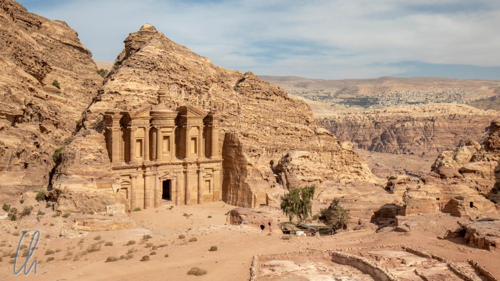
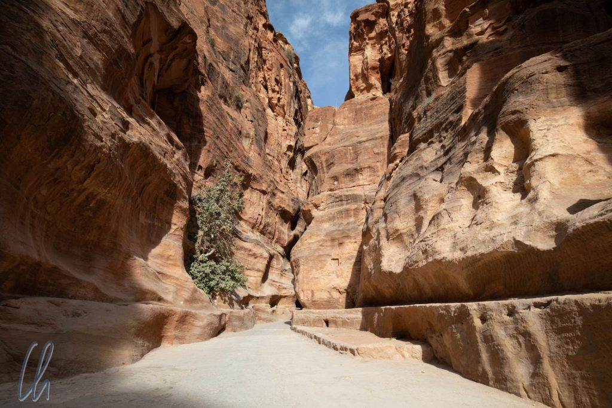
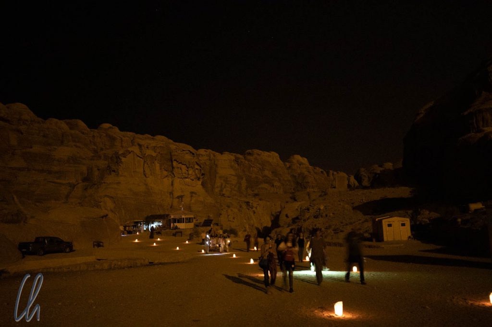

# Petra, die Hauptstadt des Reiches der Nabatäer

Petra ist mit Abstand die berühmteste Sehenswürdigkeit Jordaniens. Wer den Abenteuerstreifen "Indiana Jones und der letzte Kreuzzug" gesehen hat, kennt auch die Fassade des sogenannten "Schatzhauses des Pharao" (des wohl bekanntesten Gebäudes in Petra), das im Film den heiligen Gral barg. Für viele Touristen, die die antike Stätte in einem halben Tag besichtigen, ist das "Schatzhaus" auch wirklich das am besten zugängliche Highlight. Aber es gibt noch sehr viel mehr zu sehen. In Petra, der [Hauptstadt des Nabatäerreiches](<https://de.wikipedia.org/wiki/Petra_(Jordanien)>), die für ihre prächtigen monolithischen Fassaden bekannt ist, sind die Kulturdenkmäler über ein riesiges Areal verteilt, das wir innerhalb von dreieinhalb Tagen sozusagen in einem archäologischen Marathon erwanderten.

<!--more-->

## Wadi Musa und Petra

Wir kamen nachmittags in Wadi Musa an. Der Name bezeichnet auch die Ortschaft, die am gleichnamigen Trockenflussbett entstanden ist. Beide stellen das Tor zum archäologischen Gebiet dar: Die Kleinstadt bietet den Besuchern Möglichkeiten zur Übernachtung und im Wadi selbst verläuft damals wie heute der Weg in die antike Metropole. Wo heute Touristengruppen laufen, zogen früher mit wertvollen und exotischen Waren beladene Karawanen entlang, die Petra und seinen damaligen Bewohnern, den Nabatäern, zu Reichtum verhalfen.

Die [Nabatäer](https://de.wikipedia.org/wiki/Nabat%C3%A4er) waren ein arabischer Beduinenstammesverbund, der sich in der Nähe des heutigen Petra niederließ. Ursprünglich überfielen und beraubten sie wohl durch ihr Gebiet ziehende Karawanen, waren angeblich aber auch selbst Händler. Langfristig erschien es wohl lukrativer, einen sicheren Rast- und Warenumschlagplatz anzubieten. Ab 150 vor Christus schlossen sie sich zum Königreich der Nabatäer zusammen. 250 Jahre lang konnten sie ihre Eigenständigkeit verteidigen, selbst gegen die damalige Weltmacht Rom. Erst 105 - 106 nach Christus wurde das nabatäische Reich als Provinz Arabia Petraea ins römische Imperium eingegliedert. Die bekanntesten Sehenswürdigkeiten in Petra stammen aus der Blütezeit des unabhängigen Nabatäerreiches.

Das Wadi Musa verbirgt in seinem Namen einen weiteren Grundstein für den Reichtum Petras, nämlich eine kontinuierliche Wasserversorgung. "Musa" leitet sich von Moses ab und die Legende besagt, dass Moses in Petra mit seinem Stab an einen Felsen schlug, aus dem daraufhin eine Quelle zu sprudeln begann ([Exodus 17,3–7](https://www.bibleserver.com/EU/2.Mose17%2C3-7)). In der Ortschaft Wadi Musa kann man den Stein besuchen, dem der Prophet das kühle Nass entlockt haben soll. Er befindet sich in einem weißen Gebäude mit drei Kuppeln. Historische Beweise gibt es natürlich nicht, aber Fakt ist, dass die Nabatäer ein komplexes Bewässerungssystem konstruierten, das eine kontinuierliche Versorgung mit der lebensnotwendigen Flüssigkeit ermöglichte.

## Petra by Night

Zum ersten Mal pilgerten wir gleich am ersten Abend nach Einbruch der Dunkelheit durch das Wadi Musa. Wir hatten uns für die Veranstaltung "[Petra by Night](http://visitpetra.jo/detailspage/visitpetra/EntertainmentsDetailsEn.aspx?PID=4)" angemeldet. Die Teilnehmer sammelten sich abends am Eingang des Besucherzentrums. Ab 20:30 Uhr war Einlass und einige hundert Besucher strömten durch das Trockenflussbett in Richtung Petra. Stimmungsvolle Kerzen säumten den Weg. Der Fußweg vom Eingang bis zum "Schatzhaus", wo das Spektakel stattfinden sollte, beträgt ca. 1,5 km und so zog sich das Feld bald deutlich in die Länge.

Der Weg führte durch den [Siq](https://de.wikipedia.org/wiki/Siq), einen schmalen Canyon, der am Ende nur wenige Meter breit ist. Auf einmal öffnete sich die enge Schlucht, wir betraten einen großen Platz und standen vor der angestrahlten Fassade des "Schatzhauses", das die Einheimischen Khazne al-Firaun nennen. Zahllose Kerzen verbreiteten ein gelbliches Licht. Ein beeindruckender Anblick!

Einige Beduinen wiesen die Besucher an, sich in Reihen auf den Boden zu setzen und boten uns einen Begrüßungstee an (der allerdings im Vergleich zum Heißgetränk in Feynan eher zurückhaltend gezuckert, aber trotzdem süß war.) Nachdem (fast) alle Besucher angekommen waren, startete eine kurze Aufführung von traditioneller Beduinenmusik mit Flöte, Gesang und anderen lokalen Instrumenten. Das Ganze fand ziemlich unplugged statt und war keine pompöse Show, was uns gut gefiel. Durch die schiere Anzahl der Besucher war es sicher nicht so stimmungsvoll, wie es hätte sein können. Insgesamt verschlug uns die Inszenierung nicht den Atem, aber dennoch freuten wir uns an der nächtlichen Atmosphäre und am warmen Kerzenschein.

## Wadi Muthlim

Morgens starteten wir entweder früh oder noch früher, um der Hitze und den zyklisch auftretenden Touristenströmen wenigstens etwas zuvorzukommen. Am ersten Morgen nahmen wir einen alternativen Weg nach Petra. Zwar gingen wir durch das Wadi Musa, dann aber nicht in den Siq hinein, sondern wir bogen nach rechts ins [Wadi Muthlim](https://www.openstreetmap.org/way/303609419) ab. So entkamen wir selbst in dieser Touristenhochburg den Reisegruppen. Nach 200 Metern hatten wir den Trubel hinter uns gelassen und waren unglaublicherweise ganz allein.

Die beeindruckende Landschaft erinnerte uns an Nationalparks in den USA ("Red Rock Country"). Aber es war nicht nur die Natur, die es zu entdecken gab. An den unwahrscheinlichsten Stellen fanden wir in den Sandstein gemeißelte Spuren der Nabatäer: die Darstellung eines Adlers, Nischen im Fels und geräumige Kammern. Die Wände des Wadi wichen mal auseinander, mal verengten sie sich und zwischendurch wandelte sich die Schlucht sogar zu einem durch die Kraft des Wassers in geschwungenen Formen erodierten Slot Canyon. Es machte uns sehr viel Spaß, durch die schmalen Windungen zu klettern und das sanfte Spiel des Lichts auf dem teils gelblichen, teils rötlichen Felsen auf uns wirken zu lassen.

Als wir schon eine Weile durch die enge Schlucht geklettert waren, hörten wir oben am Rande des Canyons (etwa 20 Meter über uns) einen Hirten mit seinen Ziegen. Genauer gesagt bestand die Geräuschkulisse aus meckernden Ziegen, Ziegenglöckchen und Musik aus einem Handy. Wir bekamen die Verursacher jedoch nicht zu Gesicht. Nach einigen weiteren Kehren stießen wir auf einige in Stein gehauene Nischen, die Nabatäer waren also definitiv auch hier gewesen. Wir verweilten einige Minuten an diesem stimmungsvollen Ort. Nach ein paar Windungen weitete sich der Canyon und entließ uns in das breite Trockenflussbett des Wadi Mataha, über das wir uns Petra von Norden her näherten.

## Von Norden her ins Zentrum von Petra

Wir liefen teils im, teils entlang des Flussbettes. Zu beiden Seiten des Wadi Mataha sahen wir Höhlen und monolithische Bauwerke der Nabatäer, vor allem in einer schroffen Felswand, die sich zu unserer Linken erhob. Bei einigen der Steinkammern schien auch heute noch weniger die Archäologie als der Nutzwert im Vordergrund zu stehen, da es in vielen so aussah, als seien sie noch bis vor kurzer Zeit bewohnt gewesen oder würden aktuell als Schuppen oder Schaf-/Ziegenstall genutzt.

Je näher wir dem historischen Stadtkern kamen, desto imposanter wurden die in den Fels gehauenen Fassaden. Dabei war nicht nur die (teils recht verwitterte) Handwerkskunst bemerkenswert, sondern auch die intensiven Farben und die abwechslungsreiche Marmorierung des Steins.

## Alles nur Fassade

In der Tat sind die Fassaden in Petra meist die eigentliche Sehenswürdigkeit. Es waren keine riesigen Paläste im Fels, die die Nabatäer geschaffen hatten, sondern prächtige Fronten, die beeindrucken sollten. Interessanterweise haben die antiken Steinmetze die Fassaden von oben nach unten aus dem Sandstein herausgemeißelt. Meistens handelte es sich bei den Baudenkmälern um Grabstätten oder Mausoleen. Im "Erdgeschoss" befanden sich fast immer einige kleine Räume, die aber in der Regel nicht mit Ornamenten ausgestaltet waren.

Das widerspricht natürlich dem, was wir im Film "[Indiana Jones und der letzte Kreuzzug](https://de.wikipedia.org/wiki/Indiana_Jones_und_der_letzte_Kreuzzug)" gesehen haben. Dort findet der Showdown im "Schatzhaus" statt. Indiana Jones, sein Vater und die Bösewichte betreten die "Treasury", das Versteck des [heiligen Grals](https://de.wikipedia.org/wiki/Heiliger_Gral). Sie gelangen in eine Eingangshalle mit übermannshohen Löwen- und Ritterstatuen und einem in den Boden eingelassenen Siegel. Um den Gral zu finden und das Leben seines Vaters zu retten, muss Indiana Jones drei Prüfungen ("Der Atem Gottes", "Das Wort Gottes", "Der Pfad Gottes") bestehen, die sich immer tiefer im Berg, in jeweils einer weiteren Halle abspielen. Im vierten und letzten Raum bewacht ein Kreuzritter den heiligen Gral ("Den Becher eines Zimmermanns").

Nicht nur existieren die im Film dargestellten Säle in der Tiefe des Felsens nicht (welche Überraschung!), es gibt nur einen eher schmucklosen Raum, den man heutzutage noch nicht einmal betreten darf. Das "Schatzhaus" und viele andere Bauwerke bestehen zu 90% aus der prunkvollen Fassade, dahinter befindet sich meistens nicht viel Aufregendes - oder aber es liegt vielleicht doch daran, dass beim Versuch, den Gral in Besitz zu nehmen, alles eingestürzt ist ;).

## Königswand und Säulenstraße

Wir wanderten also von Norden aus in Richtung des antiken Stadtzentrums und die Fassaden wurden immer zahlreicher und pompöser. Die größten Fassaden in Petra sind bis zu 45 Meter hoch. Einige wirken noch deutlich höher, da sie nicht am Fuße des Felsens beginnen, sondern weiter oben. In den Fels gehauene Treppen führen zu den Grabkammern. Damit ist die [Königswand](<https://de.wikipedia.org/wiki/Petra_(Jordanien)#Die_Gr%C3%A4ber_der_K%C3%B6nigswand>) so etwas wie die Skyline Petras, nur dass die "Gebäude" eben nicht freistehend sind.

Auch wenn sich das Nabatäerreich lange Zeit gegen fremde Mächte behaupten konnte und unabhängig blieb, so sind römische und griechische Einflüsse in der Architektur deutlich zu erkennen. Ginge man am Fuße der Königswand entlang, die eine Biegung beschreibt, würde man von der entgegengesetzten Seite in den Siq gelangen. Dort hatten die nabatäischen Steinmetze ein gewaltiges Amphitheater aus dem massiven Felsen herausgearbeitet, das Platz für mehrere tausend Zuschauer geboten haben muss. Welch ein unglaubliches Werk!

Entlang des Wadi Musa und ins Tal hinab führt die sogenannte Säulenstraße, die Hauptstraße Petras, damals wie heute. An einigen Stellen ist der originale Belag sogar noch vorhanden. Motorisierte Fahrzeuge dürfen hier nicht verkehren, nur der Strom der Besucher zu Fuß, Kamele und Esel bewegen sich hier. Die Mehrzahl der Gebäude Petras existiert nicht mehr. Die Ruinen zahlreicher Tempel, Markplätze, eines Nymphaeums und von Bädern säumen die Straße. Ein großes Tor trennt den weltlichen Teil der Stadtmitte vom Tempelbezirk ab. Auf dem Hügel gegenüber den älteren Bauwerken befinden sich die Gemäuer mehrerer byzantinischer Kirchen aus dem späten 5. Jahrhundert.

## Aufstieg zum "Kloster" Ad-Deir

Auf der anderen Seite des Tals begannen wir den Aufstieg zum sogenannten "Kloster". Diese Bezeichnung von [Ad-Deir](https://de.wikipedia.org/wiki/Ad_Deir) spiegelt allerdings nur teilweise die historische Verwendung wieder. Vermutlich war das Bauwerk ursprünglich das Mausoleum eines Herrschers. Nichtsdestotrotz wurde es ab dem 4. Jahrhundert als christliches Kloster genutzt und der Name ist überliefert worden.

Zu diesem Zeitpunkt waren wir schon etliche Kilometer gelaufen und die Mittagshitze brannte auf unsere Köpfe. Um müde Besucher auf dem weitläufigen Areal zu ihren Zielen zu bringen, gab es einige tierische Fortbewegungsmittel: Vom Eingang des Siq bis zum "Schatzhaus" (und zurück) wurden fußlahme Touristen in Pferdekutschen transportiert, vom "Schatzhaus" bis in die antike Innenstadt könnte man auf einem Kamel reiten und fast überall auf der Hauptachse versuchen findige Einheimische, Eselritte anzubieten. Von keinem dieser Angebote machten wir Gebrauch. Die Pferde, die vor den Kutschen, welche nicht mit Bremsen ausgestattet waren, mit ihren Hufen über das abschüssige Pflaster des Siq rutschten, taten uns leid, ebenso die kleinen Esel, die ausgewachsene Menschen die steilen Stufen zum "Kloster" hochschleppten. So mussten wir denn selbst den Aufstieg auf uns nehmen.

800 Stufen, 200 Höhenmeter und 45 Minuten später hatten wir es geschafft. Ad-Deir ist zwar ebenso hoch, aber seine Fassade deutlich klarer und schlichter als die des "Schatzhauses". Neben dem monumentalen Kulturdenkmal genossen wir im Schein der allmählich länger werdenden Schatten spektakuläre Ausblicke über die Gebirgswelt. Nach einer kleinen Stärkung im gemütlichen Beduinen-Café machten wir uns auf den Rückweg, der uns auf direktem Weg 6km und erst 300m hinunter und dann allmählich 300m wieder hinauf bis zum Ausgang des archäologischen Gebietes führte.

## Der Petra Marathon

Auch am nächsten Tag brachen wir früh auf, da wir erneut eine "archäologische Wanderung" geplant hatten, dieses Mal auf der anderen Seite des Tals zum [Hohen Opferplatz](https://de.wikipedia.org/wiki/Hoher_Opferplatz) (High Place of Sacrifice). Auch auf dem Weg dorthin mussten wir zahlreiche Stufen bewältigen und wir passierten die Ruinen einer Struktur, die vermutlich eine von mehreren Festungen der Kreuzfahrer in der Region war. Der Opferplatz selbst befand sich auf einer Plattform auf dem Gipfel eines Berges. Mehrere Becken und ausgeklügelte Rinnen legen nahe, dass hier in der Antike Blut geflossen sein muss. Ob es sich bei den Opfern um Tiere oder auch um Menschen gehandelt hat, ist nicht sicher. So gruselten wir uns ein wenig und genossen den weiten Blick über die Gebirgslandschaft, die uns zu Füßen lag.

Was Petra wirklich einzigartig macht, ist die Kombination von archäologischen Stätten und der atemberaubenden Gebirgslandschaft. Beide Aspekte für sich wären schon beeindruckend. Würde man sich die Bauwerke und Fassaden für einen Moment wegdenken, wäre die Natur allein Grund genug für die Existenz eines Nationalparks in dieser Region. Diesen Nationalpark, diese antike Stadt hatten wir in dreieinhalb Tagen erwandert und am Ende zeigte das GPS an, dass wir mehr als einen Marathon zurückgelegt hatten.

## Petra, ein magischer Ort

Die Nabatäer waren ein hochentwickeltes Volk, das damals die Handelswege kontrollierte. Ihr Reichtum und ihre Kunstfertigkeit ermöglichten es ihnen, die architektonischen Kunstwerke zu hinterlassen, die heute zu den [sieben neuen Weltwundern](https://de.wikipedia.org/wiki/Weltwunder#%E2%80%9EDie_neuen_sieben_Weltwunder%E2%80%9C) zählen. Es ist erstaunlich, wie gut die Fassaden die Jahrhunderte und auch etliche Erdbeben überstanden haben. So hat das Erbe der Nabatäer durchaus etwas Magisches.

Petras prächtige Fassaden haben nicht nur Drehbuchautoren der Moderne inspiriert, sondern schon in der Vergangenheit die Phantasie der Beduinen beflügelt. Da man lange Zeit kaum mehr etwas über die Erbauer von Petra und die Verwendung der Gebäude wusste, ranken sich um zahlreiche Bauwerke die Legenden des Wüstenvolkes. Das "Schatzhaus des Pharao", wie auch wir [Khazne al-Firaun](https://de.wikipedia.org/wiki/Khazne_al-Firaun) in diesem Artikel genannt haben, war vermutlich in Wirklichkeit ein Mausoleum, wie viele andere Kulturdenkmäler in Petra. Trotzdem hielt sich lange der Mythos, dass der Pharao von Ägypten den Bau mittels schwarzer Magie geschaffen habe, um in der steinernen Urne weit oben in der Fassade seine Reichtümer zu verbergen. Einschusslöcher von Beduinenflinten an dem Gefäß belegen heute noch den vergeblichen Versuch, diesen Schatz zu bergen. Die Urne jedoch besteht aus massivem Sandstein.
