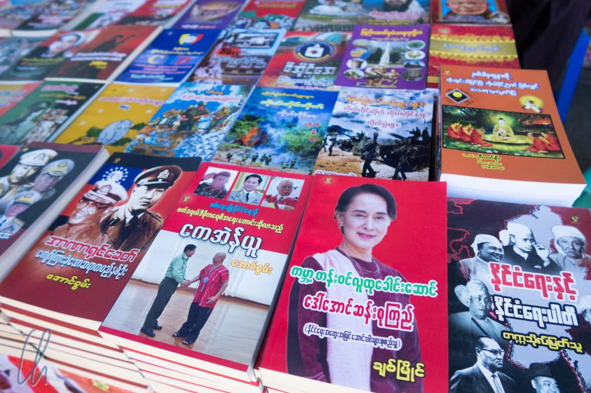
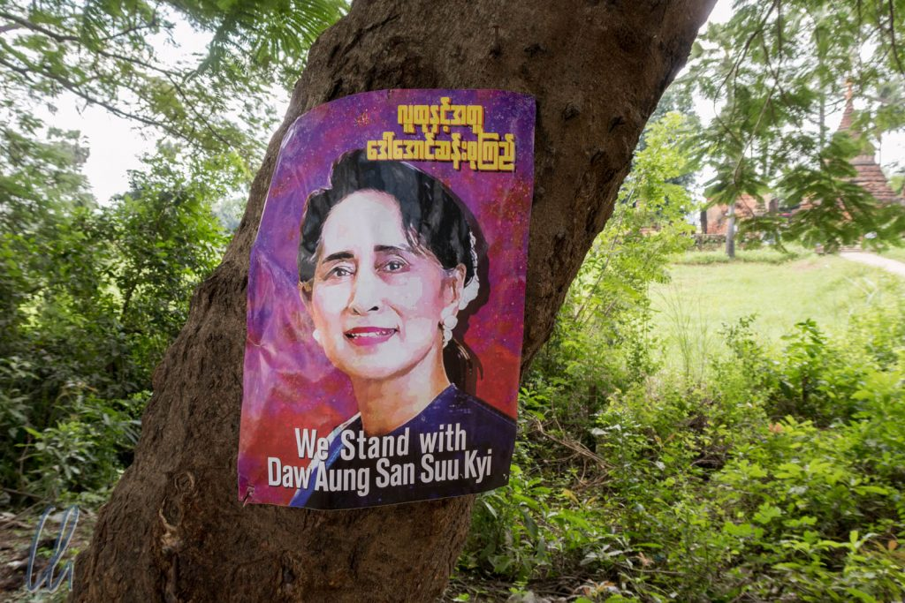
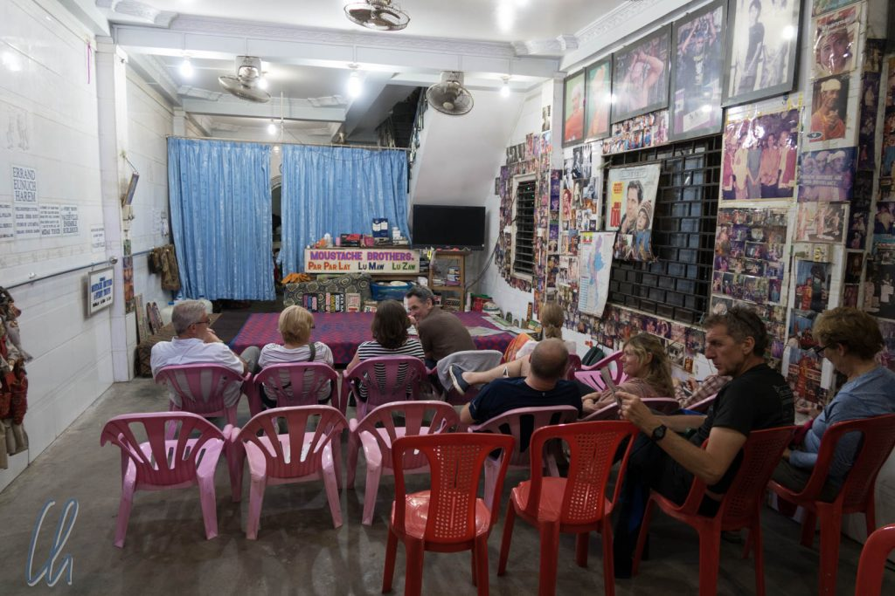
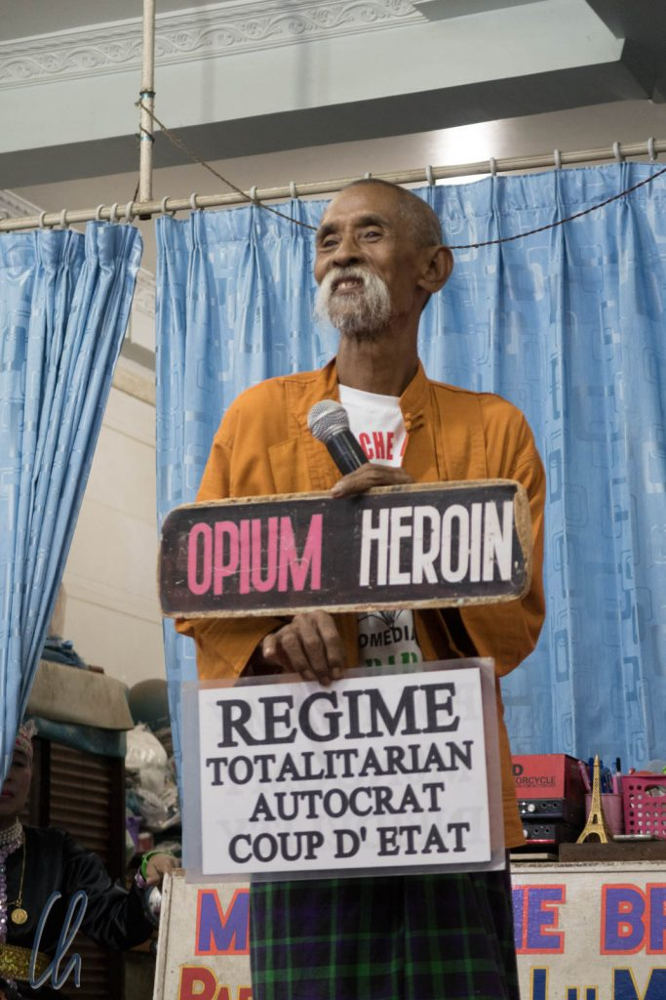
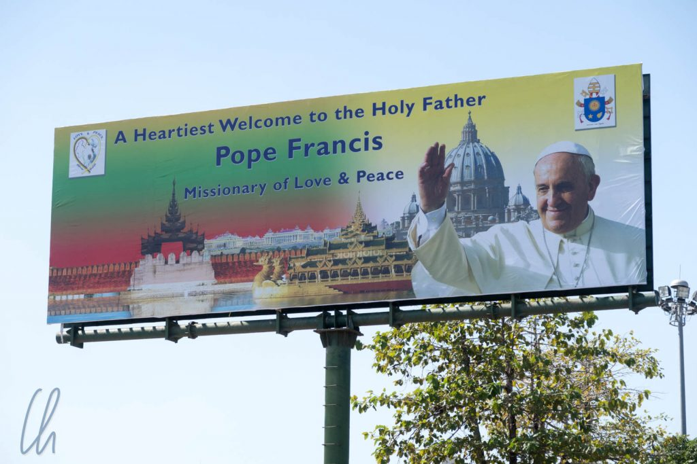

Myanmar hat seit einigen Monaten das zweifelhafte Privileg, in den internationalen Medien aufzutauchen. Der [vielschichtige Konflikt](https://www.youtube.com/watch?v=0uB8pBJ2S7I) um die Rohingya ist der Anlass (obwohl es noch zahlreiche andere teils bewaffnete Konflikte zwischen der burmesischen Armee und einigen Ethnien im Land gibt) und für uns auch ein Grund, mit offenen Augen und Ohren in Myanmar unterwegs zu sein und die Politik im Auge zu behalten. Was erzählen die Menschen? Was berichten die Medien? Und was vielleicht auch nicht?

<!--more-->

## Die Lady Aung San Suu Kyi

Wie wir schon in unseren [Erlebnissen vom ersten Tag](http://wittmann-tours.de/erste-eindruecke-aus-myanmar/) berichteten, sprachen die Menschen gelegentlich auch aus eigener Initiative über Politik. Meist war dies nicht sehr differenziert und auch erst, wenn man etwas mehr Zeit miteinander verbracht hatte. Die Zeit der Militärregierung wird generell negativ wahrgenommen. [Aung San Suu Kyi](https://de.wikipedia.org/wiki/Aung_San_Suu_Kyi) dagegen erfreut sich nach unserer Wahrnehmung großer Zustimmung in der Bevölkerung. Es hingen Plakate in einigen Dörfern, um sich zu ihr zu bekennen, auf der Straße wurden Kalender mit Bildern von ihr verkauft und in dem Frühstücksraum eines Hotels sahen wir auch ein Exemplar. Alle Menschen, mit denen wir redeten, sprachen positiv über sie, kritische Stimmen haben wir nicht gehört. Natürlich ist unser Eindruck aufgrund der weit verbreiteten Sprachbarriere nicht repräsentativ.

Im Gegensatz dazu hat die Polizei ein sehr schlechtes Image. Sie wird als korrupt wahrgenommen. Sowohl von Taxifahrern als auch beim Besuch der [Moustache Brothers](https://de.wikipedia.org/wiki/Moustache_Brothers) erfuhren wir, dass man durch Zahlungen von kleineren Summen größeren Strafen entgehen kann. Es herrscht zum Beispiel eigentlich Helmpflicht beim Mopedfahren. Wird man ohne Helm "erwischt" (was bei konsequentem Durchsetzen dieser Regel gefühlte 80%+ der Fahrer wären), beläuft sich die Strafe offiziell auf 30.000 Kyat (ca. 20 Euro). 5.000 Kyat in die Hand des Polizisten reichen unter Umständen aber auch. Wie es bei schwerwiegenderen Vergehen läuft wurde nicht erwähnt, aber man kann es sich wohl vorstellen.

## Politisches Kabarett bei den Moustache Brothers

Die oben erwähnten [Moustache Brothers](https://de.wikipedia.org/wiki/Moustache_Brothers) waren ein Comedy-Trio, das durch ihre Aufführungen mit der Militärregierung in Konflikt geraten ist. Dafür haben Par Par Lay, Lu Zaw und Lu Maw lange Jahre im Gefängnis verbracht hat. Heute sind sie nur noch ein Duo, da Par Par Lay, der Kopf des Trios, vor ca. 4 Jahren verstarb. Trotzdem finden täglich Aufführungen in Mandalay statt: Das Zielpublikum sind Touristen, die Sprache ist Englisch. Einheimischen ist das Ansehen der Show nicht gestattet.

Diese "aufrührerische" Comedy wollten wir uns natürlich ansehen. Die Show wurde von Lu Maw geführt, Lu Zaw hatte einen eher passiven Part. Das Programm bestand aus klassischen Tänzen, Slapstick und Comedy. Wer beißende Comedy und Satire erwartet, wird enttäuscht sein. Für unseren Geschmack waren die Inhalte eher zahm, aber wohl kritisch genug, um dafür ins Gefängnis zu kommen. Hier ein Beispiel:

_Ein Burmese hat Zahnschmerzen und fährt nach Thailand, um sich dort behandeln zu lassen. Der Zahnarzt fragt: "Habt ihr denn in Myanmar keine Zahnärzte?" Daraufhin antwortet der Patient: "Klar, haben wir, aber wir dürfen zu Hause den Mund nicht aufmachen!"_

Die Show war auf alle Fälle sehr unterhaltsam und sehenswert, auch wegen des engagierten und charismatischen Vortrags von Lu Maw!

## Der Buddhismus und andere Religionen

Der buddhistische Glaube ist in der Bevölkerung Myanmars (egal ob bei jung oder alt, reich oder arm, einflußreich oder nicht) sehr tief verwurzelt und wir haben noch kein Land erlebt, in dem diese Religion so omnipräsent ist. Über 90% der Menschen sind Buddhisten, und der Buddhismus wird aktiv gelebt. Selbst in den abgelegensten Gegenden findet man goldene Pagoden, in allen Tempeln sahen wir betende Menschen, überall trifft man auf Mönche in ihren bordeauxfarbenen Gewändern, die Buddhastatuen werden gewaschen und poliert, Lebensmittel, Sachgegenstände und Geld an die Klöster gespendet.

Erstaunlich ist, dass es in Myanmar im Rahmen dieser friedliebenden Religion auch eine radikale Strömung, gewalttätige Mönche und sogar Pogrome gegen Moslems gibt - auch wenn wir darüber nur aus den [westlichen Medien](http://www.ardmediathek.de/tv/Weltspiegel/Myanmar-Buddhisten-hetzen-gegen-Muslime/Das-Erste/Video-Podcast?bcastId=329478&documentId=47471682) wissen. Uns gegenüber wurden zwei mal Ressentiments gegenüber dem Islam geäußert, das Christentum dagegen wurde nicht als negativ betrachtet.

## Der Papst zu Besuch in Myanmar

Kurz vor unserer Abreise landete Papst Franziskus auf seiner Reise nach Myanmar und Bangladesh in Yangon. Somit haben wir nur die Vorbereitungen miterlebt. Das eigentliche Event verfolgten wir aus der Ferne.

Der Anlass der Reise war aufgrund der Reiseroute des Papstes (Myanmar und Bangladesch) für uns offensichtlich. In der Öffentlichkeit wurden diplomatisch Friede und Toleranz als Grund für den Besuch genannt. Trotz der gerade mal 1% Katholiken im Land schien ganz Yangon den Papst begeistert zu erwarten. Viele Leute trugen T-Shirts mit dem Bildnis des Heiligen Vaters und überall prangten große Willkommensplakate. Der Konflikt mit den Rohingya fand nirgendwo Erwähnung.

Im Vorfeld hatten wir in den öffentlichen Medien (soweit wir diese verstehen konnten), nichts zum Papstbesuch gesehen, geschweige denn wurde das R-Wort erwähnt. Stattdessen hatten die Nachrichten bessere Beziehungen zu China, Fortschritte beim Ausbau von Kraftwerken und Sozialprojekte zum Thema. (Dieselben Nachrichten liefen übrigens tagelang im Fernsehen mit 100% den gleichen Beiträgen.) [Dieser Artikel aus der Myanmar Times](https://www.mmtimes.com/news/pope-francis-prayer-peace-myanmar.html) schreibt wahrscheinlich so viel, wie zu dem Thema „Besuch des Papstes“ gesagt werden darf.

## Wenig sichtbare Politik

Aufgrund der Sprachbarriere, v.a. bei diesen etwas komplizierteren Themen, waren unsere Einblicke in die politischen Geschehnisse sehr begrenzt. Zudem haben wir politische Themen nicht aktiv angesprochen, sondern sind nur darauf eingegangen, wenn Einheimische sich uns gegenüber äußerten. Wir waren etwas überrascht, dass einige Burmesen uns gegenüber aktiv über Politik redeten. Auch wenn Kritik an der Regierung schwere Folgen haben kann, scheinen sie sich uns gegenüber sicher gefühlt zu haben.

Trotzdem ist das Internet anscheinend nicht zensiert. Die Rohversion dieses Artikels schrieb ich in Yangon am Flughafen. Dabei habe ich natürlich nach allen verdächtigen und aufrührerischen Stichwörtern gesucht - immer mit Erfolg und ohne jegliche Einschränkung. Wer also in Myanmar nach Informationen sucht und einer Fremdsprache mächtig ist (ja, viele Hindernisse), der stößt auf Antworten.

Für Myanmar hoffen wir, dass sich die vielen inneren Konflikte lösen lassen, damit endlich in allen Landesteilen Frieden einkehren kann.
