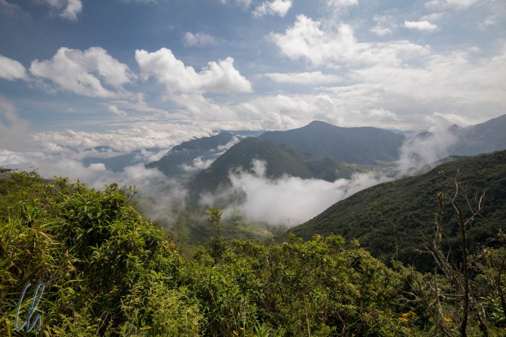
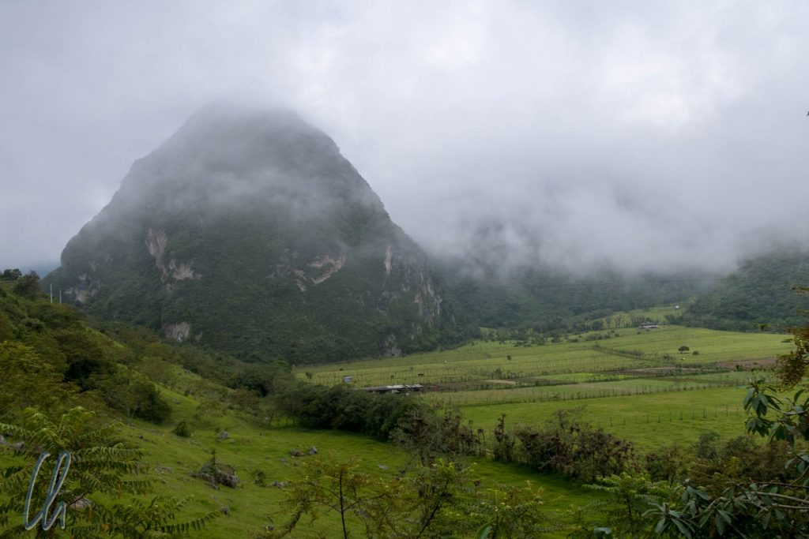
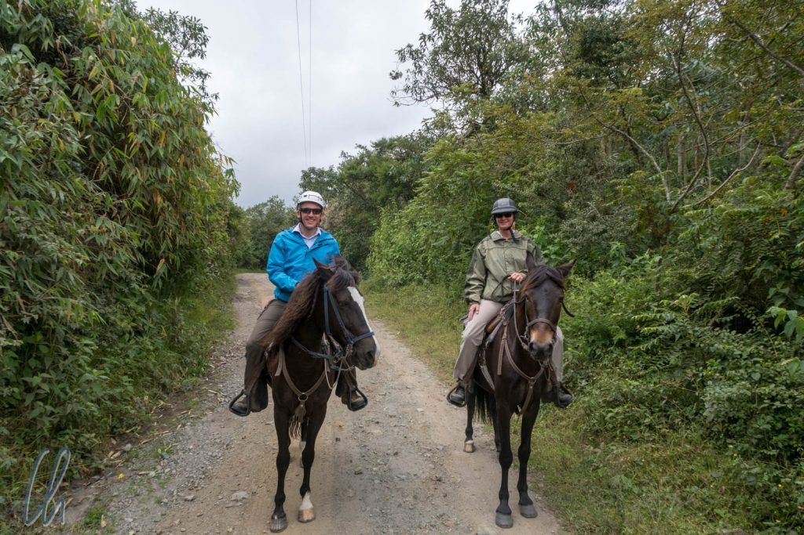
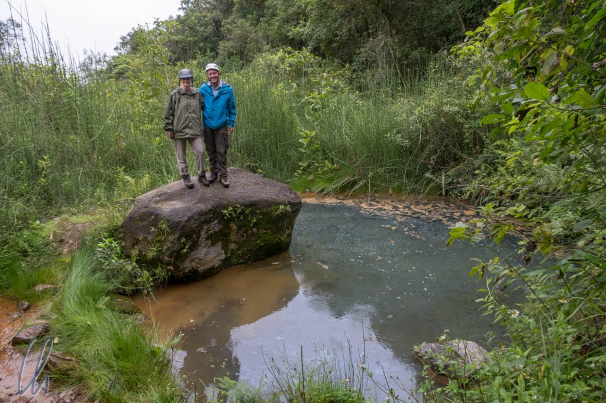
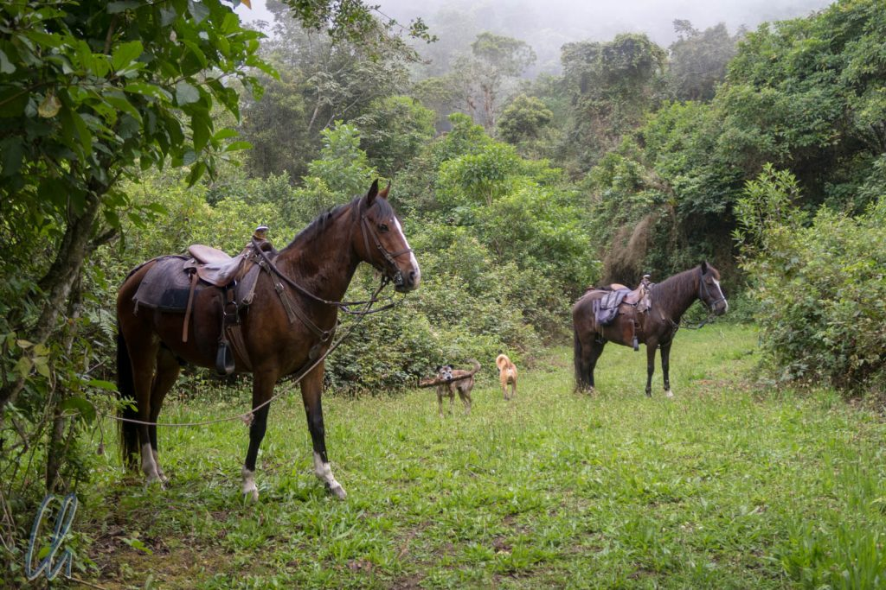

# Pululahua: Der Ritt im Vulkan

Da waren wir schon über ein halbes Jahr unterwegs und es hatte sich noch keine echte Gelegenheit zum Reiten ergeben. Das sollte sich nun in Südamerika ändern. Nachdem ich schon vor 13 Jahren einen Tagesritt im Pululahua-Krater gemacht hatte, war es höchste Zeit für eine Wiederholung.

<!--more-->

## Fahrt in den Vulkan

Praktischerweise hatte der Reiterhof uns einen direkten Transport in den Krater organisiert. Gut 5 Kilometer nördlich von Mitad del Mundo schlängelte sich eine gute Schotterpiste die Innenwand des Vulkans herunter. Vorher hielten wir kurz beim Aussichtspunkt "El Mirador" an, um von oben in den Krater zu schauen.

Der [erloschene Vulkan](https://de.wikipedia.org/wiki/Pululahua) ist als solcher nicht auf Anhieb zu erkennen, da die Caldera einen Durchmesser von 12 Kilometern aufweist und auf der Ostseite eine Öffnung hat. Daher herrscht im Krater ein ganz besonderes Klima. Im Gegensatz zur trockenen Luft im Hochland ist es dort feucht wie im Nebelwald. Pululahua ist Quechua und bedeutet "Wolke aus Wasser", wie treffend! Morgens ist der Himmel meistens klar, aber je später der Vormittag, desto mehr Feuchtigkeit zieht aus der Richtung des Amazonasgebietes in den Krater und kondensiert dort zu Nebel und Wolken.

Daher eignet sich der Kraterboden des inaktiven Vulkans bestens für die Landwirtschaft. Mehrere Familien siedelten sich hier an, um das Gebiet zu bewirtschaften. Die guten Bedingungen für den Ackerbau bestehen auch heute noch, aber immer mehr Bauern verlassen den Vulkan oder satteln auf andere Erwerbszweige um, zum Beispiel bieten sie Übernachtungen und Reittouren an. Es wirkte für uns sehr nostalgisch, dass die Arbeit auf den Feldern noch in reiner Handarbeit ohne Maschinen durchgeführt wurde.

## Die Pferdchen warten schon

Bevor es losging durften wir eine amüsante Videoeinweisung anschauen, die erklärte, wie man ein Pferd reitet. Nach 10 Minuten waren wir also bestens im Bilde und gingen zu unseren Reittieren, die schon auf uns warteten. Mona freundete sich mit Faraon an und ich mit Cozumbo. Unser Gastgeber Gabriel ritt Lucero. Als weitere Begleiter hatten wir seine vier Hunde dabei, darunter Mistica, Bobby und Rocky.

Das Rennen gegen die Wolken hatten wir schon verloren, als wir losritten. An diesem Tag schloss sich die Wolkendecke etwas früher als üblich, was die Reiterfreude aber nicht minderte. Dadurch wirkte die Vegetation im Pululahua-Krater noch authentischer und saftig grün. Auch hier waren abseits der landwirtschaftlichen Nutzflächen viele Bäume mit Flechten und Bromelien verziert. Unser Ziel waren die heißen Quellen etwas tiefer unten im Vulkan, die wir nach gut anderthalb Stunden erreichten.

Die heißen Quellen erschienen uns aufgrund des schlammigen Wassers nicht sehr einladend, die Temperatur war allenfalls lauwarm. So vergnügten wir uns damit, Stöcke für Rocky in den Tümpel zu werfen. Der Hund sprang mit lautem Platschen voller Begeisterung ins Wasser auf der Jagd nach den Hölzern. Man musste nur achtgeben, dass er sich danach nicht direkt neben einem schüttelte, sonst war die erfrischende Dusche aus dem Fell des Tieres vorprogrammiert ;).

## Charakteristisches Pululahua-Wetter

Wie nicht anders zu erwarten, fing es wenig später zu regnen an. Zum Glück war es nur ein kurzer Schauer. Auf dem Rückweg ritten wir durch einen tief eingeschnittenen Hohlweg, der schon in präkolonialen Zeiten Teil eines Handelsweges zwischen Amazonasbecken und Hochland gewesen sein soll. Den Hinweg zu den Quellen waren wir eher in beschaulichem Tempo geritten, der Rückweg verlief deutlich spritziger.

Zurück auf dem Hof bekamen die Pferde ihr wohlverdientes Futter und auch auf uns wartete ein wunderbares ecuadorianisches spätes Mittagessen. Unser erster Reittag der Weltreise gefiel uns sehr gut und in den kommenden Wochen sollten wir uns noch häufiger in den Sattel schwingen. Nebenbei, kaum hatten wir den Krater auf der Rückfahrt nach Quito verlassen, schien auch schon wieder die Sonne.

