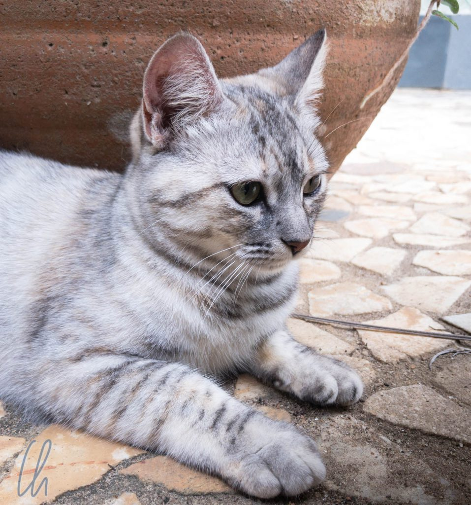

# Reiten auf den Mangalarga Marchadores

Es gibt Länder, wie Island oder [Peru](http://wittmann-tours.de/ritt-auf-paso-peruanos-im-colca-tal/), die man unmöglich bereisen kann, ohne dort nicht wenigstens eine Runde auf der landestypischen Pferderasse zu reiten. Brasilien gehört auch zu diesen Ländern: Dort sind die Mangalarga Marchadores-Pferde der [Stolz der Züchter](https://de.wikipedia.org/wiki/Mangalarga_Marchador). So verbrachten wir fünf Reittage gut 100 Kilometer östlich von Rio de Janeiro im kleinen Ort Saquarema, um diese brasilianische Pferderasse kennenzulernen.

<!--more-->

## Familiär und deutsch

Dort wohnten wir bei Claudia und Reinhard, zwei deutschen Auswanderern, die sich ihren Traum von einer Pferdefarm erfüllt hatten. Zusammen mit ihren Söhnen John und Jaro und zahlreichen Tieren, Kaja, einer jungen Hündin, den Katzen Lino und Lucy, mehreren Hühnern, zwei Schildkröten und natürlich zahlreichen Pferden leben sie auf einem paradiesischen Grundstück, das üppig mit tropischen Pflanzen bewachsen ist wie ein botanischer Garten, außerhalb von Saquarema. Wir waren zunächst die einzigen Gäste und gehörten quasi zur Familie.

Am Tag unserer Ankunft war es zum Reiten schon etwas zu spät. Stattdessen unternahmen wir einen Ausflug in den Ort Saquarema. Dort begleiteten wir Claudia beim Einkaufen (auf Reisen können auch Supermärkte sehr spannend sein!) und besichtigten die idyllisch auf einem Hügel direkt am Meer gelegene Wallfahrtskirche "[Igreja Nossa Senhora de Nazaré](https://pt.wikipedia.org/wiki/Nossa_Senhora_de_Nazar%C3%A9#Em_Saquarema)". An einem anderen Tag sollte dieses Gotteshaus das Ziel eines Ausritts werden.

Auch wenn Claudia und Reinhard schon seit 12 Jahren in Brasilien lebten, ihre Kinder in Brasilien geboren worden waren und jetzt dort zur Schule gingen, hatten die beiden die deutsche Perspektive noch nicht vollständig abgelegt. So war es für uns extrem spannend - ganz ohne Sprachbarriere ;) - ihre Geschichten und Einschätzungen zu Brasilien zu hören. Diese reichten vom juristisch interessanten Modus des Grundbesitzerwerbs über die Tücken des Schulsystems bis hin zum horrenden Preis des brasilianischen Weins.

## Ausritt durch den Mata Atlântica

Am nächsten Tag starteten wir auf den ersten Ausritt. In Brasilien hatten wir uns gegen einen Trail entschieden, sondern unternahmen größtenteils Sternritte von der Farm aus. Mona ritt auf Samba, wie passend für Brasilien ;), Christian auf Trovão (dem Donner) und Reinhard auf Ringo. Zusammen ritten wir durch das Hinterland mit seinen Farmen und Feldern in der Ebene und den (unbewirtschaftbaren) Resten des Mata Atlântica an den Hügeln, der ursprünglichen Vegetationsform an der Ostküste Brasiliens. Der [Mata Atlântica](https://de.wikipedia.org/wiki/Mata_Atl%C3%A2ntica) ist botanisch gesehen ein Tropenwald, obwohl er klimatisch auch weit in die Subtropen reicht. Über 90% des ursprünglichen Waldgebietes sind heute bereits vernichtet und es existieren fast nur noch kleine, nicht zusammenhängende Areale.

Unterwegs waren wir meistens im Schritt, aber auch im Trab, Galopp und am liebsten natürlich in der Marcha, der namensgebenden Gangart der Mangalarga Marchadores. Deren [Zuchtgeschichte](https://de.wikipedia.org/wiki/Mangalarga_Marchador#Zuchtgeschichte) ist, wie anscheinend Vieles in Brasilien, mit [Johann VI.](<https://de.wikipedia.org/wiki/Johann_VI._(Portugal)>) verbunden. Die Rasse lässt sich auf einen Altér Real-Zuchthengst mit besonders weichen Gängen zurückführen, den der Monarch aus Portugal mitgebracht hatte. Das Ergebnis der Zucht mit diesem Beschäler waren Pferde, die sich sehr bequem sitzen ließen. Der vierte, zusätzliche Gang dieser Rasse, die Marcha, dem Tölt der Islandpferde bzw. dem Paso Llano der Paso Peruanos sehr ähnlich, war und ist eines der Zuchtziele. Ob die Marcha wirklich weicher als die Bewegungen der Rösser in Peru oder auf Island ist, bleibt vom Pferd abhängig. Uns fiel auf, dass die Mangalarga Marchadores weniger Schaufelbewegungen ("Termino") mit der Vorhand machen als die Paso Peruanos.

## Am Strand

Trotz der relativen Nähe zur Großstadt Rio war die Region sehr ländlich und beschaulich. Die Wege, auf denen wir ritten, waren meistens unbefestigte Straßen, Feld- oder Waldwege. Nur auf dem Ausritt zum Strand überquerten wir eine größere Straße und ritten durch den Ort. Dafür wartete am Ende die Belohnung: eine herrliche Strecke am Ufer. Entweder waren der Wind und die Brandung zu stark oder die Pferde den Strand nicht gewöhnt. - Auf eine Galoppade ließen sie sich jedenfalls nicht ein. Dafür entschädigte der Blick bis zur Wallfahrtskirche, die wir einige Tage zuvor besucht hatten, und die frische Meeresbrise.

Als wir anschließend auf einen Imbiss in ein Strand-Café einkehrten, gab es keine Möglichkeit, die Pferde anzubinden. So saßen wir auf roten Plastikstühlen an einem Tisch mit Sonnenschirm und jeder hielt sein Roß am Führstrick. Wir müssen ein kurioses Bild für die Einheimischen abgegeben haben ;). Trotz unserer steten Aufmerksamkeit nahmen die Pferde immer wieder einen beherzten Happen von den bestimmt mühsam angepflanzten Mini-Palmen. Sie hatten sich ihren Snack schließlich mehr verdient als wir ;).

## Mangalarga Marchadores - Zuchtziel erreicht

Unseren letzten Ausritt unternahmen wir in einem Nachbarort auf den Pferden eines befreundeten Züchters. Unsere Rösser (beides Hengste) waren noch namenlos, daher tauften wir sie selbst. Mona ritt Cometa (wegen seines Temperaments und des Sterns auf der Stirn). Mein Pferd nannte ich Super-Cama (Cama bedeutet wörtlich Bett), da wirklich alle Gänge äußerst bequem waren. Das Zuchtziel der Mangalarga Marchadores war bei diesem Hengst also voll erreicht :).

An diesem Tag waren wir deutlich zügiger und temperamentvoller unterwegs, auch weil unser lokaler Führer am Schritt wenig Gefallen fand ;). So tölteten wir munter über die Wege zwischen den Feldern der Bauern. Mittagspause machten wir an einem kleinen Kiosk, wo sich auch ein Naturschwimmbad befand. Leider waren viele der Waren ausverkauft mit der Begründung "wegen des Wochenendes". Das verwunderte uns allerdings ziemlich, da Mittwoch war. War das vergangene oder zukünftige Wochenende gemeint? Was genau wollte uns die Betreiberin sagen? ;)

So verbrachten wir bei Claudia und Reinhard fünf abwechslungsreiche und entspannte Tage mit Familienanschluss und schönen Ausritten. Das gab uns die Möglichkeit, Brasilien aus einer ganz anderen Perspektive kennenzulernen, mit vielen interessanten Einblicken in das brasilianische Leben.

