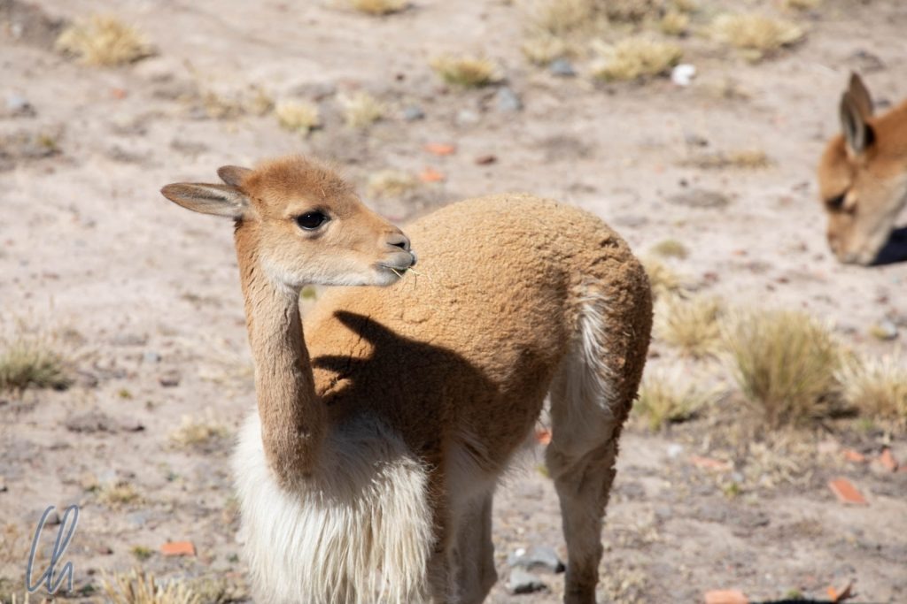
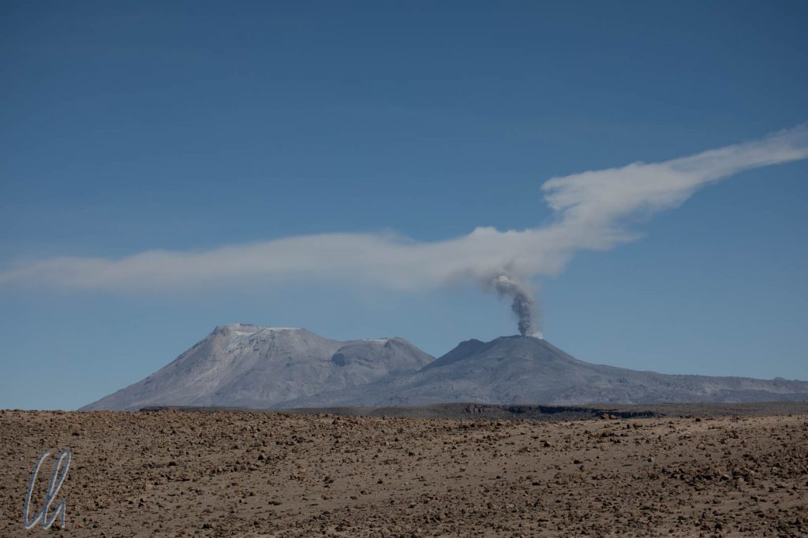

In Peru ist man zu Recht sehr stolz auf die nationale Pferderasse des Landes, die [Paso Peruanos](https://de.wikipedia.org/wiki/Paso_Peruano). Ihre Besonderheit ist, dass sie eine spezielle, überaus bequeme Gangart haben, den [Paso Llano](https://de.wikipedia.org/wiki/Paso_Peruano#Gangmechanik), ähnlich dem Tölt der Islandpferde. Das Zuchtziel ("[Brio](https://de.wikipedia.org/wiki/Paso_Peruano#Interieur)") wird folgendermaßen definiert: "Eifrige Bereitwilligkeit kombiniert mit energischem Einsatz und ausdrucksvoller Präsentation". Auf diesen Prachtpferden wollten wir gerne reiten und zwar in der herrlichen Landschaft des Colca-Tales.

<!--more-->

## Der Weg ins Colca-Tal

Die Tour begann in [Arequipa](http://wittmann-tours.de/arequipa-die-weisse-stadt/) und allein schon der Weg ins Colca-Tal war sehr sehenswert. Die Straße führte nach Osten, hoch hinauf in die Anden. Der höchste Punkt der Fahrt war der Mirador de los Andes auf fast 5000 Metern. Nicht nur die Höhe raubte uns dort den Atem, sondern auch der Blick auf die gewaltigen Vulkane. Auf dem Weg dorthin wandelte sich die Landschaft und wurde immer karger. Dort fühlen sich die [Guanacos](https://de.wikipedia.org/wiki/Guanako) zu Hause, nicht-domestizierte Verwandte der Lamas und Alpakas. Sie mögen die Höhe und die Kälte sehr. Kein Wunder, denn sie tragen in ihrem Fell eine der feinsten und wärmsten Fasern der Welt.

Immer wieder während der Fahrt (und auch später auf dem Ritt) sahen wir in der Ferne den Vulkan [Sabancaya](https://de.wikipedia.org/wiki/Sabancaya) rauchen, mal mehr, mal weniger. Was am Himmel wie Wolken aussah, war in Wirklichkeit Asche, die der Vulkan in den Himmel blies.

Unser Ziel im Colca-Tal war das Dorf Yanque. Von dort aus starteten wir zusammen mit Wilbert, dem Besitzer der Pferde, und unserem englischsprachigen Führer Rolando am Nachmittag auf den ersten Ausritt. Wilbert hatte als echter Paso Peruano-Züchter das Wiehern eines Pferdes als Klingelton seines Mobiltelefons, sehr zu unserem Amüsement :)

## Der erste Ausritt

Die Pferde (Mona auf der Stute Machi, Christian ritt den Wallach Clavel) waren vom ersten Schritt an unglaublich. Clavel hätte einen Preis verdient als das bequemste Pferd, auf dem ich je geritten bin, sowohl im Schritt als auch im Paso Llano - das waren die einzigen erlaubten Gangarten. Dabei gingen beide quasi nahtlos ineinander über. Der Schritt beschleunigte sich und es fühlte sich im Übergang so an, als ob das Pferd ein bis zwei Zentimeter über dem Boden schweben würde. Der Paso Llano konnte bisweilen ziemlich flott werden. Die relativ kleinen Pferde glänzten durch viele positive Eigenschaften: Vom Exterieur her machten sie eine gute Figur, feingliedrig mit edlen Köpfen. Aber auch ihr Charakter überzeugte. Sie waren im Umgang freundlich, unter dem Sattel eifrig, temperamentvoll und spritzig, aber immer gut kontrollierbar.

Unglaublich waren die Pferde ebenfalls in Bezug auf ihre Kletterkünste. Eher wie Bergziegen gingen sie über kleine und große Steine. Die Wege waren sehr naturbelassen, und das Spektrum reichte von Feldwegen bis hin zu trockenen Wasserläufen mit vielen großen Gesteinsbrocken von 20 oder mehr Zentimetern Durchmesser. Außerdem erklommen sie scheinbar mühelos und trittsicher felsige, steile und enge Pfade und sogar Treppen mit uns auf dem Rücken. Und sie durchquerten unerschrocken den Rio Colca, dessen Flussbett auch eher aus Wackersteinen als aus Kies bestand.

Das Ziel des Tages war eine Erhebung in der Nähe des Dorfes Achoma, von wo aus wir das Colca-Tal rund um Yanque und auch in Richtung Westen überblicken konnten. Dorthin würden wir in den kommenden Tagen reiten. Die Berge, die kleinen, in Terrassen angelegten Felder und der Fluss leuchteten in der Abendsonne.

## Die Umgebung von Yanque

Am folgenden Tag unternahmen wir einen ausgedehnten Ritt rund um Yanque und besuchten auch die Ruinenstadt [Uyo Uyo](https://en.wikipedia.org/wiki/Uyu_Uyu), eine Siedlung aus der Prä-Inka-Zeit, die später dann zum Reich der Inka gehörte. Die spanischen Kolonialherren zwangen die Bevölkerung, das Dorf unter großem Wehklagen auf die andere Seite des Tales zu verlegen. Rolando zeigte uns die Anlage und im Rahmen dieser Führung opferten wir [Pachamama](https://de.wikipedia.org/wiki/Pachamama) in einer kleinen Zeremonie einige Coca-Blätter, um für ein gutes Gelingen der Reittour zu bitten. (Mehr zum Thema Coca folgt in einem anderen Beitrag.)

Unterwegs beobachteten wir erstaunlich viele Greifvögel, die auf Bäumen und Mauern saßen, oder sich von der Thermik tragen ließen. Am letzten Tag sollten wir auch einen Kondor über den Berggipfeln kreisen sehen. Diese riesigen Vögel sind eine der großen Attraktionen im Colca-Canyon und ein Grund, warum täglich Hunderte von Touristen dorthin kommen. Von diesen Massen haben wir zum Glück wenig gesehen, da - wie so häufig - die wenigsten Reisenden die Standardrouten verlassen. Wir ritten die meiste Zeit nördlich des Colca-Flusses (Rio Colca) und die meisten Touristen bleiben im Süden.

## Abends in Yanque

Abends entspannten wir unsere Muskeln in den heißen Thermalbecken von Yanque. Um die Wasserbecken zu erreichen, musste man den Fluss über eine lange Hängebrücke überqueren und saß dann sehr hübsch in der Natur neben dem Strom.

Als wir in das Dorf zurückkehrten, war eine Fiesta in vollem Gange. Vor der Kirche fand ein Umzug statt. Die Frauen des Dorfes in traditionellen Kleidern tanzten vor ihren geschmückten Ochsengespannen her und auch die Rinder bewegten sich wiegend zur Musik.

Am nächsten Morgen verließen wir Yanque und brachen nach Westen auf. Wir würden die nächsten Tage dem Colca-Tal bis zum Beginn des Colca-Canyon folgen. Für die anstehenden Etappen wechselten wir auf frische Pferde. Mona ritt Aventurero, Rolando auf Zeus, Wilbert auf Mula und Christian auf Delirio, lauter Wallache mit verheißungsvollen Namen ;).

## Zu Pferd Unterwegs im Colca-Tal

Das Colca-Tal ist eine uralte Kulturlandschaft mit Tausenden von landwirtschaftlichen Terrassen, von denen bei weitem nicht mehr alle bewirtschaftet werden. Diese Äcker wurden in der Prä-Inka- und Inka-Zeit an den Hängen angelegt und prägen das Landschaftsbild noch heute. Zudem gibt es Steinmauern, die die Felder in ebenerem Gelände begrenzen. Um vor unerlaubtem Betreten zu schützen, sind auf manchen der Mauern Kakteen gepflanzt, eine Art Bio-Stacheldraht ;). Damit entstehen kleine Parzellen, die meisten nicht größer als 20x30 Meter.

Auf dem Ritt durch das Colca-Tal sahen wir keine einzige Landmaschine, alle Arbeiten wurden von Hand durchgeführt. An Arbeitstieren gab es Ochsen, die zum Pflügen eingesetzt wurden, und Esel zum Tragen von Lasten. Autos oder Motorrädern begegneten wir nur sehr selten. In diesem ländlichen Idyll hatten wir den Eindruck, als wären wir mit einer Zeitmaschine einige hundert Jahre in die Vergangenheit gereist. Auch das war eine Seite von Perus Alltag.

Am vierten Tage trafen wir eine Familie, die Prickly Pear-Früchte (Tunas) geerntet hatte, um diese auf dem Markt zu verkaufen. Die Ausbeute füllte vier große Körbe, die die Bauern beim Sammeln noch selbst trugen. Für den Transport ins Dorf wurde die Last auf einen Esel geladen. Es war nicht schwer sich vorzustellen, dass ihre Vorfahren dies vor 200 oder mehr Jahren ganz genauso gemacht haben.

## Lari

Am vierten Tag wurden wir frühmorgens von den lokalen Lautsprecherdurchsagen geweckt. Auf dem Rathaus von Lari sind mehrere große Lautsprecher montiert. Wenn man etwas bekanntgeben möchte oder jemand gebraucht wird, dann wird eben eine Durchsage gemacht, ähnlich wie im Supermarkt. Dort heißt es aber nicht 33 bitte 56, sondern morgens wurden wir mit einem Ave Maria, einem religiösen Lied und ein paar Lokalnachrichten geweckt - quasi der Muezzin auf katholisch-peruanisch. Am Tag zuvor war über Lautsprecher der Wächter der Kirche ausgerufen worden, damit wir sie besichtigen konnten.

Die Kirche von Lari war bemerkenswert. Eigentlich ist sie für das 3000 Seelen-Dorf viel zu groß, daher wird sie auch manchmal als Kathedrale bezeichnet. Von außen machte sie vor allem wegen der Risse in der Fassade (von vergangenen Erdbeben verursacht) wenig her. Von innen erstrahlte sie jedoch in unerwartetem Glanz. Die Wände waren mit hübschen Mustern verziert. Es gab mehrere Seitenaltäre, die wunderschön bemalt waren und in deren Nischen prächtig ausgestattete Heiligenfiguren standen. Außerdem gab es eine kleine Ausstellung mit Schätzen aus vergangenen Jahrhunderten, historische Folianten, geschnitzte sakrale Möbelstücke, eine alte Orgel mit Fußbetrieb. Am Ende der Besichtigung durften wir uns ins goldene Buch eintragen, in das auch schon [Mario Vargas Llosa](https://de.wikipedia.org/wiki/Mario_Vargas_Llosa) geschrieben hatte.

## Aufstieg zum Berg Chimba mit Blick in den Colca-Canyon

Am vorletzten Tag kletterten wir zu Pferd auf den Berg Chimba, auf dessen Gipfel sich die Ruine einer Festung aus der Prä-Inka-Zeit (Fortaleza de Chimba) befindet. Von dort aus konnten wir einen ersten Blick in den Colca-Canyon werfen. Oben angekommen durften die Pferde selbstständig ohne Reiter wieder ins Tal hinunterlaufen, damit ihre Gelenke geschont würden. Das interessanteste an der Festung waren die rekonstruierten Gräber und der beeindruckende Ausblick. Der Colca-Canyon (jedes Land braucht seine Superlative) ist angeblich der [(zweit) tiefste Canyon der Welt](https://de.wikipedia.org/wiki/Colca-Tal) (3270 m). Das Wörtchen "zweit" wird in Peru gelegentlich vergessen, aber man muss ja auch an genau einer bestimmten Stelle messen ;).

In der Festung machten wir zum ersten Mal Bekanntschaft mit [Viscachas](https://en.wikipedia.org/wiki/Southern_viscacha). Diese Nagetiere sind etwas schwierig zu beschreiben. Auf den ersten Blick sehen sie fast wie Kaninchen aus, vor allem durch ihre langen, aufrecht stehenden Ohren. In einigen Perspektiven, vor allem im Gegenlicht, ähneln sie Pokemons, nur dass sie nicht gelb sind ;). Sie haben aber, anders als Häschen, einen langen, felligen Schwanz. Wenn sie sich bewegen, wirken sie ein wenig wie kleine Kängurus, sie hüpfen mehr als dass sie laufen.

## Wir verlassen das Colca-Tal

Nachdem wir zu Fuß unten bei den Pferden angekommen waren, ritten wir wieder zwischen den Feldern der Bauern des Colca-Tals hindurch, vorbei an Seen und entlang der Terrassen. Es mag sich eigenartig anhören, aber wir konnten uns an der Landschaft nicht sattsehen.

Es war aber die Zeit gekommen, das Colca-Tal zu verlassen. Wir überquerten den Colca-Fluss auf einer Brücke, wechselten damit auf die Südseite des Tals und folgten einer kurvenreichen Straße noch oben. Je höher wir kamen, desto mehr schneebedeckte Andengipfel sahen wir in der Ferne. Bemerkenswert davon war vor allem der [Nevado Mismi](https://de.wikipedia.org/wiki/Nevado_Mismi). An diesem Berg liegt offiziell die Quelle des Amazonas. Dies war für uns ein Blick in die Zukunft, da wir in einigen Wochen im Amazonasbecken sein würden.

## Geothermalgebiete in den Anden

Am letzten Tag hatten wir das Colca-Tal schon verlassen. An diesem Tag sollte es hoch hinauf zu zwei Geothermalgebieten gehen. Wie so oft in Peru ist hoch hinauf ein relativer Ausdruck, unser Startpunkt lag schon auf zirka 3550m im kleinen Örtchen Pinchollo. Von dort ritten wir ein kurzes Stück auf der Straße und wenig später führte ein unscheinbarer Weg den Berg hinauf. Statt an fruchtbaren Feldern vorbei ritten wir durch Geröll und kniehohe Grasbüschel, wo auch einige Schafe, Ziegen und wilde Rinder weideten.

Im ersten Geothermalgebiet namens Hatun Infiernillo, das wir erreichten, strömt an einigen Stellen im Flussbett konstant heißes Gas aus, wodurch es einem Geysir ähnelt, aber faktisch keiner ist. Es zischte und brodelte und Dampfwolken schossen empor.

Um die Kraft der Geothermalenergie zu testen, startete Rolando ein interessantes Experiment: Er legte einen Plastikbeutel mit Eiern für unser Picknick ins heiße Wasser des Flusses.

## Mit den Kletterpferden bis auf 4630 Meter

Anschließend verließen wir alle auf Karten markierten Wege und ritten weiter bergauf, immer Wilbert hinterher. Die Vegetation wurde immer spärlicher, die Aussicht auf das Bergpanorama immer gewaltiger und die Luft immer dünner. Wir merkten, wie hart unsere Pferde arbeiteten, zumal ihnen bestimmt die vergangenen Tage in den Knochen steckten.

Der Aufstieg endete auf 4630 Metern, wo wir den Rastplatz für die Mittagspause an einem weiteren Geothermalgebiet erreicht hatten. Dort gab es kleine brodelnde Schlammtümpel, Fumarolen, Ablagerungen in vielen verschiedenen Farben und ein leichter Schwefelgeruch lag in der Luft.

https://www.youtube.com/watch?v=c3EaPfX82-k

Leider war das Ei-Experiment gescheitert (die Eier waren noch halb roh), auch ein Nachgaren führte nicht zum Erfolg… Trotzdem mussten wir nicht hungern. Mein Pferd Delirio ließ sich, zu seinem Pech, nicht auf kulinarische Experimente ein. Den Apfel aus dem Lunchpaket wollte er nicht fressen und schaute nur fragend: "Was soll das denn sein?". Naja, was das Pferd nicht kennt, das ißt es nicht ;). Aventurero dagegen war experimentierfreudiger und genoß sichtlich die saftige Frucht.

## Abstieg und Abschied

Der Abstieg war vielleicht noch spektakulärer als der Aufstieg, da wir nun die Andenkulisse immer im Blick hatten. Um die Pferde zu schonen, ritten wir in weiten Zickzacklinien bergab.

Zurück in Pinchollo hieß es schweren Herzens Abschied nehmen von den Pferden und von Wilbert. Fünf phantastische Reittage mit sehr guten Führern, sagenhaften Pferden und exquisitem Essen lagen hinter uns. Diese Reittour war für uns der Höhepunkt unserer Peru-Reise.

