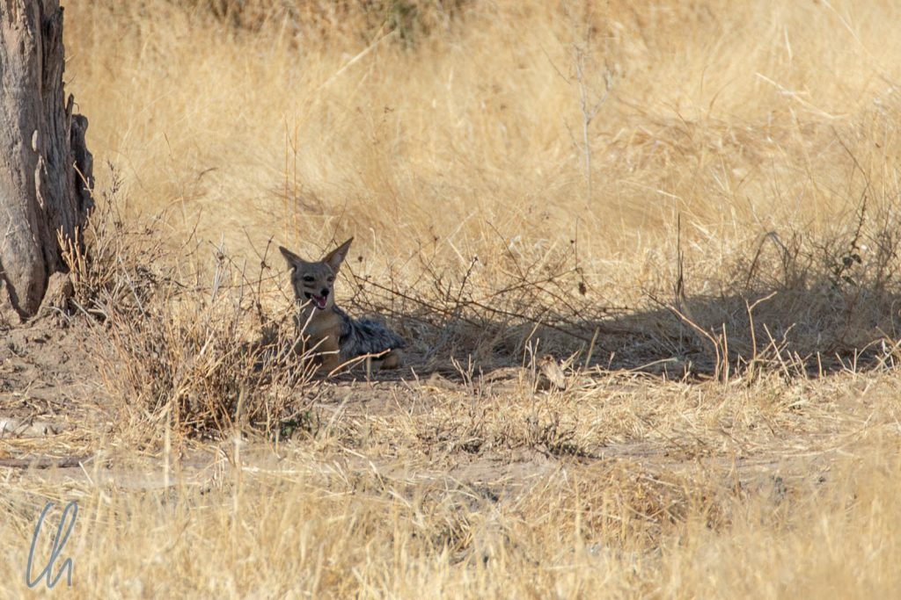
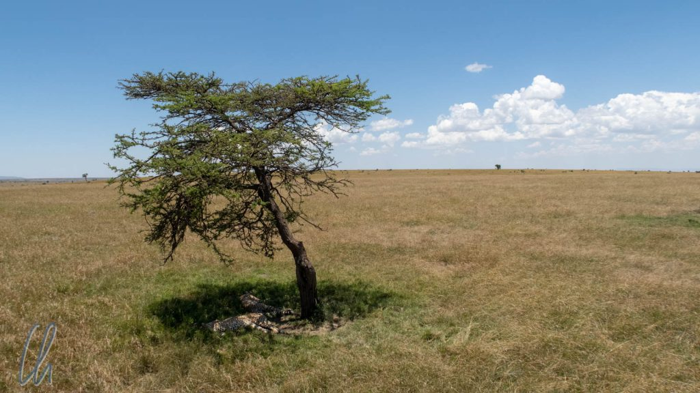

Dieser Artikel ist anders als die anderen Blogposts, kein klassischer Reisebericht, sondern ein Mitmachartikel, ein Suchspiel. Versteckt haben sich die Tiere und Ihr könnt versuchen, sie zu finden. Wann genau mir die Idee zu diesem Artikel kam, kann ich nicht mehr sagen, aber das Konzept dahinter ist, dass sich die wilden Tiere in ihrem Lebensraum eben meistens nicht formatfüllend zur Schau stellen, sondern in ihrer natürlichen Umgebung ziemlich gut getarnt sind.

<!--more-->

## Ein verzerrtes Bild von der Tierbeobachtung auf Safari

In den vorherigen Safari-Artikeln aus [Mikumi](http://wittmann-tours.de/auf-safari-im-mikumi-nationalpark/), [Ruaha](http://wittmann-tours.de/auf-safari-im-ruaha-nationalpark/) und der [Masai Mara](http://wittmann-tours.de/auf-reitsafari-in-der-masai-mara) haben wir versucht, nicht nur die Highlights zu beschreiben, sondern auch ein wenig die Realität des Safari-Alltags. Trotzdem geben die Blogposts natürlich ein verzerrtes Bild wider. Wir beschreiben, was wir mit Euch teilen möchten, was wir für bemerkenswert hielten oder woran wir uns später gerne erinnern würden. Was die Auswahl der Fotos betrifft, sind es natürlich die besten Aufnahmen, die wir im Blog veröffentlichen.

Safari funktioniert in der Wirklichkeit nicht so, dass man in den Jeep steigt, in den Nationalpark fährt und dann liegen die Löwen in bester National Geographic Manier bereit, um den Besuchern die eindrucksvollsten Motive für die Kamera zu bieten. Die wilden Tiere sind keine Fotomodelle und sie trachten auch nicht danach, sich in idealer Beleuchtung in Positur zu werfen und für eine Aufnahme zu lächeln. Ganz im Gegenteil: Die meiste Zeit verstecken sie sich, halten sich im Schatten auf, um nicht von der Sonne gebraten zu werden, und die Kamera ist ihnen im besten Falle egal.

## Wer suchet, der findet

In manch anderen Artikeln hatten wir schon beschrieben, wie schwierig es häufig ist, Tiere in freier Wildbahn zu entdecken und zu beobachten. Dies ist auf Safari nicht viel anders. Die folgende Bilderserie versucht, Euch einen Eindruck davon zu vermitteln, wie der Safari-Alltag in der Wirklichkeit aussieht, wie schwierig es ist, Lebewesen in der Wildnis zu erspähen. Und trotzdem ist es eine Positivauswahl, da es auf jeder Aufnahme etwas zu entdecken gibt ;). In der Realität findet das Suchen kontinuierlich aus einem auf einer sandigen Piste fahrenden Geländewagen statt und nur mit dem Zoom der eigenen Augen, deren Vergrößerungsmöglichkeit im Ergebnis viel geringer ist als die auf den Fotos abgebildete.

Wenn ihr also jetzt die folgenden Aufnahmen anschaut, dann sind dies immer Bilderpaare. Auf dem jeweils ersten Foto ist ein Tier zu sehen - oder besser zu erspähen - aber mit wenig Zoom. Auf dem jeweils folgenden Bild entdeckt Ihr, was Ihr hättet sehen können. Viel Spaß beim Suchen - und Finden!

## Die Suchspiel-Gallerie

Jedes einzelne Bild könnt ihr zum Vergrößern anklicken:

